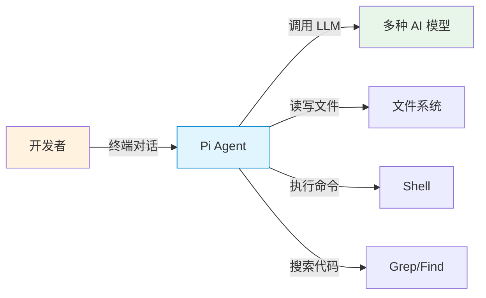
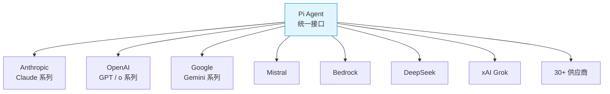
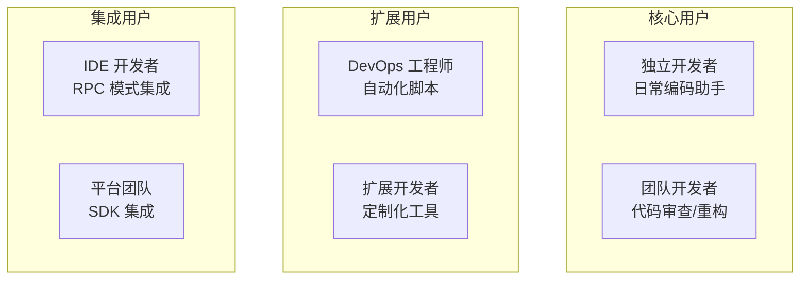
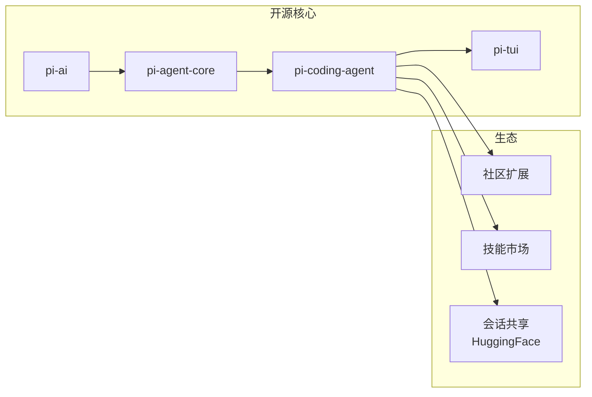
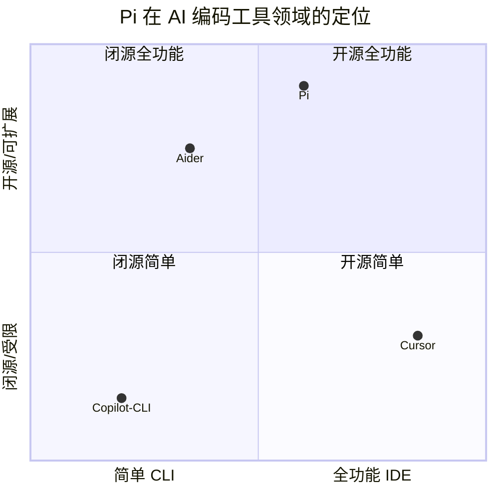

# 产品全景与价值定位

## 产品定义

Pi 是一个**开源的交互式编码智能体**，通过终端界面提供 AI 辅助编程能力。用户在终端中与 Pi 对话，Pi 能够阅读代码、执行命令、编辑文件，自主完成复杂的编码任务。

## 核心价值主张

### 1. 统一多供应商 LLM 访问

Pi 抽象了 9+ 种 LLM API 协议，用户可以在 Anthropic、OpenAI、Google、Mistral、Bedrock 等供应商之间无缝切换，无需修改工作流。

### 2. 真正的编码能力

Pi 不仅是聊天机器人，而是具备实际编码能力的**自主 Agent**：

| 能力 | 工具 | 说明 |
|------|------|------|
| 读取代码 | `read` | 读取任意文件，支持行范围 |
| 执行命令 | `bash` | 运行 shell 命令，捕获输出 |
| 编辑文件 | `edit` | 精确字符串替换编辑 |
| 创建文件 | `write` | 写入新文件或覆盖 |
| 搜索代码 | `grep` | 正则表达式搜索 |
| 查找文件 | `find` | 按模式查找文件 |
| 列目录 | `ls` | 列出目录内容 |

### 3. 会话持久化与分支

Pi 的会话系统采用**树状结构**，支持：
- 会话自动保存到 JSONL 文件
- 从任意节点分支（fork）
- 在会话树中导航
- 上下文压缩以管理长对话

### 4. 高度可扩展

通过**扩展系统**，开发者可以：
- 注册自定义工具供 LLM 调用
- 添加 slash 命令
- 注册自定义 LLM 供应商
- 修改 UI 组件和主题
- 拦截和修改 Agent 事件

### 5. 多种运行模式

| 模式 | 场景 | 接口 |
|------|------|------|
| Interactive | 日常开发 | 全功能 TUI |
| Print | 脚本集成 | stdin/stdout 文本 |
| RPC | IDE 集成 | JSONL 协议 |

## 目标用户画像

### 核心用户：终端偏好的开发者

- 习惯使用终端工作
- 需要 AI 辅助完成编码任务
- 希望保持对代码的完全控制
- 重视隐私（本地运行，API Key 自管理）

### 扩展用户：定制需求

- 需要接入私有/自建 LLM
- 需要自定义工具集
- 需要集成到现有工作流

### 集成用户：平台化

- 将 Pi 嵌入 IDE 或平台
- 通过 RPC/SDK 编程调用
- 需要无头运行模式

## 产品价值分析

### 与竞品对比

| 特性 | Pi | GitHub Copilot CLI | Cursor | Aider |
|------|----|--------------------|--------|-------|
| 开源 | MIT | 否 | 否 | 是 |
| 多供应商 | 30+ | GitHub 限定 | 多供应商 | 多供应商 |
| 终端原生 | 全功能 TUI | 简单 CLI | IDE | 终端 |
| 扩展系统 | TypeScript 扩展 | 无 | 有限 | 无 |
| 会话分支 | 树状结构 | 无 | 有限 | 无 |
| 自主编码 | 7 个工具 | 有限 | 有 | 有 |
| RPC/SDK | 完整协议 | 无 | 无 | 无 |

### 核心差异化

1. **真正的终端原生体验**：不是简单的 CLI wrapper，而是完整的 TUI 应用，支持差分渲染、语法高亮、图片显示
2. **极致的可扩展性**：TypeScript 扩展可以接管几乎所有行为
3. **供应商无关**：同一个会话可以切换模型，上下文自动转换
4. **会话持久化**：JSONL 树状会话，支持分支、压缩、导出
5. **供应链安全**：精确版本锁定、shrinkwrap、npm audit 工作流

## 商业模式

Pi 是完全开源的 MIT 许可项目，由 Earendil Works 维护。

## 技术定位

