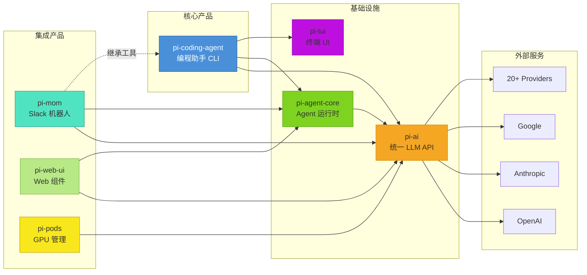

# 产品全景：定位、价值主张与竞争分析

> 从产品经理和决策者视角理解 pi-mono

---

## 1. 产品定位

### 1.1 pi 是什么

**pi** 不是一个简单的 ChatBot，也不是 IDE 插件。它是一个 **AI Agent 开发平台**，核心产品是 **pi-coding-agent** - 一个强大的交互式编程助手 CLI。

**关键特征**：
- **CLI 优先**：在终端中运行，与开发工作流深度集成
- **Agent 架构**：具有工具调用能力，可执行文件操作、运行命令、搜索代码
- **Provider 无关**：统一抽象层支持 20+ LLM 供应商，无缝切换
- **高度可扩展**：通过 TypeScript 扩展、Skills、主题进行深度定制
- **会话管理**：持久化对话历史，支持分支和树状导航

### 1.2 产品生态

pi-mono 是一个 Monorepo，包含多个相关产品：

| 产品 | 定位 | 用户 |
|------|------|------|
| **pi-coding-agent** | 核心产品，交互式编程助手 CLI | 个人开发者 |
| **pi-ai** | 统一 LLM API 库 | 集成开发者 |
| **pi-agent-core** | Agent 运行时框架 | Agent 开发者 |
| **pi-tui** | 终端 UI 框架 | CLI 开发者 |
| **pi-web-ui** | Web 聊天组件 | Web 开发者 |
| **pi-mom** | Slack 机器人 | 团队协作 |
| **pi-pods** | GPU Pod 管理 | AI 基础设施 |

### 1.3 目标用户

**主要用户**：
- 个人开发者：在终端中使用 AI 辅助编程
- 开源项目维护者：需要处理 issue、PR、代码审查
- 技术内容创作者：撰写技术文章、教程

**次要用户**：
- 团队开发者：通过 pi-mom 集成到 Slack
- Agent 开发者：基于 pi-ai 和 pi-agent-core 构建自定义 Agent
- CLI 爱好者：使用 pi-tui 构建终端应用

---

## 2. 核心价值主张

### 2.1 统一多 Provider API

**痛点**：不同 LLM 供应商 API 差异大，切换成本高。

**pi 的解决方案**：
- **统一接口**：`streamSimple(model, messages, options)` 一个函数调用所有 Provider
- **模型注册表**：700+ 预配置模型，自动发现
- **无缝切换**：运行时切换模型，无需修改代码
- **功能对齐**：工具调用、流式响应、思考模式等功能跨 Provider 一致

### 2.2 可扩展架构

**痛点**：AI 助手功能固化，无法适应特定工作流。

**pi 的解决方案**：
- **扩展系统**：TypeScript API，30+ 事件类型，可深度定制
- **Skills 系统**：SKILL.md 文件封装领域知识，按需加载
- **主题系统**：JSON 主题定义，完全自定义 UI
- **快捷键系统**：声明式配置，支持覆盖所有操作

### 2.3 完整的 Agent 运行时

**痛点**：简单 API 调用无法处理复杂任务，需要完整的状态管理。

**pi 的解决方案**：
- **双层 Agent Loop**：内层处理工具调用，外层处理 follow-up 消息
- **会话持久化**：JSONL 格式，完整记录对话历史
- **上下文压缩**：智能压缩长对话，保留关键信息
- **工具执行**：内置 7 种开发工具，支持自定义工具

### 2.4 原生终端体验

**痛点**：Web UI 或 IDE 插件与终端工作流割裂。

**pi 的解决方案**：
- **差分渲染**：仅更新变化区域，性能优越
- **终端图像**：支持 Kitty、iTerm2 图像协议
- **键盘优先**：所有操作都有快捷键，无鼠标依赖
- **tmux 友好**：在 tmux 中完美运行

### 2.5 会话管理

**痛点**：对话历史丢失，无法回溯或分支探索。

**pi 的解决方案**：
- **JSONL 持久化**：每条消息即时保存
- **分支创建**：从任意点创建新分支，探索不同方向
- **树状导航**：可视化会话树，快速跳转
- **导出功能**：导出为 HTML，分享或归档

---

## 3. 竞品对比分析

### 3.1 与 Claude Code 对比

| 维度 | pi | Claude Code |
|------|-----|-------------|
| **Provider 支持** | 20+ 供应商，可扩展 | 仅 Anthropic Claude |
| **扩展性** | 完整的扩展 API | 无扩展系统 |
| **部署方式** | npm 安装，从源码运行 | 官方二进制 |
| **会话管理** | 分支、树状导航 | 基础会话 |
| **定制化** | Skills、主题、快捷键 | 有限定制 |
| **开源程度** | 完全开源 | 部分开源 |
| **社区** | GitHub 开放讨论 | Discord 专属 |

**pi 的优势**：Provider 无关、可扩展、开源

**Claude Code 的优势**：官方支持、与 Claude 深度集成、开箱即用

### 3.2 与 Cursor/Windsurf 对比

| 维度 | pi | Cursor/Windsurf |
|------|-----|-----------------|
| **形态** | CLI 工具 | IDE 集成 |
| **工作流** | 终端原生 | IDE 内操作 |
| **工具执行** | 直接 bash | IDE 文件操作 |
| **上下文** | 整个项目 | 当前文件/目录 |
| **扩展** | TypeScript 扩展 | 插件市场 |

**pi 的优势**：终端原生、轻量、无 IDE 依赖

**Cursor/Windsurf 的优势**：IDE 集成体验、可视化编辑

### 3.3 与 Aider 对比

| 维度 | pi | Aider |
|------|-----|-------|
| **架构** | 统一 API + Agent 运行时 | 直接 API 调用 |
| **Provider** | 20+ | 主要 OpenAI |
| **扩展** | 完整扩展系统 | 有限配置 |
| **UI** | 差分渲染 TUI | 简单终端输出 |
| **会话** | 分支、树状导航 | 线性会话 |

**pi 的优势**：架构完整、可扩展、会话管理

**Aider 的优势**：简单直接、专注 Git 操作

### 3.4 pi 的差异化优势

1. **Provider 无关**：不被单一供应商绑定，可随时切换
2. **可扩展性**：核心极简，功能通过扩展实现
3. **开源生态**：完全开源，社区可贡献
4. **会话管理**：分支和树状导航是独特功能
5. **终端原生**：与 Unix 哲学一致，管道友好

---

## 4. 产品演进路线

### 4.1 从个人工具到平台

**早期**（个人工具）：
- Mario Zechner 的个人编程助手
- 命令行脚本，直接调用 API

**中期**（可扩展工具）：
- 引入扩展系统，允许用户定制
- 分离核心层（pi-ai）和应用层（pi-coding-agent）

**现在**（平台）：
- 完整的 Monorepo，多个产品
- pi-ai 和 pi-agent-core 可作为独立库使用
- pi-mom、pi-web-ui 展示平台能力

### 4.2 Monorepo 策略

**锁步版本控制**：
- 所有包使用同一版本号（如 0.70.2）
- 简化依赖管理，避免版本冲突

**构建顺序**：
```
tui → ai → agent → coding-agent → mom/web-ui/pods
```

**发布策略**：
- 主要产品：pi-coding-agent（npm 包 `@mariozechner/pi-coding-agent`）
- 辅助库：pi-ai、pi-agent-core、pi-tui 可独立使用

### 4.3 社区治理模式

**严格准入机制**（CONTRIBUTING.md）：
- 新贡献者的 issue 和 PR 自动关闭
- 维护者每日审查，质量不达标不 reopen
- `lgtmi` / `lgtm` 评论批准未来提交

**周末审查禁令**：
- 周五至周日不进行代码审查
- 避免疲劳决策，保持审查质量

**AGENTS.md 规则**：
- 专门为 AI Agent 编写的规则
- 明确禁止的操作（如 `git add -A`）
- 规定代码质量标准

---

## 5. 产品生态图



---

## 6. 商业模式与可持续发展

### 6.1 当前状态

- **完全开源**：MIT License
- **免费使用**：用户只需支付 LLM API 费用
- **社区驱动**：Discord 社区活跃，贡献者逐步增加

### 6.2 潜在方向

**可能的方向**（非官方声明）：
- **托管服务**：pi-coding-cloud（类似 GitHub Copilot）
- **企业版**：私有部署、SSO、审计日志
- **认证扩展**：官方认证的扩展市场
- **培训服务**：企业培训、定制开发

### 6.3 可持续发展

**当前模式**：
- Mario Zechner 个人维护
- 依靠个人热情和社区贡献
- 无明确的商业化计划

**挑战**：
- 长期维护需要资金支持
- 竞争加剧（Cursor、Windsurf 有融资）
- 社区规模仍较小

---

## 7. 产品路线图推测

基于代码库和 GitHub 讨论的推测（非官方）：

### 7.1 短期（0-3 个月）
- 更多 Provider 支持
- 性能优化（启动时间、内存使用）
- 扩展生态完善

### 7.2 中期（3-6 个月）
- pi-pods 功能完善（GPU 管理）
- 更多官方扩展
- Web UI 增强

### 7.3 长期（6+ 个月）
- 可视化配置工具
- 团队协作功能
- 可能的商业化探索

---

## 8. 总结

pi-mono 是一个独特的 AI Agent 开发平台：

**核心优势**：
- Provider 无关，不被单一供应商绑定
- 高度可扩展，核心极简
- 完整的 Agent 运行时
- 开源生态

**适用场景**：
- 个人开发者需要强大的 CLI AI 助手
- 团队需要可定制的工作流
- Agent 开发者需要基础设施

**不适合**：
- 习惯 IDE 操作的开发者
- 需要"开箱即用"的非技术用户
- 追求官方支持和 SLA 的企业

---

**相关文档**：
- [用户旅程](./02-user-journey.md)
- [功能地图](./03-feature-map.md)
- [架构概览](../02-architecture/01-architecture-overview.md)
