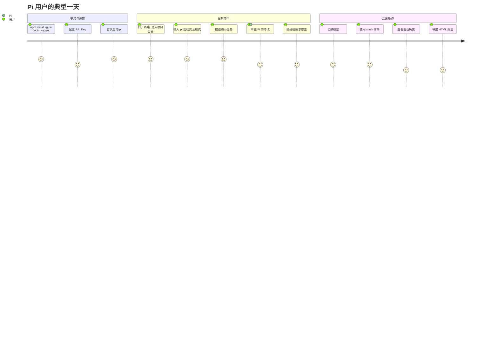
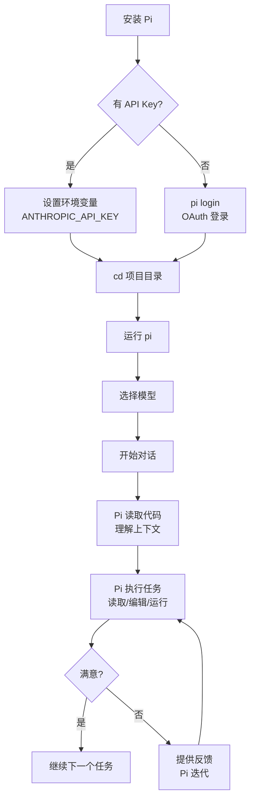
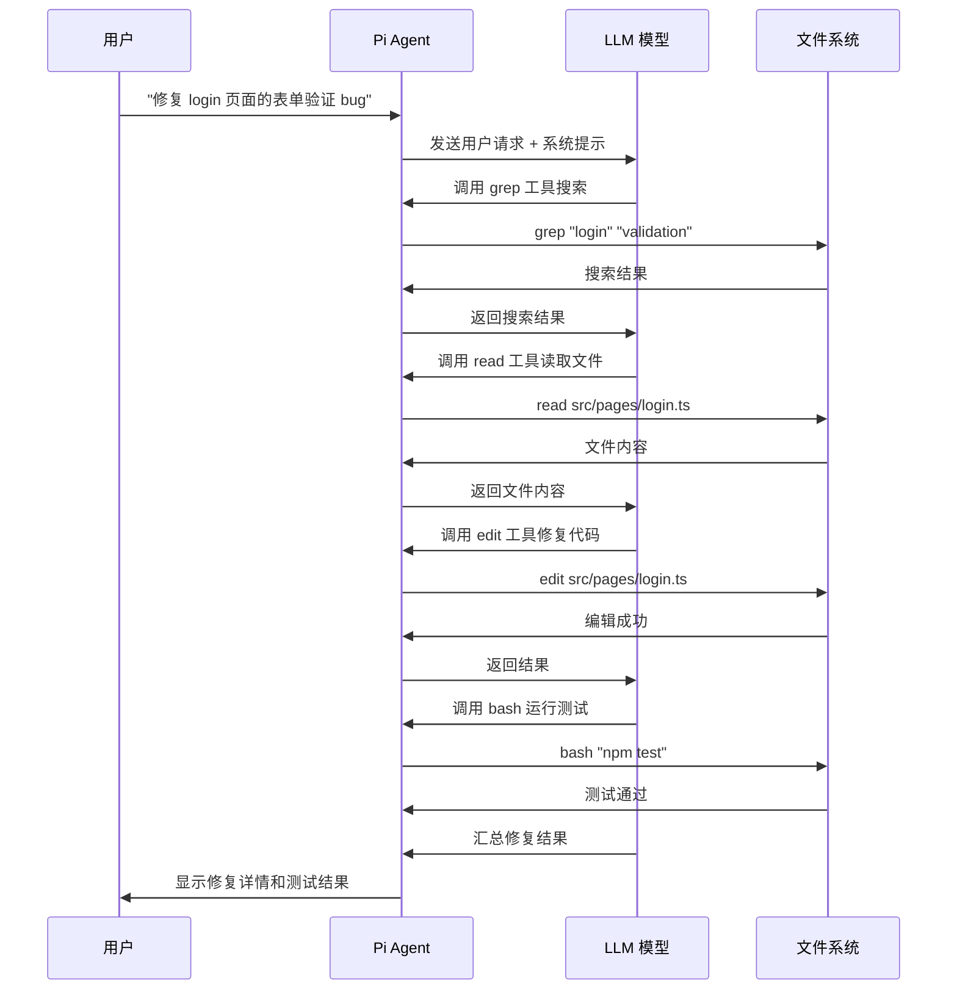
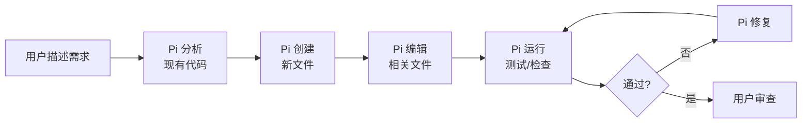
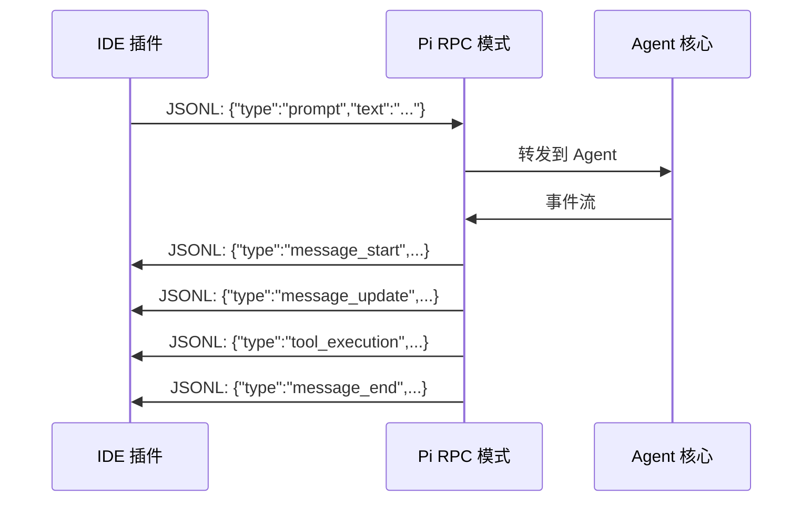
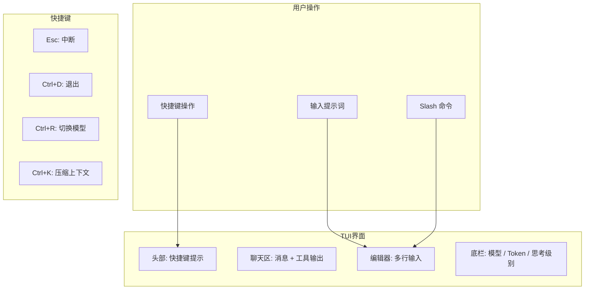
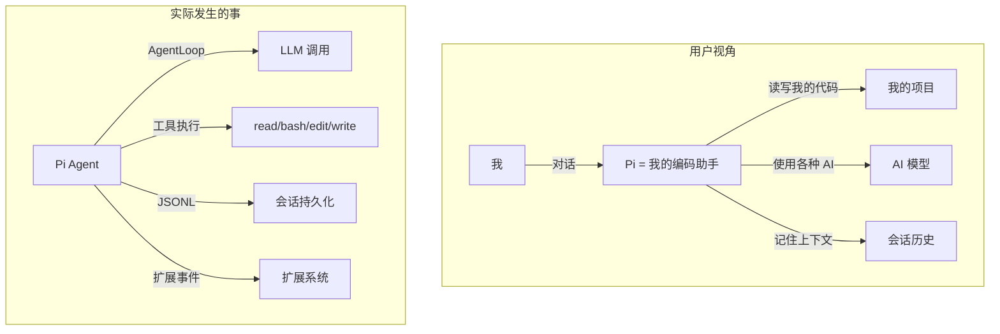
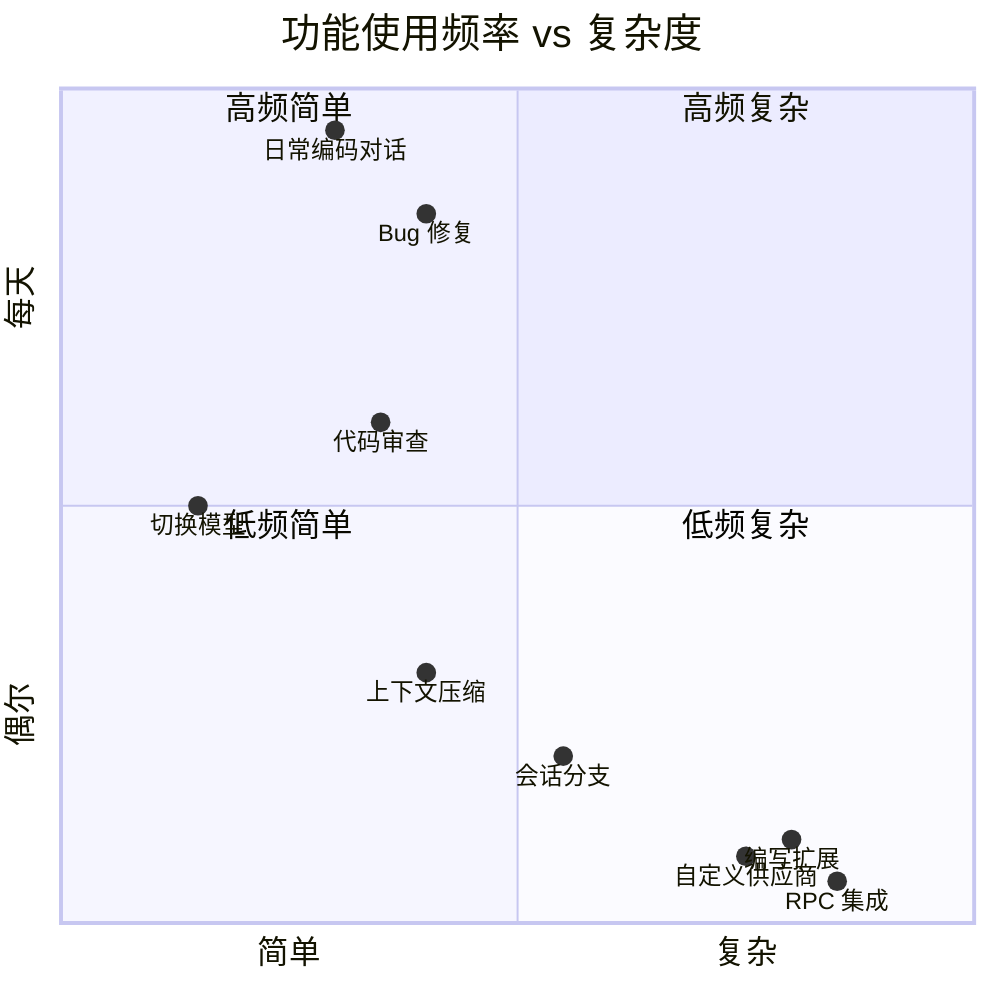

# 用户旅程与使用场景

## 用户旅程总览



## 首次使用流程



## 核心使用场景

### 场景 1：Bug 修复



### 场景 2：代码重构

用户请求 Pi 重构一个模块：

1. **分析阶段**：Pi 用 `read` 和 `grep` 理解现有代码结构
2. **规划阶段**：Pi 制定重构方案并告知用户
3. **执行阶段**：Pi 逐文件 `edit`，保持增量修改
4. **验证阶段**：Pi 用 `bash` 运行类型检查和测试

### 场景 3：新功能开发



### 场景 4：脚本化使用（Print 模式）

```bash
# 单次提问
pi -p "解释这个函数的作用" < src/complex.ts

# 管道使用
cat error.log | pi -p "分析这个错误日志"

# JSON 输出
pi -p "列出所有 TODO" --json
```

### 场景 5：IDE 集成（RPC 模式）



## 交互模式详解

### Interactive 模式（主模式）



### 关键用户交互

| 操作 | 快捷键/命令 | 说明 |
|------|------------|------|
| 发送消息 | Enter | 提交当前编辑器内容 |
| 换行 | Shift+Enter | 在编辑器中换行 |
| 中断 | Escape | 停止当前 Agent 运行 |
| 退出 | Ctrl+D | 退出 Pi |
| 切换模型 | Ctrl+R | 打开模型选择器 |
| 调整思考级别 | Ctrl+T | 循环切换推理深度 |
| 压缩上下文 | Ctrl+K | 触发上下文压缩 |
| 会话树 | Ctrl+L | 浏览会话分支 |
| 新会话 | Ctrl+N | 开始新会话 |
| 运行 bash | `!cmd` | 在编辑器中直接执行命令 |
| Slash 命令 | `/command` | 调用注册的命令 |

## 用户心智模型



## 使用频率矩阵


