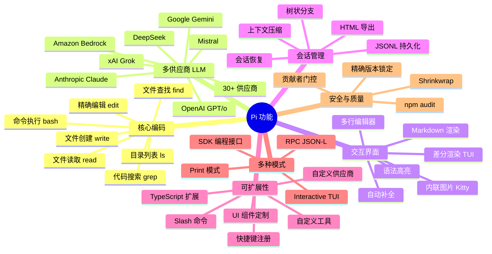
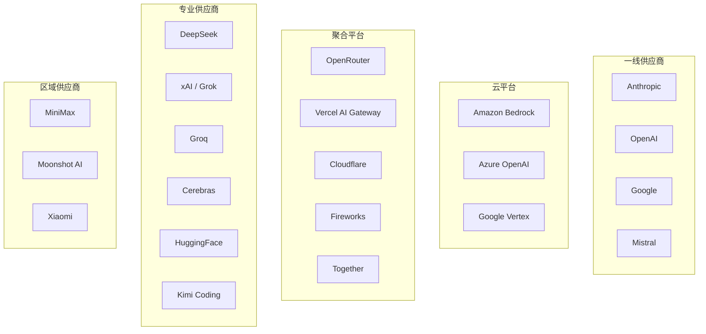
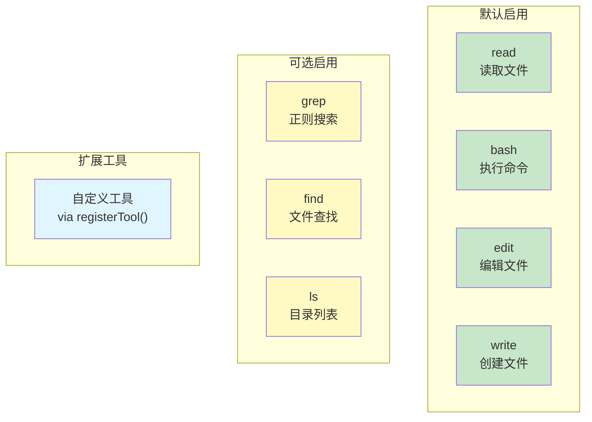
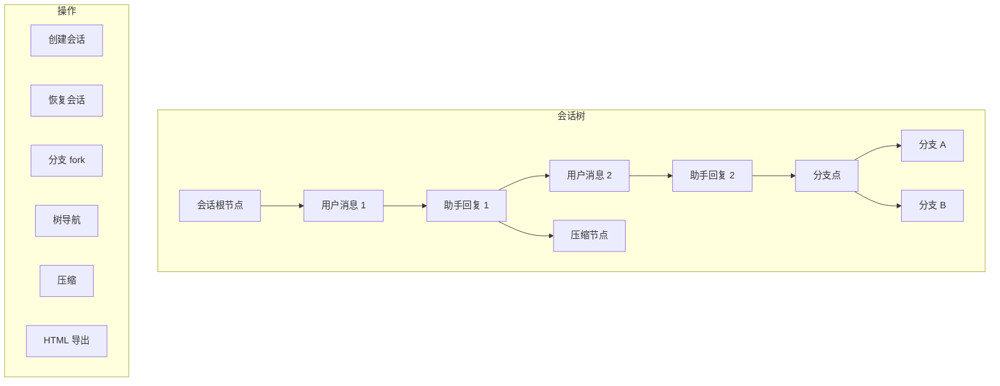
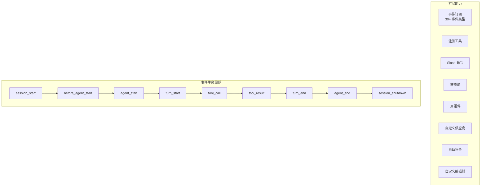
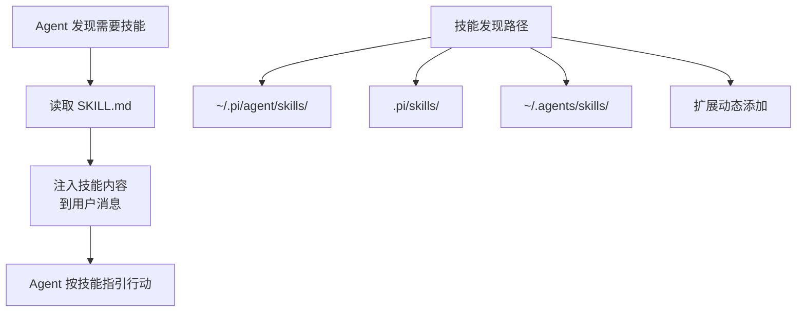
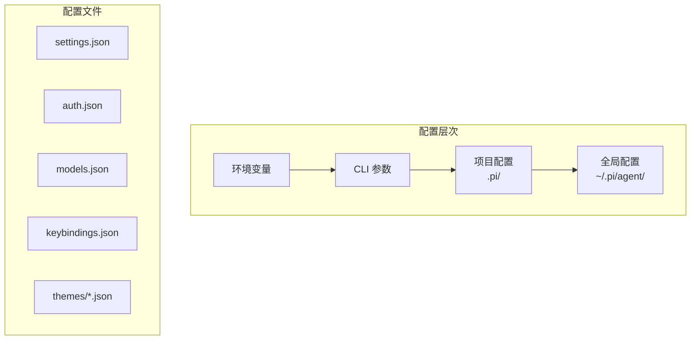

# 功能全景图

## 功能总览

## 按领域分类

### 一、LLM 集成

#### 支持的 API 协议（9 种）

| API 协议 | 对应供应商 | 特性 |
|----------|-----------|------|
| `anthropic-messages` | Anthropic, Fireworks | 流式工具调用, 扩展思考 |
| `openai-completions` | OpenAI, OpenRouter, DeepSeek, Groq, xAI | 最广泛兼容 |
| `openai-responses` | OpenAI 原生 | Responses API |
| `openai-codex-responses` | OpenAI Codex | 云端沙箱执行 |
| `azure-openai-responses` | Azure OpenAI | 企业级 |
| `google-generative-ai` | Google AI Studio | Gemini 系列 |
| `google-vertex` | Google Cloud Vertex | 企业级 |
| `mistral-conversations` | Mistral AI | Mistral 系列 |
| `bedrock-converse-stream` | AWS Bedrock | 多模型接入 |

#### 支持的供应商（30+）

#### 模型能力

| 能力 | 说明 |
|------|------|
| 工具调用 | 所有模型必须支持（入选门槛） |
| 推理思考 | 可调节 minimal/low/medium/high/xhigh |
| 图片输入 | 支持视觉理解的模型 |
| 提示缓存 | 减少重复 token 成本 |
| Token 追踪 | 输入/输出/缓存 token 计数和成本 |
| 跨供应商切换 | 同会话内切换，自动消息格式转换 |

### 二、工具系统

#### 工具详情

| 工具 | 参数 | 输出 | 安全控制 |
|------|------|------|---------|
| `read` | `file_path`, `offset`, `limit` | 文件内容（含行号） | 路径验证 |
| `bash` | `command`, `timeout`, `description` | stdout/stderr | spawn hook, 超时 |
| `edit` | `file_path`, `old_string`, `new_string` | diff 预览 | 文件锁队列 |
| `write` | `file_path`, `content` | 成功/失败 | 文件锁队列 |
| `grep` | `pattern`, `path`, `include` | 匹配行和上下文 | 路径限制 |
| `find` | `pattern`, `path`, `type` | 文件路径列表 | 路径限制 |
| `ls` | `path`, `ignore` | 目录树 | 路径限制 |

### 三、会话管理

#### 会话条目类型

| 类型 | 说明 | 在 LLM 上下文中 |
|------|------|-----------------|
| `message` | 用户/助手/工具结果消息 | 是 |
| `model_change` | 模型切换记录 | 否（元数据） |
| `thinking_level_change` | 思考级别变更 | 否（元数据） |
| `compaction` | 上下文压缩摘要 | 是（替换旧消息） |
| `branch_summary` | 分支摘要 | 是（注入上下文） |
| `custom` | 扩展自定义数据 | 否 |
| `custom_message` | 扩展注入的上下文 | 是 |
| `label` | 用户标记 | 否 |
| `session_info` | 会话元数据 | 否 |

### 四、扩展系统

#### 扩展发现路径

| 路径 | 优先级 | 说明 |
|------|--------|------|
| CLI `--extensions` | 最高 | 命令行指定 |
| `.pi/extensions/` | 项目级 | 项目内扩展 |
| `~/.pi/agent/extensions/` | 用户级 | 全局扩展 |
| settings `extensions[]` | 配置级 | 设置文件引用 |

### 五、技能系统

### 六、配置系统

| 配置项 | 全局 | 项目 | CLI | 说明 |
|--------|------|------|-----|------|
| 默认模型 | `settings.json` | `settings.json` | `--model` | 启动时使用的模型 |
| API Key | `auth.json` / 环境变量 | - | `--api-key` | LLM 认证 |
| 主题 | `settings.json` | `settings.json` | - | UI 主题 |
| 快捷键 | `keybindings.json` | - | - | 键绑定覆盖 |
| 扩展 | `settings.json` | `settings.json` | `--extensions` | 扩展列表 |
| 工具 | - | - | `--tools` | 启用的工具 |
| 思考级别 | `settings.json` | - | `--thinking` | 默认推理级别 |

### 七、安全特性

| 特性 | 实现 |
|------|------|
| 精确依赖版本 | `save-exact=true` + 手动 review |
| Shrinkwrap | 发布包锁定完整依赖树 |
| npm audit | 定时 CI 扫描 |
| 贡献者门控 | 新贡献者 issue/PR 自动关闭 |
| 生命周期脚本 | `--ignore-scripts` 默认 |
| 最小发布龄期 | `min-release-age=2` |
| Lockfile 提交保护 | 预提交钩子检查 |
