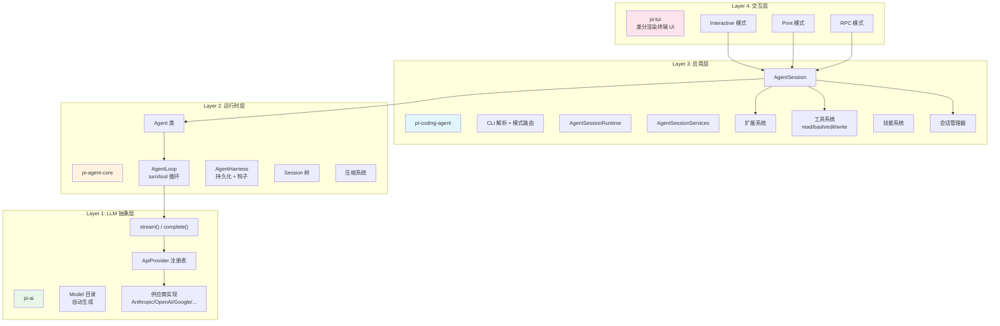
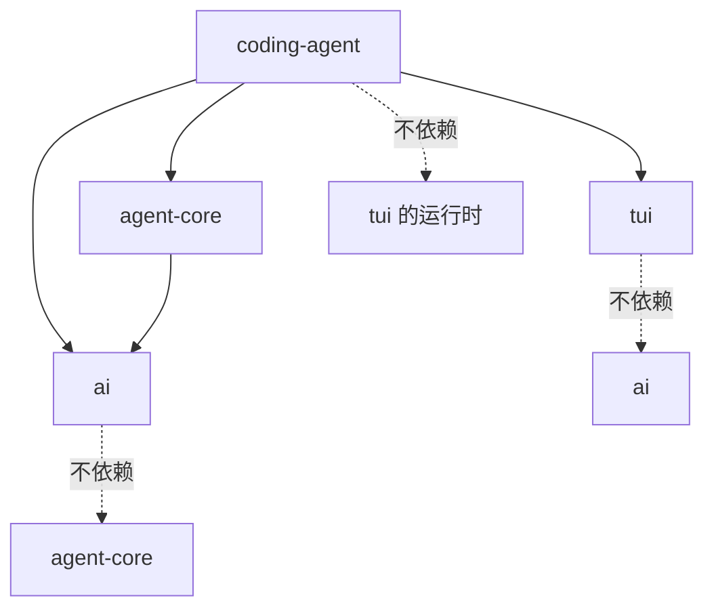
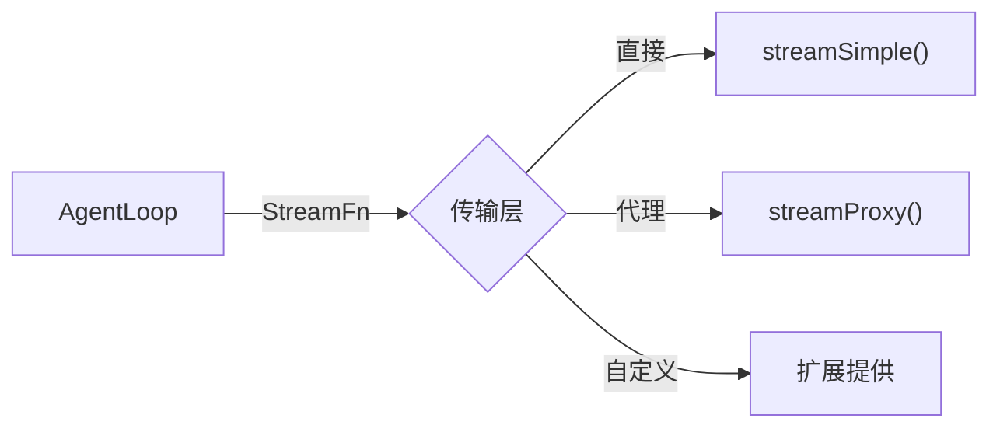
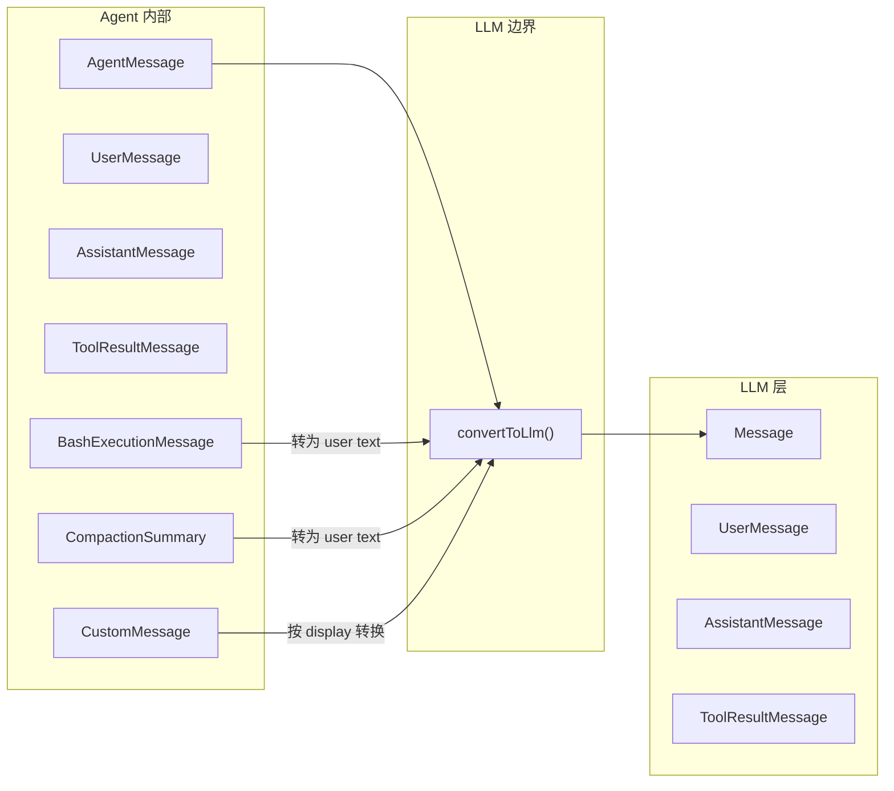
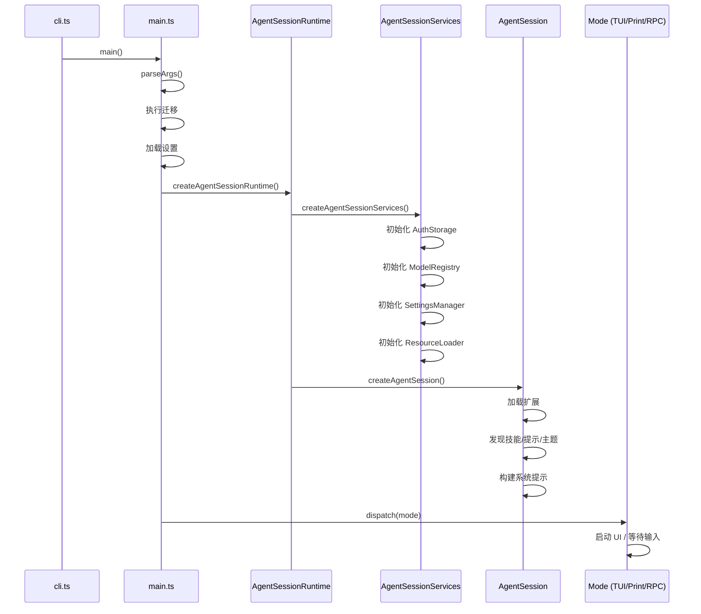
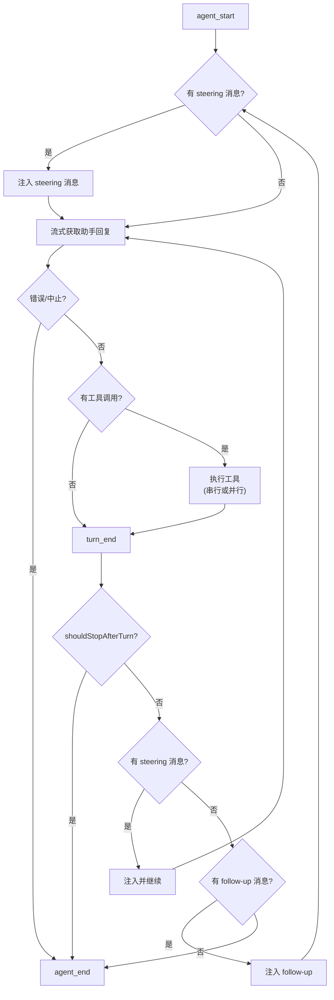

# 整体架构与分层设计

## 架构总览

Pi 采用**四层分离架构**，从底层到顶层依次为：LLM 抽象层 → Agent 运行时 → 编码智能体 → 终端 UI。



## 分层设计原则

### 原则 1：依赖方向向下



每层只依赖其下层，不存在反向依赖。`pi-tui` 是纯 UI 库，完全不感知 Agent 或 AI 的存在。

### 原则 2：接口隔离

每层通过明确的接口与上层通信：

| 层 | 向上暴露的接口 | 上层使用方式 |
|----|--------------|------------|
| pi-ai | `stream()`, `getModel()`, `registerApiProvider()` | 调用函数获取流 |
| pi-agent-core | `Agent`, `AgentHarness`, `AgentEvent` | 实例化 + 订阅事件 |
| pi-tui | `Component`, `TUI`, `Editor` | 实现组件接口 + 添加到容器 |
| pi-coding-agent | `createAgentSession()`, `ExtensionAPI` | SDK 编程接口 |

### 原则 3：传输抽象

Agent 运行时不直接调用 LLM，而是通过可注入的 `StreamFn`：



### 原则 4：事件驱动解耦

各层通过事件（而非回调嵌套）通信：

```mermaid
sequenceDiagram
    participant Loop as AgentLoop
    participant Agent as Agent
    participant Harness as AgentHarness
    participant Session as AgentSession
    participant Mode as Interactive Mode

    Loop->>Agent: emit(turn_start)
    Agent->>Harness: emit(turn_start)
    Harness->>Session: emit(turn_start)
    Session->>Mode: emit(turn_start)
    Mode->>Mode: 更新 UI
```

## 关键架构决策

### 决策 1：monorepo + lockstep versioning

**选择**：所有包同版本号，一起发布

**理由**：
- 包间 API 耦合紧密，独立版本会造成兼容性矩阵爆炸
- 简化发布流程和依赖解析
- 用户只需关心一个版本号

### 决策 2：erasable TypeScript syntax only

**选择**：只使用可擦除的 TypeScript 语法，禁用 enum、namespace、parameter properties

**理由**：
- 支持 Node.js 原生 `--strip-types` 模式
- 减少构建复杂度
- 输出 JS 与源码 1:1 对应

### 决策 3：流式优先，错误带内

**选择**：LLM 调用必须返回 `AssistantMessageEventStream`，错误通过流内事件传递，不抛异常

**理由**：
- 流式是 LLM 交互的自然模型
- 带内错误让调用方有统一的处理路径
- 避免流已部分消费后的异常处理复杂性

### 决策 4：AgentMessage vs Message 双层消息

**选择**：Agent 内部使用可扩展的 `AgentMessage`，仅在 LLM 调用边界转换为 `Message`

**理由**：
- 允许应用添加自定义消息类型（bash 执行记录、压缩摘要等）
- 自定义消息不污染 LLM 上下文
- 类型安全的声明合并扩展



### 决策 5：会话树而非线性日志

**选择**：JSONL 文件中每条记录有 `parentId`，形成树状结构

**理由**：
- 支持从任意节点分支探索不同方案
- 压缩操作可以截断子树而不丢失历史
- 树导航让用户可以回溯
- append-only 保证数据安全

### 决策 6：扩展通过 jiti 加载

**选择**：使用 jiti 动态加载 TypeScript 扩展，而非预编译

**理由**：
- 用户直接编写 `.ts` 文件即可，无需构建步骤
- 开发体验优先
- Bun 二进制版本中预打包虚拟模块

## 运行时架构

### 启动序列



### Agent 循环



## 技术栈选型理由

| 技术 | 选型 | 理由 |
|------|------|------|
| TypeScript | 5.9 + erasable syntax | 类型安全 + Node 原生支持 |
| tsgo | Native TS compiler | 10-30x 比 tsc 快 |
| Node.js | >= 22.19 | LTS, 原生 strip-types |
| Biome | 2.3 | 比 ESLint + Prettier 快 100x |
| npm workspaces | monorepo | 原生支持，无额外工具 |
| TypeBox | JSON Schema | 运行时类型验证 + TS 推导 |
| JSONL | 会话存储 | append-only, 流式读写 |
| Vitest | 测试 | 快速, ESM 原生 |
