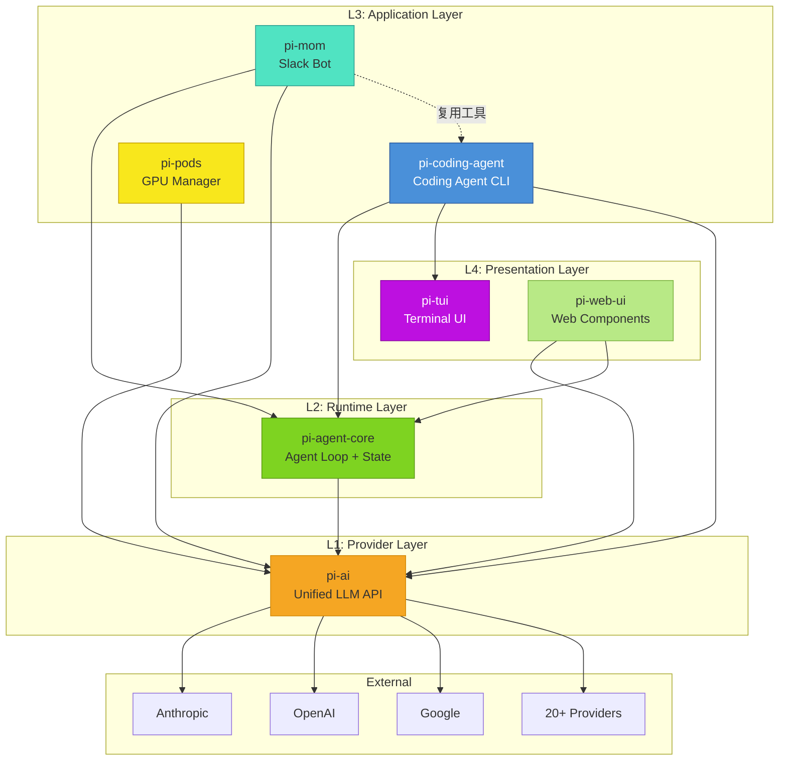

# 宏观架构与分层设计

> 理解 pi-mono 的四层架构模型和核心设计决策

---

## 1. 架构概览

### 1.1 四层架构模型

pi-mono 采用清晰的分层架构，从底层到上层分为四层：

```
┌─────────────────────────────────────────────────────────────────┐
│                    L4: Presentation Layer                        │
│                 (pi-tui, pi-web-ui)                              │
│                    终端 UI / Web 组件                              │
├─────────────────────────────────────────────────────────────────┤
│                    L3: Application Layer                         │
│          (pi-coding-agent, pi-mom, pi-pods)                      │
│              具体应用：编程助手、Slack 机器人、Pod 管理              │
├─────────────────────────────────────────────────────────────────┤
│                    L2: Runtime Layer                             │
│                   (pi-agent-core)                                │
│               Agent 运行时：循环、状态、工具执行                       │
├─────────────────────────────────────────────────────────────────┤
│                    L1: Provider Layer                            │
│                      (pi-ai)                                     │
│              统一 LLM API：20+ Provider 抽象                         │
└─────────────────────────────────────────────────────────────────┘
                              ↓
                   External LLM Providers
              (OpenAI, Anthropic, Google, ...)
```

### 1.2 层次职责

| 层次 | 包 | 职责 | 依赖 |
|------|-----|------|------|
| **L1** | pi-ai | 统一 LLM 调用抽象、Provider 注册、流式响应 | 无 |
| **L2** | pi-agent-core | Agent Loop、状态管理、工具执行框架 | pi-ai |
| **L3** | pi-coding-agent, pi-mom, pi-pods | 具体应用逻辑、会话管理、扩展加载 | pi-agent-core, pi-ai, pi-tui |
| **L4** | pi-tui, pi-web-ui | UI 渲染、组件库、交互处理 | 无 (pi-tui 无外部依赖) |

### 1.3 依赖方向

**严格单向依赖**：
- L4 → L3 → L2 → L1
- 禁止反向依赖
- 通过接口和事件机制解耦

---

## 2. 核心设计决策

### 2.1 Provider 注册表模式

**问题**：20+ LLM Provider API 差异大，如何统一？

**解决方案**：Provider 注册表 + 懒加载

```typescript
// 1. 定义统一接口
interface ApiProvider<TApi extends Api> {
    api: TApi;
    stream: StreamFunction<TApi>;
    streamSimple: StreamFunction<TApi>;
}

// 2. 注册 Provider
registerApiProvider("openai", {
    api: "openai-completions",
    stream: (model, messages, options) => { /* ... */ },
    streamSimple: (model, messages, options) => { /* ... */ }
});

// 3. 懒加载：仅在需要时加载 Provider 代码
createLazyStream("anthropic", () => import("./providers/anthropic"));
```

**源文件**：
- `/packages/ai/src/api-registry.ts` - 注册表实现
- `/packages/ai/src/providers/register-builtins.ts` - 懒加载注册

**优势**：
- 统一调用接口：`streamSimple(model, messages, options)`
- 按需加载：不使用的 Provider 不加载代码
- 动态注册：扩展可运行时注册新 Provider

### 2.2 Agent Loop 双层循环

**问题**：Agent 需要处理工具调用和 follow-up 消息，如何组织？

**解决方案**：双层 Agent Loop

```typescript
// 外层循环：处理 follow-up 消息
while (true) {
    // 内层循环：流式响应 + 工具执行
    while (true) {
        // 1. 流式获取 Assistant 响应
        for await (const event of streamAssistantResponse()) {
            // 2. 检查是否有工具调用
            if (event.type === "toolcall_delta") {
                // 3. 执行工具
                await executeTools(toolCalls);
                // 4. 继续内层循环，将结果发回 LLM
                continue;
            }
        }

        // 5. 无更多工具调用，退出内层
        break;
    }

    // 6. 检查是否有 follow-up 消息
    const followUps = getFollowUpMessages();
    if (!followUps.length) break;

    // 7. 将 follow-up 加入消息队列，继续外层
    context.messages.push(...followUps);
}
```

**源文件**：
- `/packages/agent/src/agent-loop.ts` - Agent Loop 实现

**关键点**：
- **内层**：处理单次 LLM 响应和工具调用
- **外层**：处理多轮对话的 follow-up 消息
- **消息转换边界**：仅在 LLM 调用时转换 `AgentMessage[] → Message[]`

### 2.3 事件驱动解耦

**问题**：扩展如何监听和响应 Agent 状态变化？

**解决方案**：三层事件系统

**Layer 1: AgentEvent**（pi-agent-core）
```typescript
type AgentEvent =
    | AgentStartEvent
    | TurnStartEvent
    | MessageStartEvent
    | ToolExecutionStartEvent
    | // ... 更多事件
```

**Layer 2: ExtensionEvent**（pi-coding-agent）
```typescript
type ExtensionEvent =
    | SessionStartEvent
    | ToolCallEvent
    | InputEvent
    | ContextEvent
    | // ... 30+ 事件类型
```

**Layer 3: EventBus**（跨扩展通信）
```typescript
eventBus.emit("custom-event", data);
eventBus.on("custom-event", (data) => { /* ... */ });
```

**源文件**：
- `/packages/agent/src/types.ts` - AgentEvent 定义
- `/packages/coding-agent/src/core/extensions/types.ts` - ExtensionEvent 定义
- `/packages/coding-agent/src/core/event-bus.ts` - EventBus 实现

### 2.4 扩展点设计

**问题**：如何让扩展在不修改核心代码的情况下增强功能？

**解决方案**：声明合并 + 接口注入

**示例：自定义工具**
```typescript
// 扩展代码
export default function (api: ExtensionAPI) {
    api.registerTool({
        name: "my-tool",
        description: "My custom tool",
        parameters: Type.Object({
            input: Type.String()
        }),
        execute: async (toolCallId, params, signal, onUpdate) => {
            return { result: "done" };
        }
    });
}
```

**扩展点清单**：
- 事件订阅（30+ 事件）
- 工具注册
- 命令注册
- 快捷键注册
- Provider 注册
- UI 组件注册

### 2.5 类型安全优先

**问题**：如何在跨 Provider 的情况下保持类型安全？

**解决方案**：泛型传递 + TypeBox

**泛型链**：
```typescript
Model<TApi> → AgentTool<TParameters> → ToolDefinition<TParams, TDetails, TState>
```

**TypeBox 双重用途**：
```typescript
const schema = Type.Object({
    path: Type.String(),
    line: Type.Optional(Type.Number())
});

// 1. 运行时验证
const validated = Value.Parse(schema, input);

// 2. 推导 TypeScript 类型
type Params = Static<typeof schema>;
// { path: string; line?: number }
```

**源文件**：
- `/packages/ai/src/types.ts` - 泛型定义
- `/packages/ai/src/utils/typebox-helpers.ts` - TypeBox 工具

---

## 3. 架构图



---

## 4. Monorepo 架构

### 4.1 目录结构

```
pi-mono/
├── packages/
│   ├── ai/                   # L1: Provider 层
│   │   ├── src/
│   │   │   ├── types.ts      # 核心类型
│   │   │   ├── api-registry.ts
│   │   │   ├── providers/    # 各 Provider 实现
│   │   │   └── models.ts     # 模型注册表
│   │   └── package.json
│   │
│   ├── agent/                # L2: Runtime 层
│   │   ├── src/
│   │   │   ├── agent.ts      # Agent 类
│   │   │   ├── agent-loop.ts # Agent Loop
│   │   │   └── types.ts      # AgentEvent 等
│   │   └── package.json
│   │
│   ├── coding-agent/         # L3: Application 层
│   │   ├── src/
│   │   │   ├── core/         # 核心模块
│   │   │   │   ├── agent-session.ts
│   │   │   │   ├── tools/    # 工具实现
│   │   │   │   ├── extensions/
│   │   │   │   └── session-manager.ts
│   │   │   └── modes/        # 运行模式
│   │   │       ├── interactive/
│   │   │       ├── rpc/
│   │   │       └── print/
│   │   └── package.json
│   │
│   ├── tui/                  # L4: Presentation 层
│   │   ├── src/
│   │   │   ├── tui.ts        # TUI 核心
│   │   │   ├── components/   # 组件库
│   │   │   └── keybindings.ts
│   │   └── package.json
│   │
│   ├── web-ui/               # L4: Web UI
│   ├── mom/                  # L3: Slack Bot
│   └── pods/                 # L3: GPU Pod 管理
│
├── scripts/                  # 构建脚本
├── .github/                  # CI/CD
└── package.json              # 根 package.json (workspaces)
```

### 4.2 构建顺序

```
tui → ai → agent → coding-agent → mom/web-ui/pods
```

**原因**：
- `pi-tui` 无外部依赖，首先构建
- `pi-ai` 是所有包的基础
- `pi-agent-core` 依赖 `pi-ai`
- `pi-coding-agent` 依赖 `pi-agent-core`、`pi-ai`、`pi-tui`
- `pi-mom`、`pi-web-ui`、`pi-pods` 依赖 `pi-coding-agent` 或 `pi-ai`

### 4.3 锁步版本控制

所有包使用同一版本号（如 `0.70.2`）：

```json
// packages/ai/package.json
{
    "name": "@mariozechner/pi-ai",
    "version": "0.70.2"
}

// packages/agent/package.json
{
    "name": "@mariozechner/pi-agent-core",
    "version": "0.70.2"
}
```

**优势**：
- 简化依赖管理
- 避免版本冲突
- 清晰的发布节奏

---

## 5. 数据流向

### 5.1 用户输入到响应渲染

```
用户输入
  ↓
InteractiveMode.handleInput()
  ↓
AgentSession.processInput()
  ↓
构建系统提示 (tools + skills + context)
  ↓
Agent.prompt(messages)
  ↓
Agent Loop 外层
  ↓
Agent Loop 内层
  ↓
convertToLlm() - AgentMessage[] → Message[]
  ↓
pi-ai.streamSimple()
  ↓
Provider API 调用
  ↓
流式响应事件
  ↓
Agent 事件发射
  ↓
ExtensionRunner 事件分发
  ↓
TUI 渲染更新
  ↓
SessionManager 持久化 (JSONL)
```

### 5.2 工具执行流程

```
AssistantMessage 包含 toolCall
  ↓
Agent Loop 检测工具调用
  ↓
prepareToolCall() - 参数准备
  ↓
validateToolArguments() - TypeBox 验证
  ↓
beforeToolCall hook (扩展可拦截/修改)
  ↓
Tool.execute()
  ↓
onUpdate 回调 (流式进度)
  ↓
afterToolCall hook (扩展可修改结果)
  ↓
ToolResultMessage
  ↓
加入消息队列，发回 LLM
```

---

## 6. 关键架构模式

### 6.1 注册表模式

**位置**：Provider 注册、工具注册、命令注册

**实现**：Map-based + 懒加载

### 6.2 观察者模式

**位置**：Agent 事件、扩展事件

**实现**：EventEmitter + 订阅/取消订阅

### 6.3 策略模式

**位置**：工具执行模式（顺序 vs 并行）

**实现**：`executionMode` 字段

### 6.4 模板方法模式

**位置**：Agent Loop

**实现**：定义骨架，子步骤可扩展

### 6.5 装饰器模式

**位置**：工具包装、结果修改

**实现**：`wrapToolDefinition()`、`afterToolCall` 钩子

---

## 7. 非功能性考虑

### 7.1 性能

- **懒加载**：Provider 按需加载
- **差分渲染**：TUI 仅更新变化区域
- **流式响应**：实时显示 LLM 输出
- **上下文压缩**：减少 Token 消耗

### 7.2 可扩展性

- **扩展系统**：TypeScript API
- **Skills 系统**：SKILL.md 文件
- **主题系统**：JSON 配置
- **快捷键系统**：声明式配置

### 7.3 可维护性

- **分层架构**：职责清晰
- **单向依赖**：避免循环依赖
- **类型安全**：TypeScript 严格模式
- **代码质量**：Biome 格式化、无 `any` 类型

### 7.4 可测试性

- **Faux Provider**：模拟 LLM 响应
- **Harness**：测试辅助工具
- **单元测试**：每个包独立测试
- **回归测试**：issue 专属测试

---

## 8. 总结

pi-mono 的架构设计体现了以下原则：

1. **分层清晰**：L1-L4 职责明确
2. **Provider 无关**：统一抽象，可无缝切换
3. **事件驱动**：解耦组件，支持扩展
4. **类型安全**：泛型传递 + TypeBox
5. **核心极简**：功能通过扩展实现
6. **性能优先**：懒加载、差分渲染、流式响应

这种架构使得 pi-mono 既是一个完整的产品，也是一个可扩展的平台。

---

**相关文档**：
- [包依赖关系](./02-package-dependencies.md)
- [核心数据流](./03-data-flow.md)
- [事件系统](./04-event-system.md)
- [pi-ai 包分析](../03-packages/01-pi-ai.md)
