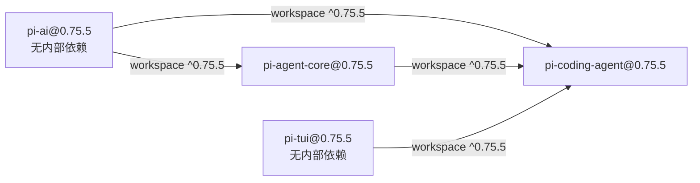
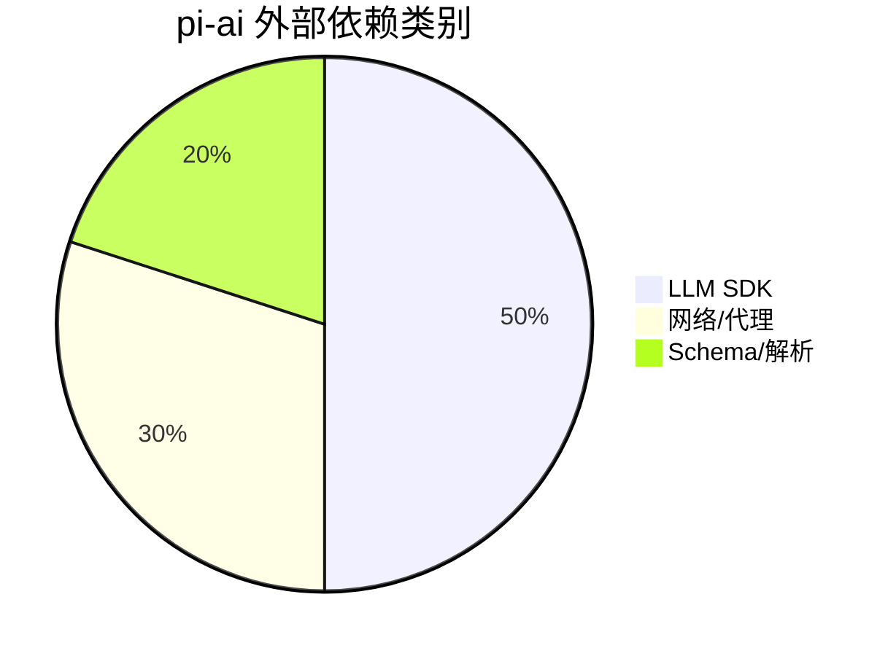
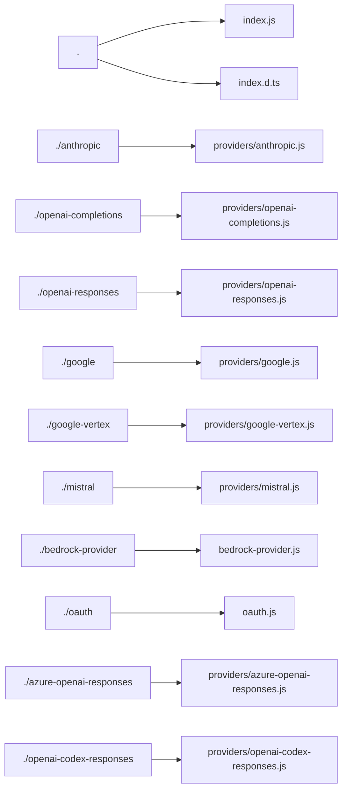
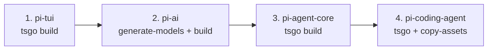
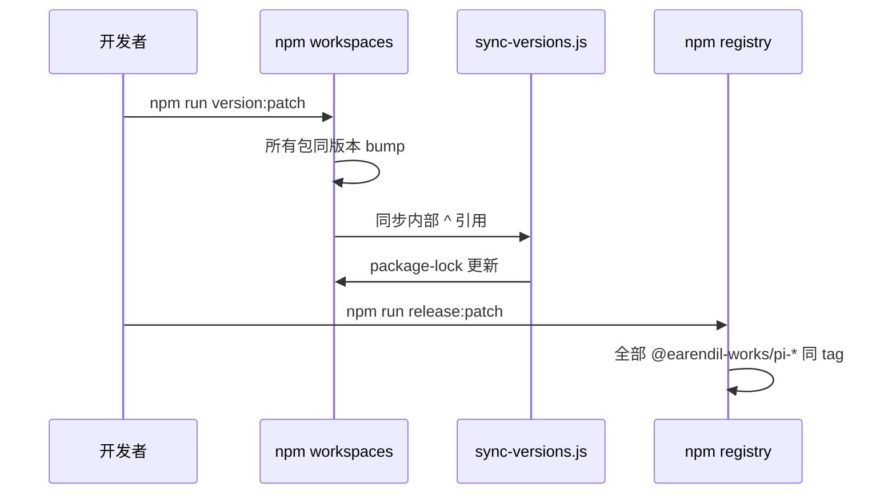
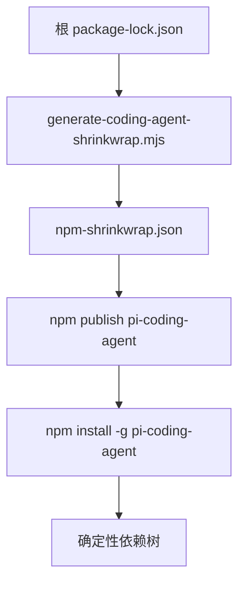
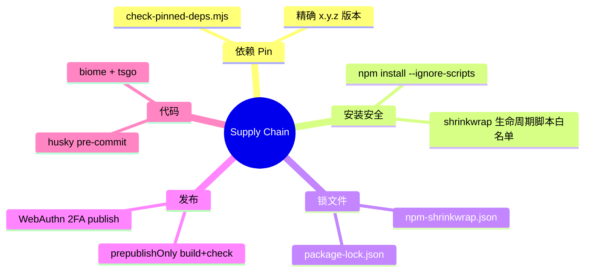

# 包依赖关系图

Pi monorepo（`pi-monorepo`）采用 **npm workspaces** 管理多个 `@earendil-works/pi-*` 包，所有发布包 **锁步版本**（当前 `0.75.5`），构建顺序由包间依赖严格决定。

## Monorepo 总览

```mermaid
graph TB
    subgraph pi-monorepo
        ROOT[pi-monorepo<br/>private workspace root]
        TUI[@earendil-works/pi-tui]
        AI[@earendil-works/pi-ai]
        AGENT[@earendil-works/pi-agent-core]
        CA[@earendil-works/pi-coding-agent]
    end
    ROOT --> TUI
    ROOT --> AI
    ROOT --> AGENT
    ROOT --> CA
    TUI --> CA
    AI --> AGENT
    AI --> CA
    AGENT --> CA
```

| 包 | 版本 | 职责 |
|----|------|------|
| `@earendil-works/pi-tui` | 0.75.5 | 终端 UI 库，差分渲染 |
| `@earendil-works/pi-ai` | 0.75.5 | 统一 LLM API、提供商、模型目录 |
| `@earendil-works/pi-agent-core` | 0.75.5 | Agent 核心：传输、状态、附件 |
| `@earendil-works/pi-coding-agent` | 0.75.5 | CLI、TUI 模式、SDK、工具、会话 |

---

## 包间依赖（精确版本）

Workspace 内依赖使用 `^0.75.5`（与当前锁步版本一致）；发布到 npm 时解析为兼容的 0.75.x。



### 依赖声明（package.json）

**pi-coding-agent → 内部包**

```json
"@earendil-works/pi-agent-core": "^0.75.5",
"@earendil-works/pi-ai": "^0.75.5",
"@earendil-works/pi-tui": "^0.75.5"
```

**pi-agent-core → pi-ai**

```json
"@earendil-works/pi-ai": "^0.75.5"
```

**pi-tui、pi-ai：** 无 `@earendil-works/pi-*` 依赖（依赖图的两个根）。

---

## 外部依赖分析

所有 **直接外部依赖** 必须 **精确 pin 版本**（由 `scripts/check-pinned-deps.mjs` 在 CI 中强制）。

### pi-tui@0.75.5

| 依赖 | 版本 | 用途 |
|------|------|------|
| `get-east-asian-width` | 1.6.0 | CJK 字符宽度计算 |
| `marked` | 15.0.12 | Markdown 渲染 |

dev：`@xterm/headless`、`chalk`

### pi-ai@0.75.5

| 依赖 | 版本 | 用途 |
|------|------|------|
| `@anthropic-ai/sdk` | 0.91.1 | Anthropic API |
| `@aws-sdk/client-bedrock-runtime` | 3.1048.0 | AWS Bedrock |
| `@google/genai` | 1.52.0 | Google Gemini |
| `@mistralai/mistralai` | 2.2.1 | Mistral |
| `openai` | 6.26.0 | OpenAI 兼容 API |
| `typebox` | 1.1.38 | 运行时类型/schema |
| `partial-json` | 0.1.7 | 流式 JSON 解析 |
| `http-proxy-agent` / `https-proxy-agent` | 7.x | 代理 |
| `@smithy/node-http-handler` | 4.7.3 | AWS HTTP |



### pi-agent-core@0.75.5

| 依赖 | 版本 | 用途 |
|------|------|------|
| `@earendil-works/pi-ai` | ^0.75.5 | LLM 调用 |
| `typebox` | 1.1.38 | Tool schema |
| `yaml` | 2.9.0 | YAML 解析 |
| `ignore` | 7.0.5 | gitignore 风格匹配 |

### pi-coding-agent@0.75.5

| 依赖 | 版本 | 用途 |
|------|------|------|
| 三个内部包 | ^0.75.5 | 核心栈 |
| `@silvia-odwyer/photon-node` | 0.3.4 | 图片处理 WASM |
| `chalk` | 5.6.2 | 终端颜色 |
| `cross-spawn` | 7.0.6 | 子进程 |
| `diff` | 8.0.4 | 编辑 diff |
| `glob` / `minimatch` | 13.0.6 / 10.2.5 | 文件匹配 |
| `highlight.js` | 10.7.3 | 语法高亮 |
| `jiti` | 2.7.0 | 扩展 TS 加载 |
| `typebox` | 1.1.38 | Tool 定义 |
| `undici` | 8.3.0 | HTTP 客户端 |
| `yaml` | 2.9.0 | 配置解析 |
| `proper-lockfile` | 4.1.2 | 文件锁 |
| `hosted-git-info` | 9.0.3 | Git 包解析 |
| `ignore` | 7.0.5 | 忽略规则 |

optional：`@mariozechner/clipboard` 0.3.6（剪贴板）

---

## Subpath Exports 映射

### @earendil-works/pi-ai



| 导出路径 | 用途 |
|----------|------|
| `.` | 主 API：`getModel`、`stream`、类型 |
| `./anthropic` | Anthropic 提供商实现 |
| `./openai-completions` | OpenAI Chat Completions |
| `./openai-responses` | OpenAI Responses API |
| `./openai-codex-responses` | Codex 订阅 |
| `./google` / `./google-vertex` | Gemini / Vertex |
| `./mistral` | Mistral |
| `./bedrock-provider` | AWS Bedrock |
| `./azure-openai-responses` | Azure OpenAI |
| `./oauth` | OAuth 工具 |

### @earendil-works/pi-agent-core

| 导出路径 | 用途 |
|----------|------|
| `.` | `Agent`、类型、compaction harness |
| `./node` | Node 专用传输 |
| `./package.json` | 包元数据 |

### @earendil-works/pi-coding-agent

| 导出路径 | 用途 |
|----------|------|
| `.` | SDK：`createAgentSession`、`SessionManager`、工具工厂 |
| `./hooks` | 扩展 hook 类型 |

### @earendil-works/pi-tui

| 导出 | 说明 |
|------|------|
| `.` | TUI 组件、Editor、Terminal |

---

## 构建顺序

根 `package.json` 的 `build` 脚本强制执行拓扑序：



```bash
cd packages/tui && npm run build
cd ../ai && npm run build      # 含 generate-models
cd ../agent && npm run build
cd ../coding-agent && npm run build
```

**原因：**

- `pi-ai` 构建时生成 `models.generated.ts`
- `pi-agent-core` 类型依赖 `pi-ai` 的 dist
- `pi-coding-agent` 聚合三者并复制 theme/assets

Bun 独立二进制额外步骤：

```bash
npm run build:binary  # tui → ai → agent → coding-agent → bun compile
```

---

## 锁步版本策略（Lockstep Versioning）



| 规则 | 说明 |
|------|------|
| 统一版本号 | 所有 `@earendil-works/pi-*` 共享 `0.75.5` |
| patch | 修复 + 新增功能 |
| minor | **Breaking changes**（无 major 版本策略） |
| 脚本 | `version:patch/minor` + `scripts/sync-versions.js` |
| 发布 | `release:patch/minor` 一次发布全部包 |

消费者应让 `@earendil-works/pi-coding-agent`、`pi-ai`、`pi-agent-core`、`pi-tui` **保持相同 minor.patch**，避免 API 不匹配。

---

## npm-shrinkwrap 与已发布 CLI

`@earendil-works/pi-coding-agent` 是唯一面向终端用户的主包，发布时附带 **`npm-shrinkwrap.json`**。



**生成与校验：**

```bash
node scripts/generate-coding-agent-shrinkwrap.mjs        # 生成
node scripts/generate-coding-agent-shrinkwrap.mjs --check  # CI 校验
npm run check:shrinkwrap
```

shrinkwrap 从根 lockfile 提取 `@earendil-works/pi-coding-agent` 的完整传递依赖闭包，确保全球安装得到 **bit-for-bit 相同** 的依赖树（含 `resolved` URL 与 `integrity` 哈希）。

**prepublishOnly 流程：**

```bash
npm run clean && npm run build && npm run shrinkwrap
```

---

## 供应链安全措施



### 1. 精确版本 Pin

`scripts/check-pinned-deps.mjs` 扫描所有 `package.json`，要求直接外部依赖为精确 semver（不允许 `^` / `~`）。workspace 内部 `@earendil-works/pi-*` 除外。

### 2. 禁用生命周期脚本

- 文档推荐：`npm install -g --ignore-scripts`
- CI / 本地：`npm ci --ignore-scripts`
- shrinkwrap 生成器维护 **`allowedInstallScriptPackages` 白名单**；新增带 install 脚本的依赖需显式审查

当前白名单示例：

| 包 | 原因 |
|----|------|
| `@google/genai@1.52.0` | preinstall 在发布包中为 no-op |
| `protobufjs@7.5.9` | postinstall 仅版本警告 |

### 3. Lockfile 保护

- Pre-commit 默认 **阻止** 未经批准的 lockfile 变更（`PI_ALLOW_LOCKFILE_CHANGE=1` 例外）
- shrinkwrap `--check` 纳入 `npm run check`

### 4. 完整性字段

shrinkwrap 每条目包含 `integrity`（SRI）与 `resolved` registry URL，npm 安装时校验 tarball。

### 5. 发布门禁

```bash
npm run prepublishOnly  # clean + build + check
```

包含：`biome`、`tsgo --noEmit`、pinned deps、shrinkwrap、相对 import 检查。

### 6. Overrides

根 `package.json` 对传递依赖（如 `rimraf`）使用 `overrides` 统一版本，减少供应链漂移。

---

## 依赖关系矩阵

|  | pi-tui | pi-ai | pi-agent-core | pi-coding-agent |
|--|:------:|:-----:|:-------------:|:---------------:|
| **pi-tui** | — | | | |
| **pi-ai** | | — | | |
| **pi-agent-core** | | ✓ | — | |
| **pi-coding-agent** | ✓ | ✓ | ✓ | — |

✓ = 直接 workspace 依赖

---

## 消费者安装拓扑

```mermaid
graph TD
    USER[npm install -g @earendil-works/pi-coding-agent]
    USER --> CA[@earendil-works/pi-coding-agent]
    CA --> AG[@earendil-works/pi-agent-core]
    CA --> AI[@earendil-works/pi-ai]
    CA --> TU[@earendil-works/pi-tui]
    CA --> EXT[photon-node chalk jiti ...]
    AG --> AI
    AI --> SDKS[@anthropic-ai/sdk openai @google/genai ...]
```

SDK 消费者若只需编程接口：

```bash
npm install @earendil-works/pi-coding-agent
# 自动拉取 pi-agent-core、pi-ai、pi-tui 作为依赖
```

仅需 LLM 层：

```bash
npm install @earendil-works/pi-ai
```

---

## 相关脚本与文件

| 文件 | 作用 |
|------|------|
| `package.json` (root) | workspaces、build 顺序、release |
| `scripts/sync-versions.js` | 锁步版本同步 |
| `scripts/check-pinned-deps.mjs` | 精确 pin 校验 |
| `scripts/generate-coding-agent-shrinkwrap.mjs` | shrinkwrap 生成/校验 |
| `scripts/release.mjs` | 发布流程 |
| `packages/coding-agent/npm-shrinkwrap.json` | 已发布 CLI 确定性树 |

---

## 引擎要求

所有包统一要求：

```json
"engines": { "node": ">=22.19.0" }
```

这与 Node strip-only TypeScript 执行策略及现代 API 使用一致。
