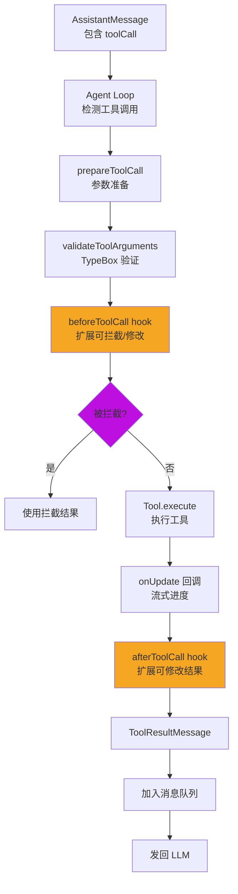

# 核心数据流与事件流

> 追踪从用户输入到最终渲染的完整数据流

---

## 1. 主数据流：用户输入 → LLM 响应

### 1.1 完整流程图

```mermaid
sequenceDiagram
    participant User as 用户
    participant IS as InteractiveMode
    participant AS as AgentSession
    participant Agent as Agent(pi-agent-core)
    participant Loop as AgentLoop
    participant AI as pi-ai
    participant Provider as LLM Provider
    participant Tool as Tool.execute()
    participant SM as SessionManager
    participant Ext as ExtensionRunner
    participant TUI as TUI

    User->>IS: 输入提示词
    IS->>IS: handleInput() 处理输入

    IS->>AS: processInput(text)
    AS->>AS: buildSystemPrompt()<br/>构建系统提示

    AS->>Agent: prompt(messages)
    Agent->>Agent: runWithLifecycle()

    Agent->>Loop: runAgentLoop()

    Loop->>Loop: transformContext()<br/>应用 beforeAgentStart 钩子

    Loop->>Loop: convertToLlm()<br/>AgentMessage[] → Message[]

    Loop->>AI: streamSimple(model, context, options)
    AI->>Provider: HTTP/SSE 请求

    Provider-->>AI: 流式响应事件
    AI-->>Loop: AssistantMessageEvent

    Loop-->>Agent: AgentEvent
    Agent-->>AS: subscribe 回调

    AS->>SM: appendEntry(message)<br/>持久化到 JSONL
    AS->>Ext: emit(event)<br/>分发到扩展

    Ext-->>AS: 扩展处理结果

    AS->>TUI: 更新渲染<br/>显示流式输出

    alt 有工具调用
        Loop->>Tool: execute(toolCallId, params)
        Tool-->>Loop: AgentToolResult

        Loop->>Loop: 将结果加入消息队列
        Loop->>AI: streamSimple(model, context + result)
    end

    AI-->>Loop: 最终响应 (done 事件)
    Loop-->>Agent: agent_end 事件
    Agent-->>AS: idle 状态
    AS-->>TUI: 最终渲染
    TUI-->>User: 显示完整响应
```

### 1.2 详细步骤说明

#### Step 1: 用户输入处理

**入口**：`/packages/coding-agent/src/modes/interactive/interactive-mode.ts`

```typescript
async handleInput(text: string) {
    // 1. 处理斜杠命令
    if (text.startsWith("/")) {
        return this.handleSlashCommand(text);
    }

    // 2. 发送到 AgentSession
    await this.agentSession.processInput(text);
}
```

#### Step 2: 构建系统提示

**入口**：`/packages/coding-agent/src/core/system-prompt.ts`

```typescript
function buildSystemPrompt(tools: Tool[], skills: Skill[]): string {
    const sections = [];

    // 1. 工具描述
    sections.push(formatToolsForPrompt(tools));

    // 2. Skills 描述
    sections.push(formatSkillsForPrompt(skills));

    // 3. 能力说明
    sections.push(CAPABILITIES_SECTION);

    // 4. 规则和指南
    sections.push(RULES_SECTION);

    return sections.join("\n\n");
}
```

#### Step 3: Agent 处理

**入口**：`/packages/agent/src/agent.ts`

```typescript
async prompt(messages: AgentMessage[]) {
    return this.runWithLifecycle(async (state) => {
        // 1. 更新状态
        state.messages.push(...messages);

        // 2. 运行 Agent Loop
        return await runAgentLoop({
            messages: state.messages,
            tools: this.tools,
            streamAssistant: (ctx) => this.streamAssistant(ctx)
        });
    });
}
```

#### Step 4: Agent Loop

**入口**：`/packages/agent/src/agent-loop.ts`

```typescript
export async function* runAgentLoop(config: AgentLoopConfig) {
    // 外层循环：处理 follow-up 消息
    while (true) {
        // 内层循环：流式响应 + 工具执行
        while (true) {
            // 1. 转换消息
            const messages = convertToLlm(config.messages);

            // 2. 流式获取响应
            const stream = streamAssistant(messages, config);

            // 3. 处理流式事件
            for await (const event of stream) {
                if (event.type === "toolCall") {
                    // 4. 执行工具
                    const results = await executeTools(event.toolCalls);
                    // 5. 将结果加入消息队列
                    config.messages.push(...results);
                    // 6. 继续内层循环
                    continue;
                }
                yield event;
            }

            // 7. 无更多工具，退出内层
            break;
        }

        // 8. 检查 follow-up 消息
        const followUps = getFollowUpMessages();
        if (!followUps.length) break;

        // 9. 加入 follow-up，继续外层
        config.messages.push(...followUps);
    }
}
```

#### Step 5: LLM 调用

**入口**：`/packages/ai/src/stream.ts`

```typescript
export async function* streamSimple(
    model: Model<Api>,
    messages: Message[],
    options: SimpleStreamOptions
): AsyncGenerator<AssistantMessageEvent> {
    // 1. 获取 Provider
    const provider = getApiProvider(model.api);

    // 2. 调用 Provider 的 streamSimple
    const stream = provider.streamSimple(model, messages, options);

    // 3. 转发事件
    for await (const event of stream) {
        yield event;
    }
}
```

#### Step 6: 会话持久化

**入口**：`/packages/coding-agent/src/core/session-manager.ts`

```typescript
async appendEntry(entry: SessionEntry) {
    // 1. 写入 JSONL 文件
    await fs.appendFile(this.sessionPath, JSON.stringify(entry) + "\n");

    // 2. 更新内存中的 entries
    this.entries.push(entry);
}
```

#### Step 7: TUI 渲染

**入口**：`/packages/tui/src/tui.ts`

```typescript
async render() {
    // 1. 获取所有组件的渲染结果
    const lines = this.container.render(this.width);

    // 2. 与前一帧对比
    const diff = this.computeDiff(this.lastLines, lines);

    // 3. 输出变化部分
    this.outputDiff(diff);

    // 4. 保存当前帧
    this.lastLines = lines;
}
```

---

## 2. 工具执行数据流

### 2.1 流程图



### 2.2 关键代码

**工具包装**：`/packages/coding-agent/src/core/tools/tool-definition-wrapper.ts`

```typescript
export function wrapToolDefinition<TDetails>(
    definition: ToolDefinition<any, TDetails>
): AgentTool<any, TDetails> {
    return {
        name: definition.name,
        parameters: definition.parameters,
        execute: async (toolCallId, params, signal, onUpdate) => {
            // 调用扩展提供的 execute 函数
            return await definition.execute(
                toolCallId,
                params,
                signal,
                onUpdate,
                // ExtensionContext
                ctx
            );
        }
    };
}
```

**工具执行**：`/packages/agent/src/agent-loop.ts`

```typescript
async function executeTools(toolCalls: ToolCall[]) {
    const results = [];

    for (const toolCall of toolCalls) {
        // 1. 获取工具
        const tool = tools.get(toolCall.name);

        // 2. 准备参数
        const params = tool.prepareArguments?.(toolCall.arguments) ?? toolCall.arguments;

        // 3. beforeToolCall hook
        const event = { toolCall, params };
        await emit("beforeToolCall", event);
        if (event.blocked) {
            results.push(event.result);
            continue;
        }

        // 4. 执行工具
        const result = await tool.execute(toolCall.id, params, signal, onUpdate);

        // 5. afterToolCall hook
        await emit("afterToolCall", { toolCall, result });
        if (event.modifiedResult) {
            results.push(event.modifiedResult);
        } else {
            results.push(result);
        }
    }

    return results;
}
```

---

## 3. 会话持久化数据流

### 3.1 JSONL 格式

**文件位置**：`~/.pi/sessions/<session-id>.jsonl`

**格式**：
```jsonl
{"type":"header","version":3,"id":"session-123","timestamp":1234567890}
{"type":"message","role":"user","content":"Hello","timestamp":1234567891}
{"type":"message","role":"assistant","content":"Hi!","timestamp":1234567892}
{"type":"tool_call","name":"read","arguments":{"path":"./README.md"},"timestamp":1234567893}
{"type":"tool_result","name":"read","result":{"content":"..."},"timestamp":1234567894}
{"type":"compaction","summary":"...","firstKeptEntryId":"entry-456","timestamp":1234567900}
```

### 3.2 读写流程

**写入**：
```typescript
// 每次事件立即追加
await fs.appendFile(sessionPath, JSON.stringify(entry) + "\n");
```

**读取**：
```typescript
// 启动时加载全部条目
const lines = await fs.readFile(sessionPath, "utf-8");
const entries = lines.split("\n").map(line => JSON.parse(line));
```

**上下文重建**：
```typescript
function buildSessionContext(entries: SessionEntry[]): AgentMessage[] {
    const messages = [];

    for (const entry of entries) {
        switch (entry.type) {
            case "message":
                messages.push({
                    role: entry.role,
                    content: entry.content,
                    timestamp: entry.timestamp
                });
                break;
            case "tool_call":
                messages.push({
                    role: "assistant",
                    content: [{
                        type: "toolCall",
                        id: entry.id,
                        name: entry.name,
                        arguments: entry.arguments
                    }]
                });
                break;
            // ... 其他类型
        }
    }

    return messages;
}
```

---

## 4. 扩展事件流

### 4.1 事件分发机制

**入口**：`/packages/coding-agent/src/core/extensions/runner.ts`

```typescript
class ExtensionRunner {
    async emit<TEvent extends ExtensionEvent>(event: TEvent) {
        const results = [];

        // 遍历所有扩展
        for (const extension of this.extensions) {
            // 获取该事件类型的处理器
            const handlers = extension.handlers.get(event.type);

            if (!handlers) continue;

            // 执行所有处理器
            for (const handler of handlers) {
                try {
                    const result = await handler(event);
                    results.push(result);
                } catch (err) {
                    console.error(`Extension ${extension.name} error:`, err);
                }
            }
        }

        // 合并结果（根据事件类型）
        return this.mergeResults(event.type, results);
    }
}
```

### 4.2 可取消事件

某些事件允许扩展"否决"操作：

```typescript
// session_before_compact 事件示例
interface SessionBeforeCompactEvent {
    type: "session_before_compact";
    session: AgentSession;
    block: () => void;  // 调用此函数阻止压缩
}

// 扩展中
api.on("session_before_compact", (event) => {
    if (shouldBlockCompaction(event.session)) {
        event.block();  // 阻止压缩
    }
});
```

---

## 5. UI 更新数据流

### 5.1 事件 → 渲染映射

| AgentEvent | TUI 组件 | 渲染效果 |
|-----------|---------|---------|
| `message_start` | Messages | 创建消息容器 |
| `message_delta` | Messages | 追加文本内容 |
| `tool_call_start` | ToolExecution | 显示工具调用 |
| `tool_call_update` | ToolExecution | 更新工具参数 |
| `tool_result` | ToolExecution | 显示工具结果 |
| `thinking_delta` | Messages | 显示思考内容 |
| `message_end` | Messages | 完成消息渲染 |

### 5.2 差分渲染

**原理**：仅输出变化的行

```typescript
function computeDiff(prev: string[], curr: string[]) {
    const diff = [];

    for (let i = 0; i < curr.length; i++) {
        if (prev[i] !== curr[i]) {
            diff.push({ line: i, text: curr[i] });
        }
    }

    return diff;
}

function outputDiff(diff: Diff[]) {
    for (const { line, text } of diff) {
        // 移动光标到指定行
        process.stdout.write(`\x1b[${line + 1};0H`);
        // 清除行
        process.stdout.write("\x1b[2K");
        // 输出新内容
        process.stdout.write(text);
    }
}
```

---

## 6. 关键数据结构转换

### 6.1 消息转换链

```
用户输入 (string)
  ↓
UserMessage (AgentMessage)
  ↓
convertToLlm()
  ↓
Message (pi-ai 格式)
  ↓
Provider SDK 格式 (如 Anthropic Messages API)
  ↓
LLM Provider 响应
  ↓
AssistantMessageEvent
  ↓
AssistantMessage (AgentMessage)
  ↓
SessionEntry (JSONL)
```

### 6.2 工具调用转换

```
AssistantMessage.content[toolCall] (pi-ai 格式)
  ↓
Agent Loop
  ↓
ToolCall (AgentTool 格式)
  ↓
Tool.execute(params)
  ↓
AgentToolResult
  ↓
ToolResultMessage (AgentMessage)
  ↓
convertToLlm()
  ↓
Message (pi-ai 格式)
  ↓
发送给 LLM
```

---

## 7. 性能优化点

### 7.1 流式响应

- 实时显示 LLM 输出
- 不等待完整响应
- 减少感知延迟

### 7.2 懒加载

- Provider 按需加载
- 扩展按需加载
- 减少启动时间

### 7.3 差分渲染

- 仅更新变化区域
- 减少 ANSI 转义输出
- 提升终端性能

### 7.4 上下文压缩

- 智能压缩长对话
- 保留关键信息
- 减少 Token 消耗

---

## 8. 调试技巧

### 8.1 追踪数据流

```typescript
// 在关键位置添加日志
console.log("[DEBUG] User input:", text);
console.log("[DEBUG] System prompt:", systemPrompt);
console.log("[DEBUG] Agent messages:", messages);
console.log("[DEBUG] LLM response:", response);
```

### 8.2 检查会话文件

```bash
# 查看最新的会话
cat ~/.pi/sessions/$(ls -t ~/.pi/sessions | head -1)
```

### 8.3 启用调试日志

```bash
# 设置环境变量
PI_DEBUG=1 ./pi-test.sh
```

---

## 9. 总结

pi-mono 的数据流设计特点：

1. **流式优先**：实时响应，减少延迟
2. **事件驱动**：解耦组件，支持扩展
3. **持久化友好**：JSONL 格式，易于处理
4. **类型安全**：完整的类型转换链
5. **性能优化**：懒加载、差分渲染、上下文压缩

理解这些数据流对于开发和调试 pi-mono 至关重要。

---

**相关文档**：
- [架构概览](./01-architecture-overview.md)
- [事件系统](./04-event-system.md)
- [Agent Loop 详解](../03-packages/02-pi-agent-core.md)
