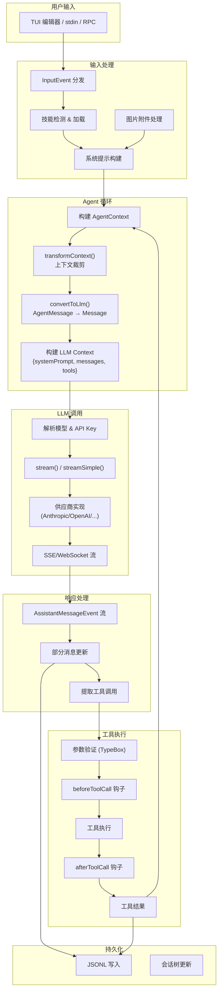
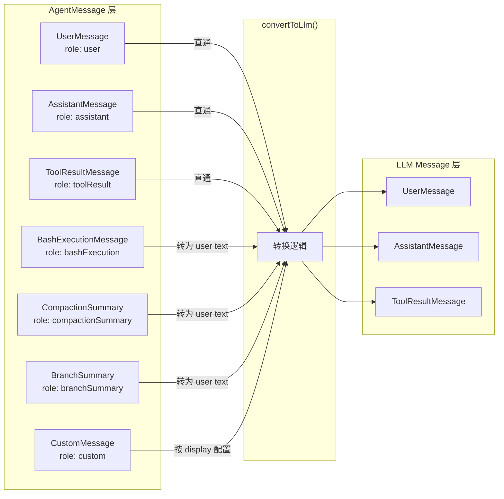
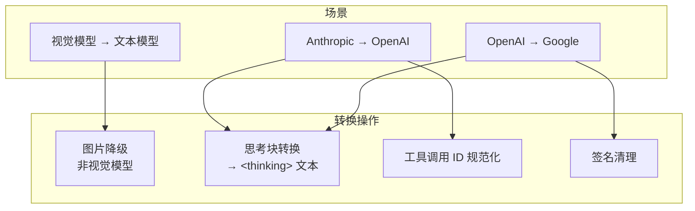
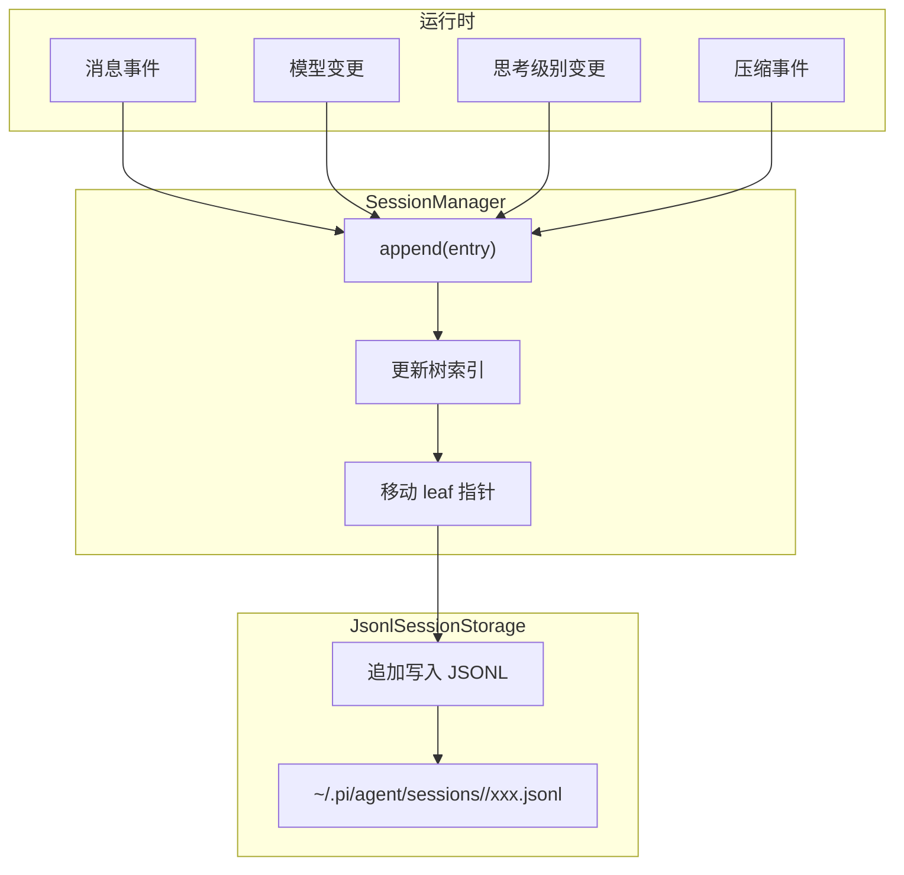
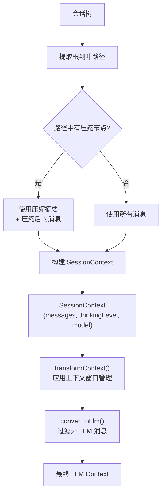
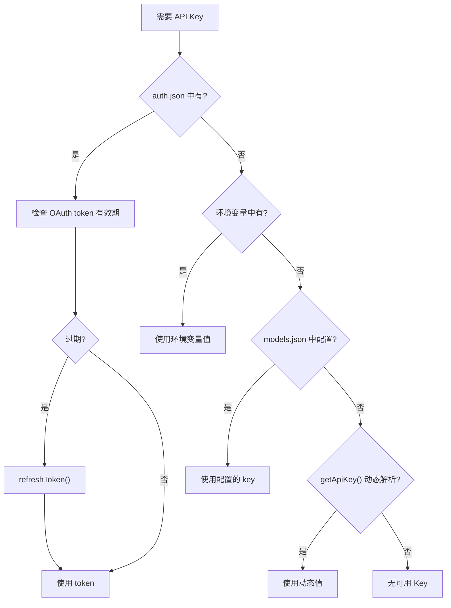

# 数据流与消息流

## 端到端数据流



## 消息生命周期

### 用户消息流

```mermaid
sequenceDiagram
    participant Editor as TUI 编辑器
    participant IM as InteractiveMode
    participant AS as AgentSession
    participant Ext as ExtensionRunner
    participant Agent as Agent
    participant Loop as AgentLoop

    Editor->>IM: onSubmit(text)
    IM->>IM: 检查 slash 命令
    IM->>IM: 检查 bash 前缀 (!/!!)
    IM->>AS: prompt(text, images)
    AS->>Ext: emit("input", {text, images})
    Note over Ext: 扩展可 transform/handle
    AS->>Ext: emit("before_agent_start", {prompt, systemPrompt})
    Note over Ext: 扩展可修改系统提示
    AS->>Agent: prompt([userMessage])
    Agent->>Loop: agentLoop(prompts, context, config)
    Loop->>Loop: emit("agent_start")
    Loop->>Loop: emit("message_start", userMessage)
    Loop->>Loop: emit("message_end", userMessage)
```

### 助手消息流

```mermaid
sequenceDiagram
    participant Loop as AgentLoop
    participant Stream as streamSimple()
    participant Provider as 供应商
    participant AS as AgentSession
    participant TUI as TUI

    Loop->>Loop: transformContext(messages)
    Loop->>Loop: convertToLlm(messages)
    Loop->>Stream: stream(model, llmContext, options)
    Stream->>Provider: HTTP/WebSocket 请求
    Provider-->>Stream: SSE 事件流
    
    Stream-->>Loop: {type: "start", partial}
    Loop->>AS: emit("message_start")
    AS->>TUI: 创建 AssistantMessageComponent
    
    loop 流式更新
        Stream-->>Loop: {type: "text_delta", delta}
        Loop->>AS: emit("message_update")
        AS->>TUI: 增量渲染 Markdown
    end
    
    Stream-->>Loop: {type: "toolcall_end", toolCall}
    Loop->>AS: emit("message_update")
    
    Stream-->>Loop: {type: "done", message}
    Loop->>AS: emit("message_end")
    AS->>AS: 写入 JSONL
```

### 工具调用流

```mermaid
sequenceDiagram
    participant Loop as AgentLoop
    participant Ext as ExtensionRunner
    participant Tool as 工具实现
    participant FS as 文件系统/Shell
    participant TUI as TUI

    Note over Loop: 从助手消息提取 toolCalls
    
    Loop->>Loop: prepareToolCall()
    Note over Loop: 查找工具, 验证参数
    
    Loop->>Ext: beforeToolCall({toolCall, args})
    Note over Ext: 扩展可 block
    
    alt 工具被阻止
        Loop->>Loop: 返回错误结果
    else 允许执行
        Loop->>Loop: emit("tool_execution_start")
        Loop->>TUI: 显示工具开始
        Loop->>Tool: execute(id, params, signal, onUpdate)
        
        loop 部分更新
            Tool->>Loop: onUpdate(partialResult)
            Loop->>TUI: 显示部分输出
        end
        
        Tool->>FS: 实际 I/O 操作
        FS->>Tool: 结果
        Tool->>Loop: return result
    end
    
    Loop->>Ext: afterToolCall({toolCall, result})
    Note over Ext: 扩展可修改结果
    
    Loop->>Loop: emit("tool_execution_end")
    Loop->>Loop: 构建 ToolResultMessage
    Loop->>Loop: emit("message_start/end", toolResult)
```

## 消息格式转换

### AgentMessage → LLM Message



### 跨供应商消息转换 (transform-messages.ts)

当在同一会话中切换模型供应商时，`pi-ai` 层自动转换消息格式：



## 数据持久化流



### JSONL 条目格式

```json
{"id":"abc123","parentId":"def456","type":"message","timestamp":1717000000000,"data":{"role":"user","content":"修复这个 bug"}}
{"id":"ghi789","parentId":"abc123","type":"message","timestamp":1717000001000,"data":{"role":"assistant","content":[{"type":"text","text":"好的，让我查看一下"}]}}
{"id":"jkl012","parentId":"ghi789","type":"model_change","timestamp":1717000002000,"data":{"provider":"anthropic","model":"claude-sonnet-4-20250514"}}
```

## 上下文构建流程

从会话树路径构建 LLM 上下文：



## API Key 解析流程


