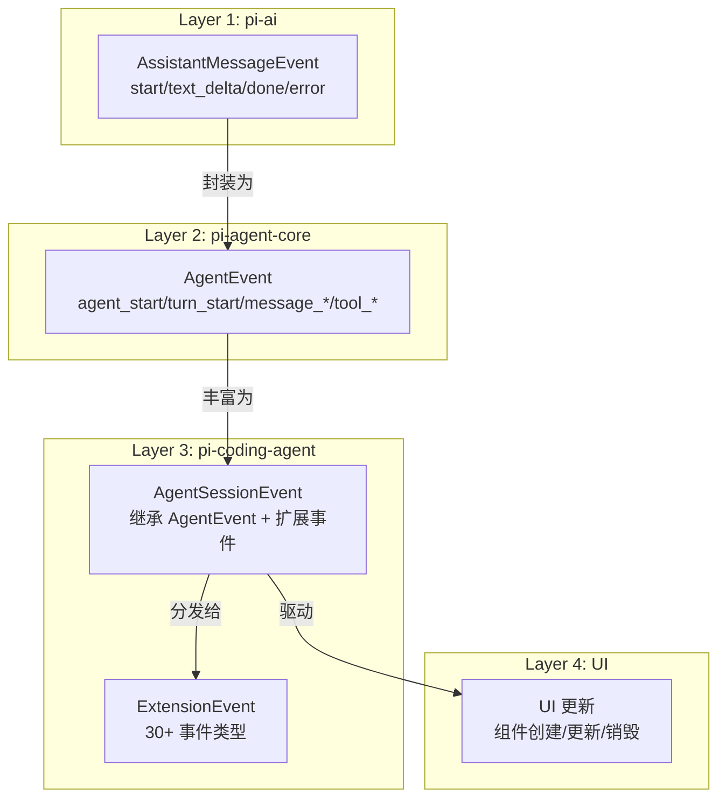
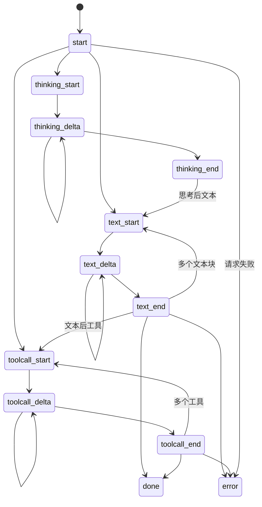
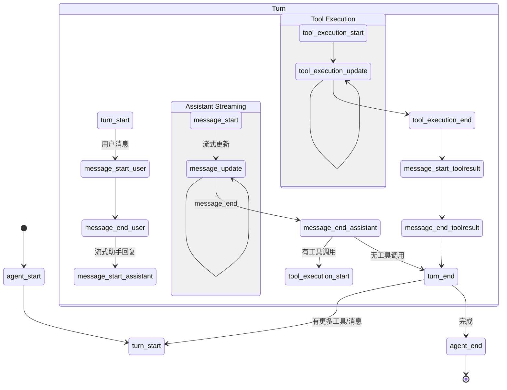
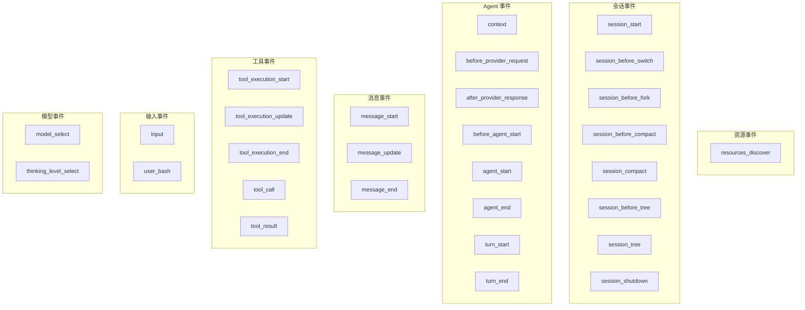
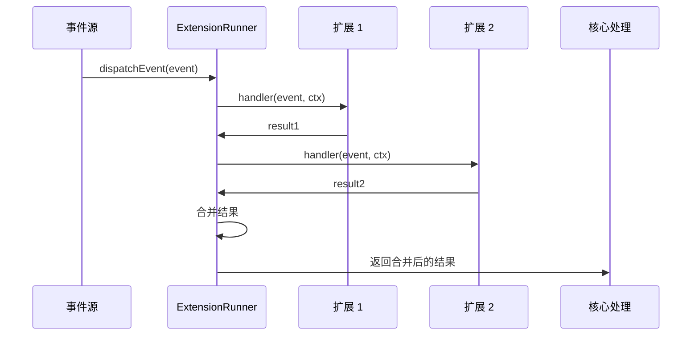
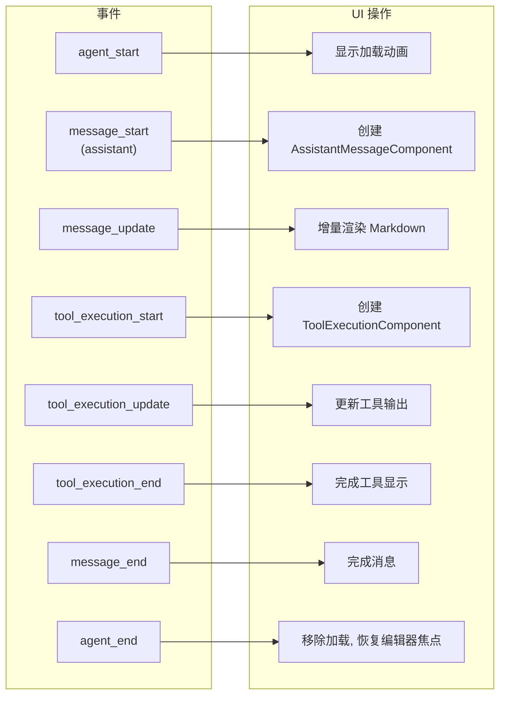
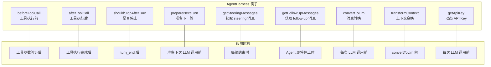

# 事件驱动架构

## 事件系统全景

Pi 的事件系统贯穿从 Agent 核心到 UI 渲染的整个链条。事件层层传递、逐级丰富，是解耦各子系统的核心机制。

## Layer 1: AssistantMessageEvent (pi-ai)

LLM 供应商返回的流式事件，最底层的事件协议：

| 事件 | 载荷 | 说明 |
|------|------|------|
| `start` | `{partial: AssistantMessage}` | 流开始，初始空消息 |
| `text_start` | `{contentIndex, partial}` | 文本块开始 |
| `text_delta` | `{contentIndex, delta, partial}` | 文本增量 |
| `text_end` | `{contentIndex, content, partial}` | 文本块完成 |
| `thinking_start/delta/end` | 同上结构 | 思考/推理块 |
| `toolcall_start/delta/end` | `{contentIndex, toolCall, partial}` | 工具调用块 |
| `done` | `{reason, message}` | 成功完成 |
| `error` | `{reason, error}` | 错误终止 |

## Layer 2: AgentEvent (pi-agent-core)

Agent 运行时事件，封装了完整的 turn/tool 生命周期：

| 事件 | 时机 | 关键载荷 |
|------|------|---------|
| `agent_start` | 循环开始 | 无 |
| `agent_end` | 循环结束 | `messages: AgentMessage[]` |
| `turn_start` | 新一轮开始 | 无 |
| `turn_end` | 一轮结束 | `message, toolResults` |
| `message_start` | 消息开始 | `message: AgentMessage` |
| `message_update` | 助手流式更新 | `message, assistantMessageEvent` |
| `message_end` | 消息结束 | `message: AgentMessage` |
| `tool_execution_start` | 工具开始执行 | `toolCallId, toolName, args` |
| `tool_execution_update` | 工具部分输出 | `partialResult` |
| `tool_execution_end` | 工具执行完成 | `result, isError` |

## Layer 3: ExtensionEvent (pi-coding-agent)

扩展系统的事件是最丰富的层，包含 30+ 种事件类型：

### 事件分类

#### 可拦截事件（返回结果影响行为）

| 事件 | 返回结果 | 拦截能力 |
|------|---------|---------|
| `input` | `action: "handled"` | 完全接管输入处理 |
| `input` | `action: "transform"` | 修改输入文本 |
| `tool_call` | `{block: true}` | 阻止工具执行 |
| `tool_result` | `{content, isError}` | 修改工具结果 |
| `context` | `{messages}` | 替换上下文消息 |
| `before_provider_request` | payload | 替换请求负载 |
| `before_agent_start` | `{systemPrompt}` | 替换系统提示 |
| `message_end` | `{message}` | 替换最终消息 |
| `session_before_switch` | `{cancel: true}` | 取消会话切换 |
| `session_before_fork` | `{cancel: true}` | 取消分支 |
| `session_before_compact` | `{cancel: true}` | 取消压缩 |
| `session_before_tree` | `{cancel: true}` | 取消树导航 |
| `user_bash` | `{operations, result}` | 替换 bash 执行 |

#### 通知事件（只读观察）

| 事件 | 用途 |
|------|------|
| `session_start` | 会话初始化后的设置 |
| `session_compact` | 压缩完成后的通知 |
| `session_tree` | 树导航完成后的通知 |
| `session_shutdown` | 清理资源 |
| `agent_start/end` | Agent 运行状态追踪 |
| `turn_start/end` | 轮次追踪 |
| `message_start/update` | UI 渲染驱动 |
| `tool_execution_*` | 工具执行追踪 |
| `model_select` | 模型变更追踪 |
| `thinking_level_select` | 思考级别变更追踪 |

## 事件分发机制

### 结果合并策略

| 事件类型 | 合并策略 |
|---------|---------|
| `tool_call` | 任一 `block: true` 则阻止 |
| `tool_result` | 最后一个非空结果生效 |
| `context` | 最后一个非空 messages 生效 |
| `before_agent_start` | systemPrompt 链式替换 |
| `input` | 第一个 `handled` 或最后一个 `transform` |
| `session_before_*` | 任一 `cancel: true` 则取消 |

## 事件与 UI 的映射

## 钩子系统 (AgentHarness)

AgentHarness 层的钩子提供了比扩展事件更底层的控制点：

