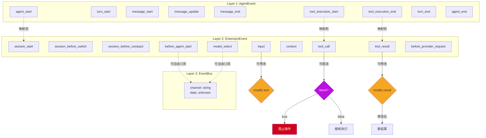

# 事件驱动架构深度分析

> 理解 pi-mono 的三层事件系统

---

## 1. 事件系统概览

pi-mono 采用**三层事件系统**，从底层到上层逐步扩展：

```
┌─────────────────────────────────────────────────────────────────┐
│                     Layer 3: EventBus                            │
│                   自由频道，跨扩展通信                              │
├─────────────────────────────────────────────────────────────────┤
│                     Layer 2: ExtensionEvent                      │
│              30+ 事件类型，扩展点、UI、会话管理                       │
├─────────────────────────────────────────────────────────────────┤
│                     Layer 1: AgentEvent                          │
│           Agent 核心事件，生命周期、消息、工具执行                     │
└─────────────────────────────────────────────────────────────────┘
```

### 1.1 三层对比

| 层次 | 定义位置 | 事件数量 | 用途 | 可取消/可修改 |
|------|---------|---------|------|-------------|
| **Layer 1** | `packages/agent/src/types.ts` | 10+ | Agent 核心生命周期 | 否 |
| **Layer 2** | `packages/coding-agent/src/core/extensions/types.ts` | 30+ | 扩展点、UI、会话管理 | 是（部分） |
| **Layer 3** | `packages/coding-agent/src/core/event-bus.ts` | 无限制 | 扩展间自由通信 | 否 |

---

## 2. Layer 1: AgentEvent

### 2.1 定义位置

**文件**：`/packages/agent/src/types.ts`

```typescript
export type AgentEvent =
    | AgentStartEvent        // Agent 启动
    | AgentEndEvent          // Agent 结束
    | TurnStartEvent         // 单轮对话开始
    | TurnEndEvent           // 单轮对话结束
    | MessageStartEvent      // 消息流开始
    | MessageUpdateEvent     // 消息内容更新（token by token）
    | MessageEndEvent        // 消息流结束
    | ToolExecutionStartEvent // 工具执行开始
    | ToolExecutionUpdateEvent // 工具执行更新
    | ToolExecutionEndEvent;  // 工具执行结束
```

### 2.2 事件详解

#### AgentStartEvent / AgentEndEvent

```typescript
interface AgentStartEvent {
    type: "agent_start";
    timestamp: number;
}

interface AgentEndEvent {
    type: "agent_end";
    timestamp: number;
    reason: "aborted" | "complete" | "error";
}
```

#### TurnStartEvent / TurnEndEvent

```typescript
interface TurnStartEvent {
    type: "turn_start";
    timestamp: number;
    messages: AgentMessage[];
}

interface TurnEndEvent {
    type: "turn_end";
    timestamp: number;
    messages: AgentMessage[];
}
```

**用途**：跟踪单轮对话（一次 user + assistant 交互）

#### MessageStartEvent / MessageUpdateEvent / MessageEndEvent

```typescript
interface MessageStartEvent {
    type: "message_start";
    timestamp: number;
    message: AssistantMessage;
}

interface MessageUpdateEvent {
    type: "message_update";
    timestamp: number;
    delta: string;  // 新增的文本
    message: AssistantMessage;
}

interface MessageEndEvent {
    type: "message_end";
    timestamp: number;
    message: AssistantMessage;
}
```

**用途**：实时跟踪消息流，用于 UI 渲染

#### ToolExecution*Event

```typescript
interface ToolExecutionStartEvent {
    type: "tool_execution_start";
    timestamp: number;
    toolCall: ToolCall;
}

interface ToolExecutionUpdateEvent {
    type: "tool_execution_update";
    timestamp: number;
    toolCall: ToolCall;
    update: unknown;  // 工具特定的更新数据
}

interface ToolExecutionEndEvent {
    type: "tool_execution_end";
    timestamp: number;
    toolCall: ToolCall;
    result: AgentToolResult;
}
```

**用途**：跟踪工具执行进度

### 2.3 订阅机制

```typescript
class Agent {
    private listeners: Array<(event: AgentEvent) => Promise<void>> = [];

    subscribe(listener: (event: AgentEvent) => Promise<void>): () => void {
        this.listeners.push(listener);
        return () => {
            this.listeners = this.listeners.filter(l => l !== listener);
        };
    }

    async emit(event: AgentEvent) {
        for (const listener of this.listeners) {
            await listener(event);
        }
    }
}
```

**特点**：
- 按订阅顺序执行
- 每个 listener 被 await
- 返回取消订阅函数

---

## 3. Layer 2: ExtensionEvent

### 3.1 定义位置

**文件**：`/packages/coding-agent/src/core/extensions/types.ts`

**关键**：这个文件有 **1546 行**，是整个扩展系统的核心。

### 3.2 事件分类

#### 会话事件（Session Events）

```typescript
type SessionEvent =
    | SessionStartEvent         // 会话启动
    | SessionBeforeSwitchEvent  // 切换会话前（可取消）
    | SessionBeforeCompactEvent // 压缩前（可取消）
    | SessionBeforeForkEvent    // 分支前（可取消）
    | SessionBeforeTreeEvent    // 打开树视图前（可取消）
    | SessionEndEvent;          // 会话结束
```

**可取消事件示例**：

```typescript
interface SessionBeforeCompactEvent {
    type: "session_before_compact";
    session: AgentSession;
    block: () => void;  // 调用此函数阻止压缩
}
```

#### 工具事件（Tool Events）

```typescript
type ToolEvent =
    | ToolCallEvent            // 工具调用前
    | ToolResultEvent;         // 工具结果返回后（可修改）

interface ToolCallEvent {
    type: "tool_call";
    toolCall: ToolCall;
    arguments: unknown;
    block: () => void;  // 可阻止工具执行
}

interface ToolResultEvent {
    type: "tool_result";
    toolCall: ToolCall;
    result: AgentToolResult;
    setResult: (result: AgentToolResult) => void;  // 可修改结果
}
```

#### 输入事件（Input Events）

```typescript
type InputEvent =
    | InputEvent               // 用户输入
    | UserBashEvent;           // 用户执行 bash 命令

interface InputEvent {
    type: "input";
    text: string;
    modify: (text: string) => void;  // 可修改输入文本
}
```

#### 上下文事件（Context Events）

```typescript
type ContextEvent =
    | ContextEvent             // 上下文修改
    | BeforeAgentStartEvent;   // Agent 启动前（修改提示）

interface ContextEvent {
    type: "context";
    messages: AgentMessage[];
    setMessages: (messages: AgentMessage[]) => void;  // 可修改上下文
}

interface BeforeAgentStartEvent {
    type: "before_agent_start";
    messages: AgentMessage[];
    setMessages: (messages: AgentMessage[]) => void;
}
```

#### Provider 事件（Provider Events）

```typescript
type ProviderEvent =
    | ModelSelectEvent         // 模型选择
    | BeforeProviderRequestEvent;  // Provider 请求前

interface ModelSelectEvent {
    type: "model_select";
    model: Model<Api>;
    setModel: (model: Model<Api>) => void;  // 可修改模型
}

interface BeforeProviderRequestEvent {
    type: "before_provider_request";
    model: Model<Api>;
    messages: Message[];
    options: SimpleStreamOptions;
    setMessages: (messages: Message[]) => void;
    setOptions: (options: SimpleStreamOptions) => void;
}
```

#### UI 事件（UI Events）

```typescript
type UIEvent =
    | RenderEvent              // 渲染事件（自定义组件）
    | StatusEvent;             // 状态栏更新

interface RenderEvent {
    type: "render";
    phase: "before" | "after";
    container: Container;  // 可添加自定义组件
}
```

### 3.3 完整事件列表

**源文件**：`/packages/coding-agent/src/core/extensions/types.ts:588-962`

```typescript
export type ExtensionEvent =
    // 资源发现
    | ResourcesDiscoverEvent
    // 会话管理
    | SessionEvent
    // 上下文修改
    | ContextEvent
    // Agent 启动前
    | BeforeAgentStartEvent
    // 工具调用和结果
    | ToolCallEvent
    | ToolResultEvent
    // 消息流
    | MessageStartEvent
    | MessageUpdateEvent
    | MessageEndEvent
    // 用户输入
    | InputEvent
    | UserBashEvent
    // 模型选择
    | ModelSelectEvent
    // Provider 请求
    | BeforeProviderRequestEvent
    // UI 渲染
    | RenderEvent
    | StatusEvent
    // ... 更多事件
    ;
```

**统计**：约 **30-40 个事件类型**

---

## 4. Layer 3: EventBus

### 4.1 定义位置

**文件**：`/packages/coding-agent/src/core/event-bus.ts`

### 4.2 API

```typescript
interface EventBus {
    emit(channel: string, data: unknown): void;
    on(channel: string, handler: (data: unknown) => void): () => void;
    clear(): void;
}
```

### 4.3 实现

```typescript
import { EventEmitter } from "events";

export function createEventBus(): EventBusController {
    const emitter = new EventEmitter();

    return {
        emit: (channel, data) => emitter.emit(channel, data),
        on: (channel, handler) => {
            const safeHandler = async (data: unknown) => {
                try {
                    await handler(data);
                } catch (err) {
                    console.error(`EventBus handler error (${channel}):`, err);
                }
            };
            emitter.on(channel, safeHandler);
            return () => emitter.off(channel, safeHandler);
        },
        clear: () => emitter.removeAllListeners()
    };
}
```

### 4.4 使用示例

**扩展 A**：
```typescript
export default function (api: ExtensionAPI) {
    // 发送自定义事件
    api.events.emit("my-custom-event", { data: "hello" });
}
```

**扩展 B**：
```typescript
export default function (api: ExtensionAPI) {
    // 监听自定义事件
    api.events.on("my-custom-event", (data) => {
        console.log("Received:", data);
    });
}
```

### 4.5 特点

- **自由频道**：任意字符串作为频道名
- **错误隔离**：每个 handler 的错误不影响其他 handler
- **轻量级**：基于 Node.js EventEmitter

---

## 5. 事件系统关系图



---

## 6. 事件处理流程

### 6.1 AgentEvent → ExtensionEvent 映射

**入口**：`/packages/coding-agent/src/core/agent-session.ts`

```typescript
// Agent 内部
this.agent.subscribe(async (event) => {
    switch (event.type) {
        case "agent_start":
            await this.extensionRunner.emit({
                type: "session_start",
                session: this
            });
            break;
        case "message_start":
            await this.extensionRunner.emit({
                type: "message_start",
                message: event.message
            });
            break;
        // ... 更多映射
    }
});
```

### 6.2 扩展事件分发

**入口**：`/packages/coding-agent/src/core/extensions/runner.ts`

```typescript
class ExtensionRunner {
    private handlers: Map<string, Array<ExtensionHandler>> = new Map();

    async emit<TEvent extends ExtensionEvent>(event: TEvent) {
        const handlers = this.handlers.get(event.type) || [];

        for (const handler of handlers) {
            try {
                await handler(event);
            } catch (err) {
                console.error(`Handler error (${event.type}):`, err);
            }
        }

        // 根据事件类型合并结果
        return this.mergeResults(event.type);
    }
}
```

### 6.3 可取消事件处理

```typescript
async function canBeBlocked(event: BlockableEvent) {
    let blocked = false;

    // 给事件添加 block 方法
    event.block = () => { blocked = true; };

    // 发送给所有处理器
    await this.emit(event);

    // 检查是否被阻止
    if (blocked) {
        return { blocked: true };
    }

    return { blocked: false };
}
```

### 6.4 可修改事件处理

```typescript
async function canBeModified<T>(event: ModifiableEvent<T>) {
    let modifiedValue: T | undefined;

    // 给事件添加修改方法
    event.setModified = (value: T) => { modifiedValue = value; };

    // 发送给所有处理器
    await this.emit(event);

    // 返回修改后的值或原值
    return modifiedValue ?? event.originalValue;
}
```

---

## 7. 扩展中的事件处理

### 7.1 订阅事件

```typescript
export default function (api: ExtensionAPI) {
    // 订阅单个事件
    api.on("tool_call", async (event) => {
        console.log("Tool called:", event.toolCall.name);
    });

    // 订阅多个事件
    api.on(["message_start", "message_end"], async (event) => {
        console.log("Message event:", event.type);
    });
}
```

### 7.2 阻止操作

```typescript
api.on("session_before_compact", async (event) => {
    // 检查是否应该阻止压缩
    if (shouldPreventCompaction(event.session)) {
        event.block();  // 阻止压缩
    }
});
```

### 7.3 修改结果

```typescript
api.on("tool_result", async (event) => {
    // 修改工具结果
    if (event.toolCall.name === "read") {
        event.setResult({
            ...event.result,
            content: modifyContent(event.result.content)
        });
    }
});
```

### 7.4 修改输入

```typescript
api.on("input", async (event) => {
    // 自动修正拼写错误
    const corrected = spellCheck(event.text);
    if (corrected !== event.text) {
        event.modify(corrected);
    }
});
```

### 7.5 使用 EventBus

```typescript
export default function (api: ExtensionAPI) {
    // 发送自定义事件
    api.events.emit("my-extension:status", {
        status: "ready"
    });

    // 监听其他扩展的事件
    api.events.on("other-extension:event", (data) => {
        console.log("Received:", data);
    });
}
```

---

## 8. 事件系统最佳实践

### 8.1 选择合适的事件层

| 使用场景 | 推荐层次 |
|---------|---------|
| Agent 核心逻辑扩展 | Layer 1 (AgentEvent) |
| 应用功能扩展（会话、工具、UI） | Layer 2 (ExtensionEvent) |
| 扩展间通信 | Layer 3 (EventBus) |

### 8.2 避免事件循环

```typescript
// ❌ 错误：可能导致无限循环
api.on("tool_result", async (event) => {
    api.sendMessage("Tool done!");  // 可能触发新的 tool_result
});

// ✅ 正确：使用标志防止循环
let handlingResult = false;
api.on("tool_result", async (event) => {
    if (handlingResult) return;
    handlingResult = true;
    await api.sendMessage("Tool done!");
    handlingResult = false;
});
```

### 8.3 异步处理

```typescript
api.on("message_end", async (event) => {
    // 长时间运行的操作
    await processMessage(event.message);
});
```

### 8.4 错误处理

```typescript
api.on("tool_call", async (event) => {
    try {
        await doSomething();
    } catch (err) {
        console.error("Handler error:", err);
        // 不重新抛出，避免影响其他处理器
    }
});
```

---

## 9. 调试事件系统

### 9.1 启用事件日志

```typescript
export default function (api: ExtensionAPI) {
    // 记录所有事件
    api.on("*", async (event) => {
        console.log("[EVENT]", event.type, event);
    });
}
```

### 9.2 追踪事件流

```typescript
let depth = 0;
api.on("*", async (event) => {
    console.log("  ".repeat(depth) + `→ ${event.type}`);
    depth++;
    // ... 处理逻辑
    depth--;
    console.log("  ".repeat(depth) + `← ${event.type}`);
});
```

### 9.3 检查事件顺序

```typescript
const events: string[] = [];
api.on("*", async (event) => {
    events.push(event.type);
});

// 执行操作
await doSomething();

// 检查事件顺序
console.log(events);
// ["session_start", "before_agent_start", "message_start", ...]
```

---

## 10. 总结

pi-mono 的三层事件系统设计：

1. **分层清晰**：每层有明确的职责
2. **扩展性强**：30+ 预定义事件 + 自定义 EventBus
3. **可控性高**：可取消、可修改事件
4. **错误隔离**：单个处理器错误不影响其他
5. **类型安全**：TypeScript 完整类型定义

这种事件驱动架构使得 pi-mono 具有极高的可扩展性，是整个扩展系统的基础。

---

**相关文档**：
- [架构概览](./01-architecture-overview.md)
- [扩展系统](../04-subsystems/02-extension-system.md)
- [pi-agent-core 包分析](../03-packages/02-pi-agent-core.md)
