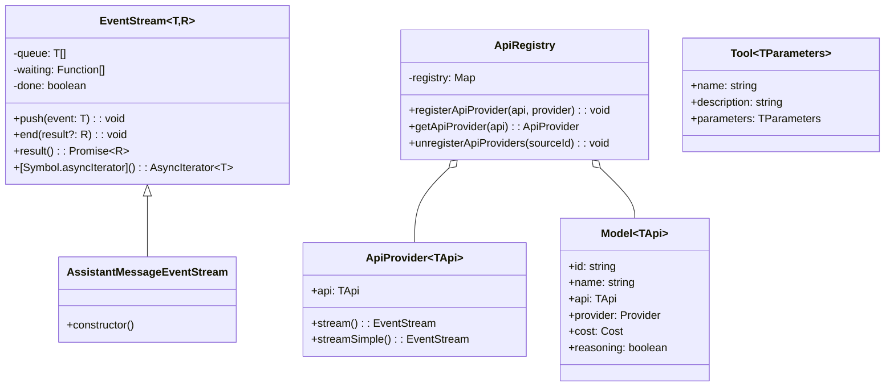

# pi-ai 包深度分析

> 统一 LLM API：Provider 注册、流式处理、类型系统

---

## 1. 包概览

**定位**：pi-ai 是 pi-mono 的 LLM 调用抽象层，提供统一的 API 支持 20+ LLM Provider。

**核心功能**：
- 统一的 Provider 接口
- 流式响应处理
- 模型注册表（700+ 预配置模型）
- 工具调用（Tool Calling）支持
- 思考模式（Thinking/Reasoning）支持
- OAuth 认证支持

**源文件结构**：
```
packages/ai/src/
├── types.ts              # 核心类型定义（500+ 行）
├── api-registry.ts       # Provider 注册表
├── stream.ts             # 流式 API
├── models.ts             # 模型接口和注册表
├── models.generated.ts   # 自动生成的模型数据库
├── providers/            # 各 Provider 实现
│   ├── register-builtins.ts  # 懒加载注册
│   ├── anthropic.ts
│   ├── openai.ts
│   ├── google.ts
│   └── ... (20+ Provider)
├── utils/
│   ├── event-stream.ts   # 事件流处理
│   ├── typebox-helpers.ts # TypeBox 工具
│   └── oauth/            # OAuth 实现
└── index.ts              # 公开 API
```

---

## 2. 类型系统分析

### 2.1 核心类型

**文件**：`/packages/ai/src/types.ts`

#### Api 类型

```typescript
// 已知的 API 类型
type KnownApi =
    | "openai-completions"
    | "anthropic-messages"
    | "google-generative-ai"
    | "azure-openai-completions"
    | ... // 20+ 类型

// Api 类型：已知或扩展字符串
type Api = KnownApi | string;

// Provider 类型
type KnownProvider =
    | "openai"
    | "anthropic"
    | "google"
    | "azure"
    | ... // 20+ 类型

type Provider = KnownProvider | string;
```

#### Model 接口

```typescript
interface Model<TApi extends Api = Api> {
    id: string;              // 模型 ID
    name: string;            // 显示名称
    api: TApi;              // API 类型（泛型关联）
    provider: Provider;     // Provider 名称
    baseUrl: string;        // API 基础 URL
    reasoning: boolean;      // 是否支持推理
    input: ("text" | "image")[]; // 输入类型
    cost: {                 // 价格（每百万 Token）
        input: number;      // 输入价格
        output: number;     // 输出价格
        cacheRead: number;  // 缓存读取价格
        cacheWrite: number; // 缓存写入价格
    };
    contextWindow: number;   // 上下文窗口大小
    maxTokens: number;       // 最大输出 Token
    headers?: Record<string, string>; // 额外请求头
    compat?: OpenAICompletionsCompat | AnthropicMessagesCompat; // 兼容性配置
}
```

**设计亮点**：泛型 `TApi` 关联 API 类型，确保编译时类型正确

```typescript
const model: Model<"anthropic-messages"> = { ... };

// ✅ 编译通过
const provider = getApiProvider(model.api);

// ❌ 编译错误：API 类型不匹配
const wrongModel: Model<"openai-completions"> = model;
```

#### Message 类型

```typescript
// 文本内容
interface TextContent {
    type: "text";
    text: string;
}

// 图片内容
interface ImageContent {
    type: "image";
    source: {
        type: "url";
        url: string;
    } | {
        type: "base64";
        media_type: string;
        data: string;
    };
}

// 思考内容
interface ThinkingContent {
    type: "thinking";
    thinking: string;
}

// 工具调用内容
interface ToolCall {
    type: "toolCall";
    id: string;
    name: string;
    arguments: Record<string, unknown>;
}

// 用户消息
interface UserMessage {
    role: "user";
    content: string | (TextContent | ImageContent)[];
    timestamp?: number;
}

// 助手消息
interface AssistantMessage {
    role: "assistant";
    content: (TextContent | ThinkingContent | ToolCall)[];
    api: Api;
    provider: Provider;
    model: string;
    usage: Usage;
    stopReason: StopReason;
    timestamp: number;
}

// 工具结果消息
interface ToolResultMessage {
    role: "user";
    content: ToolResultContent[];
    timestamp: number;
}

type Message = UserMessage | AssistantMessage | ToolResultMessage;
```

#### Usage 类型

```typescript
interface Usage {
    input: number;         // 输入 Token
    output: number;        // 输出 Token
    cacheRead: number;     // 缓存读取命中
    cacheWrite: number;    // 缓存写入 Token
    cost: {
        input: number;     // 输入成本
        output: number;    // 输出成本
        cacheRead: number; // 缓存读取成本
        cacheWrite: number;// 缓存写入成本
        total: number;     // 总成本
    };
}
```

### 2.2 StreamOptions 类型

```typescript
interface StreamOptions {
    signal?: AbortSignal;          // 中止信号
    debug?: boolean;               // 调试模式
}

interface SimpleStreamOptions extends StreamOptions {
    reasoning?: ThinkingLevel;     // 思考级别
    thinkingBudgets?: ThinkingBudgets; // 思考预算
}

interface ProviderStreamOptions extends SimpleStreamOptions {
    tools?: Tool[];                // 工具定义
    toolChoice?: "auto" | "none" | "any" | ToolChoice; // 工具选择策略
}
```

---

## 3. Provider 注册表

### 3.1 ApiProvider 接口

**文件**：`/packages/ai/src/api-registry.ts`

```typescript
interface ApiProvider<
    TApi extends Api = Api,
    TOptions extends StreamOptions = StreamOptions
> {
    api: TApi;
    stream: StreamFunction<TApi, TOptions>;
    streamSimple: StreamFunction<TApi, SimpleStreamOptions>;
}
```

**双函数设计**：
- `stream()`：完整功能，支持所有 Provider 特定选项
- `streamSimple()`：简化版，通用接口

### 3.2 注册表实现

```typescript
class ApiRegistry {
    private registry = new Map<string, ApiProvider>();

    registerApiProvider<TApi extends Api>(
        api: TApi,
        provider: ApiProvider<TApi>
    ): void {
        this.registry.set(api, provider);
    }

    getApiProvider<TApi extends Api>(
        api: TApi
    ): ApiProvider<TApi> | undefined {
        return this.registry.get(api) as ApiProvider<TApi>;
    }

    unregisterApiProviders(sourceId: string): void {
        // 按来源 ID 批量注销
    }
}

export const apiRegistry = new ApiRegistry();
```

### 3.3 懒加载机制

**文件**：`/packages/ai/src/providers/register-builtins.ts`

```typescript
// 懒加载包装器
function createLazyStream<TApi extends Api>(
    api: TApi,
    loadFn: () => Promise<ApiProvider<TApi>>
) {
    let provider: ApiProvider<TApi> | undefined;

    return {
        api,
        async stream(model, messages, options) {
            provider = provider || await loadFn();
            return provider.stream(model, messages, options);
        },
        async streamSimple(model, messages, options) {
            provider = provider || await loadFn();
            return provider.streamSimple(model, messages, options);
        }
    };
}

// 注册时使用懒加载
apiRegistry.registerApiProvider("anthropic-messages",
    createLazyStream("anthropic-messages",
        () => import("./anthropic").then(m => m.createProvider())
    )
);
```

**优势**：
- 启动时不加载所有 Provider 代码
- 仅在需要时动态加载
- 减少内存占用和启动时间

---

## 4. 流式处理架构

### 4.1 EventStream

**文件**：`/packages/ai/src/utils/event-stream.ts`

```typescript
class EventStream<T, R> {
    private queue: T[] = [];
    private waiting: Array<(value: T) => void> = [];
    private done = false;
    private result?: R;

    // 推送事件
    push(event: T): void {
        if (this.done) return;

        const waiter = this.waiting.shift();
        if (waiter) {
            waiter(event);
        } else {
            this.queue.push(event);
        }
    }

    // 结束流
    end(result?: R): void {
        this.done = true;
        this.result = result;

        // 通知所有等待者
        for (const waiter of this.waiting) {
            waiter({ done: true, value: result });
        }
        this.waiting = [];
    }

    // 异步迭代器
    async *[Symbol.asyncIterator](): AsyncIterator<T> {
        while (true) {
            // 1. 检查队列
            if (this.queue.length > 0) {
                yield this.queue.shift()!;
                continue;
            }

            // 2. 检查是否结束
            if (this.done) {
                if (this.result !== undefined) {
                    return this.result;
                }
                return;
            }

            // 3. 等待新事件
            const value = await new Promise<T>((resolve) => {
                this.waiting.push(resolve);
            });

            if (value) {
                yield value;
            }
        }
    }

    // 获取最终结果
    async result(): Promise<R> {
        while (!this.done) {
            await new Promise(resolve => setTimeout(resolve, 10));
        }
        return this.result!;
    }
}
```

### 4.2 AssistantMessageEventStream

```typescript
type AssistantMessageEvent =
    | { type: "start"; message: AssistantMessage }
    | { type: "text_start"; contentIndex: number }
    | { type: "text_delta"; contentIndex: number; delta: string }
    | { type: "text_end"; contentIndex: number }
    | { type: "thinking_start"; contentIndex: number }
    | { type: "thinking_delta"; contentIndex: number; delta: string }
    | { type: "thinking_end"; contentIndex: number }
    | { type: "toolcall_start"; contentIndex: number }
    | { type: "toolcall_delta"; contentIndex: number; delta: string }
    | { type: "toolcall_end"; contentIndex: number; toolCall: ToolCall }
    | { type: "done"; reason: StopReason; message: AssistantMessage }
    | { type: "error"; reason: StopReason; error: Error; message: AssistantMessage };

type AssistantMessageEventStream = EventStream<AssistantMessageEvent, AssistantMessage>;
```

### 4.3 流式 API

**文件**：`/packages/ai/src/stream.ts`

```typescript
export async function* streamSimple(
    model: Model<Api>,
    messages: Message[],
    options: SimpleStreamOptions = {}
): AsyncGenerator<AssistantMessageEvent, AssistantMessage> {
    // 1. 获取 Provider
    const provider = apiRegistry.getApiProvider(model.api);

    if (!provider) {
        throw new Error(`No provider registered for API: ${model.api}`);
    }

    // 2. 调用 Provider 的 streamSimple
    const stream = provider.streamSimple(model, messages, options);

    // 3. 转发事件
    for await (const event of stream) {
        yield event;

        // 4. 检查是否结束
        if (event.type === "done" || event.type === "error") {
            return event.message;
        }
    }

    throw new Error("Stream ended without done event");
}
```

---

## 5. 模型注册表

### 5.1 自动生成

**文件**：`/packages/ai/src/models.generated.ts`

由脚本 `scripts/generate-models.ts` 自动生成，包含 700+ 预配置模型。

```typescript
export const MODELS: Model[] = [
    {
        id: "claude-3-5-sonnet-20241022",
        name: "Claude 3.5 Sonnet",
        api: "anthropic-messages",
        provider: "anthropic",
        baseUrl: "https://api.anthropic.com",
        reasoning: false,
        input: ["text", "image"],
        cost: { input: 3, output: 15, cacheRead: 0.3, cacheWrite: 1.25 },
        contextWindow: 200000,
        maxTokens: 8192
    },
    // ... 700+ 模型
];
```

### 5.2 模型查询

**文件**：`/packages/ai/src/models.ts`

```typescript
// 按提供商查询
export function getModelsByProvider(provider: Provider): Model[] {
    return MODELS.filter(m => m.provider === provider);
}

// 按 ID 查询
export function getModelById(id: string): Model | undefined {
    return MODELS.find(m => m.id === id);
}

// 类型安全的模型获取
export function getModel<TApi extends Api, TModelId extends string>(
    api: TApi,
    id: TModelId
): Model<TApi> & { id: TModelId } {
    const model = MODELS.find(m => m.api === api && m.id === id);
    if (!model) {
        throw new Error(`Model not found: ${api}/${id}`);
    }
    return model as Model<TApi> & { id: TModelId };
}
```

### 5.3 成本计算

```typescript
export function calculateCost(
    model: Model<Api>,
    usage: Usage
): Usage["cost"] {
    usage.cost.input = (model.cost.input / 1_000_000) * usage.input;
    usage.cost.output = (model.cost.output / 1_000_000) * usage.output;
    usage.cost.cacheRead = (model.cost.cacheRead / 1_000_000) * usage.cacheRead;
    usage.cost.cacheWrite = (model.cost.cacheWrite / 1_000_000) * usage.cacheWrite;
    usage.cost.total = usage.cost.input + usage.cost.output +
                      usage.cost.cacheRead + usage.cost.cacheWrite;
    return usage.cost;
}
```

---

## 6. 工具调用（Tool Calling）

### 6.1 Tool 接口

```typescript
import { TSchema } from "@sinclair/typebox";

interface Tool<TParameters extends TSchema = TSchema> {
    name: string;              // 工具名称
    description: string;       // 工具描述
    parameters: TParameters;   // TypeBox 参数 schema
}
```

### 6.2 TypeBox 工具定义示例

```typescript
import { Type } from "@sinclair/typebox";

const readTool: Tool = {
    name: "read",
    description: "Read a file from the filesystem",
    parameters: Type.Object({
        path: Type.String({ description: "File path" }),
        limit: Type.Optional(Type.Number({ description: "Max lines" }))
    })
};
```

### 6.3 ToolChoice 选项

```typescript
type ToolChoice =
    | "auto"      // LLM 决定是否使用工具
    | "none"      // 不使用工具
    | "any"       // 必须使用工具
    | { type: "tool"; name: string } // 指定工具
    | ToolChoiceType; // 自定义类型

interface ToolChoiceType {
    type: "tool";
    name: string;
}
```

---

## 7. 思考模式（Thinking/Reasoning）

### 7.1 ThinkingLevel

```typescript
type ThinkingLevel =
    | "minimal"  // 最少思考
    | "low"      // 低级别思考
    | "medium"   // 中级别思考
    | "high"     // 高级别思考
    | "xhigh"    // 极高级别思考
    | "off";     // 关闭思考
```

### 7.2 ThinkingBudgets

```typescript
interface ThinkingBudgets {
    min: number;    // 最小思考 Token
    max: number;    // 最大思考 Token
    budget: number; // 当前预算
}
```

### 7.3 Provider 支持

不同 Provider 对思考模式的支持：

| Provider | 支持情况 | 实现方式 |
|----------|---------|---------|
| Anthropic | ✅ 原生 | extended thinking |
| OpenAI | ✅ 原生 | o1 系列模型 |
| Google | ✅ 原生 | thinking mode |
| 其他 | ❌ 不支持 | - |

---

## 8. OAuth 系统

### 8.1 OAuthProvider 接口

**文件**：`/packages/ai/src/utils/oauth/index.ts`

```typescript
interface OAuthProviderInterface {
    readonly id: OAuthProviderId;
    readonly name: string;

    // 登录
    login(callbacks: OAuthLoginCallbacks): Promise<OAuthCredentials>;

    // 刷新令牌
    refreshToken(credentials: OAuthCredentials): Promise<OAuthCredentials>;

    // 获取 API Key
    getApiKey(credentials: OAuthCredentials): string;

    // 可选：修改模型列表
    modifyModels?(models: Model[], credentials: OAuthCredentials): Model[];
}
```

### 8.2 支持的 OAuth Provider

| Provider | OAuth ID | 用途 |
|----------|----------|------|
| Anthropic | `anthropic-pro` | Pro/Max 订阅 |
| OpenAI | `openai-codex` | ChatGPT Plus/Pro |
| Google | `google-cli` | Gemini CLI |
| GitHub | `github-copilot` | Copilot 订阅 |

### 8.3 PKCE 流程

```typescript
async function loginWithPKCE(): Promise<string> {
    // 1. 生成 code_verifier 和 code_challenge
    const codeVerifier = generateCodeVerifier();
    const codeChallenge = await generateCodeChallenge(codeVerifier);

    // 2. 启动本地回调服务器
    const server = await startCallbackServer();

    // 3. 打开浏览器
    const authUrl = buildAuthUrl(codeChallenge);
    openBrowser(authUrl);

    // 4. 等待回调
    const code = await server.waitForCode();

    // 5. 交换令牌
    const tokens = await exchangeToken(code, codeVerifier);

    return tokens.access_token;
}
```

---

## 9. TypeBox 集成

### 9.1 StringEnum 工具

**文件**：`/packages/ai/src/utils/typebox-helpers.ts`

```typescript
function StringEnum<T extends readonly string[]>(
    values: T,
    options?: { description?: string; default?: T[number] }
): TUnsafe<T[number]> {
    return Type.Unsafe<T[number]>({
        type: "string",
        enum: values as any,
        ...(options?.description && { description: options.description }),
        ...(options?.default && { default: options.default })
    });
}
```

**使用**：
```typescript
const schema = StringEnum(["read", "write", "bash"], {
    description: "Tool name",
    default: "read"
});

// 生成 JSON Schema:
// {
//   "type": "string",
//   "enum": ["read", "write", "bash"],
//   "description": "Tool name",
//   "default": "read"
// }
```

### 9.2 Static 类型推导

```typescript
import { Static } from "@sinclair/typebox";

const schema = Type.Object({
    path: Type.String(),
    limit: Type.Optional(Type.Number())
});

type Params = Static<typeof schema>;
// { path: string; limit?: number }
```

### 9.3 运行时验证

```typescript
import { Value } from "@sinclair/typebox";

function validateAndExecute(params: unknown) {
    // 验证参数
    const validated = Value.Parse(schema, params);

    // 执行逻辑（类型安全）
    console.log(validated.path);  // string
    console.log(validated.limit); // number | undefined
}
```

---

## 10. 类图



---

## 11. 关键设计模式

### 11.1 注册表模式

**位置**：ApiRegistry

**实现**：Map-based + 懒加载

### 11.2 流式处理模式

**位置**：EventStream

**实现**：Promise + AsyncIterator

### 11.3 泛型约束

**位置**：Model<TApi>

**实现**：泛型关联 API 类型

---

## 12. 调试技巧

### 12.1 查看已注册 Provider

```typescript
import { apiRegistry } from "@mariozechner/pi-ai";

console.log(apiRegistry.getApiProvider("anthropic-messages"));
```

### 12.2 查看模型列表

```typescript
import { getModelsByProvider } from "@mariozechner/pi-ai";

const anthropicModels = getModelsByProvider("anthropic");
console.log(anthropicModels);
```

### 12.3 启用调试模式

```typescript
await streamSimple(model, messages, { debug: true });
```

---

## 13. 总结

pi-ai 包的核心特点：

1. **统一抽象**：20+ Provider 一个接口
2. **类型安全**：泛型关联 + TypeBox
3. **懒加载**：按需加载 Provider
4. **流式优先**：完整的事件流系统
5. **模型丰富**：700+ 预配置模型
6. **OAuth 支持**：主流订阅服务

这是整个 pi-mono 的基础，所有其他包都依赖它。

---

**相关文档**：
- [架构概览](../02-architecture/01-architecture-overview.md)
- [数据流](../02-architecture/03-data-flow.md)
- [pi-agent-core 包分析](./02-pi-agent-core.md)
