# pi-ai 源码深度分析

> `@earendil-works/pi-ai` — 统一多供应商 LLM API

## 包概览

pi-ai 是整个 Pi 栈的基础层，提供**供应商无关的 LLM 调用接口**。核心设计思路是"两轴分离"：

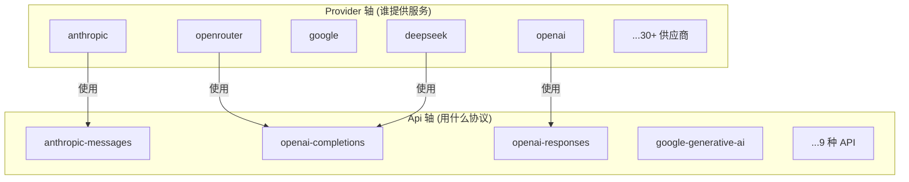

一个 Provider 使用一种 Api 实现。多个 Provider 可以共享同一种 Api（例如 OpenRouter、DeepSeek、Groq 都使用 `openai-completions`）。

## 文件结构

```
packages/ai/src/
├── index.ts                    # 公共导出桶
├── types.ts                    # 核心类型定义 (~576 行)
├── stream.ts                   # 主 API: stream/complete
├── models.ts                   # 模型注册表
├── models.generated.ts         # 自动生成的模型目录 (~16000 行)
├── api-registry.ts             # API 供应商注册表
├── image-models.ts             # 图片模型
├── image-models.generated.ts   # 自动生成的图片模型
├── images.ts                   # 图片生成 API
├── images-api-registry.ts      # 图片 API 注册表
├── env-api-keys.ts             # 环境变量 API Key 解析
├── oauth.ts                    # OAuth 子路径导出
├── bedrock-provider.ts         # Bedrock Node-only 子路径
├── session-resources.ts        # 会话资源清理
├── cli.ts                      # pi-ai CLI (login/list)
├── providers/                  # 供应商实现
│   ├── register-builtins.ts    # 内置供应商注册
│   ├── anthropic.ts            # Anthropic Claude
│   ├── openai-completions.ts   # OpenAI Completions API
│   ├── openai-responses.ts     # OpenAI Responses API
│   ├── openai-responses-shared.ts
│   ├── openai-codex-responses.ts
│   ├── azure-openai-responses.ts
│   ├── google.ts               # Google AI Studio
│   ├── google-shared.ts
│   ├── google-vertex.ts        # Google Vertex AI
│   ├── mistral.ts              # Mistral AI
│   ├── amazon-bedrock.ts       # AWS Bedrock
│   ├── cloudflare.ts           # Cloudflare Workers AI
│   ├── faux.ts                 # 测试用模拟供应商
│   ├── simple-options.ts       # reasoning → 供应商参数映射
│   ├── transform-messages.ts   # 跨供应商消息转换
│   ├── github-copilot-headers.ts
│   ├── openai-prompt-cache.ts
│   └── images/
│       ├── register-builtins.ts
│       └── openrouter.ts
└── utils/
    ├── event-stream.ts         # EventStream + AssistantMessageEventStream
    ├── validation.ts           # TypeBox 工具参数验证
    ├── typebox-helpers.ts      # TypeBox 辅助
    ├── json-parse.ts           # 部分 JSON 解析
    ├── overflow.ts             # 上下文溢出处理
    ├── diagnostics.ts          # 错误诊断
    ├── hash.ts                 # 哈希工具
    ├── headers.ts              # HTTP 头处理
    ├── sanitize-unicode.ts     # Unicode 清理
    ├── node-http-proxy.ts      # HTTP 代理支持
    └── oauth/                  # OAuth 实现
        ├── index.ts
        ├── types.ts
        ├── anthropic.ts
        ├── github-copilot.ts
        ├── openai-codex.ts
        ├── device-code.ts
        ├── pkce.ts
        └── oauth-page.ts
```

## 核心类型体系 (types.ts)

### 消息模型

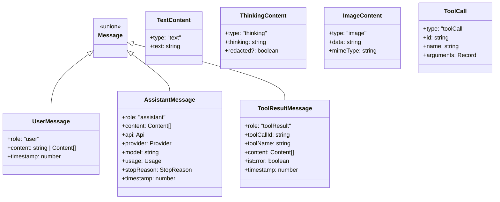

### Model 接口

每个模型包含完整的元数据，用于成本计算、能力检测和兼容性处理：

```typescript
interface Model<TApi extends Api> {
   id: string;                    // 模型 ID
   name: string;                  // 显示名称
   api: TApi;                     // API 协议类型
   provider: Provider;            // 供应商名称
   baseUrl: string;               // API 端点
   reasoning: boolean;            // 支持推理?
   thinkingLevelMap?: ThinkingLevelMap;  // 思考级别映射
   input: ("text" | "image")[];   // 输入类型
   cost: { input, output, cacheRead, cacheWrite };  // $/百万 token
   contextWindow: number;         // 上下文窗口大小
   maxTokens: number;             // 最大输出 token
   headers?: Record<string, string>;  // 自定义请求头
   compat?: ...;                  // 兼容性覆盖
}
```

### 流式协议

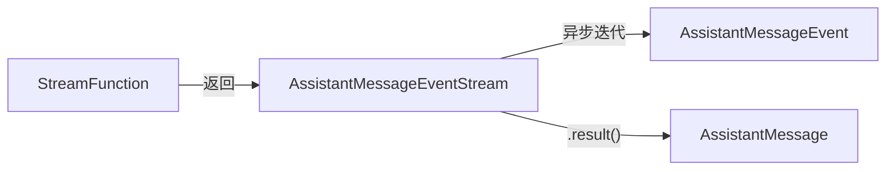

**核心合约**：
- `StreamFunction` **不得抛异常**
- 错误通过流内 `error` 事件传递
- 错误消息的 `stopReason` 为 `"error"` 或 `"aborted"`

## API 注册表 (api-registry.ts)

注册表是一个简单的 `Map<Api, RegisteredApiProvider>`：

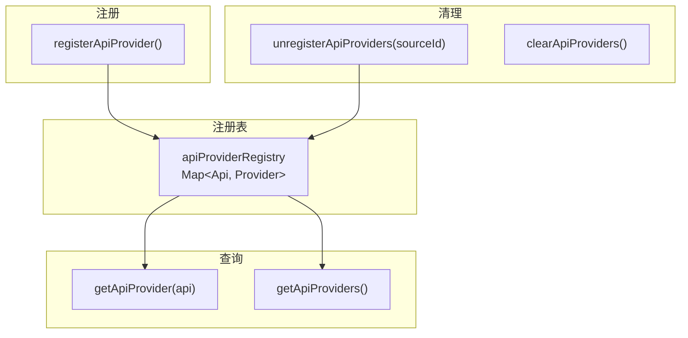

注册时会包裹 `stream` 和 `streamSimple` 函数，添加 API 类型校验。

## 主 API: stream.ts

```typescript
// 完整控制的流式调用
function stream<TApi>(model, context, options?) → AssistantMessageEventStream

// 统一 reasoning 参数的简化版
function streamSimple<TApi>(model, context, options?) → AssistantMessageEventStream

// 阻塞式版本
async function complete<TApi>(model, context, options?) → AssistantMessage
async function completeSimple<TApi>(model, context, options?) → AssistantMessage
```

`streamSimple` 是 Agent 层的默认调用方式，它将统一的 `reasoning: ThinkingLevel` 参数映射为各供应商的具体参数。

## 供应商实现模式

每个供应商实现遵循统一模式：

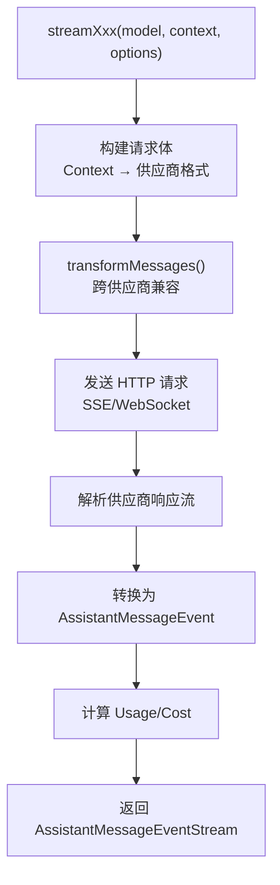

### 各供应商的关键差异

| 供应商 | 消息格式 | 流式协议 | 思考支持 | 特殊处理 |
|--------|---------|---------|---------|---------|
| Anthropic | messages API | SSE | extended thinking | cache_control, 自适应思考 |
| OpenAI Completions | chat/completions | SSE | reasoning_effort | developer role, store |
| OpenAI Responses | responses API | SSE | reasoning | session_id 缓存 |
| Google | generateContent | SSE | thinkingConfig | thoughtSignature |
| Bedrock | ConverseStream | 自有协议 | 不支持 | Node-only, AWS SDK |
| Mistral | chat/completions | SSE | 不支持 | 自有 SDK |

### 懒加载策略

供应商通过动态 `import()` 懒加载，确保浏览器和 Node 环境只加载需要的供应商：

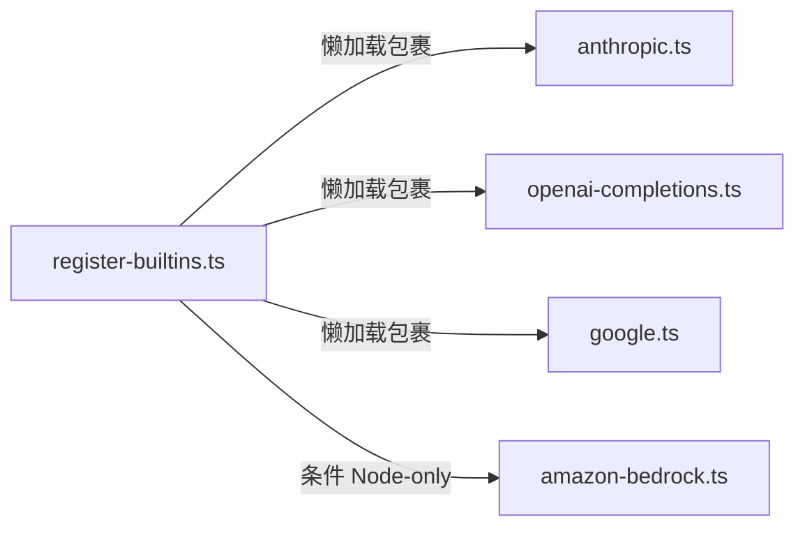

## 模型目录 (models.ts + models.generated.ts)

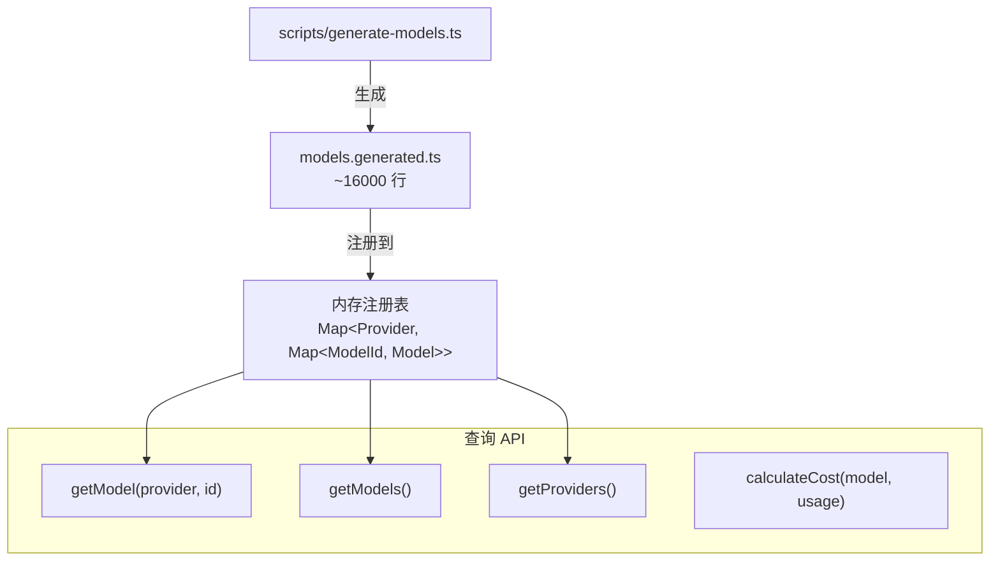

### 模型目录生成流程

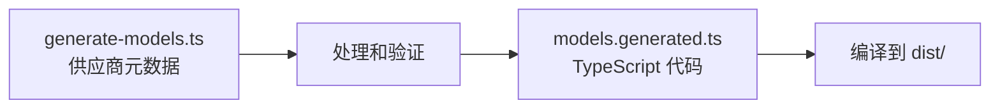

模型目录定义了每个供应商的每个模型的完整元数据，包括 API 端点、token 价格、上下文窗口大小等。

## 跨供应商兼容 (transform-messages.ts)

当用户在同一会话中切换供应商时，`transformMessages` 自动处理消息格式差异：

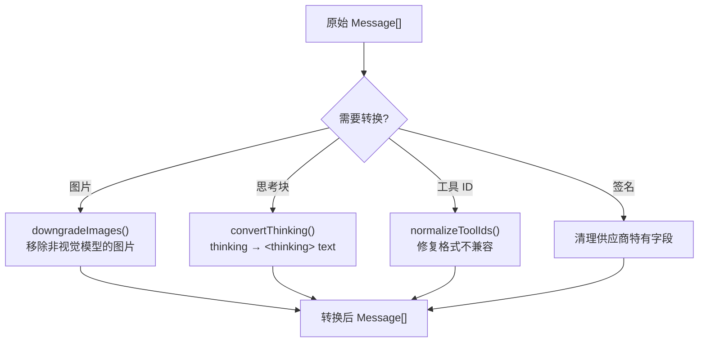

## EventStream 实现 (utils/event-stream.ts)

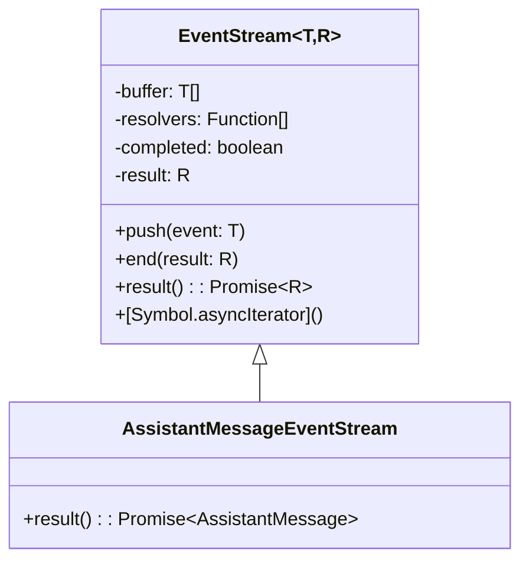

`EventStream` 是一个**推式异步可迭代流**：
- 生产者通过 `push()` 推入事件
- 消费者通过 `for await` 消费
- `result()` 等待流完成并返回最终值
- 终止条件由构造函数的谓词定义

## 工具参数验证 (utils/validation.ts)

使用 TypeBox 进行运行时类型验证：

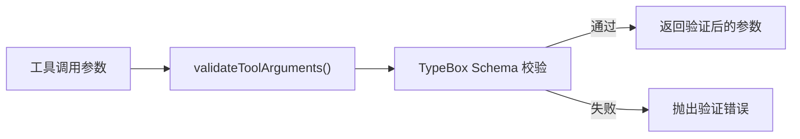

## 测试支持: faux provider

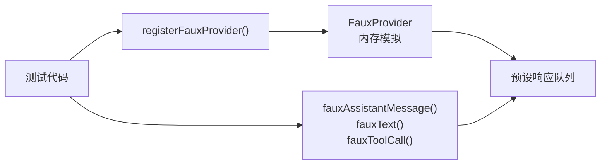

faux provider 是完整的内存供应商实现，支持：
- 预设响应队列
- 模拟流式输出
- 模拟缓存命中
- 测试各种错误场景
