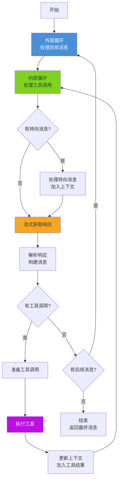
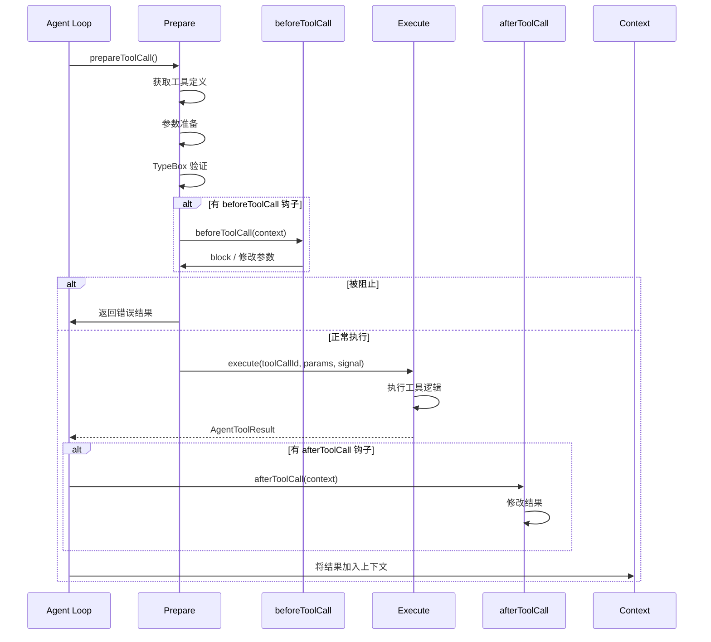
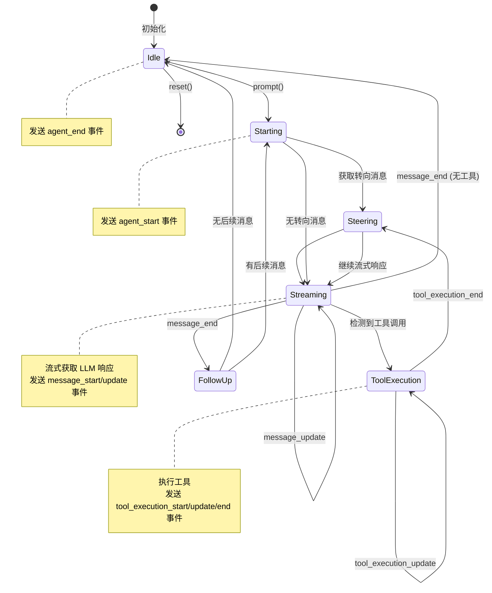

# pi-agent-core 包深度分析

> Agent 运行时框架：双层循环、状态管理、工具执行

---

## 1. 包概览

### 1.1 定位

**pi-agent-core** 是 pi-mono 架构中的 **L2: Runtime Layer**，提供完整的 Agent 运行时框架。

**核心职责**：
- Agent Loop：双层循环处理工具调用和后续消息
- 状态管理：消息队列、工具状态、流式响应跟踪
- 事件系统：AgentEvent 生命周期事件
- 工具执行：串行/并行模式、钩子机制

**依赖**：
- `@mariozechner/pi-ai` - LLM API 调用
- `@mariozechner/pi-tui` - UI 渲染（可选）

**被依赖**：
- `@mariozechner/pi-coding-agent` - 编程 Agent CLI
- `@mariozechner/pi-mom` - Slack 机器人
- `@mariozechner/pi-web-ui` - Web UI

### 1.2 目录结构

```
packages/agent/
├── src/
│   ├── agent.ts          # Agent 类：高层封装
│   ├── agent-loop.ts     # Agent Loop：双层循环核心
│   ├── types.ts          # 类型定义：AgentEvent、AgentState 等
│   ├── proxy.ts          # 代理功能：服务器端代理
│   └── index.ts          # 公共导出
├── test/
│   ├── agent.test.ts
│   ├── agent-loop.test.ts
│   └── e2e.test.ts
├── package.json
└── vitest.config.ts
```

### 1.3 关键文件

| 文件 | 行数 | 核心功能 |
|------|------|---------|
| `types.ts` | 500+ | AgentEvent、AgentState、AgentTool |
| `agent-loop.ts` | 800+ | 双层循环、工具执行 |
| `agent.ts` | 400+ | Agent 类、状态管理 |
| `proxy.ts` | 300+ | 服务器端代理 |

---

## 2. 类型系统

### 2.1 核心类型定义

**源文件**：`/packages/agent/src/types.ts`

#### AgentMessage 消息系统

```typescript
// 基础消息类型（来自 pi-ai）
export type AgentMessage = Message | CustomAgentMessages[keyof CustomAgentMessages];

// Message 包含：
// - UserMessage: { role: "user"; content: Content[] }
// - AssistantMessage: { role: "assistant"; content: Content[] }
// - SystemMessage: { role: "system"; content: Content[] }
// - ToolResultMessage: { role: "tool-result"; content: Content[]; toolCallId: string }

// 自定义消息类型
export interface CustomAgentMessages {
    "tool-result": ToolResultMessage;
    "tool-result-error": ToolResultErrorMessage;
}
```

#### AgentState 状态接口

```typescript
export interface AgentState {
    // 系统提示
    systemPrompt: string;

    // 使用的模型
    model: Model<any>;

    // 思考级别
    thinkingLevel: ThinkingLevel;

    // 工具列表（访问器返回副本）
    set tools(tools: AgentTool<any>[]);
    get tools(): AgentTool<any>[];

    // 消息队列（访问器返回副本）
    set messages(messages: AgentMessage[]);
    get messages(): AgentMessage[];

    // 流式状态
    readonly isStreaming: boolean;
    readonly streamingMessage?: AgentMessage;

    // 工具执行状态
    readonly pendingToolCalls: ReadonlySet<string>;

    // 错误信息
    readonly errorMessage?: string;
}
```

**设计要点**：
- **不可变访问**：`get` 方法返回副本，外部修改不影响内部状态
- **只读状态**：流式状态和工具调用状态为 `readonly`
- **类型安全**：泛型 `Model<any>` 保留 Provider 类型信息

#### AgentEvent 事件系统

```typescript
export type AgentEvent =
    // Agent 生命周期
    | { type: "agent_start" }
    | { type: "agent_end"; messages: AgentMessage[] }

    // Turn 生命周期（一轮对话）
    | { type: "turn_start" }
    | { type: "turn_end"; message: AgentMessage; toolResults: ToolResultMessage[] }

    // 消息生命周期
    | { type: "message_start"; message: AgentMessage }
    | { type: "message_update"; message: AgentMessage; assistantMessageEvent: AssistantMessageEvent }
    | { type: "message_end"; message: AgentMessage }

    // 工具执行生命周期
    | { type: "tool_execution_start"; toolCallId: string; toolName: string; args: any }
    | { type: "tool_execution_update"; toolCallId: string; toolName: string; args: any; partialResult: any }
    | { type: "tool_execution_end"; toolCallId: string; toolName: string; result: any; isError: boolean };
```

### 2.2 工具系统类型

#### AgentTool 工具接口

```typescript
export interface AgentTool<TParameters extends TSchema = TSchema, TDetails = any> extends Tool<TParameters> {
    // 显示名称
    label: string;

    // 参数准备（可选）
    prepareArguments?: (args: unknown) => Static<TParameters>;

    // 执行函数
    execute: (
        toolCallId: string,
        params: Static<TParameters>,
        signal?: AbortSignal,
        onUpdate?: AgentToolUpdateCallback<TDetails>,
    ) => Promise<AgentToolResult<TDetails>>;

    // 执行模式
    executionMode?: ToolExecutionMode;
}
```

#### AgentToolResult 工具结果

```typescript
export interface AgentToolResult<T> {
    content: (TextContent | ImageContent)[];
    details: T;
    terminate?: boolean;  // 是否终止 Agent
}
```

#### ToolExecutionMode 执行模式

```typescript
export type ToolExecutionMode = "sequential" | "parallel";
```

### 2.3 Agent Loop 配置

```typescript
export interface AgentLoopConfig extends SimpleStreamOptions {
    // 模型
    model: Model<any>;

    // 消息转换
    convertToLlm: (messages: AgentMessage[]) => Message[] | Promise<Message[]>;

    // 上下文转换（可选）
    transformContext?: (messages: AgentMessage[], signal?: AbortSignal) => Promise<AgentMessage[]>;

    // 获取 API Key
    getApiKey?: (provider: string) => Promise<string | undefined> | string | undefined;

    // 获取转向消息
    getSteeringMessages?: () => Promise<AgentMessage[]>;

    // 获取后续消息
    getFollowUpMessages?: () => Promise<AgentMessage[]>;

    // 工具执行模式
    toolExecution?: ToolExecutionMode;

    // 工具执行前钩子
    beforeToolCall?: (context: BeforeToolCallContext, signal?: AbortSignal) => Promise<BeforeToolCallResult | undefined>;

    // 工具执行后钩子
    afterToolCall?: (context: AfterToolCallContext, signal?: AbortSignal) => Promise<AfterToolCallResult | undefined>;
}
```

---

## 3. Agent 类

### 3.1 类设计

**源文件**：`/packages/agent/src/agent.ts`

```typescript
export class Agent {
    private _state: MutableAgentState;
    private listeners: Array<Listener> = [];
    private activeRun: ActiveRun | undefined;
    private steeringQueue = new PendingMessageQueue("all");
    private followUpQueue = new PendingMessageQueue("one-at-a-time");

    constructor(options: AgentOptions = {});

    // 事件订阅
    subscribe(listener: (event: AgentEvent, signal: AbortSignal) => Promise<void> | void): () => void;

    // 消息处理
    prompt(message: AgentMessage | AgentMessage[]): Promise<void>;
    continue(): Promise<void>;

    // 队列管理
    steer(message: AgentMessage): void;
    followUp(message: AgentMessage): void;
    clearSteeringQueue(): void;
    clearFollowUpQueue(): void;

    // 状态控制
    abort(): void;
    reset(): void;
    waitForIdle(): Promise<void>;

    // 状态访问
    get state(): AgentState;
}
```

### 3.2 状态管理

#### MutableAgentState 内部状态

```typescript
interface MutableAgentState {
    systemPrompt: string;
    model: Model<any>;
    thinkingLevel: ThinkingLevel;
    tools: AgentTool<any>[];
    messages: AgentMessage[];
    isStreaming: boolean;
    streamingMessage?: AgentMessage;
    pendingToolCalls: Set<string>;
    errorMessage?: string;
}
```

#### 状态访问器

```typescript
function createMutableAgentState(
    initialState?: Partial<Omit<AgentState, "pendingToolCalls" | "isStreaming" | "streamingMessage" | "errorMessage">>
): MutableAgentState {
    let tools: AgentTool<any>[] = [];
    let messages: AgentMessage[] = [];

    return {
        systemPrompt: initialState?.systemPrompt ?? "",
        model: initialState?.model ?? DEFAULT_MODEL,
        thinkingLevel: initialState?.thinkingLevel ?? "off",

        get tools() {
            return tools.slice();  // 返回副本
        },
        set tools(nextTools: AgentTool<any>[]) {
            tools = nextTools.slice();  // 创建副本
        },

        get messages() {
            return messages.slice();  // 返回副本
        },
        set messages(nextMessages: AgentMessage[]) {
            messages = nextMessages.slice();  // 创建副本
        },

        isStreaming: false,
        streamingMessage: undefined,
        pendingToolCalls: new Set<string>(),
        errorMessage: undefined,
    };
}
```

**设计要点**：
- **防御性复制**：所有 `get` 方法返回数组副本
- **单向数据流**：状态只能通过事件更新，不能直接修改

### 3.3 消息队列系统

#### PendingMessageQueue

```typescript
class PendingMessageQueue {
    private messages: AgentMessage[] = [];
    mode: QueueMode;

    constructor(mode: QueueMode) {
        this.mode = mode;
    }

    enqueue(message: AgentMessage): void {
        this.messages.push(message);
    }

    drain(): AgentMessage[] {
        const drained = this.messages.slice();
        this.messages = [];
        return drained;
    }

    clear(): void {
        this.messages = [];
    }
}
```

#### 队列模式

| 队列 | 模式 | 用途 |
|------|------|------|
| `steeringQueue` | "all" | 转向消息，全部发送给 LLM |
| `followUpQueue` | "one-at-a-time" | 后续消息，每次取一条 |

### 3.4 事件处理

#### processEvents 方法

```typescript
private async processEvents(event: AgentEvent): Promise<void> {
    const signal = this.activeRun?.abortController.signal;

    switch (event.type) {
        case "message_start":
            this._state.isStreaming = true;
            this._state.streamingMessage = event.message;
            break;

        case "message_update":
            this._state.streamingMessage = event.message;
            break;

        case "message_end":
            this._state.isStreaming = false;
            this._state.streamingMessage = undefined;
            this._state.messages.push(event.message);
            break;

        case "tool_execution_start":
            this._state.pendingToolCalls.add(event.toolCallId);
            break;

        case "tool_execution_end":
            this._state.pendingToolCalls.delete(event.toolCallId);
            break;

        case "agent_end":
            if (event.messages) {
                this._state.messages = event.messages.slice();
            }
            break;
    }

    // 通知所有监听器
    for (const listener of this.listeners) {
        await listener(event, signal!);
    }
}
```

### 3.5 运行时管理

#### ActiveRun 运行状态

```typescript
type ActiveRun = {
    promise: Promise<void>;
    resolve: () => void;
    abortController: AbortController;
};
```

#### runWithLifecycle 方法

```typescript
private async runWithLifecycle<T>(
    fn: (state: MutableAgentState, signal: AbortSignal) => Promise<T>
): Promise<T> {
    // 如果已有运行中的任务，等待完成
    if (this.activeRun) {
        await this.activeRun.promise;
    }

    // 创建新的运行状态
    const abortController = new AbortController();
    let resolve!: () => void;

    this.activeRun = {
        promise: new Promise<void>((r) => (resolve = r)),
        resolve,
        abortController,
    };

    try {
        // 发送 agent_start 事件
        await this.processEvents({ type: "agent_start" });

        // 执行主逻辑
        const result = await fn(this._state, abortController.signal);

        // 发送 agent_end 事件
        await this.processEvents({
            type: "agent_end",
            messages: this._state.messages.slice(),
        });

        return result;
    } finally {
        resolve();
        this.activeRun = undefined;
    }
}
```

---

## 4. Agent Loop

### 4.1 双层循环架构

**源文件**：`/packages/agent/src/agent-loop.ts`



### 4.2 完整循环代码

```typescript
export async function* runAgentLoop(config: AgentLoopConfig): AsyncGenerator<AgentEvent, AssistantMessage> {
    // 初始化上下文
    const currentContext: Context = {
        systemPrompt: config.systemPrompt ?? "",
        messages: config.initialMessages ?? [],
        tools: config.tools ?? [],
    };

    // 外层循环：处理后续消息
    while (true) {
        let hasMoreToolCalls = true;
        let followUpMessages: AgentMessage[] = [];

        // 内层循环：处理工具调用和转向消息
        while (hasMoreToolCalls || followUpMessages.length > 0) {
            // 处理后续消息
            if (followUpMessages.length > 0) {
                for (const message of followUpMessages) {
                    currentContext.messages.push(message);
                    yield { type: "turn_start" };
                }
                followUpMessages = [];
            }

            // 处理转向消息
            const steeringMessages = await config.getSteeringMessages?.() ?? [];
            if (steeringMessages.length > 0) {
                for (const message of steeringMessages) {
                    currentContext.messages.push(message);
                }
            }

            // 流式获取助手响应
            const assistantMessage = await streamAssistantResponse(
                currentContext,
                config,
                async (event) => yield event
            );

            // 检查工具调用
            const toolCalls = assistantMessage.content.filter(
                (c) => c.type === "toolCall"
            ) as ToolCallContent[];

            if (toolCalls.length > 0) {
                // 执行工具调用
                const executedToolBatch = await executeToolCalls(
                    currentContext,
                    assistantMessage,
                    toolCalls,
                    config,
                    signal
                );

                // 更新上下文
                currentContext.messages.push(assistantMessage);
                for (const result of executedToolBatch.results) {
                    currentContext.messages.push(result.message);
                }

                // 发送 turn_end 事件
                yield {
                    type: "turn_end",
                    message: assistantMessage,
                    toolResults: executedToolBatch.results.map((r) => r.message),
                };

                // 检查是否终止
                hasMoreToolCalls = !executedToolBatch.terminate;
            } else {
                hasMoreToolCalls = false;
            }

            // 获取后续消息
            followUpMessages = (await config.getFollowUpMessages?.()) ?? [];
        }

        // 检查是否退出外层循环
        if (followUpMessages.length === 0) {
            break;
        }
    }

    // 返回最终消息
    return currentContext.messages[
        currentContext.messages.length - 1
    ] as AssistantMessage;
}
```

### 4.3 流式响应处理

```typescript
async function streamAssistantResponse(
    currentContext: Context,
    config: AgentLoopConfig,
    emit: (event: AgentEvent) => Promise<void>
): Promise<AssistantMessage> {
    // 转换上下文
    let messages = currentContext.messages;
    if (config.transformContext) {
        messages = await config.transformContext(messages, signal);
    }

    // 转换为 LLM 格式
    const llmMessages = await config.convertToLlm(messages);

    // 构建 LLM 上下文
    const llmContext: Context = {
        systemPrompt: currentContext.systemPrompt,
        messages: llmMessages,
        tools: currentContext.tools,
    };

    // 获取 API Key
    const apiKey = config.getApiKey
        ? await config.getApiKey(config.model.api)
        : undefined;

    // 流式调用
    const response = streamSimple(
        { ...config.model, apiKey },
        llmContext,
        config
    );

    let partialMessage: AssistantMessage | undefined;
    const events: AgentEvent[] = [];

    // 处理流式事件
    for await (const event of response) {
        switch (event.type) {
            case "start":
                partialMessage = event.partial;
                events.push({
                    type: "message_start",
                    message: partialMessage,
                });
                break;

            case "text_delta":
            case "thinking_delta":
            case "toolcall_delta":
                partialMessage = event.partial;
                events.push({
                    type: "message_update",
                    message: partialMessage,
                    assistantMessageEvent: event,
                });
                break;

            case "done":
            case "error":
                for (const e of events) {
                    await emit(e);
                }
                return await response.result();
        }
    }

    return await response.result();
}
```

---

## 5. 工具执行机制

### 5.1 工具执行流程



### 5.2 工具准备阶段

```typescript
async function prepareToolCall(
    currentContext: Context,
    assistantMessage: AssistantMessage,
    toolCall: ToolCallContent,
    config: AgentLoopConfig,
    signal?: AbortSignal
): Promise<PreparedToolCall | ImmediateToolResult> {
    // 1. 获取工具定义
    const tool = currentContext.tools?.find((t) => t.name === toolCall.name);
    if (!tool) {
        return {
            kind: "immediate",
            result: createErrorToolResult(`Tool ${toolCall.name} not found`),
            isError: true,
        };
    }

    try {
        // 2. 参数准备
        let preparedArgs = toolCall.arguments;
        if (tool.prepareArguments) {
            preparedArgs = tool.prepareArguments(toolCall.arguments);
        }

        // 3. TypeBox 验证
        const validatedArgs = Value.Parse(tool.parameters, preparedArgs);

        // 4. beforeToolCall 钩子
        if (config.beforeToolCall) {
            const beforeResult = await config.beforeToolCall(
                {
                    assistantMessage,
                    toolCall,
                    args: validatedArgs,
                    context: currentContext,
                },
                signal
            );

            if (beforeResult?.block) {
                return {
                    kind: "immediate",
                    result: createErrorToolResult(
                        beforeResult.reason ?? "Tool execution was blocked"
                    ),
                    isError: true,
                };
            }
        }

        return {
            kind: "prepared",
            toolCall,
            tool,
            args: validatedArgs,
        };
    } catch (error) {
        return {
            kind: "immediate",
            result: createErrorToolResult(
                error instanceof Error ? error.message : String(error)
            ),
            isError: true,
        };
    }
}
```

### 5.3 工具执行阶段

```typescript
async function executePreparedToolCall(
    prepared: PreparedToolCall,
    signal?: AbortSignal,
    emit?: (event: AgentEvent) => Promise<void>
): Promise<ExecutedToolCall> {
    const updateEvents: Promise<void>[] = [];

    try {
        // 执行工具
        const result = await prepared.tool.execute(
            prepared.toolCall.id,
            prepared.args as never,
            signal,
            (partialResult) => {
                // 发送更新事件
                if (emit) {
                    updateEvents.push(
                        emit({
                            type: "tool_execution_update",
                            toolCallId: prepared.toolCall.id,
                            toolName: prepared.tool.name,
                            args: prepared.toolCall.arguments,
                            partialResult,
                        })
                    );
                }
            }
        );

        // 等待所有更新事件完成
        await Promise.all(updateEvents);

        return {
            toolCall: prepared.toolCall,
            result,
            isError: false,
        };
    } catch (error) {
        await Promise.all(updateEvents);

        return {
            toolCall: prepared.toolCall,
            result: createErrorToolResult(
                error instanceof Error ? error.message : String(error)
            ),
            isError: true,
        };
    }
}
```

### 5.4 工具完成阶段

```typescript
async function finalizeExecutedToolCall(
    currentContext: Context,
    assistantMessage: AssistantMessage,
    executed: ExecutedToolCall,
    config: AgentLoopConfig,
    signal?: AbortSignal
): Promise<FinalizedToolCall> {
    // afterToolCall 钩子
    if (config.afterToolCall) {
        try {
            const afterResult = await config.afterToolCall(
                {
                    assistantMessage,
                    toolCall: executed.toolCall,
                    result: executed.result,
                    context: currentContext,
                },
                signal
            );

            if (afterResult?.modifyResult) {
                return {
                    message: afterResult.modifyResult,
                    terminate: afterResult.terminate ?? executed.result.terminate ?? false,
                };
            }
        } catch (error) {
            console.error("afterToolCall error:", error);
        }
    }

    return {
        message: {
            role: "tool-result",
            content: executed.result.content,
            toolCallId: executed.toolCall.id,
        },
        terminate: executed.result.terminate ?? false,
    };
}
```

### 5.5 工具执行模式

#### 串行执行

```typescript
async function executeToolCallsSequential(
    currentContext: Context,
    assistantMessage: AssistantMessage,
    toolCalls: ToolCallContent[],
    config: AgentLoopConfig,
    signal?: AbortSignal,
    emit?: (event: AgentEvent) => Promise<void>
): Promise<ExecutedToolBatch> {
    const results: FinalizedToolCall[] = [];

    for (const toolCall of toolCalls) {
        // 1. 准备
        const prepared = await prepareToolCall(
            currentContext,
            assistantMessage,
            toolCall,
            config,
            signal
        );

        if (prepared.kind === "immediate") {
            results.push({
                message: prepared.result,
                terminate: prepared.isError,
            });
            continue;
        }

        // 2. 执行
        await emit?.({
            type: "tool_execution_start",
            toolCallId: prepared.toolCall.id,
            toolName: prepared.tool.name,
            args: prepared.args,
        });

        const executed = await executePreparedToolCall(prepared, signal, emit);

        // 3. 完成
        const finalized = await finalizeExecutedToolCall(
            currentContext,
            assistantMessage,
            executed,
            config,
            signal
        );

        await emit?.({
            type: "tool_execution_end",
            toolCallId: prepared.toolCall.id,
            toolName: prepared.tool.name,
            result: executed.result,
            isError: executed.isError,
        });

        results.push(finalized);

        // 检查是否终止
        if (finalized.terminate) {
            break;
        }
    }

    return { results, terminate: results.some((r) => r.terminate) };
}
```

#### 并行执行

```typescript
async function executeToolCallsParallel(
    currentContext: Context,
    assistantMessage: AssistantMessage,
    toolCalls: ToolCallContent[],
    config: AgentLoopConfig,
    signal?: AbortSignal,
    emit?: (event: AgentEvent) => Promise<void>
): Promise<ExecutedToolBatch> {
    // 1. 并行准备所有工具
    const preparations = await Promise.all(
        toolCalls.map((toolCall) =>
            prepareToolCall(currentContext, assistantMessage, toolCall, config, signal)
        )
    );

    // 2. 过滤出需要执行的工具
    const toExecute = preparations.filter((p) => p.kind === "prepared") as PreparedToolCall[];
    const immediate = preparations.filter((p) => p.kind === "immediate") as ImmediateToolResult[];

    // 3. 并行执行
    const executions = await Promise.all(
        toExecute.map((prepared) => executePreparedToolCall(prepared, signal, emit))
    );

    // 4. 并行完成
    const finalized = await Promise.all(
        executions.map((executed) =>
            finalizeExecutedToolCall(currentContext, assistantMessage, executed, config, signal)
        )
    );

    const allResults = [
        ...immediate.map((i) => ({ message: i.result, terminate: i.isError })),
        ...finalized,
    ];

    return { results: allResults, terminate: allResults.some((r) => r.terminate) };
}
```

---

## 6. 代理功能

### 6.1 代理流

**源文件**：`/packages/agent/src/proxy.ts`

```typescript
export function streamProxy(
    model: Model<any>,
    context: Context,
    options: ProxyStreamOptions
): ProxyMessageEventStream {
    const stream = new ProxyMessageEventStream();

    (async () => {
        try {
            // 发送请求到代理服务器
            const response = await fetch(`${options.proxyUrl}/api/stream`, {
                method: "POST",
                headers: {
                    Authorization: `Bearer ${options.authToken}`,
                    "Content-Type": "application/json",
                },
                body: JSON.stringify({
                    model,
                    context,
                    options: buildProxyRequestOptions(options),
                }),
            });

            if (!response.ok) {
                throw new Error(`Proxy error: ${response.status}`);
            }

            // 读取流式响应
            const reader = response.body?.getReader();
            if (!reader) {
                throw new Error("No response body");
            }

            const decoder = new TextDecoder();
            let buffer = "";

            while (true) {
                const { done, value } = await reader.read();
                if (done) break;

                buffer += decoder.decode(value, { stream: true });

                // 处理 SSE 格式
                const lines = buffer.split("\n");
                buffer = lines.pop() ?? "";

                for (const line of lines) {
                    if (line.startsWith("data: ")) {
                        const proxyEvent = JSON.parse(line.slice(6).trim());
                        const event = processProxyEvent(proxyEvent, stream.partial);
                        stream.push(event);
                    }
                }
            }

            stream.complete();
        } catch (error) {
            stream.error(error);
        }
    })();

    return stream;
}
```

### 6.2 代理事件处理

```typescript
function processProxyEvent(
    proxyEvent: ProxyAssistantMessageEvent,
    partial: AssistantMessage
): AgentEvent {
    switch (proxyEvent.type) {
        case "text_delta":
            const textContent = partial.content[proxyEvent.contentIndex] as TextContent;
            textContent.text += proxyEvent.delta;
            break;

        case "toolcall_delta":
            const toolContent = partial.content[proxyEvent.contentIndex] as ToolCallContent;
            (toolContent as any).partialJson = (toolContent as any).partialJson ?? "";
            (toolContent as any).partialJson += proxyEvent.delta;
            toolContent.arguments =
                parseStreamingJson((toolContent as any).partialJson) ?? {};
            break;

        case "thinking_delta":
            const thinkingContent = partial.content[proxyEvent.contentIndex] as ThinkingContent;
            thinkingContent.thinking += proxyEvent.delta;
            break;
    }

    return {
        type: "message_update",
        message: partial,
        assistantMessageEvent: proxyEvent,
    };
}
```

---

## 7. 状态机图



---

## 8. 使用示例

### 8.1 基础使用

```typescript
import { Agent } from "@mariozechner/pi-agent-core";
import { anthropicModels } from "@mariozechner/pi-ai";

// 创建 Agent
const agent = new Agent({
    model: anthropicModels.claude_3_5_sonnet_20241022,
    systemPrompt: "You are a helpful assistant.",
    tools: [],
});

// 订阅事件
agent.subscribe(async (event) => {
    console.log("[EVENT]", event.type);
    if (event.type === "message_update") {
        process.stdout.write(event.assistantMessageEvent.delta);
    }
});

// 发送消息
await agent.prompt({
    role: "user",
    content: [{ type: "text", text: "Hello!" }],
});
```

### 8.2 添加工具

```typescript
import { Agent, Type } from "@mariozechner/pi-agent-core";

const agent = new Agent({
    tools: [
        {
            name: "get_weather",
            description: "Get the weather for a location",
            label: "Weather",
            parameters: Type.Object({
                location: Type.String(),
            }),
            execute: async (toolCallId, params) => {
                // 获取天气
                const weather = await getWeather(params.location);
                return {
                    content: [{ type: "text", text: weather.description }],
                    details: weather,
                };
            },
        },
    ],
});
```

### 8.3 使用转向消息

```typescript
// 在工具执行前插入转向消息
agent.subscribe(async (event, signal) => {
    if (event.type === "tool_call_start") {
        if (event.toolName === "get_weather") {
            // 插示 LLM 使用特定格式
            agent.steer({
                role: "user",
                content: [{
                    type: "text",
                    text: "Please format the weather in JSON."
                }],
            });
        }
    }
});
```

### 8.4 使用后续消息

```typescript
// 在响应后添加后续消息
agent.subscribe(async (event, signal) => {
    if (event.type === "message_end") {
        // 检查是否需要总结
        if (needsSummary(event.message)) {
            agent.followUp({
                role: "user",
                content: [{
                    type: "text",
                    text: "Please summarize your response."
                }],
            });
        }
    }
});
```

---

## 9. 最佳实践

### 9.1 工具设计

```typescript
// ✅ 好的工具设计
const goodTool = {
    name: "search_files",
    description: "Search for files matching a pattern",
    label: "Search Files",
    parameters: Type.Object({
        pattern: Type.String(),
        path: Type.Optional(Type.String()),
    }),
    // 参数准备
    prepareArguments: (args) => ({
        pattern: args.pattern,
        path: args.path ?? ".",
    }),
    // 执行
    execute: async (toolCallId, params, signal, onUpdate) => {
        // 流式更新
        onUpdate({ status: "searching", filesFound: 0 });

        const results = [];
        for (const file of await searchFiles(params.pattern, params.path)) {
            results.push(file);
            onUpdate({ status: "searching", filesFound: results.length });
        }

        return {
            content: [{ type: "text", text: JSON.stringify(results) }],
            details: { count: results.length },
        };
    },
};

// ❌ 不好的工具设计
const badTool = {
    name: "do_everything",
    description: "Do everything",
    parameters: Type.Object({}),
    execute: async (toolCallId, params) => {
        // 做太多事情，无法跟踪进度
        // 无法取消
        // 无法流式更新
        return { content: [], details: {} };
    },
};
```

### 9.2 错误处理

```typescript
agent.subscribe(async (event, signal) => {
    if (event.type === "tool_execution_end" && event.isError) {
        // 记录错误
        console.error(`Tool ${event.toolName} failed:`, event.result);

        // 可选：重试
        if (shouldRetry(event.toolName, event.result)) {
            agent.followUp({
                role: "user",
                content: [{
                    type: "text",
                    text: `Please retry ${event.toolName} with different parameters.`,
                }],
            });
        }
    }
});
```

### 9.3 资源清理

```typescript
agent.subscribe(async (event, signal) => {
    if (event.type === "agent_end") {
        // 清理资源
        await cleanupResources();
    }

    if (signal.aborted) {
        // 处理中断
        await handleAbort();
    }
});
```

---

## 10. 调试技巧

### 10.1 启用详细日志

```typescript
agent.subscribe(async (event, signal) => {
    console.log(JSON.stringify(event, null, 2));
});
```

### 10.2 追踪消息流

```typescript
let depth = 0;
agent.subscribe(async (event, signal) => {
    console.log("  ".repeat(depth) + `→ ${event.type}`);
    depth++;
    // ... 处理逻辑
    depth--;
    console.log("  ".repeat(depth) + `← ${event.type}`);
});
```

### 10.3 检查状态

```typescript
setInterval(() => {
    const state = agent.state;
    console.log({
        isStreaming: state.isStreaming,
        pendingTools: state.pendingToolCalls.size,
        messageCount: state.messages.length,
    });
}, 1000);
```

---

## 11. 总结

pi-agent-core 包提供了完整的 Agent 运行时框架：

**核心特性**：
1. **双层循环**：内层处理工具调用，外层处理后续消息
2. **状态管理**：不可变访问、防御性复制
3. **事件系统**：完整的生命周期事件
4. **工具执行**：串行/并行模式、钩子机制
5. **消息队列**：转向消息和后续消息

**设计优势**：
- **类型安全**：完整的 TypeScript 类型
- **可扩展性**：支持自定义工具和消息
- **可测试性**：独立的模块和纯函数
- **可观察性**：完整的事件系统

**适用场景**：
- 多轮对话 Agent
- 工具增强型 AI 应用
- 实时协作系统
- 自定义工作流编排

---

**相关文档**：
- [架构概览](../02-architecture/01-architecture-overview.md)
- [核心数据流](../02-architecture/03-data-flow.md)
- [事件系统](../02-architecture/04-event-system.md)
- [pi-ai 包分析](./01-pi-ai.md)
