# pi-agent-core 源码深度分析

> `@earendil-works/pi-agent-core` — Agent 运行时与会话管理

## 包概览

pi-agent-core 是 Pi 栈的**运行时心脏**，提供两层抽象：

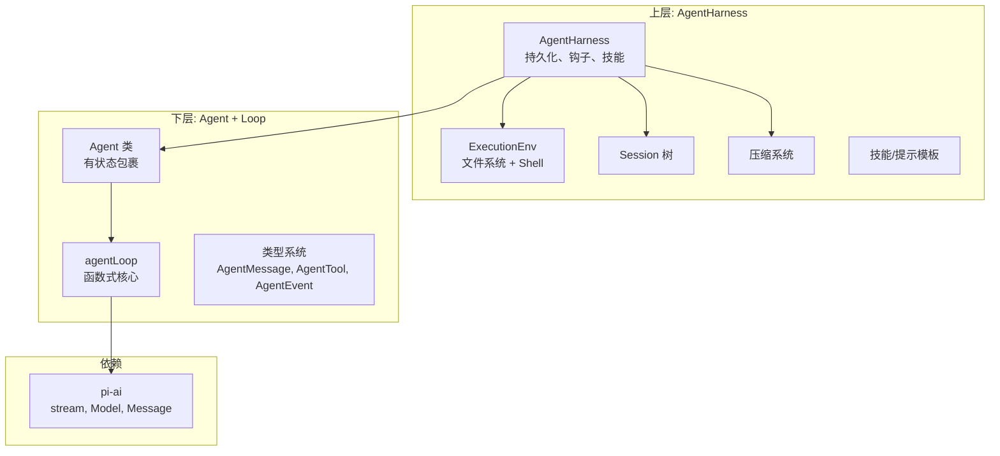

## 文件结构

```
packages/agent/src/
├── index.ts                    # 公共导出
├── node.ts                     # Node 子路径 (NodeExecutionEnv)
├── agent.ts                    # Agent 类 (~350 行)
├── agent-loop.ts               # 核心循环 (~743 行)
├── types.ts                    # 类型定义 (~419 行)
├── proxy.ts                    # 流代理传输
└── harness/
    ├── agent-harness.ts        # AgentHarness (~800 行)
    ├── types.ts                # Harness 类型
    ├── messages.ts             # 自定义消息类型 + convertToLlm
    ├── system-prompt.ts        # 系统提示构建
    ├── prompt-templates.ts     # 提示模板
    ├── skills.ts               # 技能加载
    ├── compaction/
    │   ├── compaction.ts       # 压缩逻辑
    │   ├── branch-summarization.ts
    │   └── utils.ts
    ├── session/
    │   ├── session.ts          # 会话上下文构建
    │   ├── uuid.ts             # UUID 生成
    │   ├── repo-utils.ts       # 仓库工具
    │   ├── jsonl-repo.ts       # JSONL 持久化
    │   ├── jsonl-storage.ts    # JSONL 存储
    │   ├── memory-repo.ts      # 内存仓库
    │   └── memory-storage.ts   # 内存存储
    ├── env/
    │   └── nodejs.ts           # Node.js 执行环境
    └── utils/
        ├── shell-output.ts
        └── truncate.ts
```

## 核心类型 (types.ts)

### AgentMessage: 可扩展的消息类型

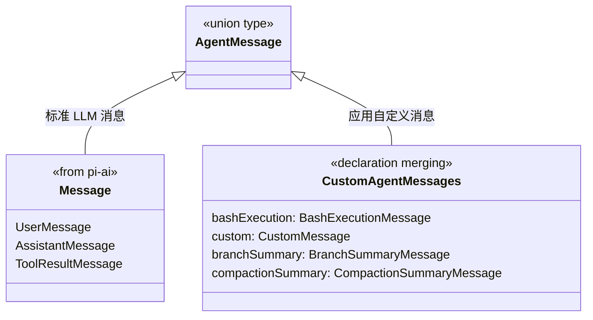

通过 TypeScript 声明合并，上层应用可以添加新的消息类型：

```typescript
declare module "@earendil-works/pi-agent-core" {
   interface CustomAgentMessages {
      myCustom: MyCustomMessage;
   }
}
```

### AgentTool: 运行时工具定义

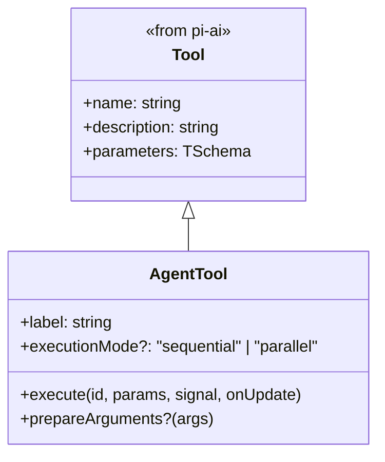

### AgentLoopConfig: 循环配置

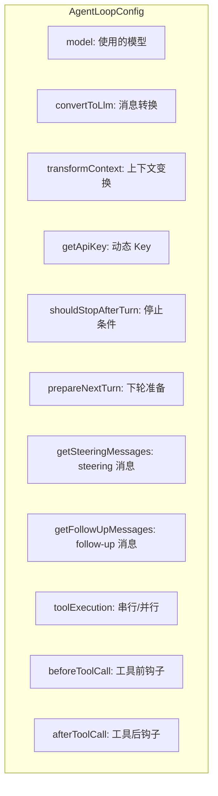

## Agent 循环 (agent-loop.ts)

这是 Pi 最核心的 743 行代码。循环实现了 LLM 调用 → 工具执行 → 再次调用的自主循环。

### 循环结构

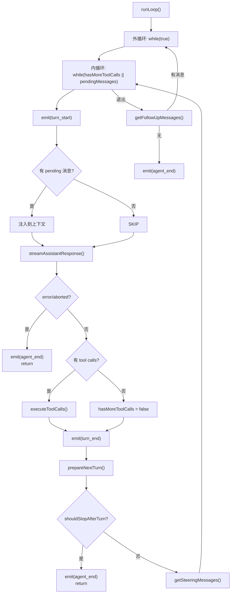

### streamAssistantResponse(): LLM 调用

```mermaid
sequenceDiagram
    participant Loop as runLoop
    participant SAR as streamAssistantResponse
    participant TF as transformContext
    participant CTL as convertToLlm
    participant SF as StreamFn
    participant Provider as LLM Provider

    Loop->>SAR: 调用
    SAR->>TF: messages (AgentMessage[])
    TF->>SAR: 裁剪后的 messages
    SAR->>CTL: AgentMessage[] → Message[]
    CTL->>SAR: LLM 兼容的 Message[]
    SAR->>SAR: 构建 LLM Context
    SAR->>SAR: 解析 API Key
    SAR->>SF: stream(model, llmContext, options)
    SF->>Provider: HTTP 请求
    Provider-->>SF: SSE 事件流
    
    loop for await event of response
        SF-->>SAR: AssistantMessageEvent
        SAR->>Loop: emit(message_start/update/end)
    end
    
    SAR->>Loop: return AssistantMessage
```

### executeToolCalls(): 工具执行

工具执行支持两种模式：

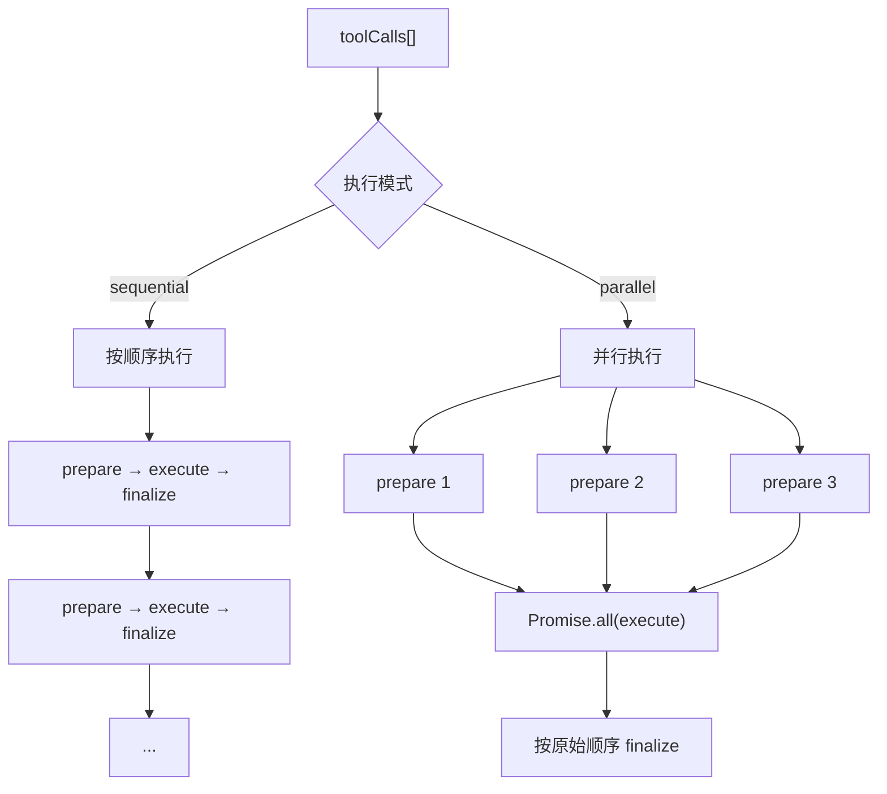

### 工具执行阶段

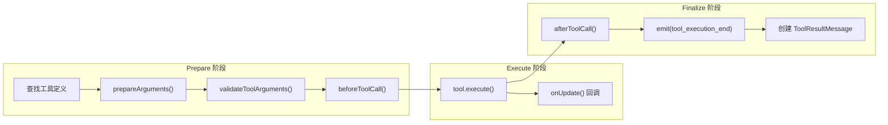

## Agent 类 (agent.ts)

Agent 是 agentLoop 的**有状态包裹器**：

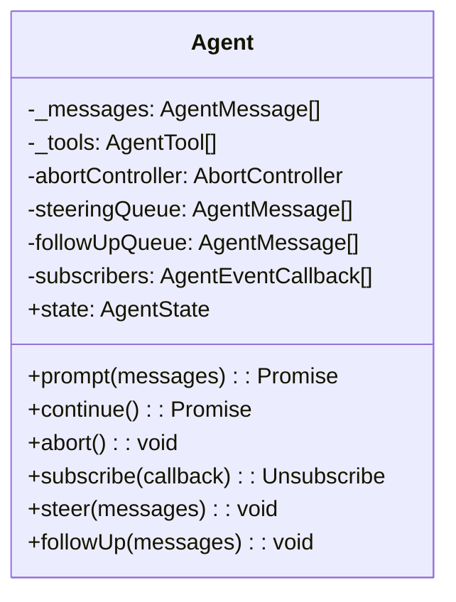

### 关键行为

1. **prompt()**: 添加用户消息，启动 agentLoop
2. **continue()**: 不添加新消息，从当前上下文继续（用于重试）
3. **steer()**: 在 Agent 运行时注入消息（steering 队列）
4. **followUp()**: Agent 即将停止时注入消息（follow-up 队列）
5. **abort()**: 通过 AbortController 中断当前运行

## Harness 层

### AgentHarness

AgentHarness 在 Agent 之上添加了：

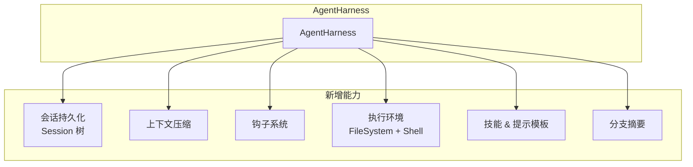

### 自定义消息与 convertToLlm

`harness/messages.ts` 定义了 4 种自定义消息并声明合并到 `CustomAgentMessages`：

| 消息类型 | 角色 | LLM 转换方式 |
|---------|------|-------------|
| `BashExecutionMessage` | `bashExecution` | → UserMessage (命令 + 输出文本) |
| `CustomMessage` | `custom` | 按 `display` 配置转换 |
| `BranchSummaryMessage` | `branchSummary` | → UserMessage (XML 包裹的摘要) |
| `CompactionSummaryMessage` | `compactionSummary` | → UserMessage (XML 包裹的摘要) |

### 会话树

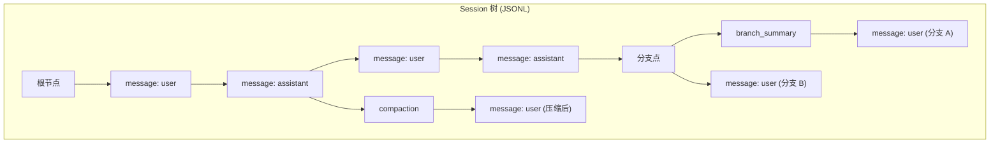

### 会话上下文构建

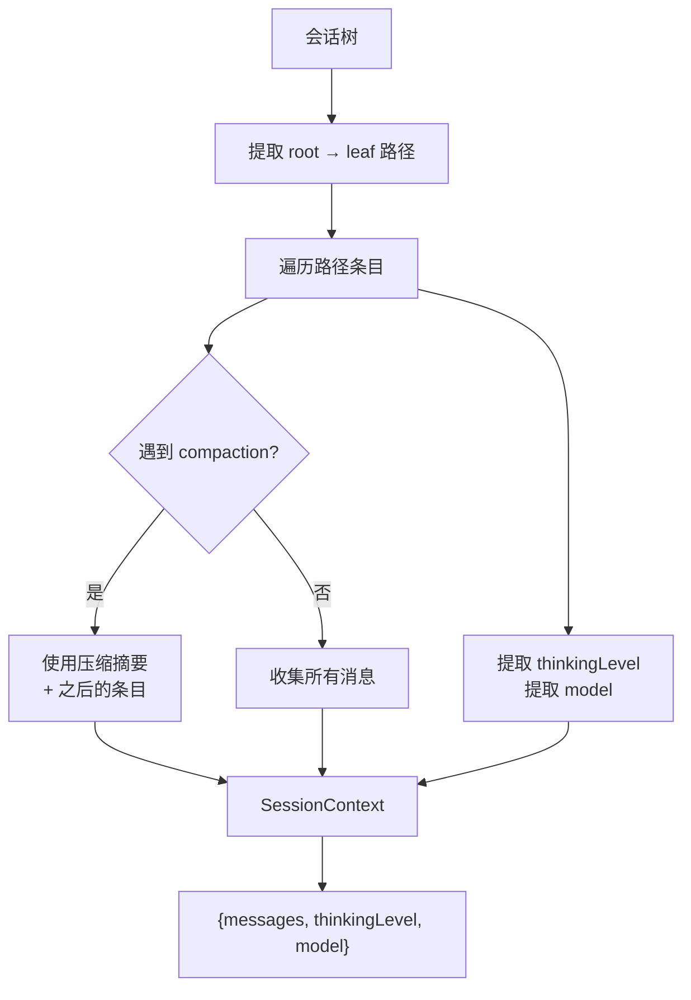

### ExecutionEnv: 文件系统与 Shell 抽象

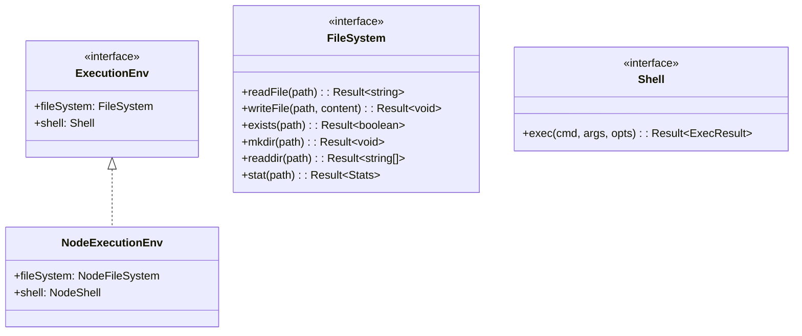

所有 I/O 返回 `Result<T, Error>`，不抛异常——这是函数式错误处理的体现。

## 流代理 (proxy.ts)

`streamProxy` 将 LLM 调用代理到后端服务器，用于浏览器应用：

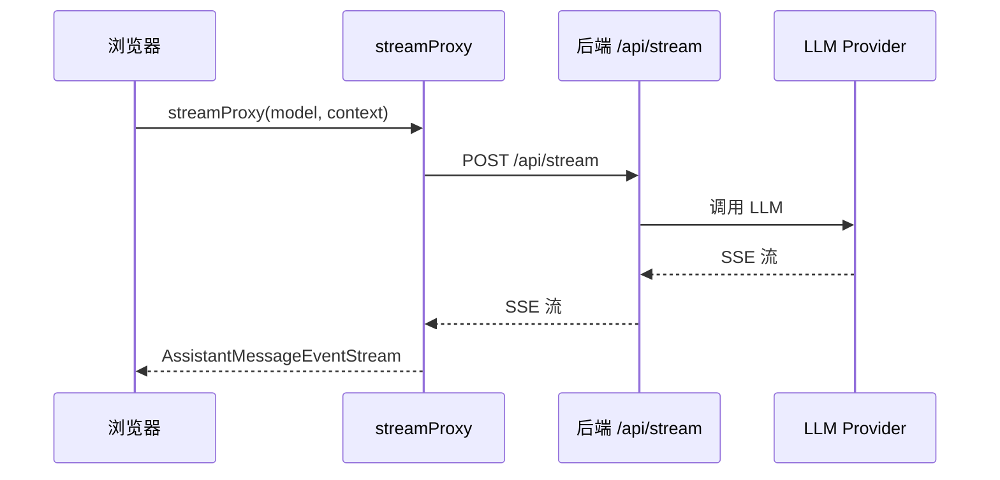
