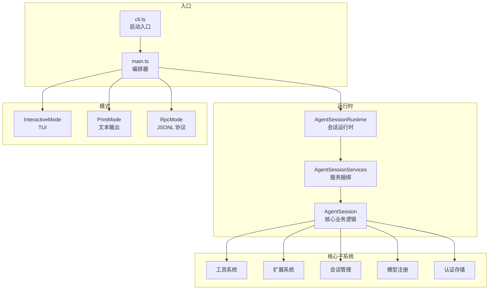
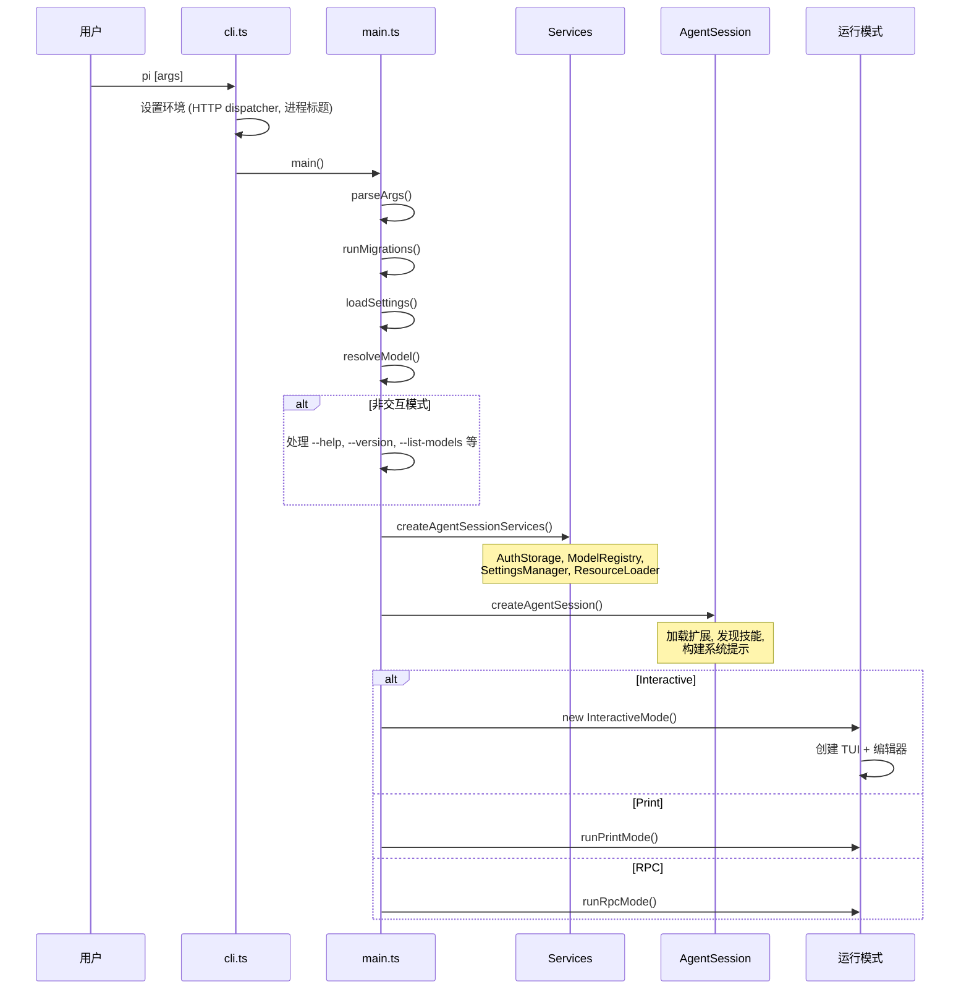
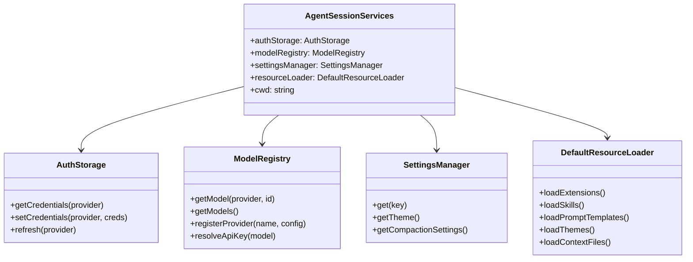
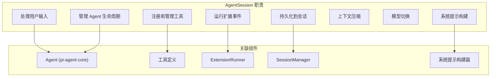
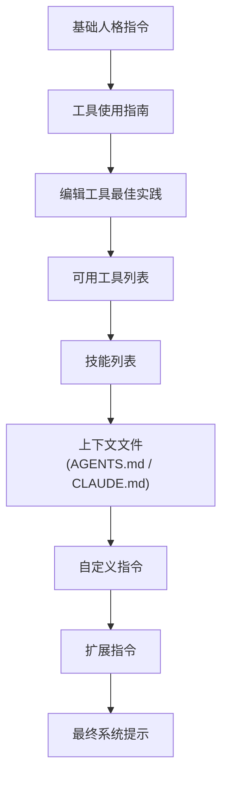
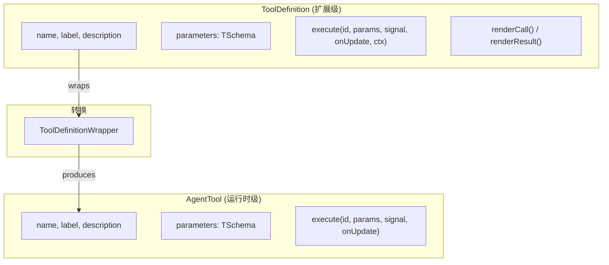
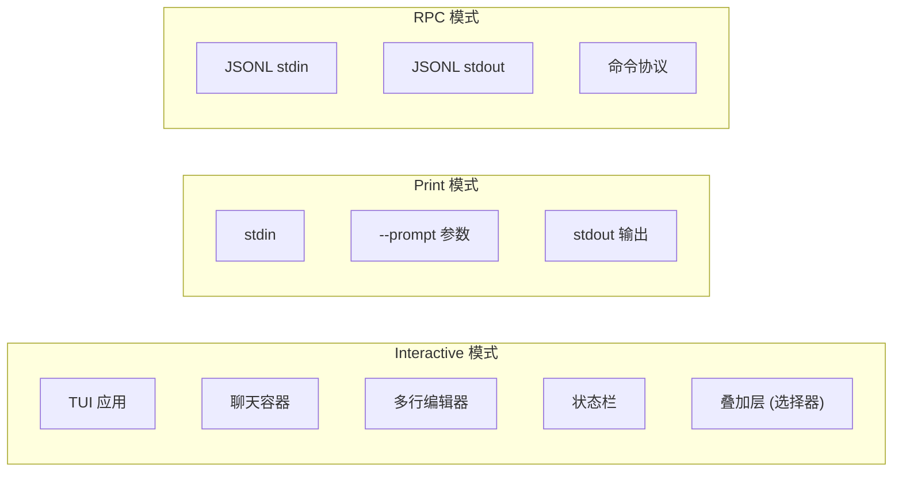
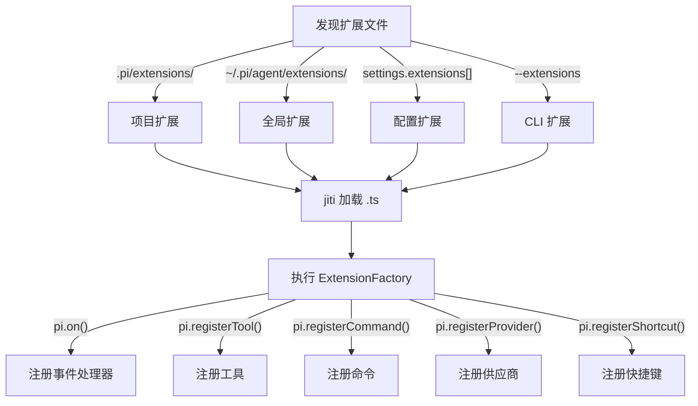
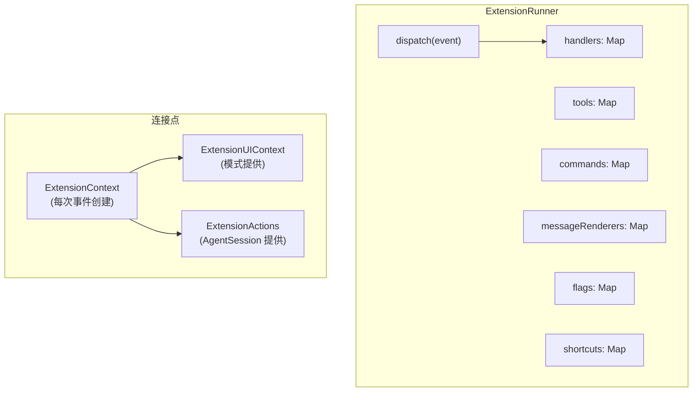
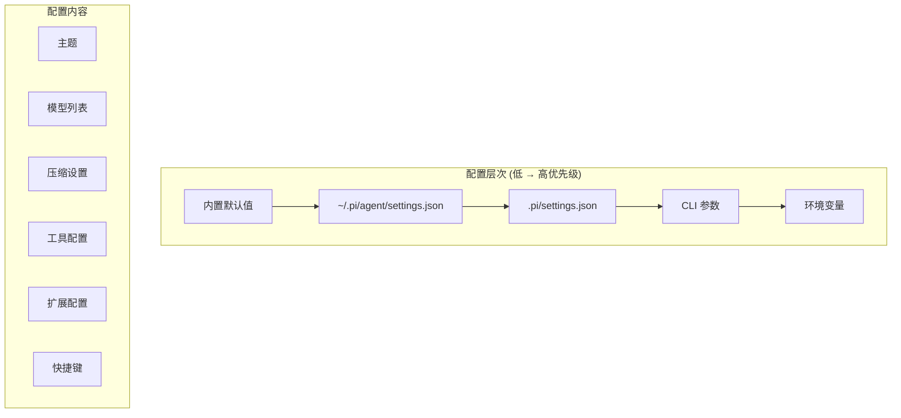

# pi-coding-agent 源码深度分析

> `@earendil-works/pi-coding-agent` — 编码智能体 CLI

## 包概览

pi-coding-agent 是面向用户的顶层包（~152 个源文件），整合了 Agent 核心、LLM API、终端 UI，提供完整的编码智能体体验。



## 启动流程



## 核心模块

### AgentSessionServices: 服务捆绑



### AgentSession: 核心业务逻辑

AgentSession 是 pi-coding-agent 最核心的类，桥接 Agent 运行时与应用层：



### 系统提示构建

系统提示是一个精心构建的多段文本：



## 工具系统详解

### 工具注册与双表示



### 文件操作队列

`edit` 和 `write` 工具通过 `FileMutationQueue` 序列化，避免并发写入冲突：

```mermaid
sequenceDiagram
    participant LLM as LLM
    participant Loop as AgentLoop
    participant Queue as FileMutationQueue
    participant FS as 文件系统

    LLM->>Loop: toolCall: edit file1
    LLM->>Loop: toolCall: edit file2
    LLM->>Loop: toolCall: write file3
    
    par 并行执行
        Loop->>Queue: edit file1 (获取锁)
        Queue->>FS: 写入 file1
        FS->>Queue: 完成
        Queue->>Loop: 释放锁
    and
        Loop->>Queue: edit file2 (获取锁)
        Queue->>FS: 写入 file2
        FS->>Queue: 完成
        Queue->>Loop: 释放锁
    and
        Loop->>Queue: write file3 (获取锁)
        Queue->>FS: 写入 file3
        FS->>Queue: 完成
        Queue->>Loop: 释放锁
    end
```

## 三种运行模式



### Interactive 模式 UI 布局

```
┌──────────────────────────────────┐
│ headerContainer                  │ ← 快捷键提示
├──────────────────────────────────┤
│                                  │
│ chatContainer                    │ ← 消息 + 工具输出
│   ├ UserMessageComponent         │
│   ├ AssistantMessageComponent    │
│   │   └ ToolExecutionComponent   │
│   ├ CompactionSummaryComponent   │
│   └ ...                          │
│                                  │
├──────────────────────────────────┤
│ pendingMessagesContainer         │ ← 队列中的消息
├──────────────────────────────────┤
│ statusContainer                  │ ← 加载动画
├──────────────────────────────────┤
│ widgetContainerAbove             │ ← 扩展 widget
├──────────────────────────────────┤
│ editorContainer                  │ ← 输入编辑器
├──────────────────────────────────┤
│ widgetContainerBelow             │ ← 扩展 widget
├──────────────────────────────────┤
│ footer                           │ ← 模型/Token/思考
└──────────────────────────────────┘
```

## 扩展系统

### 扩展加载流程



### ExtensionRunner: 事件分发中心



## 配置系统



## SDK 使用

pi-coding-agent 也提供编程 API：

```typescript
import { createAgentSession } from "@earendil-works/pi-coding-agent";

const session = await createAgentSession({
   model: getModel("anthropic", "claude-sonnet-4-20250514"),
   apiKey: process.env.ANTHROPIC_API_KEY,
   cwd: process.cwd(),
});

session.subscribe((event) => {
   // 处理事件
});

await session.prompt("修复这个 bug");
```
