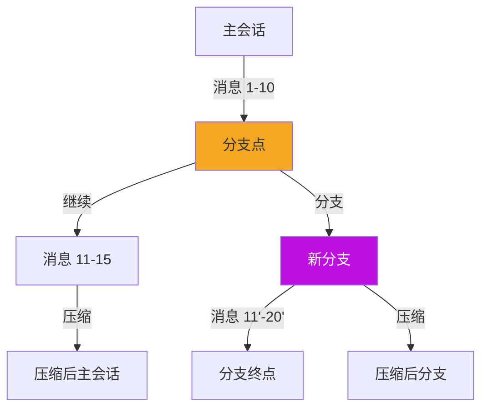

# pi-coding-agent 包深度分析

> 编程 Agent CLI：多模式运行、工具系统、会话管理

---

## 1. 包概览

### 1.1 定位

**pi-coding-agent** 是 pi-mono 的核心产品（**L3: Application Layer**），一个功能完整的交互式编程助手 CLI。

**核心职责**：
- **多模式运行**：交互式 TUI、RPC、打印模式
- **会话管理**：持久化、分支、树状导航
- **工具系统**：7 种内置开发工具
- **扩展系统**：TypeScript API 扩展支持
- **上下文压缩**：智能压缩长对话

**依赖**：
- `@mariozechner/pi-ai` - LLM API
- `@mariozechner/pi-agent-core` - Agent 运行时
- `@mariozechner/pi-tui` - 终端 UI

**被使用**：
- 用户通过 npm 安装使用
- pi-mom 复用工具系统

### 1.2 目录结构

```
packages/coding-agent/src/
├── core/                           # 核心实现
│   ├── agent-session.ts           # AgentSession 类 (3100+ 行)
│   ├── agent-session-runtime.ts    # 运行时包装器
│   ├── session-manager.ts         # 会话管理器 (1426+ 行)
│   ├── system-prompt.ts           # 系统提示构建
│   ├── compaction/                # 上下文压缩系统
│   ├── extensions/                # 扩展系统
│   │   ├── types.ts               # 扩展类型定义 (1546 行)
│   │   ├── runner.ts              # 扩展运行器
│   │   └── index.ts               # 导出
│   ├── tools/                     # 工具实现
│   │   ├── index.ts               # 工具工厂
│   │   ├── read.ts                # read 工具
│   │   ├── bash.ts                # bash 工具
│   │   ├── edit.ts                # edit 工具
│   │   ├── write.ts               # write 工具
│   │   ├── grep.ts                # grep 工具
│   │   ├── find.ts                # find 工具
│   │   └── ls.ts                  # ls 工具
│   ├── export-html/               # HTML 导出
│   └── ...                        # 其他核心文件
│
├── modes/                         # 运行模式
│   ├── interactive/               # 交互式 TUI 模式
│   │   ├── interactive-mode.ts    # 主交互模式
│   │   ├── components/            # UI 组件
│   │   └── theme/                 # 主题系统
│   ├── rpc/                       # RPC 模式
│   │   ├── rpc-mode.ts            # RPC 模式实现
│   │   ├── rpc-client.ts          # RPC 客户端
│   │   ├── rpc-types.ts           # RPC 协议类型
│   │   └── jsonl.ts               # JSONL 处理
│   └── print-mode.ts              # 打印模式
│
├── cli/                           # CLI 入口点
├── bun/                           # Bun 运行时适配
└── utils/                         # 工具函数
```

### 1.3 关键文件

| 文件 | 行数 | 核心功能 |
|------|------|---------|
| `core/agent-session.ts` | 3100+ | AgentSession 核心类 |
| `core/session-manager.ts` | 1400+ | 会话持久化和导航 |
| `core/extensions/types.ts` | 1546 | 扩展系统类型定义 |
| `core/system-prompt.ts` | 500+ | 系统提示构建 |
| `modes/interactive/interactive-mode.ts` | 800+ | 交互模式主逻辑 |

---

## 2. AgentSession 类

### 2.1 类设计

**源文件**：`/packages/coding-agent/src/core/agent-session.ts`

```typescript
export class AgentSession {
    // 标识
    id: string;
    sessionId: string;

    // 运行时
    private agent: Agent;
    private extensionRunner: ExtensionRunner;
    private sessionManager: SessionManager;

    // 状态
    state: "idle" | "running" | "aborted";

    // 配置
    model: Model<any>;
    thinkingLevel: ThinkingLevel;
    systemPrompt: string;

    // 工具
    tools: AgentTool<any>[];
    skills: Skill[];

    // 构造函数
    constructor(options: AgentSessionOptions);

    // 核心方法
    prompt(message: string, options?: PromptOptions): Promise<AssistantMessage>;
    continue(): Promise<void>;
    abort(): void;

    // 会话管理
    compact(options?: CompactOptions): Promise<CompactionResult>;
    cycleModel(): Promise<void>;

    // 导航
    navigateTree(branchId: string): Promise<ReplacedSessionContext>;

    // bash 执行
    executeBash(command: string, options?: ExecOptions): Promise<BashResult>;

    // 生命周期
    shutdown(): Promise<void>;
}
```

### 2.2 状态管理

```typescript
type SessionState = "idle" | "running" | "aborted";

interface AgentSessionState {
    // 标识
    id: string;
    sessionId: string;

    // Agent 配置
    model: Model<any>;
    thinkingLevel: ThinkingLevel;
    systemPrompt: string;

    // 工具和技能
    tools: AgentTool<any>[];
    skills: Skill[];

    // 运行状态
    state: SessionState;
}
```

### 2.3 核心方法实现

#### prompt 方法

```typescript
async prompt(message: string, options?: PromptOptions): Promise<AssistantMessage> {
    // 1. 检查状态
    if (this.state === "running") {
        throw new Error("Agent is already running");
    }

    // 2. 更新状态
    this.state = "running";

    try {
        // 3. 构建用户消息
        const userMessage: UserMessage = {
            role: "user",
            content: parseContent(message, options?.images),
        };

        // 4. 添加到会话管理器
        await this.sessionManager.appendMessage(userMessage);

        // 5. 调用 Agent
        const assistantMessage = await this.agent.prompt(userMessage);

        // 6. 返回结果
        return assistantMessage;
    } finally {
        this.state = "idle";
    }
}
```

#### compact 方法

```typescript
async compact(options?: CompactOptions): Promise<CompactionResult> {
    // 1. 构建压缩提示
    const compactionPrompt = await this.buildCompactionPrompt(options);

    // 2. 调用 LLM 压缩
    const response = await streamSimple(
        this.compactionModel,
        {
            systemPrompt: COMPACTION_SYSTEM_PROMPT,
            messages: [compactionPrompt],
        },
        {}
    );

    // 3. 解析结果
    const result = await response.result();
    const summary = extractSummary(result);

    // 4. 创建压缩条目
    const compactionEntry: CompactionEntry = {
        type: "compaction",
        summary: summary,
        firstKeptEntryId: this.sessionManager.firstKeptEntryId,
        timestamp: Date.now(),
    };

    // 5. 追加到会话文件
    await this.sessionManager.appendCompaction(compactionEntry);

    // 6. 更新内存状态
    await this.sessionManager.reload();

    return {
        summary,
        entriesRemoved: this.sessionManager.entriesRemoved,
    };
}
```

#### navigateTree 方法

```typescript
async navigateTree(branchId: string): Promise<ReplacedSessionContext> {
    // 1. 获取分支消息
    const branchMessages = await this.sessionManager.getForkMessages(branchId);

    // 2. 替换当前上下文
    const oldMessages = this.agent.state.messages.slice();
    this.agent.state.messages = branchMessages;

    // 3. 重新加载会话管理器
    await this.sessionManager.reload();

    // 4. 返回替换的上下文
    return {
        oldMessages,
        newMessages: branchMessages,
    };
}
```

---

## 3. SessionManager 类

### 3.1 会话持久化

**源文件**：`/packages/coding-agent/src/core/session-manager.ts`

#### JSONL 格式

```typescript
// 会话文件格式 (~/.pi/sessions/<session-id>.jsonl)
{"type":"header","version":3,"id":"session-123","timestamp":1234567890}
{"type":"message","role":"user","content":[...],"timestamp":1234567891}
{"type":"message","role":"assistant","content":[...],"timestamp":1234567892}
{"type":"tool_call","name":"read","arguments":{"path":"./README.md"},"timestamp":1234567893}
{"type":"tool_result","name":"read","result":{"content":[...]},"timestamp":1234567894}
{"type":"compaction","summary":"...","firstKeptEntryId":"entry-456","timestamp":1234567900}
```

#### 条目类型

```typescript
type SessionEntry =
    | HeaderEntry              // 头部：版本和 ID
    | MessageEntry             // 消息：user/assistant/system
    | ToolCallEntry            // 工具调用
    | ToolResultEntry          // 工具结果
    | CompactionEntry;         // 压缩条目

interface HeaderEntry {
    type: "header";
    version: number;
    id: string;
    timestamp: number;
}

interface MessageEntry {
    type: "message";
    role: "user" | "assistant" | "system";
    content: Content[];
    timestamp: number;
}

interface ToolCallEntry {
    type: "tool_call";
    id: string;
    name: string;
    arguments: unknown;
    timestamp: number;
}

interface ToolResultEntry {
    type: "tool_result";
    toolCallId: string;
    name: string;
    result: AgentToolResult<unknown>;
    timestamp: number;
}

interface CompactionEntry {
    type: "compaction";
    summary: string;
    firstKeptEntryId: string;
    timestamp: number;
}
```

### 3.2 会话管理方法

```typescript
class SessionManager {
    // 构建会话上下文
    async buildSessionContext(options?: ContextBuildOptions): Promise<AgentMessage[]>;

    // 追加条目
    async appendMessage(entry: MessageEntry): Promise<void>;
    async appendToolCall(entry: ToolCallEntry): Promise<void>;
    async appendToolResult(entry: ToolResultEntry): Promise<void>;
    async appendCompaction(entry: CompactionEntry): Promise<void>;

    // 分支操作
    async branch(entry: SessionEntry): Promise<string>;
    async branchWithSummary(entry: SessionEntry): Promise<string>;

    // 导航操作
    async getForkMessages(entryId: string): Promise<AgentMessage[]>;
    async navigateTree(branchId: string): Promise<ReplacedSessionContext>;

    // 重新加载
    async reload(): Promise<void>;

    // 属性
    entries: SessionEntry[];
    sessionPath: string;
    firstKeptEntryId: string | undefined;
}
```

### 3.3 会话分支



```typescript
// 创建分支
async branch(entry: SessionEntry): Promise<string> {
    // 1. 生成分支 ID
    const branchId = generateUUID();

    // 2. 创建分支条目
    const branchEntry: BranchEntry = {
        type: "branch",
        branchId,
        parentEntryId: entry.id,
        timestamp: Date.now(),
    };

    // 3. 写入新会话文件
    const branchSessionPath = path.join(
        sessionsDir,
        `branch-${branchId}.jsonl`
    );

    // 4. 复制父分支的所有条目
    const parentEntries = this.entries.filter(
        e => getEntryTimestamp(e) <= getEntryTimestamp(entry)
    );

    for (const e of parentEntries) {
        await fs.appendFile(
            branchSessionPath,
            JSON.stringify(e) + "\n"
        );
    }

    // 5. 追加分支条目
    await fs.appendFile(
        branchSessionPath,
        JSON.stringify(branchEntry) + "\n"
    );

    return branchId;
}

// 获取分支消息
async getForkMessages(entryId: string): Promise<AgentMessage[]> {
    // 1. 找到分支点
    const branchEntry = this.entries.find(
        e => e.type === "branch" && e.parentEntryId === entryId
    );

    if (!branchEntry) {
        throw new Error(`Branch not found for entry ${entryId}`);
    }

    // 2. 构建分支消息上下文
    const messages: AgentMessage[] = [];

    for (const entry of this.entries) {
        if (entry.type === "message") {
            messages.push({
                role: entry.role,
                content: entry.content,
                timestamp: entry.timestamp,
            });
        }

        // 到达分支点时停止
        if (entry.type === "branch" && entry.id === branchEntry.id) {
            break;
        }
    }

    return messages;
}
```

---

## 4. 工具系统

### 4.1 工具列表

**源文件**：`/packages/coding-agent/src/core/tools/index.ts`

```typescript
export type ToolName =
    | "read"    // 读取文件
    | "bash"    // 执行命令
    | "edit"    // 编辑文件
    | "write"   // 写入文件
    | "grep"    // 搜索文本
    | "find"    // 查找文件
    | "ls";     // 列出目录

export const allToolNames: Set<ToolName> = new Set([
    "read", "bash", "edit", "write", "grep", "find", "ls"
]);
```

### 4.2 工具工厂

```typescript
// 创建单个工具
export function createTool(
    toolName: ToolName,
    cwd: string,
    options?: ToolsOptions
): AgentTool<any> {
    switch (toolName) {
        case "read":
            return createReadTool(cwd, options?.read);
        case "bash":
            return createBashTool(cwd, options?.bash);
        case "edit":
            return createEditTool(cwd, options?.edit);
        case "write":
            return createWriteTool(cwd, options?.write);
        case "grep":
            return createGrepTool(cwd, options?.grep);
        case "find":
            return createFindTool(cwd, options?.find);
        case "ls":
            return createLsTool(cwd, options?.ls);
    }
}

// 创建完整工具集
export function createAllTools(
    cwd: string,
    options?: ToolsOptions
): Record<ToolName, AgentTool<any>> {
    return {
        read: createReadTool(cwd, options?.read),
        bash: createBashTool(cwd, options?.bash),
        edit: createEditTool(cwd, options?.edit),
        write: createWriteTool(cwd, options?.write),
        grep: createGrepTool(cwd, options?.grep),
        find: createFindTool(cwd, options?.find),
        ls: createLsTool(cwd, options?.ls),
    };
}

// 创建只读工具集
export function createReadOnlyTools(
    cwd: string,
    options?: ToolsOptions
): AgentTool<any>[] {
    return [
        createReadTool(cwd, options?.read),
        createGrepTool(cwd, options?.grep),
        createFindTool(cwd, options?.find),
        createLsTool(cwd, options?.ls),
    ];
}

// 创建编码工具集
export function createCodingTools(
    cwd: string,
    options?: ToolsOptions
): AgentTool<any>[] {
    return [
        createReadTool(cwd, options?.read),
        createBashTool(cwd, options?.bash),
        createEditTool(cwd, options?.edit),
        createWriteTool(cwd, options?.write),
        createGrepTool(cwd, options?.grep),
        createFindTool(cwd, options?.find),
        createLsTool(cwd, options?.ls),
    ];
}
```

### 4.3 Read 工具

**源文件**：`/packages/coding-agent/src/core/tools/read.ts`

```typescript
export function createReadTool(
    cwd: string,
    options?: ReadToolOptions
): AgentTool<ReadToolParameters> {
    return {
        name: "read",
        description: "Read the contents of a file",
        label: "Read file",
        parameters: Type.Object({
            path: Type.String(),
            offset: Type.Optional(Type.Number()),
            limit: Type.Optional(Type.Number()),
        }),
        execute: async (toolCallId, params, signal, onUpdate) => {
            const filePath = resolvePath(params.path, cwd);

            // 读取文件
            const content = await fs.readFile(filePath, "utf-8");

            // 应用偏移和限制
            const lines = content.split("\n");
            const offset = params.offset ?? 0;
            const limit = params.limit ?? lines.length;

            const selectedLines = lines.slice(offset, offset + limit);

            // 发送更新
            onUpdate({
                progress: (offset + selectedLines.length) / lines.length,
            });

            // 检测图片
            if (isImageFile(filePath)) {
                const image = await resizeImageIfNeeded(filePath);
                return {
                    content: [{
                        type: "image",
                        source: {
                            type: "base64",
                            media_type: image.mime,
                            data: image.base64,
                        },
                    }],
                    details: { path: filePath },
                };
            }

            // 返回文本内容
            return {
                content: [{
                    type: "text",
                    text: selectedLines.join("\n"),
                }],
                details: {
                    path: filePath,
                    totalLines: lines.length,
                    linesReturned: selectedLines.length,
                },
            };
        },
    };
}
```

### 4.4 Bash 工具

**源文件**：`/packages/coding-agent/src/core/tools/bash.ts`

```typescript
export function createBashTool(
    cwd: string,
    options?: BashToolOptions
): AgentTool<BashToolParameters> {
    return {
        name: "bash",
        description: "Execute a bash command in the terminal",
        label: "Bash",
        parameters: Type.Object({
            command: Type.String(),
        }),
        executionMode: "sequential",
        execute: async (toolCallId, params, signal, onUpdate) => {
            const { command } = params;

            // 创建进程
            const child = spawn("bash", ["-c", command], {
                cwd,
                env: process.env,
                signal,
            });

            let stdout = "";
            let stderr = "";
            let exitCode = 0;

            // 监听输出
            child.stdout?.on("data", (data) => {
                stdout += data.toString();
                onUpdate({ stdout: data.toString() });
            });

            child.stderr?.on("data", (data) => {
                stderr += data.toString();
                onUpdate({ stderr: data.toString() });
            });

            // 等待完成
            await new Promise<void>((resolve) => {
                child.on("close", (code) => {
                    exitCode = code ?? 0;
                    resolve();
                });
            });

            // 返回结果
            return {
                content: [{
                    type: "text",
                    text: JSON.stringify({ stdout, stderr, exitCode }),
                }],
                details: { command, exitCode },
            };
        },
    };
}
```

### 4.5 Edit 工具

**源文件**：`/packages/coding-agent/src/core/tools/edit.ts`

```typescript
export function createEditTool(
    cwd: string,
    options?: EditToolOptions
): AgentTool<EditToolParameters> {
    return {
        name: "edit",
        description: "Edit a file by replacing text",
        label: "Edit file",
        parameters: Type.Object({
            path: Type.String(),
            oldText: Type.String(),
            newText: Type.String(),
        }),
        execute: async (toolCallId, params, signal, onUpdate) => {
            const filePath = resolvePath(params.path, cwd);

            // 读取文件
            const content = await fs.readFile(filePath, "utf-8");

            // 检查 oldText 是否存在
            if (!content.includes(params.oldText)) {
                return {
                    content: [{
                        type: "text",
                        text: `Error: oldText not found in file`,
                    }],
                    details: { error: "oldText not found" },
                };
            }

            // 替换文本
            const newContent = content.replace(
                params.oldText,
                params.newText
            );

            // 写入文件
            await fs.writeFile(filePath, newContent, "utf-8");

            // 计算差异
            const diff = computeDiff(content, newContent);

            return {
                content: [{
                    type: "text",
                    text: `File edited successfully\n\nDiff:\n${diff}`,
                }],
                details: { path: filePath, diff },
            };
        },
    };
}
```

---

## 5. 扩展系统

### 5.1 扩展类型

**源文件**：`/packages/coding-agent/src/core/extensions/types.ts`

```typescript
export interface Extension {
    // 元数据
    name?: string;
    version?: string;
    description?: string;

    // 事件处理器
    onAgentStart?: AgentStartHandler;
    onAgentEnd?: AgentEndHandler;
    onToolCall?: ToolCallEventHandler;
    onToolResult?: ToolResultEventHandler;
    onMessage?: MessageEventHandler;
    onInput?: InputEventHandler;
    onContext?: ContextEventHandler;
    onModelSelect?: ModelSelectEventHandler;

    // 工具
    tools?: ExtensionTool[];

    // 命令
    commands?: ExtensionCommand[];

    // UI 组件
    uiComponents?: ExtensionUIComponent[];

    // Provider
    providers?: ApiProvider<any>[];

    // 快捷键
    keybindings?: Keybinding[];

    // 主题
    themes?: Theme[];
}
```

### 5.2 扩展 API

```typescript
export interface ExtensionAPI {
    // 事件订阅
    on<TEventName extends ExtensionEventName>(
        event: TEventName | TEventName[],
        handler: ExtensionEventHandler<TEventName>
    ): () => void;

    // 工具注册
    registerTool(tool: ExtensionTool): void;
    unregisterTool(toolName: string): void;

    // 命令注册
    registerCommand(command: ExtensionCommand): void;
    unregisterCommand(commandId: string): void;

    // 快捷键注册
    registerKeybinding(keybinding: Keybinding): void;

    // Provider 注册
    registerProvider<TApi extends Api>(
        name: string,
        provider: ApiProvider<TApi>
    ): void;

    // UI 组件
    registerComponent(component: ExtensionUIComponent): void;

    // 发送消息
    sendMessage(message: string, images?: ImageContent[]): Promise<void>;

    // 执行 bash
    executeBash(command: string): Promise<BashResult>;

    // 事件总线
    events: EventBus;

    // Agent 访问
    agent: Agent;
    session: AgentSession;
}
```

### 5.3 扩展运行时

**源文件**：`/packages/coding-agent/src/core/extensions/runner.ts`

```typescript
export class ExtensionRunner {
    private extensions: Map<string, LoadedExtension> = new Map();
    private handlers: Map<string, Array<ExtensionEventHandler<any>>> = new Map();

    // 加载扩展
    async loadExtensions(
        extensions: Extension[],
        api: ExtensionAPI
    ): Promise<LoadExtensionsResult> {
        const results: LoadExtensionsResult = {
            loaded: [],
            failed: [],
        };

        for (const extension of extensions) {
            try {
                // 调用扩展函数
                const result = extension(api);

                // 处理返回值
                if (result && typeof result === "object") {
                    // 注册工具
                    if (result.tools) {
                        for (const tool of result.tools) {
                            this.registerTool(tool);
                        }
                    }

                    // 注册命令
                    if (result.commands) {
                        for (const command of result.commands) {
                            this.registerCommand(command);
                        }
                    }

                    // 注册事件处理器
                    for (const [event, handler] of Object.entries(result)) {
                        if (event.startsWith("on")) {
                            this.registerEventHandler(event, handler);
                        }
                    }
                }

                results.loaded.push(extension.name ?? "anonymous");
            } catch (error) {
                results.failed.push({
                    name: extension.name ?? "anonymous",
                    error: error instanceof Error ? error.message : String(error),
                });
            }
        }

        return results;
    }

    // 发射事件
    async emit<TEvent extends ExtensionEvent>(
        event: TEvent
    ): Promise<ExtensionEventResult<TEvent>> {
        const handlers = this.handlers.get(event.type) || [];

        // 执行所有处理器
        for (const handler of handlers) {
            try {
                await handler(event);
            } catch (error) {
                console.error(`Extension error (${event.type}):`, error);
            }
        }

        return this.mergeResults(event);
    }

    // 注册事件处理器
    private registerEventHandler(
        event: string,
        handler: ExtensionEventHandler<any>
    ): void {
        const eventType = event.substring(2).replace(/([A-Z])/g, "_$1").toLowerCase();

        if (!this.handlers.has(eventType)) {
            this.handlers.set(eventType, []);
        }

        this.handlers.get(eventType)!.push(handler);
    }
}
```

---

## 6. 运行模式

### 6.1 模式概览

| 模式 | 入口点 | 特点 | 用途 |
|------|--------|------|------|
| **Interactive** | `modes/interactive/` | TUI 界面、实时交互 | 日常使用 |
| **RPC** | `modes/rpc/` | JSON stdin/stdout 协议 | IDE 集成、API |
| **Print** | `modes/print-mode.ts` | 单次执行、纯文本输出 | 脚本、CI |

### 6.2 交互模式

**源文件**：`/packages/coding-agent/src/modes/interactive/interactive-mode.ts`

```typescript
export class InteractiveMode {
    private tui: TUI;
    private agentSession: AgentSession;
    private inputComponent: InputComponent;
    private messagesComponent: MessagesComponent;

    async start(): Promise<void> {
        // 初始化 TUI
        this.tui = new TUI({
            theme: loadTheme(),
        });

        // 创建组件
        this.inputComponent = new InputComponent({
            onSubmit: async (input) => {
                await this.handleInput(input);
            },
        });

        this.messagesComponent = new MessagesComponent();

        // 添加到容器
        this.tui.container.add(this.messagesComponent, { height: "flex" });
        this.tui.container.add(this.inputComponent, { height: 3 });

        // 启动 TUI
        await this.tui.start();
    }

    async handleInput(text: string): Promise<void> {
        // 处理斜杠命令
        if (text.startsWith("/")) {
            await this.handleSlashCommand(text);
            return;
        }

        // 发送到 Agent
        const response = await this.agentSession.prompt(text);

        // 更新消息显示
        this.messagesComponent.addMessage(response);
    }

    async handleSlashCommand(text: string): Promise<void> {
        const [command, ...args] = text.split(" ");

        switch (command) {
            case "/compact":
                await this.agentSession.compact();
                break;
            case "/model":
                await this.agentSession.cycleModel();
                break;
            case "/clear":
                this.messagesComponent.clear();
                break;
            case "/help":
                this.showHelp();
                break;
            default:
                this.messagesComponent.addSystemMessage(
                    `Unknown command: ${command}`
                );
        }
    }
}
```

### 6.3 RPC 模式

**源文件**：`/packages/coding-agent/src/modes/rpc/rpc-mode.ts`

```typescript
// RPC 协议类型
export type RpcCommand =
    | { type: "prompt"; message: string; images?: ImageContent[] }
    | { type: "abort" }
    | { type: "set_model"; provider: string; modelId: string }
    | { type: "compact"; customInstructions?: string }
    | { type: "bash"; command: string }
    | { type: "exit" };

export type RpcEvent =
    | { type: "message_start"; message: AssistantMessage }
    | { type: "message_delta"; delta: string }
    | { type: "message_end"; message: AssistantMessage }
    | { type: "tool_call_start"; toolCall: ToolCallContent }
    | { type: "tool_result"; toolCallId: string; result: AgentToolResult }
    | { type: "error"; error: string };

export class RpcMode {
    private agentSession: AgentSession;
    private stdin: Readable;
    private stdout: Writable;

    async start(): Promise<void> {
        // 订阅 Agent 事件
        this.agentSession.agent.subscribe(async (event) => {
            const rpcEvent = this.agentEventToRpcEvent(event);
            this.send(rpcEvent);
        });

        // 监听 stdin
        readline.createInterface({
            input: this.stdin,
            output: this.stdout,
            terminal: false,
        }).on("line", (line) => {
            const command = JSON.parse(line) as RpcCommand;
            this.handleCommand(command);
        });
    }

    async handleCommand(command: RpcCommand): Promise<void> {
        switch (command.type) {
            case "prompt":
                await this.agentSession.prompt(command.message, {
                    images: command.images,
                });
                break;

            case "abort":
                this.agentSession.abort();
                break;

            case "set_model":
                await this.setModel(command.provider, command.modelId);
                break;

            case "compact":
                await this.agentSession.compact({
                    customInstructions: command.customInstructions,
                });
                break;

            case "bash":
                const result = await this.agentSession.executeBash(command.command);
                this.send({
                    type: "bash_result",
                    result,
                });
                break;

            case "exit":
                process.exit(0);
        }
    }

    private send(event: RpcEvent): void {
        this.stdout.write(JSON.stringify(event) + "\n");
    }

    private agentEventToRpcEvent(event: AgentEvent): RpcEvent {
        // 转换逻辑...
        return rpcEvent;
    }
}
```

### 6.4 打印模式

**源文件**：`/packages/coding-agent/src/modes/print-mode.ts`

```typescript
export async function printMode(options: PrintModeOptions): Promise<number> {
    const { mode, messages, initialMessage, initialImages } = options;

    // 创建 AgentSession
    const agentSession = new AgentSession({
        model: options.model,
        systemPrompt: options.systemPrompt,
        tools: options.tools ?? [],
    });

    // 订阅事件
    agentSession.agent.subscribe(async (event) => {
        if (mode === "json") {
            console.log(JSON.stringify(event));
        } else {
            switch (event.type) {
                case "message_update":
                    process.stdout.write(event.assistantMessageEvent.delta);
                    break;
                case "tool_execution_end":
                    console.log(`\n[Tool: ${event.toolName}]`);
                    break;
            }
        }
    });

    // 处理初始消息
    if (initialMessage) {
        await agentSession.prompt(initialMessage, {
            images: initialImages,
        });
    }

    // 处理额外消息
    if (messages) {
        for (const message of messages) {
            await agentSession.prompt(message);
        }
    }

    // 等待完成
    await agentSession.waitForIdle();

    // 返回退出码
    return agentSession.state.errorMessage ? 1 : 0;
}
```

---

## 7. 系统提示构建

**源文件**：`/packages/coding-agent/src/core/system-prompt.ts`

```typescript
export interface BuildSystemPromptOptions {
    customPrompt?: string;
    selectedTools?: string[];
    toolSnippets?: Record<string, string>;
    promptGuidelines?: string[];
    appendSystemPrompt?: string;
    cwd: string;
    contextFiles?: Array<{ path: string; content: string }>;
    skills?: Skill[];
}

export function buildSystemPrompt(options: BuildSystemPromptOptions): string {
    const sections = [];

    // 1. 自定义提示
    if (options.customPrompt) {
        sections.push(options.customPrompt);
    }

    // 2. 工具描述
    if (options.selectedTools && options.selectedTools.length > 0) {
        sections.push(formatToolsForPrompt(options.selectedTools, options.toolSnippets));
    }

    // 3. Skills 描述
    if (options.skills && options.skills.length > 0) {
        sections.push(formatSkillsForPrompt(options.skills));
    }

    // 4. 上下文文件
    if (options.contextFiles && options.contextFiles.length > 0) {
        sections.push(formatContextFilesForPrompt(options.contextFiles));
    }

    // 5. 提示指南
    if (options.promptGuidelines && options.promptGuidelines.length > 0) {
        sections.push(options.promptGuidelines.join("\n"));
    }

    // 6. 追加提示
    if (options.appendSystemPrompt) {
        sections.push(options.appendSystemPrompt);
    }

    return sections.join("\n\n");
}

function formatToolsForPrompt(
    tools: string[],
    snippets?: Record<string, string>
): string {
    const lines = ["# Tools\n\nYou have access to the following tools:\n"];

    for (const tool of tools) {
        lines.push(`## ${tool}`);

        if (snippets && snippets[tool]) {
            lines.push(snippets[tool]);
        }

        lines.push("");
    }

    return lines.join("\n");
}
```

---

## 8. 使用示例

### 8.1 作为库使用

```typescript
import { AgentSession } from "@mariozechner/pi-coding-agent";
import { anthropicModels } from "@mariozechner/pi-ai";

// 创建会话
const session = new AgentSession({
    model: anthropicModels.claude_3_5_sonnet_20241022,
    systemPrompt: "You are a helpful coding assistant.",
    tools: createCodingTools(process.cwd()),
});

// 发送消息
const response = await session.prompt("Help me debug this function");

// 压缩上下文
await session.compact();

// 关闭
await session.shutdown();
```

### 8.2 编写扩展

```typescript
import { Extension, ExtensionAPI } from "@mariozechner/pi-coding-agent";

const myExtension: Extension = {
    name: "my-extension",
    version: "1.0.0",

    // 订阅事件
    onToolCall: async (event, api) => {
        if (event.toolCall.name === "bash") {
            console.log("Bash command:", event.arguments.command);
        }
    },

    // 注册工具
    tools: [
        {
            name: "my_tool",
            description: "My custom tool",
            parameters: { type: "object", properties: {} },
            execute: async (toolCallId, params) => {
                return {
                    content: [{ type: "text", text: "Hello!" }],
                    details: {},
                };
            },
        },
    ],

    // 注册命令
    commands: [
        {
            id: "my-command",
            title: "My Command",
            handler: async (api) => {
                await api.sendMessage("Hello from my command!");
            },
        },
    ],
};

export default function (api: ExtensionAPI) {
    return myExtension;
}
```

### 8.3 使用 RPC 模式

```bash
# 启动 RPC 服务器
pi --mode rpc

# 发送命令
echo '{"type":"prompt","message":"Hello"}' | pi --mode rpc
```

```typescript
// RPC 客户端
import { RpcClient } from "@mariozechner/pi-coding-agent";

const client = new RpcClient({
    command: "pi",
    args: ["--mode", "rpc"],
});

// 发送消息
await client.prompt("Hello, world!");

// 执行 bash
const result = await client.bash("ls -la");

// 退出
await client.exit();
```

---

## 9. 总结

pi-coding-agent 包是一个功能完整的编程 Agent CLI：

**核心特性**：
1. **多模式运行**：交互式、RPC、打印模式
2. **会话管理**：持久化、分支、树状导航
3. **工具系统**：7 种内置开发工具
4. **扩展系统**：TypeScript API
5. **上下文压缩**：智能压缩长对话

**架构优势**：
- **模块化设计**：清晰的核心-模式分离
- **可扩展性**：运行时扩展支持
- **可测试性**：独立的模块和纯函数
- **可观察性**：完整的事件系统

**适用场景**：
- 日常编程辅助
- CI/CD 集成
- IDE 插件后端
- 自定义 AI 工作流

---

**相关文档**：
- [架构概览](../02-architecture/01-architecture-overview.md)
- [核心数据流](../02-architecture/03-data-flow.md)
- [工具系统](../04-subsystems/01-tool-system.md)
- [扩展系统](../04-subsystems/02-extension-system.md)
- [pi-agent-core 包分析](./02-pi-agent-core.md)
