# pi-tui 源码深度分析

> `@earendil-works/pi-tui` — 差分渲染终端 UI 框架

## 包概览

pi-tui 是一个**独立的终端 UI 库**，完全不依赖 AI 或 Agent。核心特性是差分渲染——只更新变化的行。

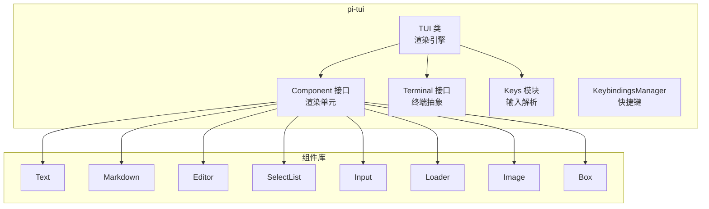

## 文件结构

```
packages/tui/src/
├── index.ts                # 公共导出
├── tui.ts                  # TUI 类 (~1200 行, 核心)
├── terminal.ts             # Terminal 接口 + ProcessTerminal
├── terminal-image.ts       # Kitty/iTerm2 图片协议
├── keys.ts                 # 键盘输入解析
├── keybindings.ts          # 快捷键管理器
├── stdin-buffer.ts         # stdin 输入缓冲
├── utils.ts                # 宽度计算, ANSI 处理
├── autocomplete.ts         # 自动补全
├── fuzzy.ts                # 模糊匹配
├── editor-component.ts     # 编辑器接口
├── undo-stack.ts           # 撤销栈
├── kill-ring.ts            # kill ring (Emacs 风格)
├── native-modifiers.ts     # 原生修饰键检测
└── components/
    ├── box.ts              # 带背景的容器
    ├── cancellable-loader.ts
    ├── editor.ts           # 多行编辑器 (~1500 行)
    ├── image.ts            # 内联图片
    ├── input.ts            # 单行输入
    ├── loader.ts           # 加载动画
    ├── markdown.ts         # Markdown 渲染器
    ├── select-list.ts      # 选择列表
    ├── settings-list.ts    # 设置列表
    ├── spacer.ts           # 空白
    ├── text.ts             # 多行文本
    └── truncated-text.ts   # 截断文本
```

## 核心概念: Component

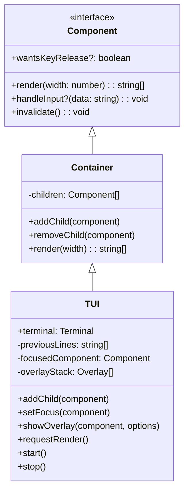

每个 Component 的 `render(width)` 方法返回 `string[]`——每个字符串是一行终端输出（含 ANSI 转义码）。

## 差分渲染引擎 (tui.ts)

### 渲染管线

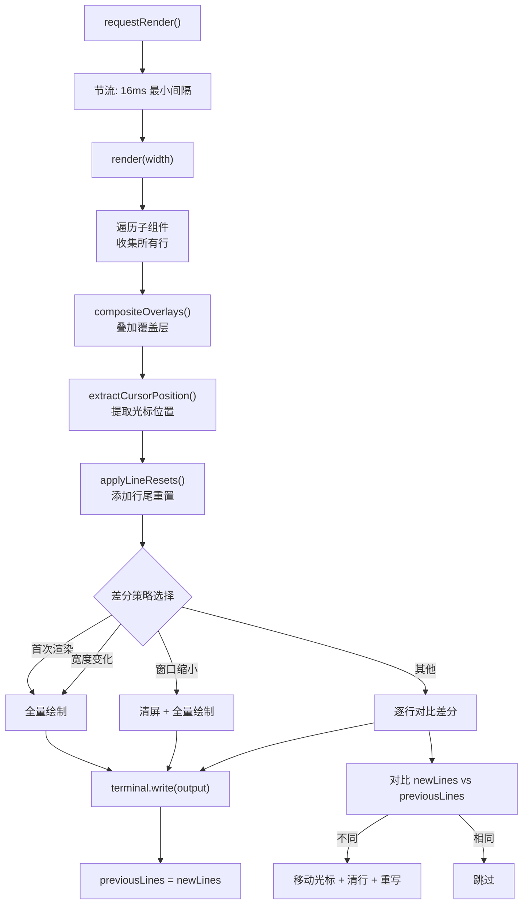

### 差分对比核心逻辑

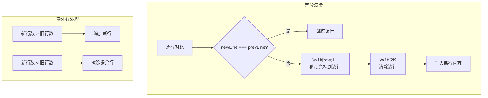

### 覆盖层 (Overlay) 系统

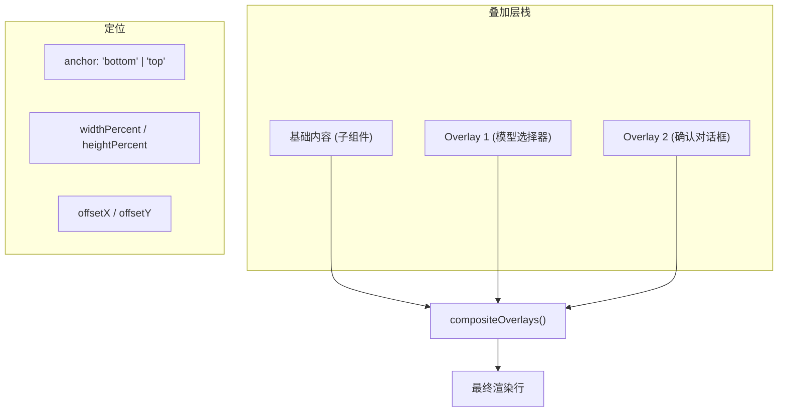

覆盖层渲染到独立层，然后按 Z 序合成到基础内容上。支持居中、锚定、百分比尺寸。

## 输入处理链

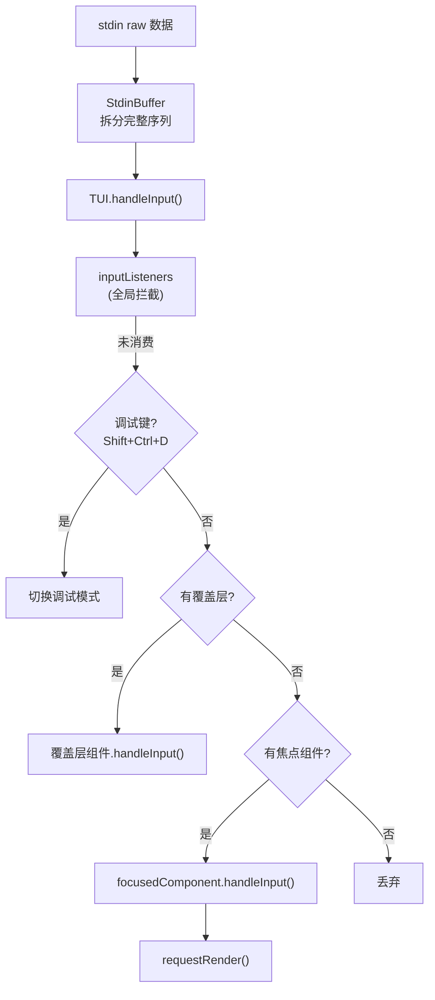

### Kitty 键盘协议

pi-tui 支持 Kitty 键盘协议（更精确的键检测）：

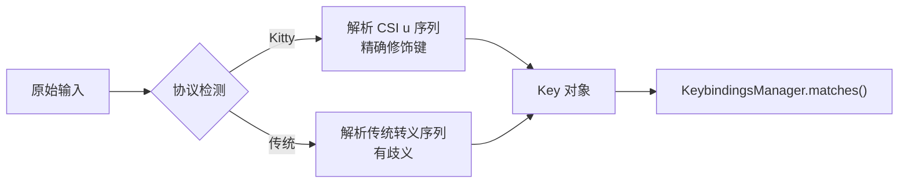

## 组件库

### Editor 组件 (~1500 行)

编辑器是最复杂的组件，支持：

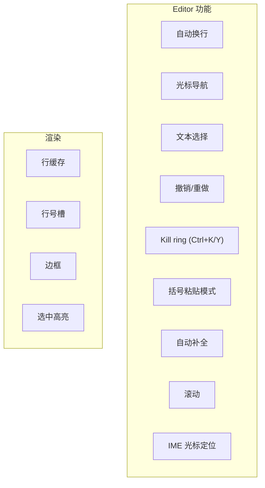

### Markdown 组件

使用 `marked` 库解析 Markdown，然后通过主题函数渲染为 ANSI 彩色输出：

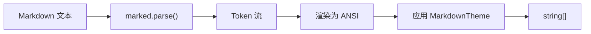

主题接口（由调用方提供）：

```typescript
interface MarkdownTheme {
   heading: (text: string) => string;
   link: (text: string) => string;
   code: (text: string) => string;
   codeBlock: (text: string) => string;
   highlightCode?: (code: string, lang?: string) => string[];
   // ...更多
}
```

### SelectList 组件

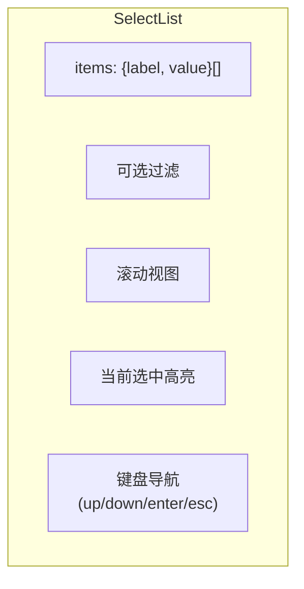

## 宽度计算 (utils.ts)

终端宽度计算是 TUI 的基础难题：

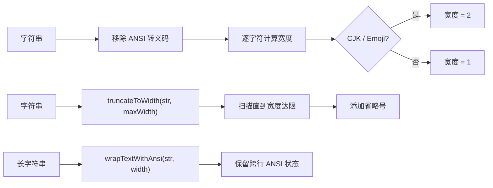

`visibleWidth()` 是性能热点——在每次渲染时对每行调用。使用 `get-east-asian-width` 库处理 CJK 和 emoji 的宽度。

## 与 coding-agent 的集成

pi-tui **不感知** Agent 的存在。coding-agent 通过以下方式桥接：

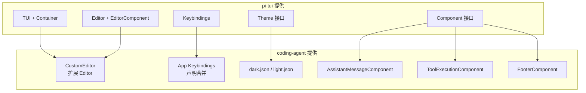
