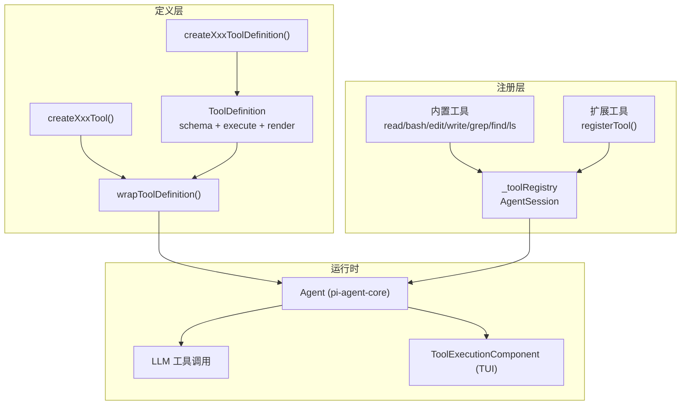
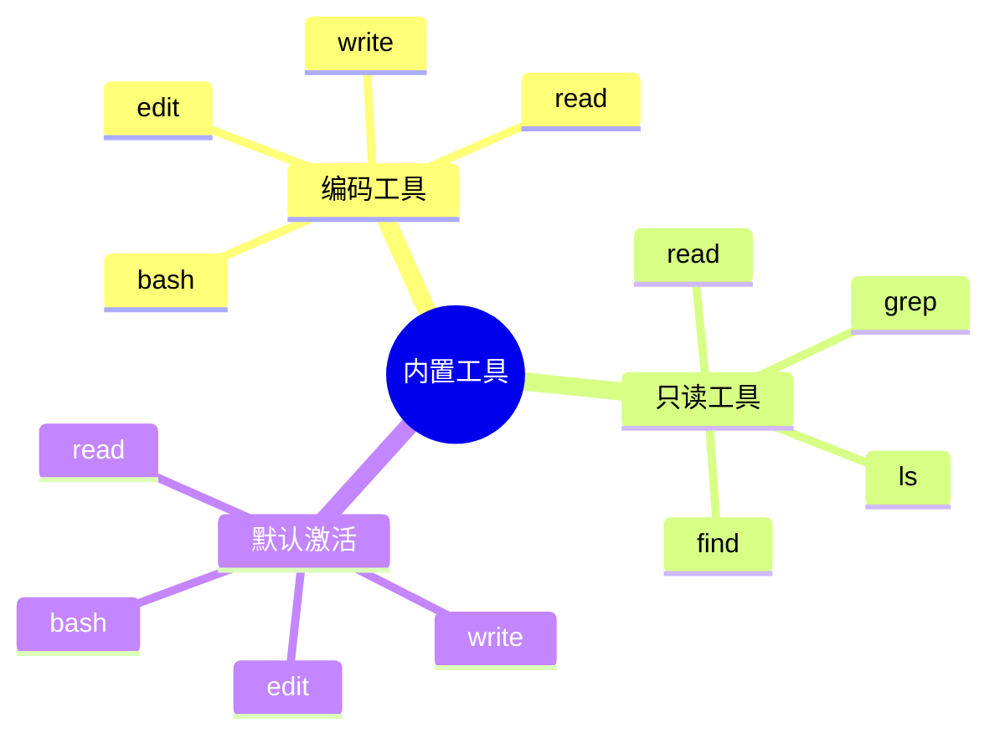
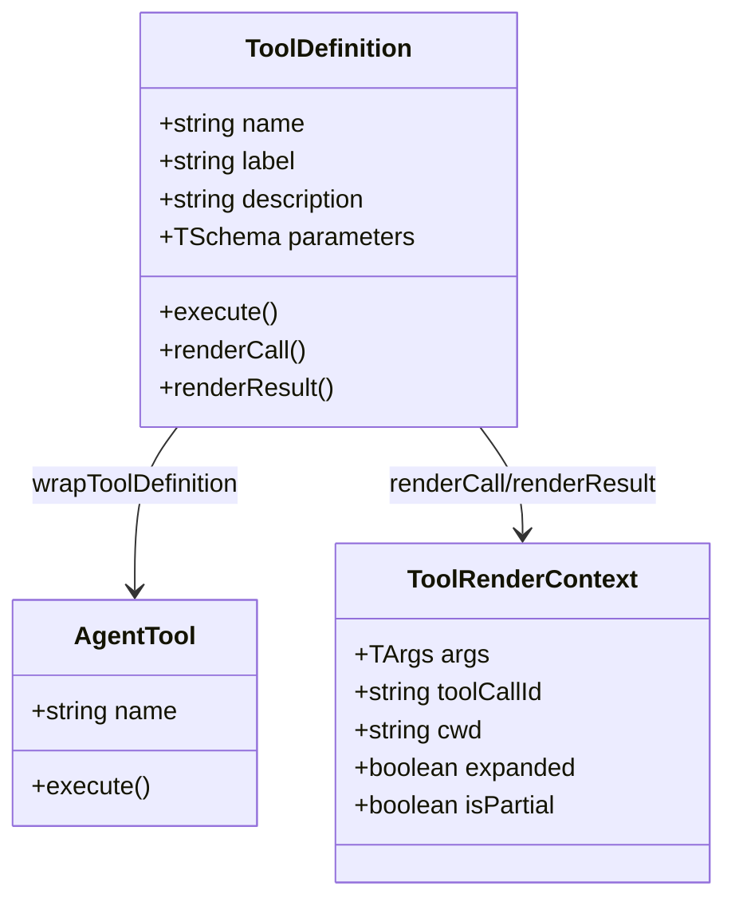
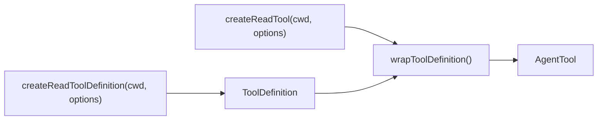
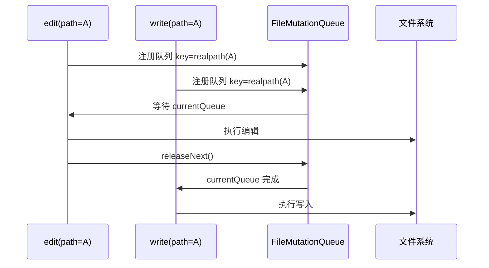
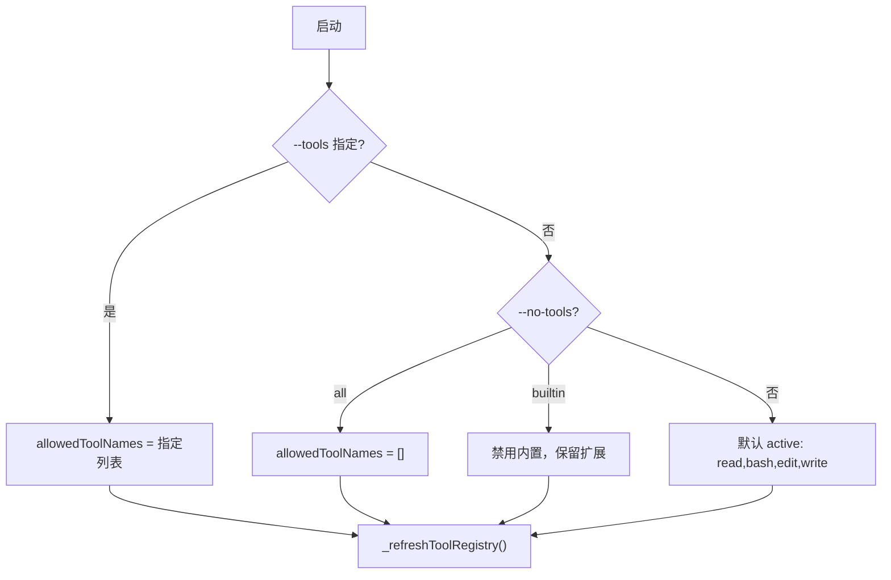
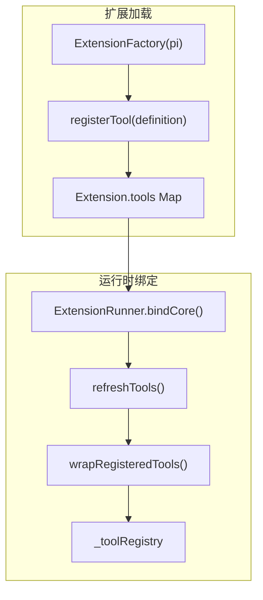
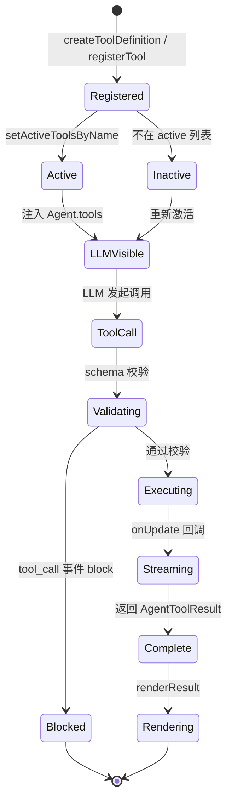
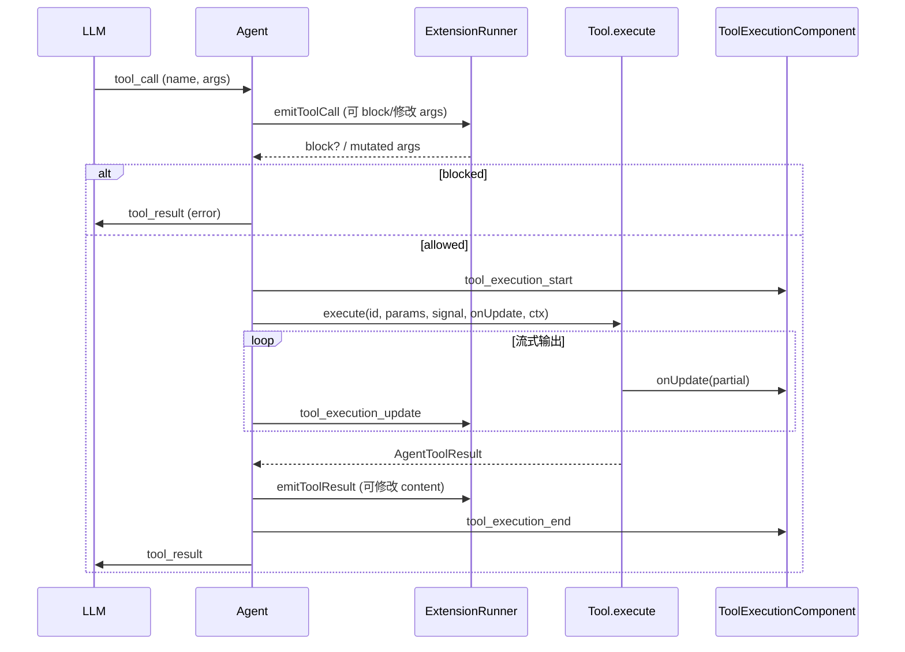
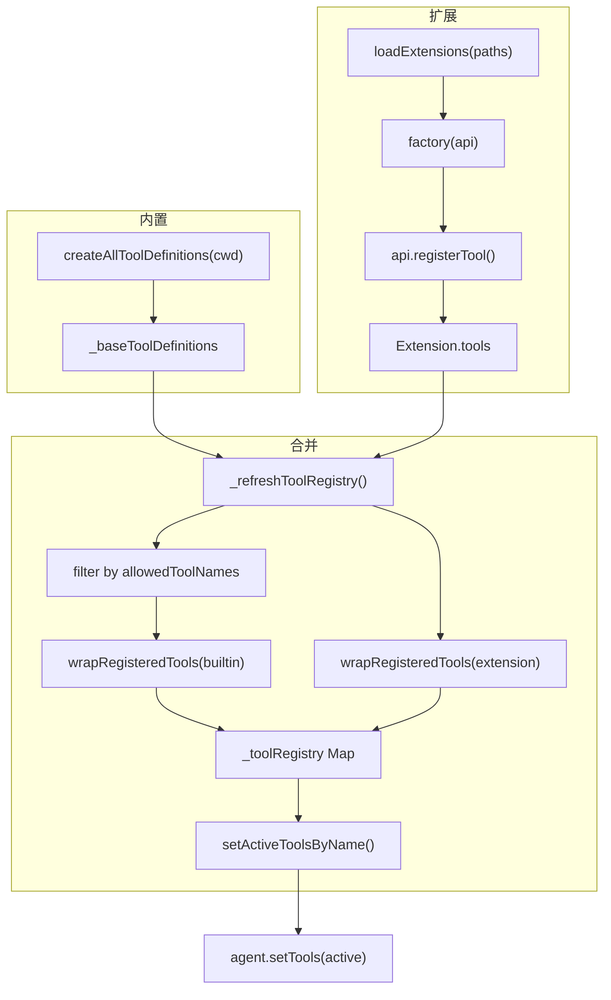

# 工具系统

Pi 的工具系统位于 `packages/coding-agent/src/core/tools/`，为 LLM 提供可调用的能力：读文件、执行命令、编辑代码、搜索目录等。工具以 **ToolDefinition** 为统一抽象，经 **AgentTool** 包装后接入 `pi-agent-core` 运行时。

## 架构概览



## 七种内置工具

| 工具 | 用途 | 默认激活 |
|------|------|----------|
| `read` | 读取文件内容（支持行范围、图片） | 是 |
| `bash` | 执行 shell 命令 | 是 |
| `edit` | 对文件做 search/replace 编辑 | 是 |
| `write` | 写入或覆盖文件 | 是 |
| `grep` | 在文件中搜索正则模式 | 否 |
| `find` | 按 glob 查找文件 | 否 |
| `ls` | 列出目录内容 | 否 |

默认激活集由 `createCodingToolDefinitions()` / `createCodingTools()` 定义，仅包含 **read、bash、edit、write** 四个编码工具。只读工具集 `createReadOnlyToolDefinitions()` 包含 read、grep、find、ls。



## ToolDefinition 接口

扩展与内置工具共享 `ToolDefinition` 接口（定义于 `extensions/types.ts`）：

```typescript
interface ToolDefinition<TParams, TDetails, TState> {
  name: string;           // LLM 调用名
  label: string;          // UI 显示名
  description: string;    // LLM 描述
  parameters: TParams;    // TypeBox schema
  promptSnippet?: string; // 系统提示词中的单行摘要
  promptGuidelines?: string[];
  renderShell?: "default" | "self";
  prepareArguments?: (args: unknown) => Static<TParams>;
  executionMode?: "sequential" | "parallel";
  execute(toolCallId, params, signal, onUpdate, ctx): Promise<AgentToolResult>;
  renderCall?(args, theme, context): Component;
  renderResult?(result, options, theme, context): Component;
}
```

| 成员 | 作用 |
|------|------|
| `parameters` | TypeBox schema，定义 LLM 可见的参数结构 |
| `execute` | 实际执行逻辑，接收 `ExtensionContext` |
| `renderCall` | TUI 中工具调用行的自定义渲染 |
| `renderResult` | TUI 中工具结果行的自定义渲染 |
| `executionMode` | 覆盖默认并行/串行执行策略 |



## 工具创建模式

每个内置工具遵循 **双工厂函数** 模式：



- **`createXxxToolDefinition()`**：返回完整 `ToolDefinition`（含 schema、execute、renderCall、renderResult）
- **`createXxxTool()`**：调用 definition 工厂 + `wrapToolDefinition()`，返回 `AgentTool`

聚合入口在 `tools/index.ts`：

- `createToolDefinition(toolName, cwd)` / `createTool(toolName, cwd)` — 按名称创建单个工具
- `createAllToolDefinitions(cwd)` — 全部 7 个工具的 Record
- `createCodingToolDefinitions(cwd)` — 默认 4 个编码工具

每个工具还支持 **可插拔 Operations**（如 `ReadOperations`、`BashOperations`），便于扩展或测试时替换底层实现（例如 SSH 远程文件系统）。

## FileMutationQueue

`edit` 和 `write` 通过 `withFileMutationQueue()` 序列化对同一文件的变更：



机制要点：

- 按 **realpath** 作为队列 key，不同文件并行、同文件串行
- 全局 `registrationQueue` 保证注册顺序，避免竞态
- 队列链式 Promise：前一个操作完成后才执行下一个

## CLI 工具配置

| 标志 | 缩写 | 效果 |
|------|------|------|
| `--tools read,grep,ls` | `-t` | 显式 allowlist，仅启用列出的工具 |
| `--no-tools` | `-nt` | 禁用所有工具（内置 + 扩展） |
| `--no-builtin-tools` | `-nbt` | 禁用内置工具，保留扩展/自定义工具 |

SDK 层（`sdk.ts`）解析逻辑：



`AgentSession._refreshToolRegistry()` 合并内置工具、扩展工具和 CLI allowlist，最终通过 `setActiveToolsByName()` 同步到 Agent。

## 扩展工具注册

扩展通过 `ExtensionAPI.registerTool()` 注册自定义工具：



注册流程：

1. 扩展工厂函数调用 `pi.registerTool(toolDefinition)`
2. 工具存入 `Extension.tools` Map（含 `sourceInfo` 溯源）
3. `refreshTools()` 触发 `AgentSession._refreshToolRegistry()`
4. 扩展工具经 `wrapRegisteredTools()` 包装，与内置工具合并
5. 新注册的扩展工具默认自动加入 active 列表（除非被 allowlist 限制）

扩展工具可覆盖同名内置工具（后加载者优先）。

## 工具生命周期



## 工具执行流



执行阶段扩展介入点：

| 事件 | 时机 | 能力 |
|------|------|------|
| `tool_call` | 执行前 | `block` 阻止；就地修改 `event.input` |
| `tool_execution_start/update/end` | 执行中/后 | 观察，不可修改 |
| `tool_result` | 返回后 | 修改 `content`、`details`、`isError` |

## 工具注册流



## 关键源文件

| 文件 | 职责 |
|------|------|
| `tools/index.ts` | 工具聚合、工厂函数、类型导出 |
| `tools/tool-definition-wrapper.ts` | ToolDefinition ↔ AgentTool 转换 |
| `tools/file-mutation-queue.ts` | 文件变更串行化 |
| `tools/read.ts` … `ls.ts` | 各内置工具实现 |
| `extensions/types.ts` | ToolDefinition 接口定义 |
| `agent-session.ts` | 工具注册表、active 工具管理 |
| `cli/args.ts` | CLI 工具标志解析 |
