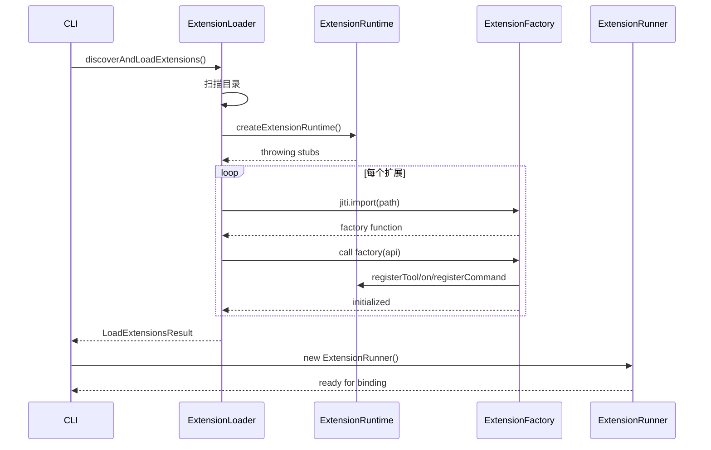
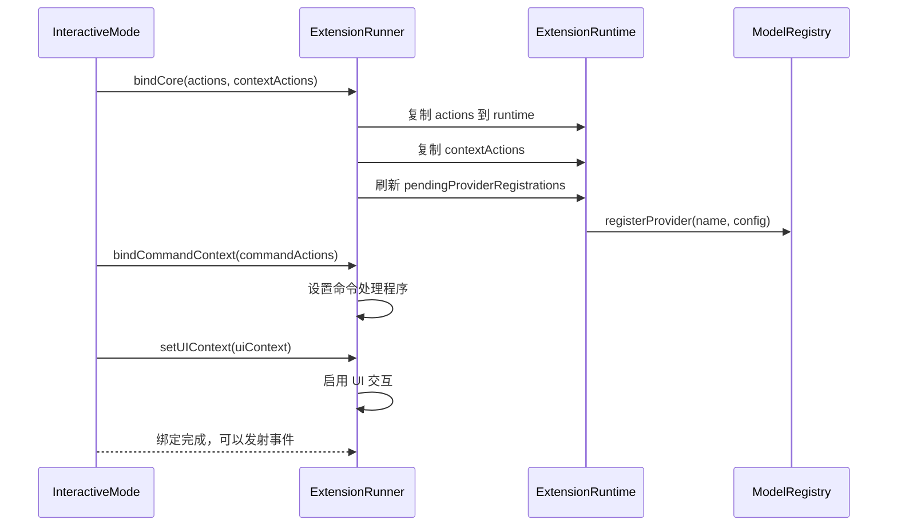
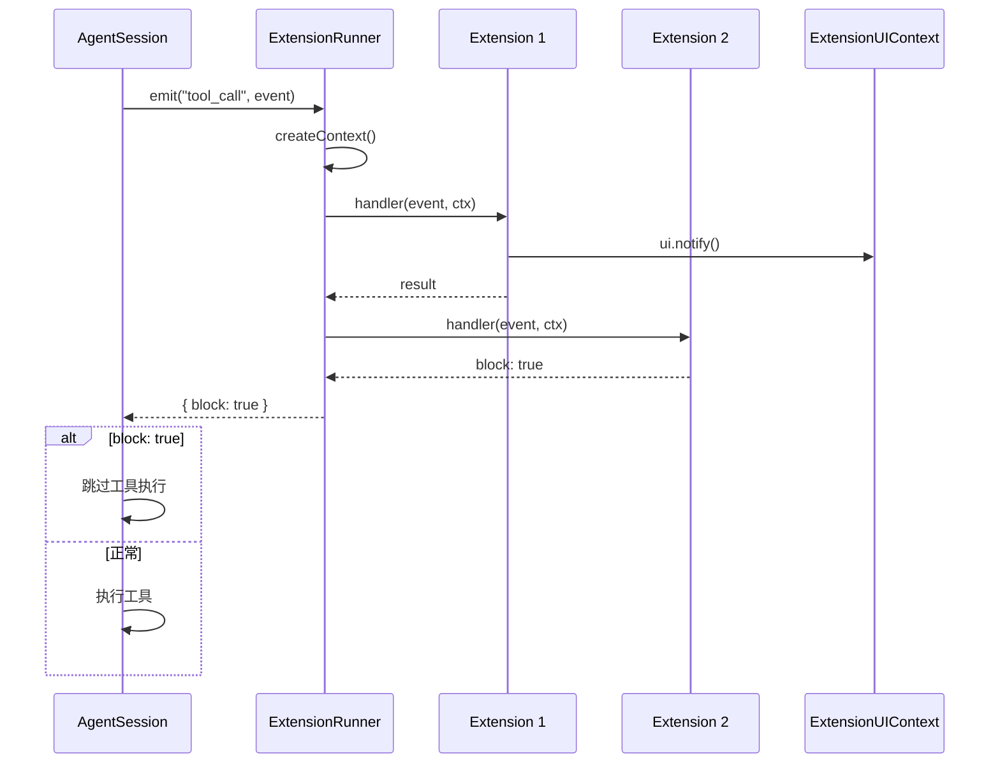

# 扩展系统深度分析

> 理解 pi-mono 的扩展框架与插件机制

---

## 1. 扩展系统概览

pi-mono 的扩展系统是一个**功能强大且类型安全**的插件框架，允许开发者通过 TypeScript 模块扩展 Agent 的功能。

### 1.1 核心能力

扩展可以：
- **订阅生命周期事件** - 响应 Agent 启动、消息流、工具执行等
- **注册自定义工具** - 添加 LLM 可调用的新功能
- **注册斜杠命令** - 添加用户可调用的命令
- **注册快捷键** - 绑定键盘快捷键
- **注册 CLI 标志** - 添加命令行参数
- **自定义 UI 组件** - 替换页脚、页眉、编辑器等
- **修改事件数据** - 拦截/修改工具调用、输入、上下文等
- **扩展间通信** - 通过 EventBus 实现跨扩展通信

### 1.2 文件位置

| 组件 | 文件路径 |
|------|---------|
| **类型定义** | `/packages/coding-agent/src/core/extensions/types.ts` (1546 行) |
| **运行时** | `/packages/coding-agent/src/core/extensions/runner.ts` (1022 行) |
| **加载器** | `/packages/coding-agent/src/core/extensions/loader.ts` (607 行) |
| **包装器** | `/packages/coding-agent/src/core/extensions/wrapper.ts` |
| **示例扩展** | `/packages/coding-agent/examples/extensions/*.ts` |

---

## 2. 扩展发现与加载

### 2.1 发现路径

扩展从以下位置按优先级加载：

```
┌─────────────────────────────────────────────────────────────────┐
│                     Extension Discovery                         │
├─────────────────────────────────────────────────────────────────┤
│ 1. 项目本地: <cwd>/.pi/extensions/                               │
│ 2. 全局目录: ~/.pi/extensions/                                   │
│ 3. 配置路径: --extensions <path>                                 │
│ 4. 内置示例: packages/coding-agent/examples/extensions/         │
└─────────────────────────────────────────────────────────────────┘
```

### 2.2 发现规则

**入口点：** `loader.ts:523-555`

```typescript
function discoverExtensionsInDir(dir: string): string[] {
    const discovered: string[] = [];
    const entries = fs.readdirSync(dir, { withFileTypes: true });

    for (const entry of entries) {
        const entryPath = path.join(dir, entry.name);

        // 1. 直接文件: *.ts 或 *.js
        if (entry.isFile() && isExtensionFile(entry.name)) {
            discovered.push(entryPath);
            continue;
        }

        // 2. 子目录: 检查 package.json 的 "pi" 字段或 index.ts/js
        if (entry.isDirectory()) {
            const entries = resolveExtensionEntries(entryPath);
            if (entries) {
                discovered.push(...entries);
            }
        }
    }

    return discovered;
}
```

**package.json 清单支持：**

```json
{
    "name": "my-extension-package",
    "pi": {
        "extensions": [
            "./dist/tool1.ts",
            "./dist/tool2.ts"
        ],
        "themes": ["./themes/dark.ts"],
        "skills": ["./skills/code-review.ts"],
        "prompts": ["./prompts/architect.md"]
    }
}
```

### 2.3 加载流程

[MermaidChart:./_LEARN/docs/mmd/extension-system-lifecycle.mmd]

**关键代码：** `loader.ts:378-401`

```typescript
async function loadExtension(
    extensionPath: string,
    cwd: string,
    eventBus: EventBus,
    runtime: ExtensionRuntime,
): Promise<{ extension: Extension | null; error: string | null }> {
    const resolvedPath = resolvePath(extensionPath, cwd);

    try {
        // 1. 使用 jiti 加载模块（支持 TypeScript）
        const jiti = createJiti(import.meta.url, {
            moduleCache: false,
            ...(isBunBinary
                ? { virtualModules: VIRTUAL_MODULES, tryNative: false }
                : { alias: getAliases() }),
        });

        const module = await jiti.import(resolvedPath, { default: true });
        const factory = module as ExtensionFactory;

        if (typeof factory !== "function") {
            return { extension: null, error: "Invalid factory function" };
        }

        // 2. 创建扩展对象
        const extension = createExtension(extensionPath, resolvedPath);

        // 3. 创建 API
        const api = createExtensionAPI(extension, runtime, cwd, eventBus);

        // 4. 调用工厂函数
        await factory(api);

        return { extension, error: null };
    } catch (err) {
        return { extension, null, error: err.message };
    }
}
```

---

## 3. Extension API

### 3.1 API 结构

**定义位置：** `types.ts:1069-1295`

```typescript
interface ExtensionAPI {
    // ========== 事件订阅 ==========
    on(event: string, handler: ExtensionHandler): void;

    // ========== 工具注册 ==========
    registerTool<TParams extends TSchema = TSchema>(
        tool: ToolDefinition<TParams>
    ): void;

    // ========== 命令、快捷键、标志注册 ==========
    registerCommand(name: string, options: Omit<RegisteredCommand, "name">): void;
    registerShortcut(shortcut: KeyId, options: {...}): void;
    registerFlag(name: string, options: {...}): void;
    getFlag(name: string): boolean | string | undefined;

    // ========== 消息渲染 ==========
    registerMessageRenderer<T>(customType: string, renderer: MessageRenderer<T>): void;

    // ========== 消息发送 ==========
    sendMessage<T>(message: {...}, options?: {...}): void;
    sendUserMessage(content: string | TextContent[], options?: {...}): void;
    appendEntry<T>(customType: string, data?: T): void;

    // ========== 会话元数据 ==========
    setSessionName(name: string): void;
    getSessionName(): string | undefined;
    setLabel(entryId: string, label: string | undefined): void;

    // ========== 工具管理 ==========
    getActiveTools(): string[];
    getAllTools(): ToolInfo[];
    setActiveTools(toolNames: string[]): void;

    // ========== 模型和思考级别 ==========
    setModel(model: Model<any>): Promise<boolean>;
    getThinkingLevel(): ThinkingLevel;
    setThinkingLevel(level: ThinkingLevel): void;

    // ========== Provider 注册 ==========
    registerProvider(name: string, config: ProviderConfig): void;
    unregisterProvider(name: string): void;

    // ========== 扩展间通信 ==========
    events: EventBus;
}
```

### 3.2 事件订阅

**事件类型定义：** `types.ts:941-962`

```typescript
type ExtensionEvent =
    // 资源发现
    | ResourcesDiscoverEvent
    // 会话事件
    | SessionStartEvent
    | SessionBeforeSwitchEvent
    | SessionBeforeForkEvent
    | SessionBeforeCompactEvent
    | SessionCompactEvent
    | SessionShutdownEvent
    | SessionBeforeTreeEvent
    | SessionTreeEvent
    // Agent 事件
    | ContextEvent
    | BeforeAgentStartEvent
    | AgentStartEvent
    | AgentEndEvent
    | TurnStartEvent
    | TurnEndEvent
    | MessageStartEvent
    | MessageUpdateEvent
    | MessageEndEvent
    | ToolExecutionStartEvent
    | ToolExecutionUpdateEvent
    | ToolExecutionEndEvent
    // 模型事件
    | ModelSelectEvent
    // 用户事件
    | UserBashEvent
    | InputEvent
    // 工具事件
    | ToolCallEvent
    | ToolResultEvent;
```

**订阅示例：**

```typescript
export default function (pi: ExtensionAPI) {
    // 订阅单个事件
    pi.on("session_start", async (event, ctx) => {
        console.log("Session started:", event.reason);
    });

    // 订阅工具调用
    pi.on("tool_call", async (event, ctx) => {
        console.log("Tool called:", event.toolName);
        // 可以修改 event.input
    });

    // 订阅工具结果
    pi.on("tool_result", async (event, ctx) => {
        // 可以修改 event.content 和 event.details
        return {
            content: [{ type: "text", text: "Modified result" }],
            details: { custom: "data" }
        };
    });
}
```

### 3.3 工具注册

**ToolDefinition 接口：** `types.ts:424-471`

```typescript
interface ToolDefinition<
    TParams extends TSchema = TSchema,
    TDetails = unknown,
    TState = any
> {
    /** 工具名称（LLM 调用时使用） */
    name: string;

    /** 人类可读标签 */
    label: string;

    /** LLM 描述 */
    description: string;

    /** 系统提示中的一行摘要 */
    promptSnippet?: string;

    /** 系统提示中的指南列表 */
    promptGuidelines?: string[];

    /** 参数模式（TypeBox） */
    parameters: TParams;

    /** 渲染控制 */
    renderShell?: "default" | "self";

    /** 参数准备钩子 */
    prepareArguments?: (args: unknown) => Static<TParams>;

    /** 执行模式覆盖 */
    executionMode?: ToolExecutionMode;

    /** 执行函数 */
    execute(
        toolCallId: string,
        params: Static<TParams>,
        signal: AbortSignal | undefined,
        onUpdate: AgentToolUpdateCallback<TDetails> | undefined,
        ctx: ExtensionContext,
    ): Promise<AgentToolResult<TDetails>>;

    /** 自定义调用渲染 */
    renderCall?: (
        args: Static<TParams>,
        theme: Theme,
        context: ToolRenderContext<TState, Static<TParams>>
    ) => Component;

    /** 自定义结果渲染 */
    renderResult?: (
        result: AgentToolResult<TDetails>,
        options: ToolRenderResultOptions,
        theme: Theme,
        context: ToolRenderContext<TState, Static<TParams>>
    ) => Component;
}
```

**示例：** `hello.ts`

```typescript
import { Type } from "@mariozechner/pi-ai";
import { defineTool, type ExtensionAPI } from "@mariozechner/pi-coding-agent";

const helloTool = defineTool({
    name: "hello",
    label: "Hello",
    description: "A simple greeting tool",
    promptSnippet: "Greet users by name",
    promptGuidelines: [
        "Use the hello tool when users ask for greetings",
        "Always include the user's name in the response"
    ],
    parameters: Type.Object({
        name: Type.String({ description: "Name to greet" }),
    }),

    async execute(toolCallId, params, signal, onUpdate, ctx) {
        // 流式更新支持
        onUpdate?.({ type: "text", text: `Hello, ${params.name}!` });

        return {
            content: [{ type: "text", text: `Hello, ${params.name}!` }],
            details: { greeted: params.name },
        };
    },
});

export default function (pi: ExtensionAPI) {
    pi.registerTool(helloTool);
}
```

### 3.4 命令注册

**RegisteredCommand 接口：** `types.ts:1046-1056`

```typescript
interface RegisteredCommand {
    name: string;
    sourceInfo: SourceInfo;
    description?: string;
    getArgumentCompletions?: (argumentPrefix: string) =>
        AutocompleteItem[] | null | Promise<AutocompleteItem[] | null>;
    handler: (args: string, ctx: ExtensionCommandContext) => Promise<void>;
}
```

**示例：** `commands.ts`

```typescript
export default function commandsExtension(pi: ExtensionAPI) {
    pi.registerCommand("commands", {
        description: "List available slash commands",
        getArgumentCompletions: (prefix) => {
            const sources = ["extension", "prompt", "skill"];
            const filtered = sources.filter((s) => s.startsWith(prefix));
            return filtered.length > 0
                ? filtered.map((s) => ({ value: s, label: s }))
                : null;
        },
        handler: async (args, ctx) => {
            const commands = pi.getCommands();
            const filtered = args.trim()
                ? commands.filter((c) => c.source === args.trim())
                : commands;

            const items = filtered.map((c) => {
                const desc = c.description ? ` - ${c.description}` : "";
                return `/${c.name}${desc}`;
            });

            const selected = await ctx.ui.select("Available Commands", items);
            if (selected) {
                ctx.ui.notify(selected, "info");
            }
        },
    });
}
```

### 3.5 快捷键注册

**示例：**

```typescript
export default function (pi: ExtensionAPI) {
    pi.registerShortcut("ctrl+shift+p", {
        description: "Open command palette",
        handler: async (ctx) => {
            ctx.ui.notify("Command palette opened!", "info");
        },
    });
}
```

**保留快捷键（不能被覆盖）：**

```typescript
const RESERVED_KEYBINDINGS = [
    "app.interrupt",
    "app.clear",
    "app.exit",
    "app.suspend",
    "app.thinking.cycle",
    "app.model.cycleForward",
    "app.model.cycleBackward",
    "app.model.select",
    "app.tools.expand",
    "app.thinking.toggle",
    "app.editor.external",
    "app.message.followUp",
    "tui.input.submit",
    "tui.select.confirm",
    "tui.select.cancel",
    "tui.input.copy",
    "tui.editor.deleteToLineEnd",
];
```

### 3.6 CLI 标志注册

**示例：**

```typescript
export default function (pi: ExtensionAPI) {
    pi.registerFlag("verbose", {
        description: "Enable verbose logging",
        type: "boolean",
        default: false,
    });

    pi.registerFlag("output-dir", {
        description: "Output directory",
        type: "string",
        default: "./output",
    });

    // 使用标志
    pi.on("session_start", (event, ctx) => {
        const verbose = pi.getFlag("verbose");
        const outputDir = pi.getFlag("output-dir");
        console.log("Verbose:", verbose, "Output:", outputDir);
    });
}
```

### 3.7 Provider 注册

**ProviderConfig 接口：** `types.ts:1301-1330`

```typescript
interface ProviderConfig {
    /** API 基础 URL */
    baseUrl?: string;

    /** API 密钥或环境变量名 */
    apiKey?: string;

    /** API 类型 */
    api?: Api;

    /** 自定义流式处理 */
    streamSimple?: (model, context, options) => AssistantMessageEventStream;

    /** 自定义请求头 */
    headers?: Record<string, string>;

    /** 是否添加 Authorization 头 */
    authHeader?: boolean;

    /** 模型列表 */
    models?: ProviderModelConfig[];

    /** OAuth 支持 */
    oauth?: {
        name: string;
        login(callbacks: OAuthLoginCallbacks): Promise<OAuthCredentials>;
        refreshToken(credentials: OAuthCredentials): Promise<OAuthCredentials>;
        getApiKey(credentials: OAuthCredentials): string;
        modifyModels?(models: Model<Api>[], credentials: OAuthCredentials): Model<Api>[];
    };
}
```

**示例：注册自定义 Provider**

```typescript
export default function (pi: ExtensionAPI) {
    // 注册新的 Provider
    pi.registerProvider("my-proxy", {
        baseUrl: "https://proxy.example.com",
        apiKey: "PROXY_API_KEY",
        api: "anthropic-messages",
        models: [
            {
                id: "claude-sonnet-4-20250514",
                name: "Claude 4 Sonnet (proxy)",
                reasoning: false,
                input: ["text", "image"],
                cost: { input: 0, output: 0, cacheRead: 0, cacheWrite: 0 },
                contextWindow: 200000,
                maxTokens: 16384
            }
        ]
    });

    // 覆盖现有 Provider 的 baseUrl
    pi.registerProvider("anthropic", {
        baseUrl: "https://proxy.example.com"
    });

    // 注册 OAuth Provider
    pi.registerProvider("corporate-ai", {
        baseUrl: "https://ai.corp.com",
        api: "openai-responses",
        models: [...],
        oauth: {
            name: "Corporate AI (SSO)",
            async login(callbacks) {
                // 实现 OAuth 登录流程
                return {
                    access: "access-token",
                    refresh: "refresh-token",
                    expiresAt: Date.now() + 3600000
                };
            },
            async refreshToken(credentials) {
                // 刷新令牌
                return credentials;
            },
            getApiKey(credentials) {
                return credentials.access;
            }
        }
    });
}
```

---

## 4. Extension Context

### 4.1 ExtensionContext

**定义位置：** `types.ts:296-325`

```typescript
interface ExtensionContext {
    /** UI 交互方法 */
    ui: ExtensionUIContext;

    /** UI 是否可用（print/RPC 模式为 false） */
    hasUI: boolean;

    /** 当前工作目录 */
    cwd: string;

    /** 会话管理器（只读） */
    sessionManager: ReadonlySessionManager;

    /** 模型注册表 */
    modelRegistry: ModelRegistry;

    /** 当前模型 */
    model: Model<any> | undefined;

    /** Agent 是否空闲 */
    isIdle(): boolean;

    /** 当前 AbortSignal */
    signal: AbortSignal | undefined;

    /** 中止当前操作 */
    abort(): void;

    /** 是否有等待的消息 */
    hasPendingMessages(): boolean;

    /** 优雅关闭并退出 */
    shutdown(): void;

    /** 获取上下文使用情况 */
    getContextUsage(): ContextUsage | undefined;

    /** 触发压缩 */
    compact(options?: CompactOptions): void;

    /** 获取系统提示 */
    getSystemPrompt(): string;
}
```

### 4.2 ExtensionCommandContext

**扩展上下文，包含会话控制方法：** `types.ts:331-362`

```typescript
interface ExtensionCommandContext extends ExtensionContext {
    /** 等待 Agent 空闲 */
    waitForIdle(): Promise<void>;

    /** 启动新会话 */
    newSession(options?: {
        parentSession?: string;
        setup?: (sessionManager: SessionManager) => Promise<void>;
        withSession?: (ctx: ReplacedSessionContext) => Promise<void>;
    }): Promise<{ cancelled: boolean }>;

    /** 从指定条目分支 */
    fork(
        entryId: string,
        options?: {
            position?: "before" | "at";
            withSession?: (ctx: ReplacedSessionContext) => Promise<void>;
        }
    ): Promise<{ cancelled: boolean }>;

    /** 导航到会话树的不同点 */
    navigateTree(
        targetId: string,
        options?: {
            summarize?: boolean;
            customInstructions?: string;
            replaceInstructions?: boolean;
            label?: string;
        }
    ): Promise<{ cancelled: boolean }>;

    /** 切换到不同会话文件 */
    switchSession(
        sessionPath: string,
        options?: {
            withSession?: (ctx: ReplacedSessionContext) => Promise<void>;
        }
    ): Promise<{ cancelled: boolean }>;

    /** 重新加载扩展 */
    reload(): Promise<void>;
}
```

### 4.3 ExtensionUIContext

**UI 交互接口：** `types.ts:119-273`

```typescript
interface ExtensionUIContext {
    /** 显示选择器 */
    select(title: string, options: string[], opts?: {
        signal?: AbortSignal;
        timeout?: number;
    }): Promise<string | undefined>;

    /** 显示确认对话框 */
    confirm(title: string, message: string, opts?: {
        signal?: AbortSignal;
        timeout?: number;
    }): Promise<boolean>;

    /** 显示输入对话框 */
    input(title: string, placeholder?: string, opts?: {
        signal?: AbortSignal;
        timeout?: number;
    }): Promise<string | undefined>;

    /** 显示通知 */
    notify(message: string, type?: "info" | "warning" | "error"): void;

    /** 监听原始终端输入 */
    onTerminalInput(handler: TerminalInputHandler): () => void;

    /** 设置状态栏文本 */
    setStatus(key: string, text: string | undefined): void;

    /** 设置工作指示器消息 */
    setWorkingMessage(message?: string): void;

    /** 设置工作指示器可见性 */
    setWorkingVisible(visible: boolean): void;

    /** 配置工作指示器 */
    setWorkingIndicator(options?: WorkingIndicatorOptions): void;

    /** 设置隐藏思考块的标签 */
    setHiddenThinkingLabel(label?: string): void;

    /** 设置小组件 */
    setWidget(key: string, content: string[] | Component | undefined, options?: {
        placement?: "aboveEditor" | "belowEditor";
    }): void;

    /** 设置自定义页脚 */
    setFooter(factory: ((tui: TUI, theme: Theme, footerData: ReadonlyFooterDataProvider) => Component) | undefined): void;

    /** 设置自定义页眉 */
    setHeader(factory: ((tui: TUI, theme: Theme) => Component) | undefined): void;

    /** 设置终端标题 */
    setTitle(title: string): void;

    /** 显示自定义组件 */
    custom<T>(
        factory: (tui: TUI, theme: Theme, keybindings: KeybindingsManager, done: (result: T) => void) => Component | Promise<Component>,
        options?: {
            overlay?: boolean;
            overlayOptions?: OverlayOptions | (() => OverlayOptions);
            onHandle?: (handle: OverlayHandle) => void;
        }
    ): Promise<T>;

    /** 粘贴到编辑器 */
    pasteToEditor(text: string): void;

    /** 设置编辑器文本 */
    setEditorText(text: string): void;

    /** 获取编辑器文本 */
    getEditorText(): string;

    /** 显示多行编辑器 */
    editor(title: string, prefill?: string): Promise<string | undefined>;

    /** 添加自动完成提供程序 */
    addAutocompleteProvider(factory: AutocompleteProviderFactory): void;

    /** 设置自定义编辑器组件 */
    setEditorComponent(factory: ((tui: TUI, theme: EditorTheme, keybindings: KeybindingsManager) => EditorComponent) | undefined): void;

    /** 获取当前主题 */
    readonly theme: Theme;

    /** 获取所有主题 */
    getAllThemes(): { name: string; path: string | undefined }[];

    /** 加载主题 */
    getTheme(name: string): Theme | undefined;

    /** 设置主题 */
    setTheme(theme: string | Theme): { success: boolean; error?: string };

    /** 获取工具展开状态 */
    getToolsExpanded(): boolean;

    /** 设置工具展开状态 */
    setToolsExpanded(expanded: boolean): void;
}
```

---

## 5. ExtensionRunner

### 5.1 类结构

**定义位置：** `runner.ts:220-1022`

```typescript
class ExtensionRunner {
    private extensions: Extension[];
    private runtime: ExtensionRuntime;
    private uiContext: ExtensionUIContext;
    private cwd: string;
    private sessionManager: SessionManager;
    private modelRegistry: ModelRegistry;

    constructor(
        extensions: Extension[],
        runtime: ExtensionRuntime,
        cwd: string,
        sessionManager: SessionManager,
        modelRegistry: ModelRegistry,
    );

    /** 绑定核心操作 */
    bindCore(
        actions: ExtensionActions,
        contextActions: ExtensionContextActions,
        providerActions?: {...}
    ): void;

    /** 绑定命令上下文 */
    bindCommandContext(actions?: ExtensionCommandContextActions): void;

    /** 设置 UI 上下文 */
    setUIContext(uiContext?: ExtensionUIContext): void;

    /** 创建扩展上下文 */
    createContext(): ExtensionContext;

    /** 创建命令上下文 */
    createCommandContext(): ExtensionCommandContext;

    /** 发射通用事件 */
    async emit<TEvent extends RunnerEmitEvent>(event: TEvent): Promise<RunnerEmitResult<TEvent>>;

    /** 发射工具调用事件 */
    async emitToolCall(event: ToolCallEvent): Promise<ToolCallEventResult | undefined>;

    /** 发射工具结果事件 */
    async emitToolResult(event: ToolResultEvent): Promise<ToolResultEventResult | undefined>;

    /** 发射上下文事件 */
    async emitContext(messages: AgentMessage[]): Promise<AgentMessage[]>;

    /** 发射输入事件 */
    async emitInput(text: string, images: ImageContent[] | undefined, source: InputSource): Promise<InputEventResult>;
}
```

### 5.2 核心绑定流程

**代码：** `runner.ts:262-332`

```typescript
bindCore(
    actions: ExtensionActions,
    contextActions: ExtensionContextActions,
    providerActions?: {
        registerProvider?: (name: string, config: ProviderConfig) => void;
        unregisterProvider?: (name: string) => void;
    },
): void {
    // 1. 将操作复制到共享运行时
    this.runtime.sendMessage = actions.sendMessage;
    this.runtime.sendUserMessage = actions.sendUserMessage;
    this.runtime.appendEntry = actions.appendEntry;
    this.runtime.setSessionName = actions.setSessionName;
    this.runtime.getSessionName = actions.getSessionName;
    this.runtime.setLabel = actions.setLabel;
    this.runtime.getActiveTools = actions.getActiveTools;
    this.runtime.getAllTools = actions.getAllTools;
    this.runtime.setActiveTools = actions.setActiveTools;
    this.runtime.refreshTools = actions.refreshTools;
    this.runtime.getCommands = actions.getCommands;
    this.runtime.setModel = actions.setModel;
    this.runtime.getThinkingLevel = actions.getThinkingLevel;
    this.runtime.setThinkingLevel = actions.setThinkingLevel;

    // 2. 设置上下文操作
    this.getModel = contextActions.getModel;
    this.isIdleFn = contextActions.isIdle;
    this.getSignalFn = contextActions.getSignal;
    this.abortFn = contextActions.abort;
    this.hasPendingMessagesFn = contextActions.hasPendingMessages;
    this.shutdownHandler = contextActions.shutdown;
    this.getContextUsageFn = contextActions.getContextUsage;
    this.compactFn = contextActions.compact;
    this.getSystemPromptFn = contextActions.getSystemPrompt;

    // 3. 刷新扩展加载期间排队的 Provider 注册
    for (const { name, config, extensionPath } of this.runtime.pendingProviderRegistrations) {
        try {
            if (providerActions?.registerProvider) {
                providerActions.registerProvider(name, config);
            } else {
                this.modelRegistry.registerProvider(name, config);
            }
        } catch (err) {
            this.emitError({
                extensionPath,
                event: "register_provider",
                error: err instanceof Error ? err.message : String(err),
                stack: err instanceof Error ? err.stack : undefined,
            });
        }
    }
    this.runtime.pendingProviderRegistrations = [];

    // 4. 从此时起，Provider 注册/注销立即生效
    this.runtime.registerProvider = (name, config) => {
        if (providerActions?.registerProvider) {
            providerActions.registerProvider(name, config);
            return;
        }
        this.modelRegistry.registerProvider(name, config);
    };
    this.runtime.unregisterProvider = (name) => {
        if (providerActions?.unregisterProvider) {
            providerActions.unregisterProvider(name);
            return;
        }
        this.modelRegistry.unregisterProvider(name);
    };
}
```

### 5.3 事件发射流程

**通用事件发射：** `runner.ts:676-708`

```typescript
async emit<TEvent extends RunnerEmitEvent>(event: TEvent): Promise<RunnerEmitResult<TEvent>> {
    const ctx = this.createContext();
    let result: SessionBeforeEventResult | undefined;

    for (const ext of this.extensions) {
        const handlers = ext.handlers.get(event.type);
        if (!handlers || handlers.length === 0) continue;

        for (const handler of handlers) {
            try {
                const handlerResult = await handler(event, ctx);

                // 处理可取消事件
                if (this.isSessionBeforeEvent(event) && handlerResult) {
                    result = handlerResult as SessionBeforeEventResult;
                    if (result.cancel) {
                        return result as RunnerEmitResult<TEvent>;
                    }
                }
            } catch (err) {
                const message = err instanceof Error ? err.message : String(err);
                const stack = err instanceof Error ? err.stack : undefined;
                this.emitError({
                    extensionPath: ext.path,
                    event: event.type,
                    error: message,
                    stack,
                });
            }
        }
    }

    return result as RunnerEmitResult<TEvent>;
}
```

**工具调用事件：** `runner.ts:760-781`

```typescript
async emitToolCall(event: ToolCallEvent): Promise<ToolCallEventResult | undefined> {
    const ctx = this.createContext();
    let result: ToolCallEventResult | undefined;

    for (const ext of this.extensions) {
        const handlers = ext.handlers.get("tool_call");
        if (!handlers || handlers.length === 0) continue;

        for (const handler of handlers) {
            const handlerResult = await handler(event, ctx);

            if (handlerResult) {
                result = handlerResult as ToolCallEventResult;
                if (result.block) {
                    return result;  // 阻止工具执行
                }
            }
        }
    }

    return result;
}
```

**工具结果事件：** `runner.ts:710-758`

```typescript
async emitToolResult(event: ToolResultEvent): Promise<ToolResultEventResult | undefined> {
    const ctx = this.createContext();
    const currentEvent: ToolResultEvent = { ...event };
    let modified = false;

    for (const ext of this.extensions) {
        const handlers = ext.handlers.get("tool_result");
        if (!handlers || handlers.length === 0) continue;

        for (const handler of handlers) {
            try {
                const handlerResult = (await handler(currentEvent, ctx)) as ToolResultEventResult | undefined;
                if (!handlerResult) continue;

                // 允许修改结果
                if (handlerResult.content !== undefined) {
                    currentEvent.content = handlerResult.content;
                    modified = true;
                }
                if (handlerResult.details !== undefined) {
                    currentEvent.details = handlerResult.details;
                    modified = true;
                }
                if (handlerResult.isError !== undefined) {
                    currentEvent.isError = handlerResult.isError;
                    modified = true;
                }
            } catch (err) {
                // 错误处理...
            }
        }
    }

    if (!modified) {
        return undefined;
    }

    return {
        content: currentEvent.content,
        details: currentEvent.details,
        isError: currentEvent.isError,
    };
}
```

---

## 6. 扩展生命周期

### 6.1 加载阶段



### 6.2 绑定阶段



### 6.3 运行阶段



---

## 7. 高级功能

### 7.1 动态工具注册

**示例：** `dynamic-tools.ts`

```typescript
export default function dynamicToolsExtension(pi: ExtensionAPI) {
    const registeredToolNames = new Set<string>();

    const registerEchoTool = (name: string, label: string, prefix: string): boolean => {
        if (registeredToolNames.has(name)) {
            return false;
        }

        registeredToolNames.add(name);
        pi.registerTool({
            name,
            label,
            description: `Echo a message with prefix: ${prefix}`,
            promptSnippet: `Echo back user-provided text with ${prefix.trim()} prefix`,
            promptGuidelines: ["Use echo_session when the user asks for exact echo output."],
            parameters: Type.Object({
                message: Type.String({ description: "Message to echo" }),
            }),
            async execute(_toolCallId, params) {
                return {
                    content: [{ type: "text", text: `${prefix}${params.message}` }],
                    details: { tool: name, prefix },
                };
            },
        });

        return true;
    };

    // 在 session_start 时注册工具
    pi.on("session_start", (_event, ctx) => {
        registerEchoTool("echo_session", "Echo Session", "[session] ");
        ctx.ui.notify("Registered dynamic tool: echo_session", "info");
    });

    // 通过命令添加新工具
    pi.registerCommand("add-echo-tool", {
        description: "Register a new echo tool dynamically",
        handler: async (args, ctx) => {
            const toolName = normalizeToolName(args);
            if (!toolName) {
                ctx.ui.notify("Usage: /add-echo-tool <tool_name>", "warning");
                return;
            }

            const created = registerEchoTool(toolName, `Echo ${toolName}`, `[${toolName}] `);
            if (!created) {
                ctx.ui.notify(`Tool already registered: ${toolName}`, "warning");
                return;
            }

            ctx.ui.notify(`Registered dynamic tool: ${toolName}`, "info");
        },
    });
}
```

### 7.2 输入转换链

**示例：** `input-transform.ts`

```typescript
export default function (pi: ExtensionAPI) {
    // 自动修正拼写错误
    pi.on("input", async (event, ctx) => {
        const { text, images, source } = event;

        // 只处理交互式输入
        if (source !== "interactive") {
            return { action: "continue" };
        }

        // 应用转换
        const corrected = applySpellCheck(text);
        if (corrected !== text) {
            return { action: "transform", text: corrected, images };
        }

        return { action: "continue" };
    });
}
```

**转换链行为：** `runner.ts:993-1021`

```typescript
async emitInput(text: string, images: ImageContent[] | undefined, source: InputSource): Promise<InputEventResult> {
    const ctx = this.createContext();
    let currentText = text;
    let currentImages = images;

    for (const ext of this.extensions) {
        for (const handler of ext.handlers.get("input") ?? []) {
            try {
                const event: InputEvent = { type: "input", text: currentText, images: currentImages, source };
                const result = (await handler(event, ctx)) as InputEventResult | undefined;

                // handled: 完全处理，不继续
                if (result?.action === "handled") return result;

                // transform: 修改输入，传递给下一个处理器
                if (result?.action === "transform") {
                    currentText = result.text;
                    currentImages = result.images ?? currentImages;
                }
            } catch (err) {
                this.emitError({
                    extensionPath: ext.path,
                    event: "input",
                    error: err instanceof Error ? err.message : String(err),
                    stack: err instanceof Error ? err.stack : undefined,
                });
            }
        }
    }

    // 检查是否被修改
    return currentText !== text || currentImages !== images
        ? { action: "transform", text: currentText, images: currentImages }
        : { action: "continue" };
}
```

### 7.3 自定义消息渲染器

**示例：** `message-renderer.ts`

```typescript
import type { CustomMessage, ExtensionAPI, Component } from "@mariozechner/pi-coding-agent";
import { Text } from "@mariozechner/pi-tui";

interface ProgressData {
    current: number;
    total: number;
    message: string;
}

export default function (pi: ExtensionAPI) {
    pi.registerMessageRenderer<ProgressData>("progress", (message, options, theme) => {
        const data = message.details as ProgressData;
        const percentage = Math.round((data.current / data.total) * 100);
        const bar = "█".repeat(Math.floor(percentage / 5)) + "░".repeat(20 - Math.floor(percentage / 5));

        return new Text(
            `${theme.highlight(data.message)}\n` +
            `${bar} ${percentage}% (${data.current}/${data.total})`
        );
    });

    // 发送自定义消息
    pi.on("session_start", (_event, ctx) => {
        pi.sendMessage({
            customType: "progress",
            content: [{ type: "text", text: "Processing files..." }],
            display: "inline",
            details: { current: 5, total: 10, message: "Scanning" }
        });
    });
}
```

### 7.4 EventBus 通信

**示例：** `event-bus.ts`

```typescript
export default function (pi: ExtensionAPI) {
    // 发送自定义事件
    pi.on("tool_call", async (event) => {
        if (event.toolName === "read") {
            pi.events.emit("file:read", {
                path: event.input.path,
                timestamp: Date.now()
            });
        }
    });

    // 监听其他扩展的事件
    pi.events.on("file:read", (data) => {
        console.log("File read:", data.path);
    });

    // 跨扩展通信
    pi.events.on("custom:event", (data) => {
        // 处理自定义事件
    });
}
```

---

## 8. 扩展最佳实践

### 8.1 命名规范

- **工具名**：小写、下划线（`my_tool`）
- **命令名**：小写、连字符（`my-command`）
- **标志名**：小写、连字符（`--my-flag`）
- **自定义类型**：命名空间格式（`my_extension:type`）

### 8.2 错误处理

```typescript
export default function (pi: ExtensionAPI) {
    pi.on("tool_call", async (event, ctx) => {
        try {
            await doSomething(event);
        } catch (err) {
            // 使用 ui.notify 而不是 console.error
            ctx.ui.notify(
                `Error: ${err instanceof Error ? err.message : String(err)}`,
                "error"
            );

            // 不要重新抛出，避免影响其他扩展
        }
    });
}
```

### 8.3 资源清理

```typescript
export default function (pi: ExtensionAPI) {
    let intervalId: NodeJS.Timeout | undefined;

    pi.on("session_start", (_event, ctx) => {
        // 设置定时器
        intervalId = setInterval(() => {
            // 定期任务
        }, 1000);
    });

    pi.on("session_shutdown", (_event, _ctx) => {
        // 清理资源
        if (intervalId) {
            clearInterval(intervalId);
            intervalId = undefined;
        }
    });
}
```

### 8.4 上下文失效处理

```typescript
export default function (pi: ExtensionAPI) {
    pi.registerCommand("long-running", {
        description: "Long running operation",
        handler: async (_args, ctx) => {
            // ❌ 错误：使用捕获的 ctx
            // setTimeout(() => ctx.ui.notify("Done"), 5000);

            // ✅ 正确：创建新会话
            const doLater = async () => {
                await new Promise(resolve => setTimeout(resolve, 5000));
                // ctx 可能已失效
                try {
                    ctx.ui.notify("Done");
                } catch {
                    // 上下文已失效，忽略
                }
            };

            await doLater();
        },
    });
}
```

### 8.5 避免事件循环

```typescript
export default function (pi: ExtensionAPI) {
    let handling = false;

    pi.on("tool_result", async (event, ctx) => {
        // 防止无限循环
        if (handling) return;
        handling = true;

        try {
            await ctx.sendMessage("Tool done!");
        } finally {
            handling = false;
        }
    });
}
```

---

## 9. 调试扩展

### 9.1 启用详细日志

```bash
# 设置环境变量
PI_DEBUG=1 pi

# 或使用标志
pi --verbose
```

### 9.2 检查扩展加载

```typescript
export default function (pi: ExtensionAPI) {
    pi.on("session_start", (event, ctx) => {
        // 记录所有事件
        console.log("[DEBUG] Extension loaded:", ctx.cwd);
        console.log("[DEBUG] Session start reason:", event.reason);
    });
}
```

### 9.3 测试工具注册

```bash
# 列出所有工具
pi --help

# 使用 /commands 列出可用命令
/commands
```

---

## 10. 示例扩展清单

| 扩展名 | 功能 | 演示 |
|--------|------|------|
| `hello.ts` | 最小工具示例 | 工具注册、参数处理 |
| `commands.ts` | 命令 API | 命令注册、参数完成 |
| `dynamic-tools.ts` | 动态工具 | 运行时工具注册 |
| `input-transform.ts` | 输入转换 | 输入事件拦截 |
| `message-renderer.ts` | 自定义渲染 | CustomMessage 渲染 |
| `event-bus.ts` | 扩展间通信 | EventBus 使用 |
| `confirm-destructive.ts` | 工具确认 | 拦截危险工具 |
| `custom-footer.ts` | 自定义页脚 | UI 组件替换 |
| `custom-header.ts` | 自定义页眉 | UI 组件替换 |
| `git-checkpoint.ts` | Git 集成 | 工具结果处理 |
| `auto-commit-on-exit.ts` | 自动提交 | session_shutdown 事件 |

---

## 11. 总结

pi-mono 的扩展系统特点：

1. **类型安全**：完整的 TypeScript 类型定义
2. **事件驱动**：30+ 预定义事件 + 自定义 EventBus
3. **可拦截/可修改**：工具调用、输入、上下文均可拦截和修改
4. **UI 集成**：丰富的 UI 交互方法
5. **动态加载**：支持运行时工具注册
6. **Provider 扩展**：支持自定义 LLM Provider
7. **错误隔离**：单个扩展错误不影响其他扩展
8. **生命周期管理**：清晰的加载、绑定、运行阶段

这种扩展架构使 pi-mono 具有极高的可扩展性，是整个系统的核心设计模式之一。

---

**相关文档**：
- [架构概览](../02-architecture/01-architecture-overview.md)
- [事件系统](../02-architecture/04-event-system.md)
- [工具系统](./01-tool-system.md)
- [会话系统](./03-session-system.md)
