# 扩展系统

Pi 的扩展系统位于 `packages/coding-agent/src/core/extensions/`，允许 TypeScript 模块在运行时注入工具、命令、快捷键、Provider、UI 组件，并订阅 Agent 全生命周期事件。

## 架构概览

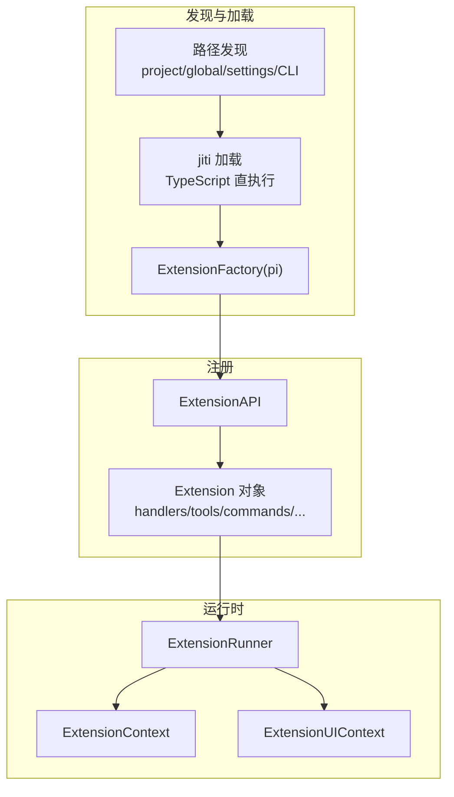

## 扩展发现路径

扩展从多个来源合并加载，**先加载者优先**（冲突时后加载覆盖）：

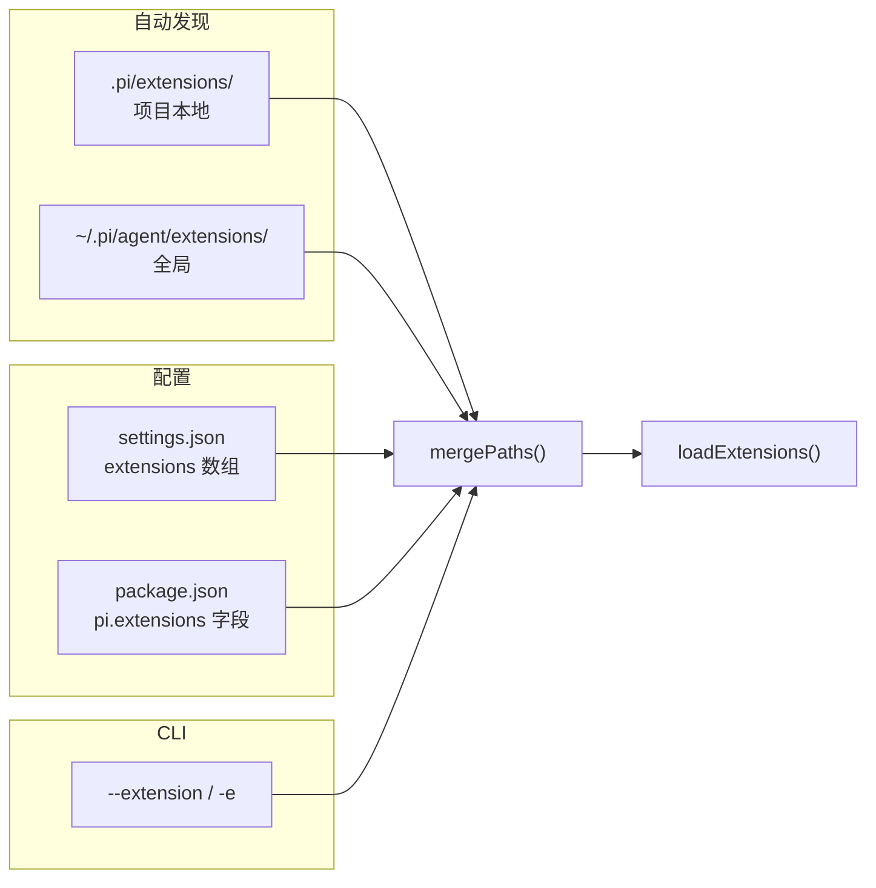

目录发现规则（`loader.ts`）：

1. **直接文件**：`extensions/*.ts` 或 `*.js`
2. **子目录 index**：`extensions/my-ext/index.ts`
3. **package.json 清单**：`extensions/my-ext/package.json` 中 `"pi": { "extensions": [...] }`

不递归超过一层；复杂包须用 manifest 声明入口。

`ResourceLoader` 还会解析 npm 包中的扩展路径，并与 settings 中启用的路径合并。`--no-extensions` 跳过 settings/自动发现，仅保留 CLI 指定的扩展。

## jiti 加载

扩展模块通过 **jiti** 直接执行 TypeScript，无需预编译：

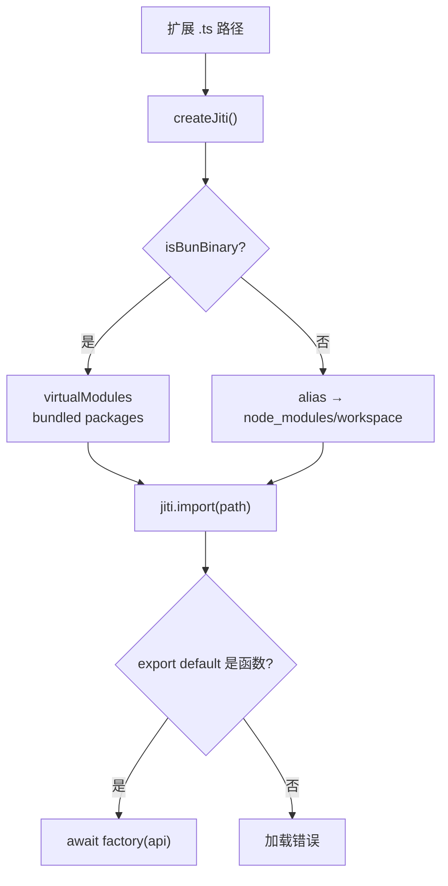

### Bun 二进制虚拟模块

编译为 Bun 单文件二进制时，扩展无法访问文件系统上的 `node_modules`。loader 通过 **virtualModules** 注入预打包依赖：

| 虚拟模块 | 实际包 |
|----------|--------|
| `typebox` / `@sinclair/typebox` | TypeBox |
| `@earendil-works/pi-agent-core` | Agent 核心 |
| `@earendil-works/pi-ai` | AI/模型层 |
| `@earendil-works/pi-tui` | TUI 组件 |
| `@earendil-works/pi-coding-agent` | 自身 SDK |

Node.js 开发模式则用 **alias** 解析到 workspace 或 `node_modules` 路径。

## ExtensionFactory

```typescript
type ExtensionFactory = (pi: ExtensionAPI) => void | Promise<void>;
```

扩展文件 **default export** 一个工厂函数，接收 `ExtensionAPI`，在加载时同步或异步注册能力：

```typescript
export default function (pi: ExtensionAPI) {
  pi.registerTool(myTool);
  pi.on("session_start", async (event, ctx) => { ... });
  pi.registerCommand("hello", { handler: async (args, ctx) => { ... } });
}
```

## ExtensionAPI 接口

`ExtensionAPI` 是扩展与 Pi 交互的唯一入口：

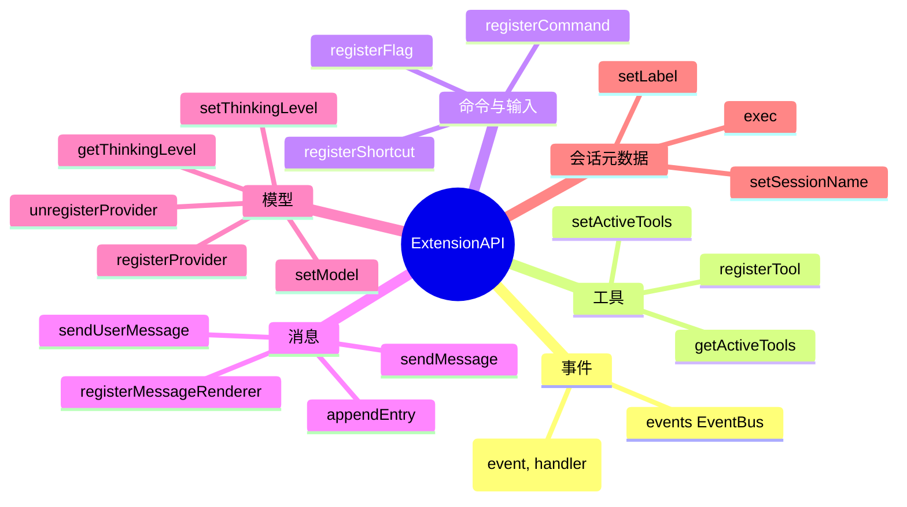

## ExtensionContext 与 ExtensionUIContext

### ExtensionContext

事件处理器和工具 `execute` 接收的上下文：

| 成员 | 说明 |
|------|------|
| `ui` | UI 交互方法（`ExtensionUIContext`） |
| `hasUI` | 是否有 UI（print/RPC 模式为 false） |
| `cwd` | 当前工作目录 |
| `sessionManager` | 只读会话管理器 |
| `modelRegistry` | 模型注册表（API key 解析） |
| `model` | 当前模型 |
| `isIdle()` / `signal` / `abort()` | Agent 状态控制 |
| `getContextUsage()` | 上下文 token 用量 |
| `compact()` | 触发压缩 |
| `getSystemPrompt()` | 当前系统提示词 |

### ExtensionCommandContext

命令处理器额外获得会话控制能力：

- `waitForIdle()` — 等待 Agent 停止流式输出
- `newSession()` / `fork()` / `navigateTree()` / `switchSession()` — 会话操作
- `reload()` — 热重载扩展/技能/主题

### ExtensionUIContext

交互模式下的 UI 原语：对话框（select/confirm/input）、通知、状态栏、working indicator、widget/footer/header 定制、编辑器替换、主题切换、工具输出展开控制等。

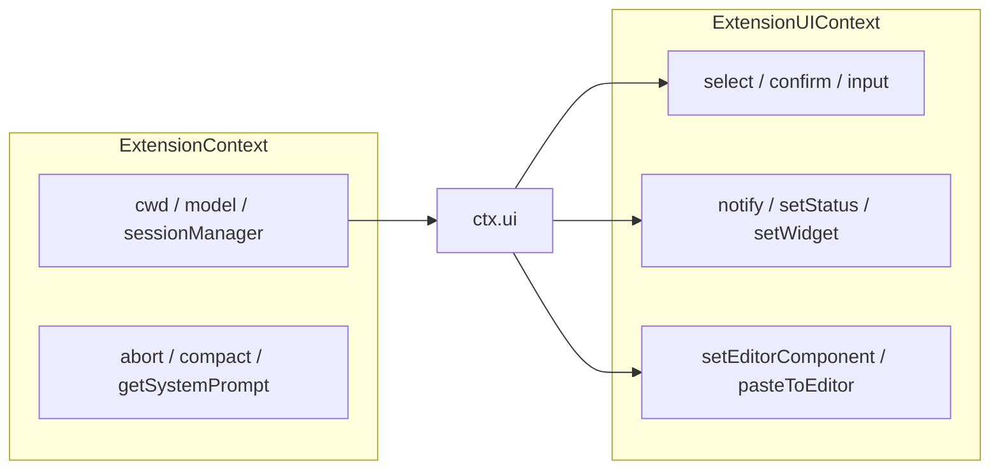

## 事件类型（按类别）

共 **29 种** `ExtensionEvent` 类型，按职责分组：

### 资源发现（1）

| 事件 | 说明 |
|------|------|
| `resources_discover` | 启动/reload 后，扩展可返回额外 skill/prompt/theme 路径 |

### 会话（8）

| 事件 | 可取消 | 说明 |
|------|--------|------|
| `session_start` | | 会话启动/加载/新建/fork/resume |
| `session_before_switch` | 是 | 切换会话前 |
| `session_before_fork` | 是 | fork 前 |
| `session_before_compact` | 是 | 压缩前（可自定义压缩结果） |
| `session_compact` | | 压缩完成 |
| `session_shutdown` | | 退出/reload/会话替换前 |
| `session_before_tree` | 是 | 树导航前（可自定义摘要） |
| `session_tree` | | 树导航完成 |

### Agent 与上下文（11）

| 事件 | 可修改 | 说明 |
|------|--------|------|
| `context` | messages | 每次 LLM 调用前 |
| `before_provider_request` | payload | 发送请求前 |
| `after_provider_response` | | 收到响应后 |
| `before_agent_start` | systemPrompt, message | 用户提交后、Agent 循环前 |
| `agent_start` / `agent_end` | | Agent 循环起止 |
| `turn_start` / `turn_end` | | 单轮起止 |
| `message_start/update/end` | message (end) | 消息流式生命周期 |
| `tool_execution_start/update/end` | | 工具执行观察 |

### 模型（2）

| 事件 | 说明 |
|------|------|
| `model_select` | 模型切换 |
| `thinking_level_select` | 思考级别切换 |

### 工具（2）

| 事件 | 可修改 | 说明 |
|------|--------|------|
| `tool_call` | input (就地), block | 工具执行前 |
| `tool_result` | content, details, isError | 工具执行后 |

### 用户输入（2）

| 事件 | 可修改 | 说明 |
|------|--------|------|
| `input` | transform / handled | 用户输入到达后 |
| `user_bash` | operations, result | `!` / `!!` 前缀 bash |

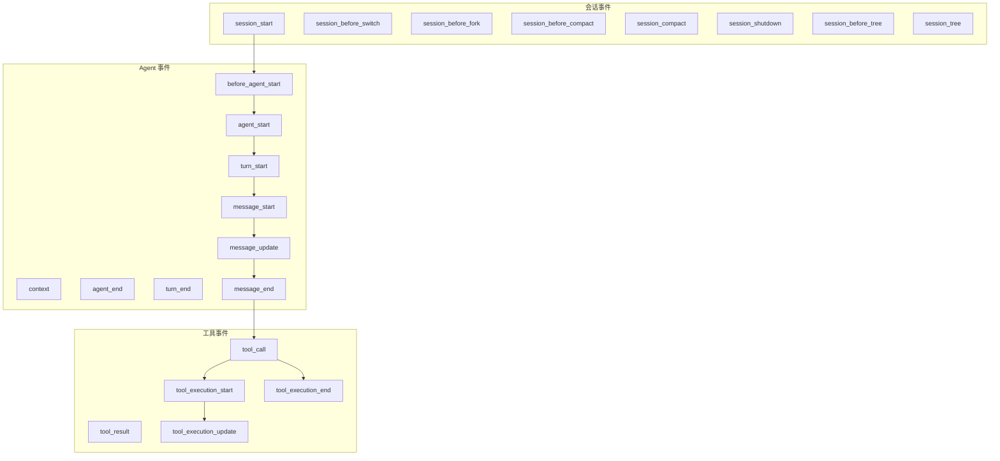

## 事件分发与结果合并

`ExtensionRunner` 按扩展加载顺序依次调用 handler，不同事件有不同的合并策略：

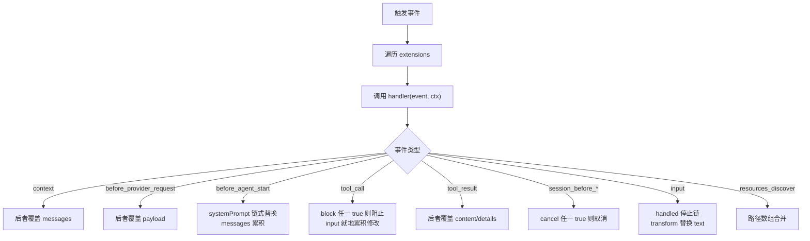

### 合并示例

**context 事件** — 顺序替换：

```typescript
// 扩展 A 返回 { messages: modifiedA }
// 扩展 B 返回 { messages: modifiedB }
// 最终 messages = modifiedB
```

**before_agent_start** — systemPrompt 链式、message 累积：

```typescript
// 扩展 A: { systemPrompt: "A" }
// 扩展 B: { systemPrompt: "B" }  → 最终 "B"
// 两者都返回 message → messages 数组包含两条
```

**tool_call** — 就地修改 args，后 handler 看到前者的 mutation：

```typescript
// 扩展 A: event.input.path = "/fixed"
// 扩展 B: 看到已修改的 input
// 任一返回 { block: true } → 工具不执行
```

Handler 错误被捕获并通过 `emitError()` 报告，不中断其他扩展。

## 扩展提供的能力

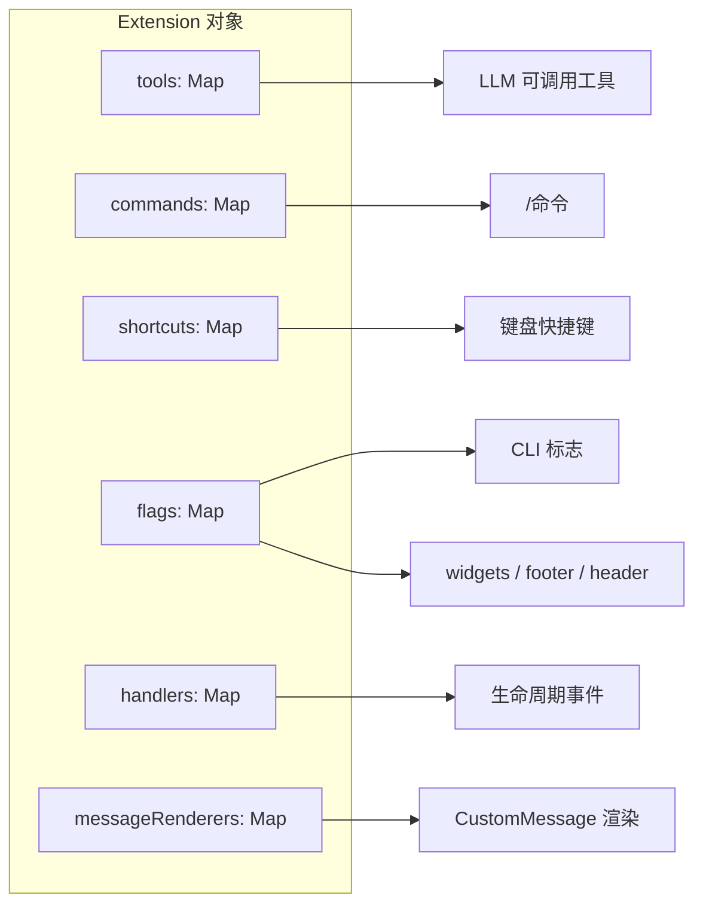

| 能力 | 注册 API | 运行时效果 |
|------|----------|------------|
| 工具 | `registerTool()` | LLM 工具列表 + TUI 渲染 |
| 命令 | `registerCommand()` | `/命令名` 斜杠命令 |
| 快捷键 | `registerShortcut()` | 键盘绑定（冲突检测） |
| CLI 标志 | `registerFlag()` | `--flag-name` 参数 |
| Widget | `ctx.ui.setWidget()` | 编辑器上下方面板 |
| Footer/Header | `ctx.ui.setFooter/setHeader()` | 自定义页眉页脚 |
| Provider | `registerProvider()` | 动态模型/端点/OAuth |

同名命令冲突时，后加载扩展获得带序号后缀的 invocation name（如 `deploy:2`）。

## 扩展生命周期

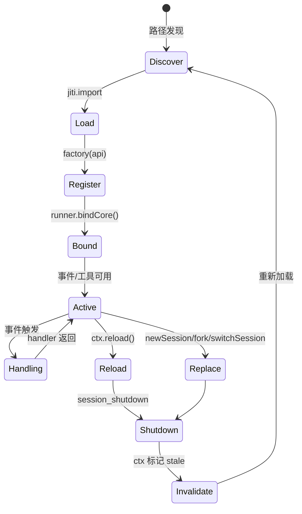

### Runtime 状态机

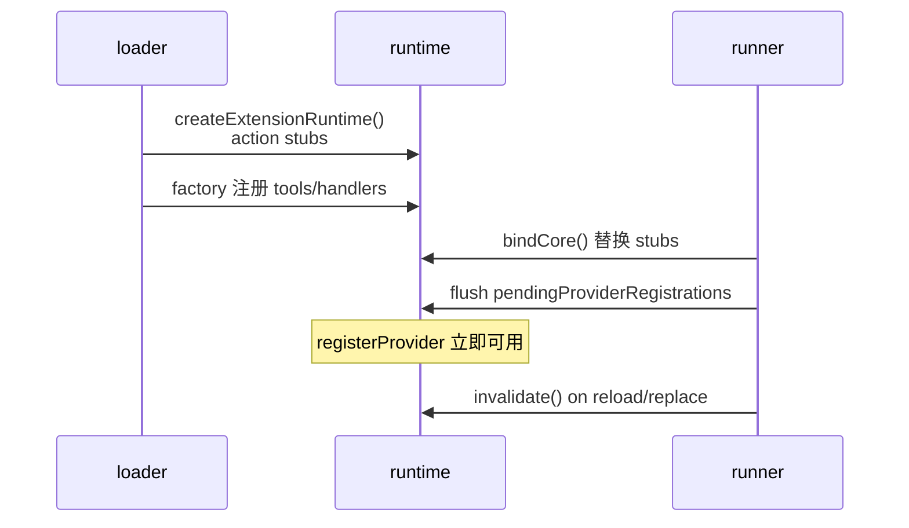

加载期间 `sendMessage` 等 action 方法抛出 "not initialized"；`registerTool` 和 `on` 在加载时即可用。`registerProvider` 在 bind 前排队，bind 后 flush 到 `ModelRegistry`。

## 事件流

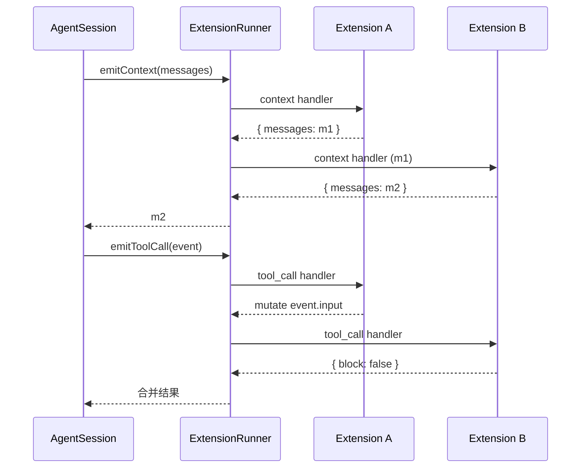

## 能力地图

```mermaid
graph TB
    subgraph "ExtensionAPI 能力"
        direction TB
        E["事件订阅 on()"]
        T["工具 registerTool()"]
        CMD["命令 registerCommand()"]
        SK["快捷键 registerShortcut()"]
        FL["标志 registerFlag()"]
        MSG["消息 sendMessage/sendUserMessage"]
        PRV["Provider registerProvider()"]
        MDL["模型 setModel/setThinkingLevel()"]
        SES["会话 setSessionName/setLabel/appendEntry"]
    end

    subgraph "ExtensionContext 能力"
        direction TB
        UI["UI ctx.ui.*"]
        ABORT["abort/compact"]
        SYS["getSystemPrompt/getContextUsage"]
        SM["sessionManager 只读"]
    end

    subgraph "ExtensionCommandContext 额外"
        direction TB
        WAIT["waitForIdle"]
        NEW["newSession/fork/navigateTree"]
        SW["switchSession/reload"]
    end

    E --> RUNTIME["ExtensionRunner 分发"]
    T --> AGENT["Agent 工具注册表"]
    CMD --> SLASH["斜杠命令解析"]
    PRV --> MR["ModelRegistry"]
    UI --> TUI["Interactive Mode TUI"]
```

## 关键源文件

| 文件 | 职责 |
|------|------|
| `extensions/types.ts` | 全部类型定义、ExtensionAPI |
| `extensions/loader.ts` | jiti 加载、路径发现、ExtensionAPI 实现 |
| `extensions/runner.ts` | 事件分发、结果合并、生命周期 |
| `extensions/wrapper.ts` | 扩展工具包装 |
| `extensions/index.ts` | 公共导出 |
| `resource-loader.ts` | 扩展路径解析与 settings 集成 |
