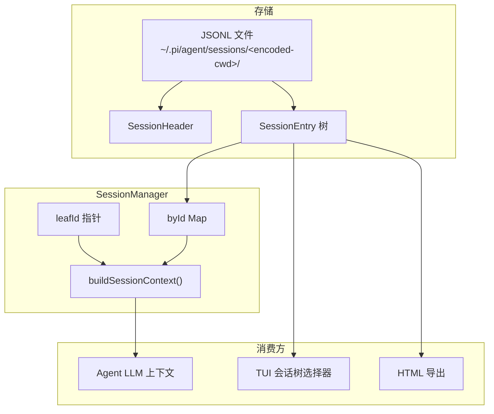
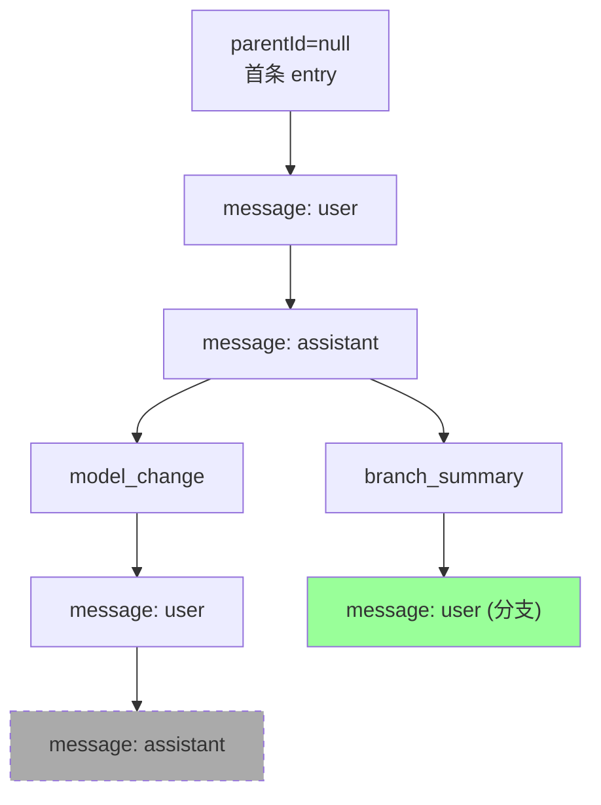
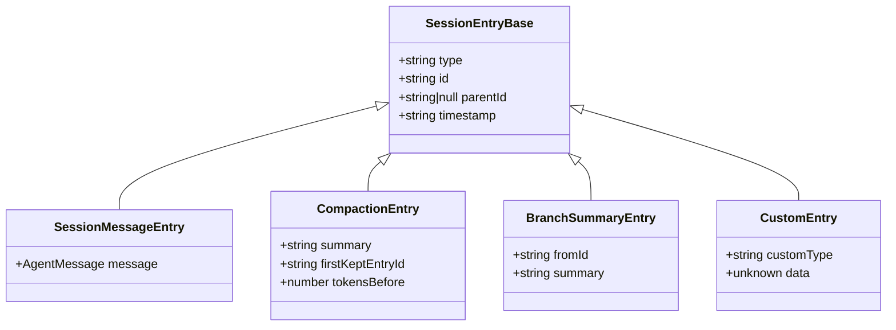
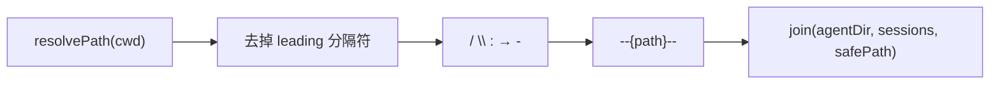
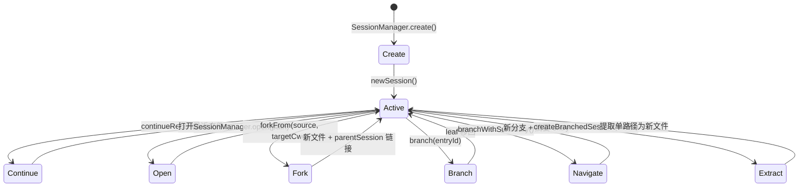
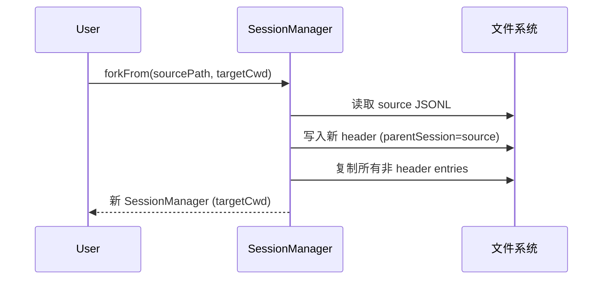
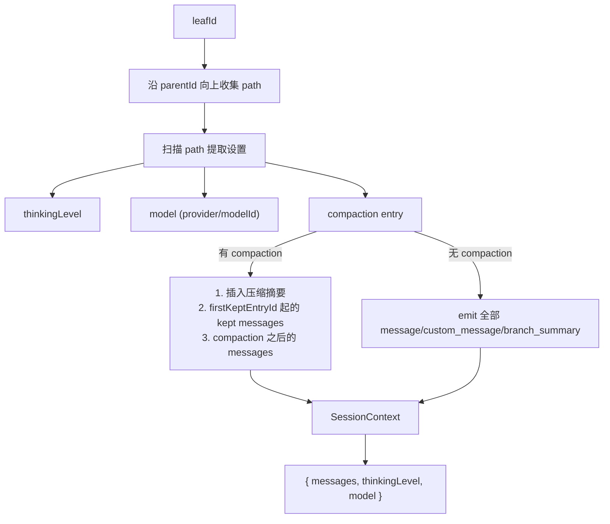
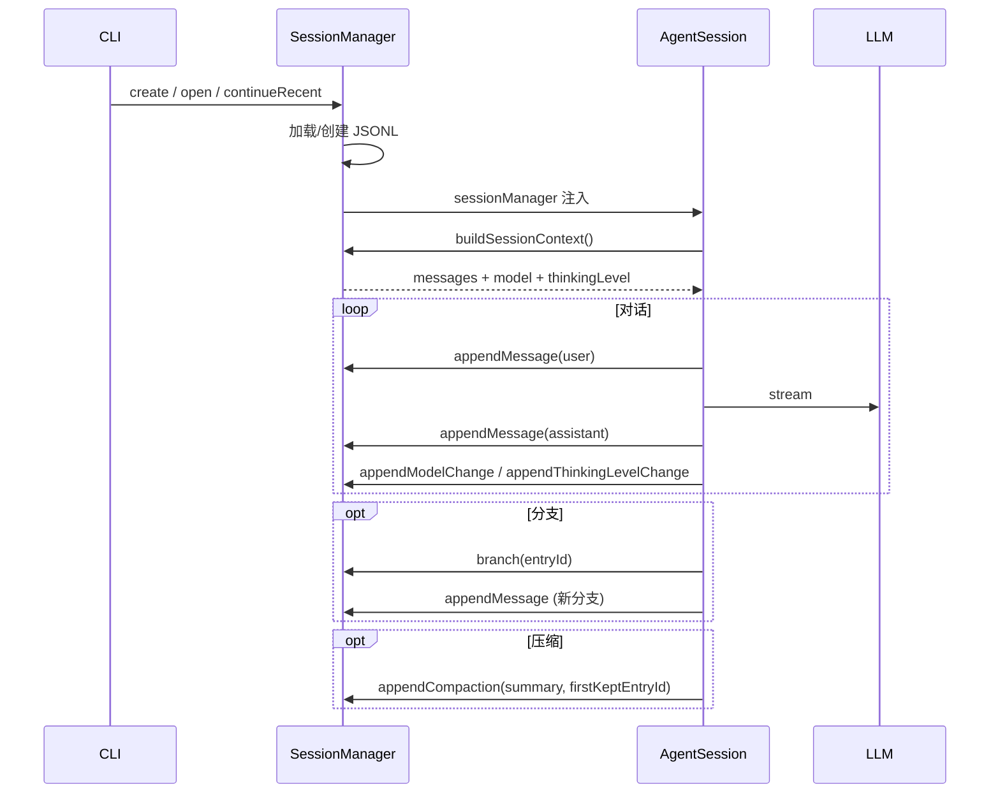
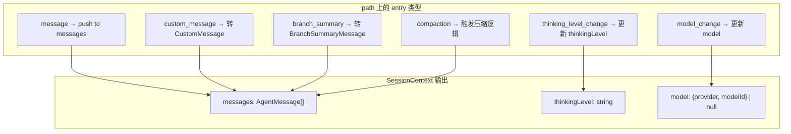
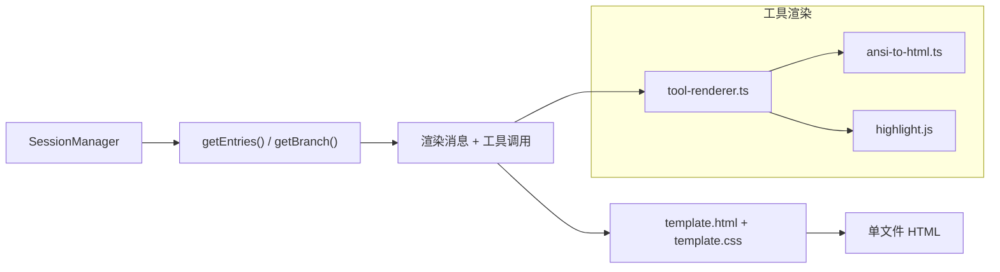

# 会话系统

Pi 的会话系统以 **SessionManager**（`packages/coding-agent/src/core/session-manager.ts`）为核心，将对话历史存储为 **append-only 树结构** 的 JSONL 文件，支持分支、fork、压缩摘要和 HTML 导出。

## 架构概览



## 会话树结构

每个 entry 含 `id` 和 `parentId`，形成有向树（实际为链+分支）：



- **leafId** 指向当前活跃分支的末端 entry
- `appendXxx()` 创建 `parentId = leafId` 的新 entry，然后推进 leaf
- `branch(id)` 将 leaf 移回较早 entry，下次 append 形成新分支
- 历史 entry **永不修改或删除**（append-only）

### Entry 类型

| type | 参与 LLM 上下文 | 说明 |
|------|-----------------|------|
| `message` | 是 | 标准 AgentMessage（user/assistant/toolResult 等） |
| `custom_message` | 是 | 扩展注入的消息，按 customType 渲染 |
| `compaction` | 是（摘要形式） | 上下文压缩摘要 |
| `branch_summary` | 是（摘要形式） | 分支切换时的路径摘要 |
| `model_change` | 否（影响 model 解析） | 记录 provider/modelId |
| `thinking_level_change` | 否（影响 thinking 解析） | 记录思考级别 |
| `custom` | 否 | 扩展持久化状态（不参与上下文） |
| `label` | 否 | 用户书签/标记 |
| `session_info` | 否 | 会话显示名称等元数据 |



## JSONL 存储

### 文件位置

```
~/.pi/agent/sessions/<encoded-cwd>/<timestamp>_<sessionId>.jsonl
```

### 目录名编码

`getDefaultSessionDir()` 将 cwd 编码为安全目录名：

```
原始: /home/user/my-project
编码: --home-user-my-project--
路径: ~/.pi/agent/sessions/--home-user-my-project--/
```

规则：去掉 leading `/` 或 `\`，将 `/`、`\`、`:` 替换为 `-`，前后加 `--`。



### 文件格式

每行一个 JSON 对象，首行必须是 `SessionHeader`：

```json
{"type":"session","version":3,"id":"...","timestamp":"...","cwd":"/path","parentSession":"..."}
{"type":"message","id":"abc12345","parentId":null,"timestamp":"...","message":{...}}
{"type":"model_change","id":"def67890","parentId":"abc12345",...}
```

- **版本迁移**：v1→v2 添加 id/parentId 树；v2→v3 重命名 hookMessage→custom
- **延迟刷盘**：首条 assistant 消息到达前缓冲，避免空会话文件
- **append-only**：正常运行只追加行；迁移/修复时整文件 rewrite

## 会话操作



| 操作 | API | 说明 |
|------|-----|------|
| 创建 | `SessionManager.create(cwd)` | 新会话，自动生成文件 |
| 打开 | `SessionManager.open(path)` | 加载已有 JSONL |
| 继续 | `SessionManager.continueRecent(cwd)` | 最近会话或新建 |
| Fork | `SessionManager.forkFrom(source, targetCwd)` | 跨项目复制会话 |
| 分支 | `branch(entryId)` | leaf 移回，下次 append 分叉 |
| 带摘要分支 | `branchWithSummary(id, summary)` | 分支 + branch_summary entry |
| 树导航 | `resetLeaf()` / `branch(null)` | 回到根或指定点 |
| 列表 | `SessionManager.list(cwd)` / `listAll()` | 枚举会话 |

CLI 对应：`--continue`、`-r`/`--resume`、`--session`、`--fork`。

### Fork 流程



## buildSessionContext

从 leaf 沿 `parentId` 向上走到根，构建 LLM 可见上下文：



### 压缩路径处理

存在 `compaction` entry 时：

1. 先插入 `CompactionSummaryMessage`（含 tokensBefore）
2. 从 `firstKeptEntryId` 到 compaction 之间的 message 保留
3. compaction 之后的 message 正常追加
4. `branch_summary` 转为 `BranchSummaryMessage` 注入上下文

`custom` 和 `label` entry 被忽略（不参与 LLM 上下文）。

### leafId 特殊值

| leafId | 行为 |
|--------|------|
| `undefined` | 使用最后一条 entry |
| 具体 id | 从该 entry 向上构建 |
| `null` | 返回空 messages（导航到首条之前） |

## 会话生命周期



## 上下文构建详解



Agent 在每次 LLM 调用前调用 `sessionManager.buildSessionContext()`，再经扩展 `context` 事件修改 messages。

## HTML 导出

位于 `packages/coding-agent/src/core/export-html/`：



特性：

- 读取会话 entry，渲染完整对话时间线
- 内置工具 + 扩展工具的 HTML 渲染（`ToolHtmlRenderer` 接口）
- 主题色从 TUI theme 导出（`getThemeExportColors()`）
- CLI：`--export <path>` 或 SDK `exportSession()`

导出文件为自包含 HTML（内联 CSS/JS），可离线浏览。

## 关键 API 速查

| 方法 | 用途 |
|------|------|
| `appendMessage(msg)` | 追加消息 entry |
| `appendCompaction(...)` | 追加压缩 entry |
| `appendBranchSummary(...)` | 追加分支摘要 |
| `appendCustom(type, data)` | 扩展状态持久化 |
| `appendCustomMessage(...)` | 扩展上下文消息 |
| `getBranch(fromId?)` | 获取 root→leaf 路径 |
| `getTree()` | 完整树结构（含 children） |
| `buildSessionContext()` | 构建 LLM 上下文 |
| `createBranchedSession(leafId)` | 提取单路径为新会话 |

## 关键源文件

| 文件 | 职责 |
|------|------|
| `session-manager.ts` | SessionManager 核心实现 |
| `messages.ts` | 摘要/自定义消息工厂 |
| `export-html/index.ts` | HTML 导出入口 |
| `export-html/tool-renderer.ts` | 工具 HTML 渲染 |
| `agent-session.ts` | 会话操作与扩展集成 |
