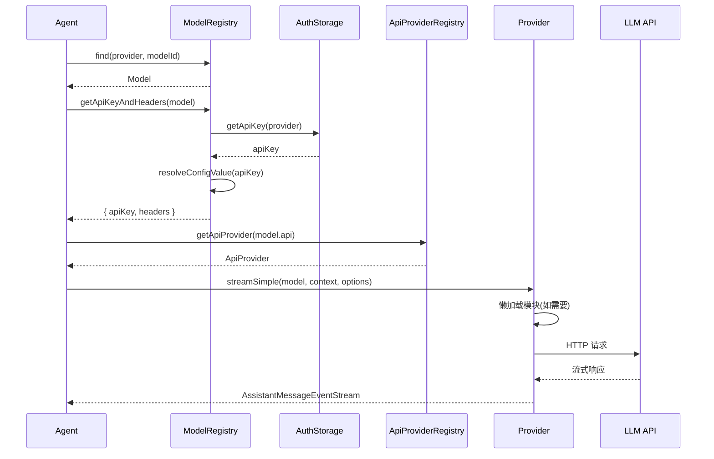

# Provider System 深度分析

> 理解 pi-mono 如何统一管理 20+ LLM Provider

---

## 1. Provider System 概览

### 1.1 系统架构

pi-mono 的 Provider System 是一个**三层架构**：

```
┌─────────────────────────────────────────────────────────────────┐
│                   ModelRegistry (coding-agent)                   │
│              管理模型定义、API Key 解析、自定义模型                  │
├─────────────────────────────────────────────────────────────────┤
│                  ApiProviderRegistry (pi-ai)                     │
│              API Provider 注册、懒加载、流式处理                    │
├─────────────────────────────────────────────────────────────────┤
│               Provider Implementations (pi-ai/providers)         │
│        20+ Provider 实现、OAuth 支持、兼容性适配                     │
└─────────────────────────────────────────────────────────────────┘
```

### 1.2 支持的 Provider

**文件**：`/packages/ai/src/types.ts:19-45`

```typescript
export type KnownProvider =
    | "amazon-bedrock"      // AWS Bedrock
    | "anthropic"           // Anthropic Claude
    | "google"              // Google Gemini
    | "google-gemini-cli"   // Google Gemini CLI
    | "google-antigravity"  // Google Antigravity
    | "google-vertex"       // Google Vertex AI
    | "openai"              // OpenAI
    | "azure-openai-responses" // Azure OpenAI
    | "openai-codex"        // OpenAI Codex
    | "deepseek"            // DeepSeek
    | "github-copilot"      // GitHub Copilot
    | "xai"                 // xAI Grok
    | "groq"                // Groq
    | "cerebras"            // Cerebras
    | "openrouter"          // OpenRouter
    | "vercel-ai-gateway"   // Vercel AI Gateway
    | "zai"                 // Z.ai
    | "mistral"             // Mistral AI
    | "minimax"             // MiniMax
    | "minimax-cn"          // MiniMax China
    | "huggingface"         // Hugging Face
    | "fireworks"           // Fireworks AI
    | "opencode"            // OpenCode
    | "opencode-go"         // OpenCode Go
    | "kimi-coding";        // Kimi Coding
```

---

## 2. ApiProviderRegistry

### 2.1 定义位置

**文件**：`/packages/ai/src/api-registry.ts`

### 2.2 核心接口

```typescript
export interface ApiProvider<TApi extends Api = Api, TOptions extends StreamOptions = StreamOptions> {
    api: TApi;
    stream: StreamFunction<TApi, TOptions>;
    streamSimple: StreamFunction<TApi, SimpleStreamOptions>;
}
```

### 2.3 注册机制

**入口**：`/packages/ai/src/api-registry.ts:66-78`

```typescript
const apiProviderRegistry = new Map<string, RegisteredApiProvider>();

export function registerApiProvider<TApi extends Api, TOptions extends StreamOptions>(
    provider: ApiProvider<TApi, TOptions>,
    sourceId?: string,
): void {
    apiProviderRegistry.set(provider.api, {
        provider: {
            api: provider.api,
            stream: wrapStream(provider.api, provider.stream),
            streamSimple: wrapStreamSimple(provider.api, provider.streamSimple),
        },
        sourceId,
    });
}
```

**特点**：
- 按 API 类型（如 `anthropic-messages`）注册
- 支持按来源 ID（如 `provider:custom-extension`）批量注销
- 自动验证模型 API 类型匹配

### 2.4 懒加载机制

**文件**：`/packages/ai/src/providers/register-builtins.ts`

**关键设计**：Provider 实现模块按需加载，减少启动时间。

```typescript
function createLazyStream<TApi extends Api, TOptions extends StreamOptions>(
    loadModule: () => Promise<LazyProviderModule<TApi, TOptions, TSimpleOptions>>,
): StreamFunction<TApi, TOptions> {
    return (model, context, options) => {
        const outer = new AssistantMessageEventStream();

        loadModule()
            .then((module) => {
                const inner = module.stream(model, context, options);
                forwardStream(outer, inner);
            })
            .catch((error) => {
                const message = createLazyLoadErrorMessage(model, error);
                outer.push({ type: "error", reason: "error", error: message });
                outer.end(message);
            });

        return outer;
    };
}
```

**懒加载的 Provider**：
- `anthropic-messages` → `./anthropic.js`
- `openai-completions` → `./openai-completions.js`
- `openai-responses` → `./openai-responses.js`
- `google-generative-ai` → `./google.js`
- `google-vertex` → `./google-vertex.js`
- `mistral-conversations` → `./mistral.js`
- `bedrock-converse-stream` → `./amazon-bedrock.js`

**优势**：
1. **启动速度**：不需要加载 20+ 个 Provider SDK
2. **内存占用**：只加载实际使用的 Provider
3. **Bun 兼容**：Bedrock 使用 Node-only SDK，支持运行时注入

---

## 3. ModelRegistry

### 3.1 定义位置

**文件**：`/packages/coding-agent/src/core/model-registry.ts`

### 3.2 核心职责

```typescript
export class ModelRegistry {
    private models: Model<Api>[];
    private providerRequestConfigs: Map<string, ProviderRequestConfig>;
    private modelRequestHeaders: Map<string, Record<string, string>>;
    private registeredProviders: Map<string, ProviderConfigInput>;

    // 管理模型定义、API Key 解析、自定义模型、扩展 Provider
}
```

### 3.3 Model 接口

**文件**：`/packages/ai/src/types.ts:426-452`

```typescript
export interface Model<TApi extends Api> {
    id: string;              // 模型 ID（如 "claude-sonnet-4-20250514"）
    name: string;            // 显示名称（如 "Claude Sonnet 4"）
    api: TApi;              // API 类型（如 "anthropic-messages"）
    provider: Provider;      // Provider 名称（如 "anthropic"）
    baseUrl: string;        // API 端点 URL
    reasoning: boolean;     // 是否支持推理模式
    input: ("text" | "image")[];  // 输入类型支持
    cost: {                 // 定价（$/百万 tokens）
        input: number;
        output: number;
        cacheRead: number;
        cacheWrite: number;
    };
    contextWindow: number;  // 上下文窗口大小
    maxTokens: number;      // 最大输出 tokens
    headers?: Record<string, string>;  // 默认请求头
    compat?: ModelCompat;   // 兼容性设置
}
```

### 3.4 内置模型加载

**入口**：`/packages/ai/src/models.ts`

```typescript
import { MODELS } from "./models.generated.js";

const modelRegistry: Map<string, Map<string, Model<Api>>> = new Map();

// 启动时从 MODELS 初始化
for (const [provider, models] of Object.entries(MODELS)) {
    const providerModels = new Map<string, Model<Api>>();
    for (const [id, model] of Object.entries(models)) {
        providerModels.set(id, model as Model<Api>);
    }
    modelRegistry.set(provider, providerModels);
}
```

**MODELS 生成**：
- 源文件：`/packages/ai/models.json`
- 构建时生成 `models.generated.ts`
- 包含所有内置模型的完整定义

### 3.5 自定义模型（models.json）

**文件位置**：`~/.pi/models.json`

**Schema**：`/packages/coding-agent/src/core/model-registry.ts:190-193`

```typescript
const ModelsConfigSchema = Type.Object({
    providers: Type.Record(Type.String(), ProviderConfigSchema),
});

const ProviderConfigSchema = Type.Object({
    baseUrl: Type.Optional(Type.String()),
    apiKey: Type.Optional(Type.String()),
    api: Type.Optional(Type.String()),
    headers: Type.Optional(Type.Record(Type.String(), Type.String())),
    compat: Type.Optional(ProviderCompatSchema),
    authHeader: Type.Optional(Type.Boolean()),
    models: Type.Optional(Type.Array(ModelDefinitionSchema)),
    modelOverrides: Type.Optional(Type.Record(Type.String(), ModelOverrideSchema)),
});
```

**示例配置**：

```json
{
  "providers": {
    "anthropic": {
      "baseUrl": "https://api.anthropic.com"
    },
    "openai": {
      "apiKey": "!command:echo $OPENAI_API_KEY",
      "modelOverrides": {
        "gpt-4o": {
          "cost": {
            "input": 2.50,
            "output": 10.00
          }
        }
      }
    },
    "ollama": {
      "baseUrl": "http://localhost:11434/v1",
      "api": "openai-completions",
      "apiKey": "ollama",
      "models": [
        {
          "id": "llama3:8b",
          "name": "Llama 3 8B",
          "api": "openai-completions",
          "reasoning": false,
          "input": ["text"],
          "cost": { "input": 0, "output": 0, "cacheRead": 0, "cacheWrite": 0 },
          "contextWindow": 128000,
          "maxTokens": 4096
        }
      ]
    }
  }
}
```

**配置类型**：
1. **Override-only**：仅覆盖内置模型的 baseUrl/headers/compat
2. **Custom models**：定义全新模型（需指定 api、baseUrl）
3. **Mixed**：同时包含 override 和自定义模型

### 3.6 模型合并策略

**入口**：`/packages/coding-agent/src/core/model-registry.ts:424-436`

```typescript
private mergeCustomModels(builtInModels: Model<Api>[], customModels: Model<Api>[]): Model<Api>[] {
    const merged = [...builtInModels];
    for (const customModel of customModels) {
        const existingIndex = merged.findIndex((m) =>
            m.provider === customModel.provider && m.id === customModel.id
        );
        if (existingIndex >= 0) {
            merged[existingIndex] = customModel;  // 自定义模型优先
        } else {
            merged.push(customModel);
        }
    }
    return merged;
}
```

**优先级**：自定义模型 > 内置模型

---

## 4. Auth Resolution

### 4.1 AuthStorage

**文件**：`/packages/coding-agent/src/core/auth-storage.ts`

**支持的认证类型**：
- **API Key**：直接存储或环境变量
- **Command**：通过 shell 命令获取（如 `!command:pass show ...`）
- **OAuth**：OAuth 2.0 流程（支持 `/login` 命令）

### 4.2 API Key 解析

**入口**：`/packages/coding-agent/src/core/model-registry.ts:663-702`

```typescript
async getApiKeyAndHeaders(model: Model<Api>): Promise<ResolvedRequestAuth> {
    try {
        const providerConfig = this.providerRequestConfigs.get(model.provider);
        const apiKeyFromAuthStorage = await this.authStorage.getApiKey(model.provider, { includeFallback: false });
        const apiKey =
            apiKeyFromAuthStorage ??
            (providerConfig?.apiKey
                ? resolveConfigValueOrThrow(providerConfig.apiKey, `API key for provider "${model.provider}"`)
                : undefined);

        const providerHeaders = resolveHeadersOrThrow(providerConfig?.headers);
        const modelHeaders = resolveHeadersOrThrow(this.modelRequestHeaders.get(...));

        let headers = { ...model.headers, ...providerHeaders, ...modelHeaders };

        if (providerConfig?.authHeader && apiKey) {
            headers = { ...headers, Authorization: `Bearer ${apiKey}` };
        }

        return { ok: true, apiKey, headers };
    } catch (error) {
        return { ok: false, error: error.message };
    }
}
```

**解析顺序**：
1. AuthStorage（OAuth 或已存储的 API Key）
2. models.json 中的 `apiKey`
3. 环境变量（通过 `resolveConfigValueOrThrow`）

### 4.3 Command-backed Auth

**语法**：`!command:<shell-command>`

**示例**：
```json
{
  "apiKey": "!command:pass show anthropic/api-key"
}
```

**实现**：`/packages/coding-agent/src/core/resolve-config-value.ts`

```typescript
export function resolveConfigValueOrThrow(
    value: string,
    description: string,
): string {
    if (value.startsWith("!")) {
        const command = value.slice(1);
        const result = execSync(command, { encoding: "utf-8" }).trim();
        if (!result) {
            throw new Error(`${description}: command returned empty result`);
        }
        return result;
    }

    if (process.env[value]) {
        return process.env[value]!;
    }

    return value;
}
```

### 4.4 OAuth Support

**文件**：`/packages/ai/src/oauth.ts`

**注册 OAuth Provider**：
```typescript
export interface OAuthProviderInterface {
    id: string;
    name: string;
    authorizationUrl: string;
    tokenUrl: string;
    scope?: string;
    modifyModels?: (models: Model<Api>[], credentials: OAuthCredentials) => Model<Api>[];
}
```

**使用场景**：
- GitHub Copilot OAuth
- 自定义 OAuth Provider（通过扩展注册）

**Token 刷新**：
```typescript
// 每次请求时检查 token 是否过期
if (cred.expiresAt && Date.now() > cred.expiresAt) {
    cred = await refreshOAuthToken(cred);
}
```

---

## 5. Provider Implementation

### 5.1 Provider 目录结构

**位置**：`/packages/ai/src/providers/`

```
providers/
├── anthropic.ts              # Anthropic Claude
├── openai-completions.ts     # OpenAI Completions API
├── openai-responses.ts       # OpenAI Responses API
├── openai-codex-responses.ts # OpenAI Codex
├── azure-openai-responses.ts # Azure OpenAI
├── google.ts                 # Google Gemini
├── google-vertex.ts          # Google Vertex AI
├── google-gemini-cli.ts      # Google Gemini CLI
├── mistral.ts                # Mistral AI
├── amazon-bedrock.ts         # AWS Bedrock
├── register-builtins.ts      # 内置 Provider 注册
└── ...
```

### 5.2 StreamFunction Contract

**定义**：`/packages/ai/src/types.ts:147-151`

```typescript
export type StreamFunction<TApi extends Api = Api, TOptions extends StreamOptions = StreamOptions> = (
    model: Model<TApi>,
    context: Context,
    options?: TOptions,
) => AssistantMessageEventStream;
```

**Contract**：
1. 必须返回 `AssistantMessageEventStream`
2. 请求/模型/运行时错误必须编码在流中，不能抛出
3. 错误终止必须产生 `stopReason: "error" | "aborted"` 的消息

### 5.3 事件协议

**文件**：`/packages/ai/src/types.ts:259-271`

```typescript
export type AssistantMessageEvent =
    | { type: "start"; partial: AssistantMessage }
    | { type: "text_start"; contentIndex: number; partial: AssistantMessage }
    | { type: "text_delta"; contentIndex: number; delta: string; partial: AssistantMessage }
    | { type: "text_end"; contentIndex: number; content: string; partial: AssistantMessage }
    | { type: "thinking_start"; contentIndex: number; partial: AssistantMessage }
    | { type: "thinking_delta"; contentIndex: number; delta: string; partial: AssistantMessage }
    | { type: "thinking_end"; contentIndex: number; content: string; partial: AssistantMessage }
    | { type: "toolcall_start"; contentIndex: number; partial: AssistantMessage }
    | { type: "toolcall_delta"; contentIndex: number; delta: string; partial: AssistantMessage }
    | { type: "toolcall_end"; contentIndex: number; toolCall: ToolCall; partial: AssistantMessage }
    | { type: "done"; reason: Extract<StopReason, "stop" | "length" | "toolUse">; message: AssistantMessage }
    | { type: "error"; reason: Extract<StopReason, "aborted" | "error">; error: AssistantMessage };
```

**流程**：
```
start → text_start → text_delta* → text_end → ... → done/error
```

---

## 6. 兼容性系统 (Compat)

### 6.1 为什么需要 Compat？

不同 Provider 的 OpenAI 兼容 API 有细微差异：

| 特性 | OpenAI | OpenRouter | DeepSeek | z.ai |
|-----|--------|-----------|----------|-----|
| `reasoning_effort` | ✅ | ✅ | ✅ | ❌ |
| `store` field | ✅ | ❌ | ❌ | ❌ |
| `developer` role | ✅ | ❌ | ❌ | ❌ |
| reasoning 格式 | `reasoning_effort` | `reasoning: { effort }` | `thinking: { type }` + `reasoning_effort` | `enable_thinking: bool` |

### 6.2 Compat Schema

**文件**：`/packages/ai/src/types.ts:277-314`

```typescript
export interface OpenAICompletionsCompat {
    supportsStore?: boolean;
    supportsDeveloperRole?: boolean;
    supportsReasoningEffort?: boolean;
    reasoningEffortMap?: Partial<Record<ThinkingLevel, string>>;
    supportsUsageInStreaming?: boolean;
    maxTokensField?: "max_completion_tokens" | "max_tokens";
    requiresToolResultName?: boolean;
    requiresAssistantAfterToolResult?: boolean;
    requiresThinkingAsText?: boolean;
    requiresReasoningContentOnAssistantMessages?: boolean;
    thinkingFormat?: "openai" | "openrouter" | "deepseek" | "zai" | "qwen" | "qwen-chat-template";
    cacheControlFormat?: "anthropic";
    openRouterRouting?: OpenRouterRouting;
    vercelGatewayRouting?: VercelGatewayRouting;
    zaiToolStream?: boolean;
    supportsStrictMode?: boolean;
    supportsLongCacheRetention?: boolean;
}
```

### 6.3 自动检测

**入口**：`/packages/ai/src/providers/openai-completions.ts`

```typescript
function detectCompat(baseUrl: string): OpenAICompletionsCompat {
    if (baseUrl.includes("openrouter.ai")) {
        return {
            supportsStore: false,
            supportsDeveloperRole: false,
            supportsReasoningEffort: false,
            thinkingFormat: "openrouter",
            // ...
        };
    }

    if (baseUrl.includes("api.deepseek.com")) {
        return {
            thinkingFormat: "deepseek",
            supportsStore: false,
            // ...
        };
    }

    // 默认 OpenAI 行为
    return {
        supportsStore: true,
        supportsDeveloperRole: true,
        thinkingFormat: "openai",
    };
}
```

### 6.4 OpenRouter Routing

**文件**：`/packages/ai/src/types.ts:344-411`

```typescript
export interface OpenRouterRouting {
    allow_fallbacks?: boolean;
    require_parameters?: boolean;
    data_collection?: "deny" | "allow";
    zdr?: boolean;
    enforce_distillable_text?: boolean;
    order?: string[];
    only?: string[];
    ignore?: string[];
    quantizations?: string[];
    sort?: string | { by?: string; partition?: string | null };
    max_price?: {
        prompt?: number | string;
        completion?: number | string;
        // ...
    };
    preferred_min_throughput?: number | { p50?: number; p75?: number; /* ... */ };
    preferred_max_latency?: number | { p50?: number; p90?: number; /* ... */ };
}
```

**使用示例**：
```json
{
  "baseUrl": "https://openrouter.ai/api/v1",
  "compat": {
    "openRouterRouting": {
      "order": ["anthropic", "openai"],
      "max_price": { "prompt": 0.5, "completion": 1.5 },
      "preferred_max_latency": { "p50": 2 }
    }
  }
}
```

---

## 7. Extension Providers

### 7.1 注册自定义 Provider

**文件**：`/packages/coding-agent/src/core/model-registry.ts:758-890`

```typescript
registerProvider(providerName: string, config: ProviderConfigInput): void {
    this.validateProviderConfig(providerName, config);
    this.applyProviderConfig(providerName, config);
    this.upsertRegisteredProvider(providerName, config);
}
```

**ProviderConfigInput**：
```typescript
export interface ProviderConfigInput {
    baseUrl?: string;
    apiKey?: string;
    api?: Api;
    streamSimple?: (model, context, options?) => AssistantMessageEventStream;
    headers?: Record<string, string>;
    authHeader?: boolean;
    oauth?: Omit<OAuthProviderInterface, "id">;
    models?: Array<{
        id: string;
        name: string;
        api?: Api;
        reasoning: boolean;
        input: ("text" | "image")[];
        cost: { input: number; output: number; cacheRead: number; cacheWrite: number };
        contextWindow: number;
        maxTokens: number;
        headers?: Record<string, string>;
        compat?: Model<Api>["compat"];
    }>;
}
```

### 7.2 扩展中注册 Provider

**示例**：
```typescript
export default function (api: ExtensionAPI) {
    api.registerProvider("my-custom-provider", {
        baseUrl: "https://my-api.com/v1",
        apiKey: process.env.MY_API_KEY,
        api: "openai-completions",
        streamSimple: async (model, context, options) => {
            // 自定义流式实现
            return stream;
        },
        models: [
            {
                id: "my-model-1",
                name: "My Model 1",
                api: "openai-completions",
                reasoning: false,
                input: ["text"],
                cost: { input: 0, output: 0, cacheRead: 0, cacheWrite: 0 },
                contextWindow: 128000,
                maxTokens: 4096,
            },
        ],
    });
}
```

### 7.3 注销 Provider

```typescript
unregisterProvider(providerName: string): void {
    if (!this.registeredProviders.has(providerName)) return;
    this.registeredProviders.delete(providerName);
    this.refresh();  // 重新加载内置模型
}
```

---

## 8. 请求执行流程

### 8.1 完整流程



### 8.2 Agent Loop 调用

**入口**：`/packages/agent/src/agent-loop.ts`

```typescript
const stream = streamSimple(messages, config);

for await (const event of stream) {
    if (event.type === "text_delta") {
        // 处理文本增量
    } else if (event.type === "toolcall_end") {
        // 执行工具
    } else if (event.type === "done") {
        // 完成
    }
}
```

### 8.3 streamSimple 封装

**文件**：`/packages/coding-agent/src/core/agent-session.ts`

```typescript
async streamSimple(
    model: Model<Api>,
    context: Context,
    options: SimpleStreamOptions,
): Promise<AssistantMessage> {
    // 1. 获取 API Key 和 Headers
    const { apiKey, headers } = await this.modelRegistry.getApiKeyAndHeaders(model);

    // 2. 合并 options
    const mergedOptions: SimpleStreamOptions = {
        ...options,
        apiKey,
        headers: { ...headers, ...options.headers },
    };

    // 3. 获取 Provider
    const provider = getApiProvider(model.api);
    if (!provider) {
        throw new Error(`No provider found for API: ${model.api}`);
    }

    // 4. 调用 streamSimple
    const stream = provider.streamSimple(model, context, mergedOptions);

    // 5. 收集事件
    const events: AssistantMessageEvent[] = [];
    for await (const event of stream) {
        events.push(event);
        // 发送到扩展系统
        await this.extensionRunner.emit(event);
    }

    // 6. 返回最终消息
    return events[events.length - 1].message;
}
```

---

## 9. 高级功能

### 9.1 Thinking Levels

**定义**：`/packages/ai/src/types.ts:47`

```typescript
export type ThinkingLevel = "minimal" | "low" | "medium" | "high" | "xhigh";
```

**支持情况**：
- **Anthropic**：Claude 3.7 Sonnet+ 支持 `extended_thinking`
- **OpenAI**：GPT-5.2+ 支持 `reasoning_effort`
- **DeepSeek**：V4 Pro 支持 `thinking`

**Token Budgets**：
```typescript
export interface ThinkingBudgets {
    minimal?: number;
    low?: number;
    medium?: number;
    high?: number;
}
```

### 9.2 Prompt Caching

**支持类型**：
- **Anthropic**：`cache_control` markers
- **OpenAI**：`prompt_cache_retention: "24h"`
- **Google**：`contents.role` caching

**配置**：
```typescript
export type CacheRetention = "none" | "short" | "long";

interface StreamOptions {
    cacheRetention?: CacheRetention;
    sessionId?: string;  // 用于缓存亲和性
}
```

### 9.3 Session Affinity

**目的**：提高缓存命中率，降低延迟

**实现**：
```typescript
// Anthropic
headers: {
    "anthropic-beta": "prompt-caching-2024-07-31"
}

// OpenAI
headers: {
    "session_id": sessionId
}

// 自定义 Provider
compat: {
    sendSessionAffinityHeaders: true
}
```

### 9.4 成本计算

**文件**：`/packages/ai/src/models.ts:39-46`

```typescript
export function calculateCost<TApi extends Api>(model: Model<TApi>, usage: Usage): Usage["cost"] {
    usage.cost.input = (model.cost.input / 1000000) * usage.input;
    usage.cost.output = (model.cost.output / 1000000) * usage.output;
    usage.cost.cacheRead = (model.cost.cacheRead / 1000000) * usage.cacheRead;
    usage.cost.cacheWrite = (model.cost.cacheWrite / 1000000) * usage.cacheWrite;
    usage.cost.total = usage.cost.input + usage.cost.output + usage.cost.cacheRead + usage.cost.cacheWrite;
    return usage.cost;
}
```

**定价单位**：美元/百万 tokens

---

## 10. 最佳实践

### 10.1 配置本地模型

**Ollama**：
```json
{
  "providers": {
    "ollama": {
      "baseUrl": "http://localhost:11434/v1",
      "api": "openai-completions",
      "apiKey": "ollama",
      "models": [
        {
          "id": "llama3:8b",
          "name": "Llama 3 8B",
          "api": "openai-completions",
          "reasoning": false,
          "input": ["text"],
          "cost": { "input": 0, "output": 0, "cacheRead": 0, "cacheWrite": 0 },
          "contextWindow": 128000,
          "maxTokens": 4096
        }
      ]
    }
  }
}
```

**LM Studio**：
```json
{
  "providers": {
    "lmstudio": {
      "baseUrl": "http://localhost:1234/v1",
      "api": "openai-completions",
      "apiKey": "lm-studio",
      "models": [
        {
          "id": "local-model",
          "name": "Local Model",
          "api": "openai-completions",
          "reasoning": false,
          "input": ["text"],
          "cost": { "input": 0, "output": 0, "cacheRead": 0, "cacheWrite": 0 },
          "contextWindow": 32000,
          "maxTokens": 4096
        }
      ]
    }
  }
}
```

### 10.2 使用 Command Auth

**Pass**：
```json
{
  "apiKey": "!command:pass show anthropic/api-key"
}
```

**1Password**：
```json
{
  "apiKey": "!command:op read 'op://Personal/Anthropic/api key' --no-newline"
}
```

**环境变量**：
```json
{
  "apiKey": "ANTHROPIC_API_KEY"
}
```

### 10.3 OpenRouter Routing

```json
{
  "providers": {
    "openrouter": {
      "baseUrl": "https://openrouter.ai/api/v1",
      "apiKey": "OPENROUTER_API_KEY",
      "compat": {
        "openRouterRouting": {
          "order": ["anthropic", "openai"],
          "max_price": { "prompt": "0.50", "completion": "1.50" },
          "preferred_max_latency": { "p50": 2, "p99": 5 }
        }
      }
    }
  }
}
```

### 10.4 扩展中添加 Provider

```typescript
export default function (api: ExtensionAPI) {
    api.registerProvider("my-provider", {
        baseUrl: "https://my-provider.com/v1",
        api: "openai-completions",
        streamSimple: async (model, context, options) => {
            // 实现自定义流式逻辑
            const stream = new AssistantMessageEventStream();

            try {
                const response = await fetch(model.baseUrl, {
                    method: "POST",
                    headers: {
                        "Content-Type": "application/json",
                        "Authorization": `Bearer ${options.apiKey}`,
                    },
                    body: JSON.stringify({
                        model: model.id,
                        messages: context.messages,
                        stream: true,
                    }),
                });

                for await (const chunk of response.body) {
                    // 解析 SSE 事件
                    const event = parseSSE(chunk);
                    stream.push(event);
                }

                stream.end();
            } catch (error) {
                stream.push({
                    type: "error",
                    reason: "error",
                    error: createErrorMessage(error),
                });
                stream.end();
            }

            return stream;
        },
        models: [
            {
                id: "my-model",
                name: "My Model",
                api: "openai-completions",
                reasoning: false,
                input: ["text"],
                cost: { input: 1, output: 2, cacheRead: 0, cacheWrite: 0 },
                contextWindow: 128000,
                maxTokens: 4096,
            },
        ],
    });
}
```

---

## 11. 调试技巧

### 11.1 检查模型列表

```bash
# 列出所有模型
pi model list

# 列出可用模型（有 auth 的）
pi model list --available
```

### 11.2 检查 Auth 状态

```bash
# 检查特定 Provider
pi auth status anthropic

# 登录 OAuth Provider
pi login github-copilot
```

### 11.3 验证 models.json

```bash
# 重新加载 models.json
pi model reload

# 查看加载错误
pi model list
```

### 11.4 启用调试日志

```bash
# 启用 Provider 调试
PI_DEBUG_PROVIDER=1 pi

# 启用请求日志
PI_DEBUG_REQUEST=1 pi
```

---

## 12. 总结

pi-mono 的 Provider System 设计特点：

1. **三层架构**：ModelRegistry → ApiProviderRegistry → Provider 实现
2. **懒加载**：Provider 模块按需加载，提升启动速度
3. **统一接口**：`streamSimple` 统一所有 Provider 的调用方式
4. **灵活配置**：支持 models.json 覆盖、自定义模型、扩展 Provider
5. **兼容性适配**：自动检测 + 手动配置兼容性设置
6. **多种认证**：API Key、Command、OAuth
7. **成本计算**：自动计算 token 成本

这种设计使得 pi-mono 能够轻松支持 20+ LLM Provider，同时保持代码的可维护性和扩展性。

---

**相关文档**：
- [架构概览](../02-architecture/01-architecture-overview.md)
- [扩展系统](./02-extension-system.md)
- [Agent Loop 详解](../03-packages/02-pi-agent-core.md)
- [pi-ai 包分析](../03-packages/01-pi-ai.md)

**[MermaidChart:./_LEARN/docs/mmd/provider-system-lifecycle.mmd]**
