# 供应商/模型系统

Pi 的模型系统位于 `packages/coding-agent/src/core/model-registry.ts` 和 `model-resolver.ts`，管理 **Provider（谁提供）× Api（什么协议）** 二维模型空间，并负责 API key 解析、OAuth 认证和模型选择。

## 双轴模型

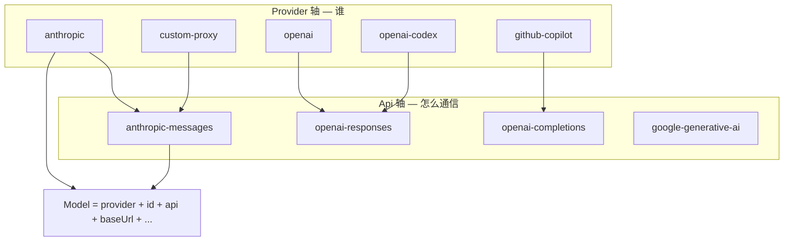

- **Provider**：供应商标识（如 `anthropic`、`openai`），决定 API key 来源和 OAuth 流程
- **Api**：协议类型（如 `anthropic-messages`、`openai-responses`），决定请求/响应格式和 stream 实现
- 每个 `Model<Api>` 绑定一个 provider 和一个 api，可覆盖 baseUrl、headers、compat 等

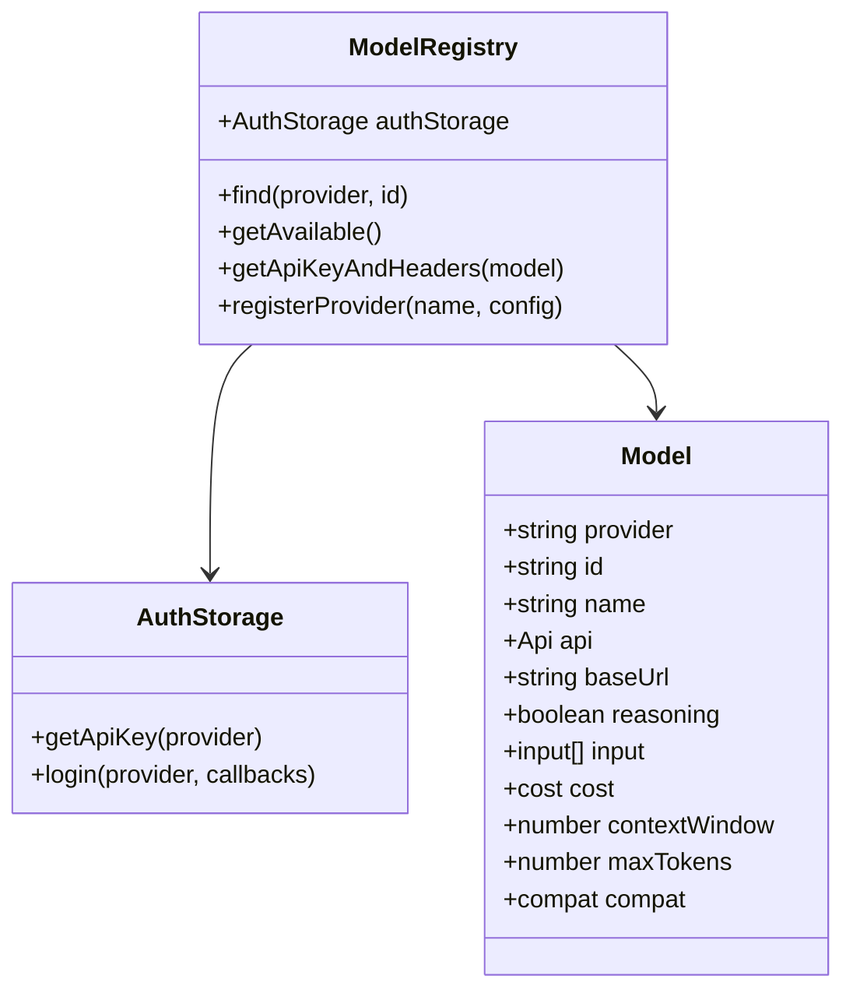

## ModelRegistry 架构

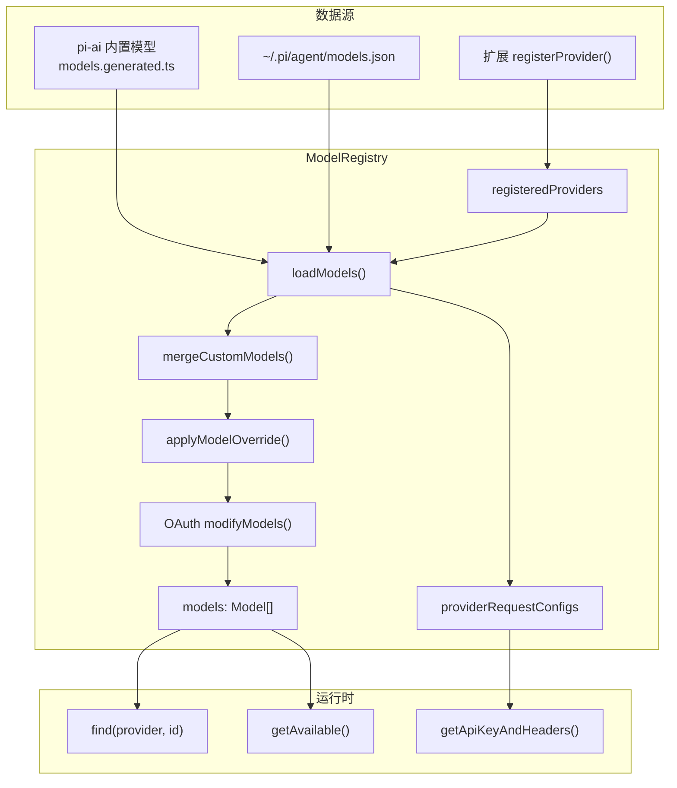

### 内置模型

来自 `@earendil-works/pi-ai` 的 `getProviders()` + `getModels(provider)`，数据生成于 `packages/ai/src/models.generated.ts`（由 `generate-models.ts` 脚本维护）。

### 自定义模型 (models.json)

路径：`~/.pi/agent/models.json`

```json
{
  "providers": {
    "ollama": {
      "baseUrl": "http://localhost:11434/v1",
      "apiKey": "ollama",
      "api": "openai-completions",
      "models": [
        {
          "id": "llama3",
          "name": "Llama 3",
          "reasoning": false,
          "input": ["text"],
          "cost": { "input": 0, "output": 0, "cacheRead": 0, "cacheWrite": 0 },
          "contextWindow": 8192,
          "maxTokens": 4096
        }
      ]
    }
  }
}
```

支持：

- **完整 provider 定义**（baseUrl + api + models）
- **provider 级 override**（仅覆盖 baseUrl/headers/compat）
- **modelOverrides**（按 model id 部分覆盖内置模型属性）
- JSON 注释和 trailing comma（加载时 strip）

自定义模型与内置模型按 `provider + id` 合并，**custom 优先**。

## API Key 解析链

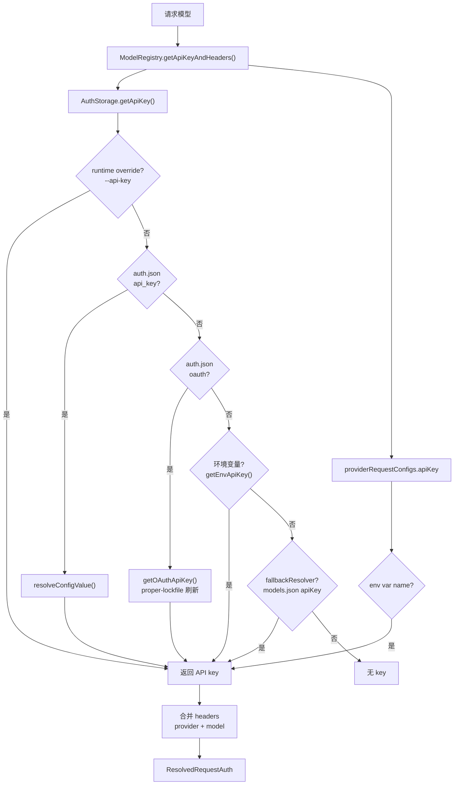

### AuthStorage 优先级

`AuthStorage.getApiKey()` 完整链：

| 优先级 | 来源 | 说明 |
|--------|------|------|
| 1 | Runtime override | CLI `--api-key` |
| 2 | auth.json (api_key) | 持久化 API key |
| 3 | auth.json (oauth) | OAuth token，过期自动刷新 |
| 4 | 环境变量 | `getEnvApiKey(provider)` |
| 5 | Fallback resolver | models.json 中的 apiKey 字段 |

`ModelRegistry.getApiKeyAndHeaders()` 额外检查 `providerRequestConfigs` 中的 apiKey（可引用 env var 名）。

### AuthStorage 与 proper-lockfile

OAuth token 刷新使用 **proper-lockfile** 防止多实例竞态：

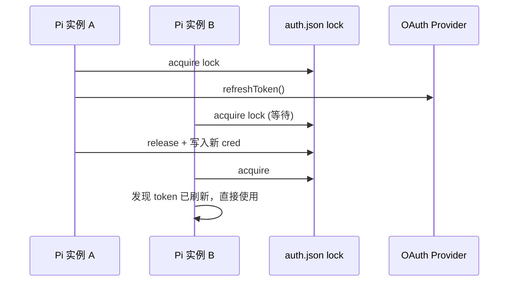

- 同步操作：`lockSync` + 重试
- 异步刷新：`lock()` + stale 检测 + `onCompromised` 回调
- 文件权限：`auth.json` mode `0600`，目录 `0700`

## OAuth 流程

内置 OAuth 支持（via `@earendil-works/pi-ai/oauth`）：

| Provider | ID | 用途 |
|----------|-----|------|
| Anthropic | `anthropic` | Claude 订阅/API |
| GitHub Copilot | `github-copilot` | Copilot 模型 |
| OpenAI Codex | `openai-codex` | Codex 订阅 |

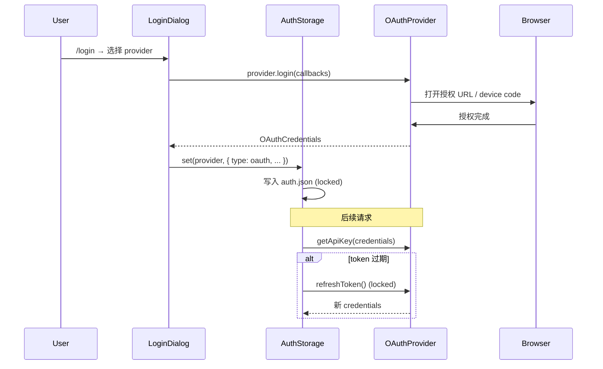

扩展可通过 `registerProvider()` 注册自定义 OAuth：

```typescript
pi.registerProvider("corporate-ai", {
  baseUrl: "https://ai.corp.com",
  api: "openai-responses",
  models: [...],
  oauth: {
    name: "Corporate AI (SSO)",
    login(callbacks) { ... },
    refreshToken(credentials) { ... },
    getApiKey(credentials) { return credentials.access; },
    modifyModels(models, credentials) { ... },
  },
});
```

## 扩展 Provider 注册

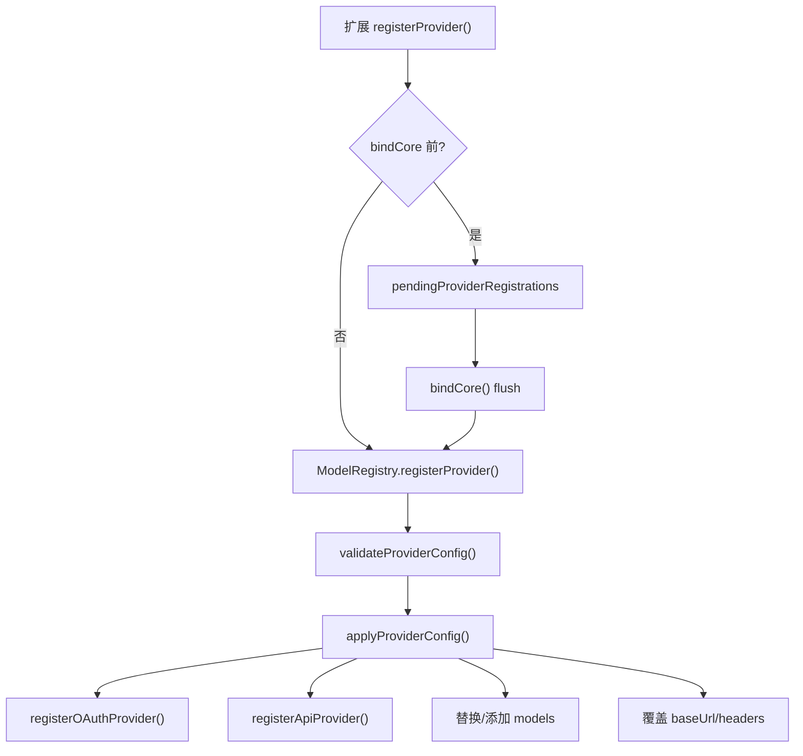

三种注册模式：

1. **完整 provider**：`models` + `baseUrl` + `apiKey`/`oauth` → 替换该 provider 全部模型
2. **URL 覆盖**：仅 `baseUrl` → 修改已有模型的 endpoint
3. **OAuth 注册**：`oauth` 对象 → 启用 `/login` 支持

`unregisterProvider()` 移除扩展注册的 provider 并 `refresh()` 恢复内置模型。

## 模型解析顺序

启动时 `findInitialModel()` 按优先级选择模型：

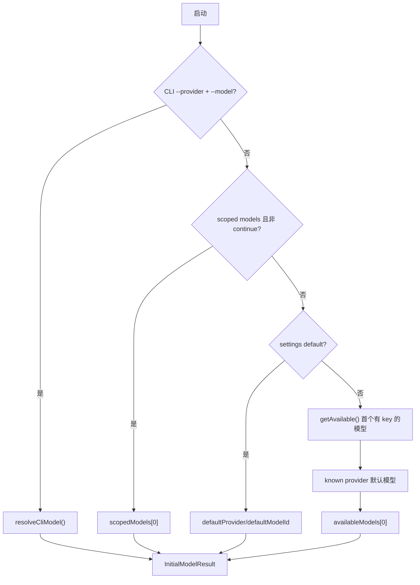

| 优先级 | 来源 | 条件 |
|--------|------|------|
| 1 | CLI | `--provider` + `--model` 或 `--model provider/pattern` |
| 2 | Scoped models | `--models` 或 settings `enabledModels`，非 resume/continue |
| 3 | Settings 默认 | `defaultProvider` + `defaultModelId` |
| 4 | 可用模型 | 第一个已配置 auth 的模型 |
| 5 | 已知默认 | 各 provider 的 defaultModelPerProvider |
| 6 | 兜底 | availableModels[0] |

### Continue/Resume 时的模型恢复

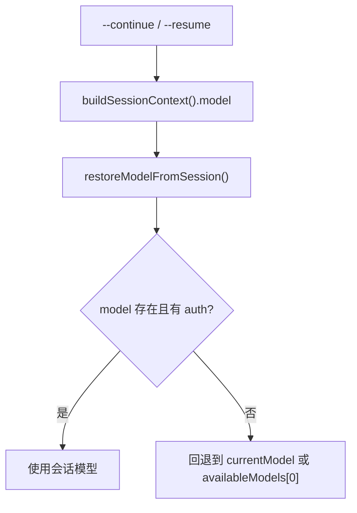

Resume 时跳过 scoped models 优先级，优先恢复会话中记录的 model。

### Scoped Models

`--models "anthropic/*,openai/gpt-*"` 解析为 `ScopedModel[]`：

- 支持 glob（`anthropic/*`）和模糊匹配（`*sonnet*`）
- 可选 thinking level 后缀：`model:high`
- 模型切换（cycle）仅在 scoped 列表内循环
- scoped 列表过滤掉无 auth 的模型

## 模型注册表架构图

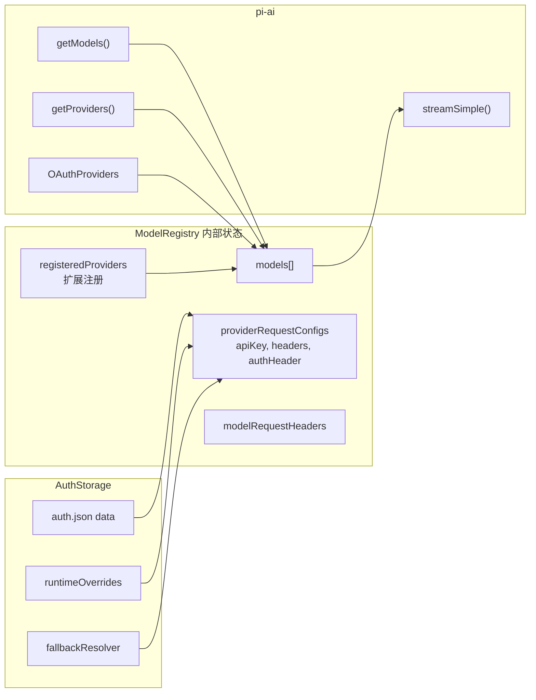

## API Key 解析详图

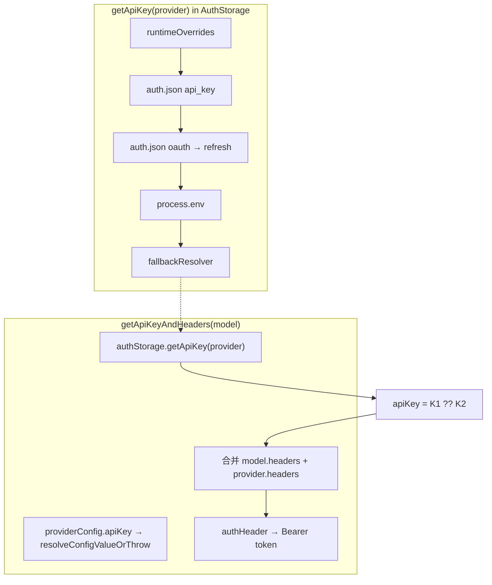

### apiKey 值类型

models.json 中 `apiKey` 可以是：

- 字面量 key 字符串
- 环境变量名（如 `"ANTHROPIC_API_KEY"`）
- 命令引用（`!"cmd args"`）— 运行时执行获取

## 关键源文件

| 文件 | 职责 |
|------|------|
| `model-registry.ts` | ModelRegistry、models.json 加载、Provider 注册 |
| `model-resolver.ts` | CLI/scoped/初始模型解析 |
| `auth-storage.ts` | auth.json 读写、OAuth 刷新、锁 |
| `resolve-config-value.ts` | env/command 配置值解析 |
| `packages/ai/src/models.generated.ts` | 内置模型数据 |
| `extensions/types.ts` | ProviderConfig 类型 |

## CLI 相关

| 标志 | 作用 |
|------|------|
| `--provider` / `--model` | 指定模型 |
| `--models` | scoped 模型列表（glob） |
| `--api-key` | runtime API key override |
| `--list-models` | 列出可用模型 |
| `/login` | OAuth 登录流程 |
