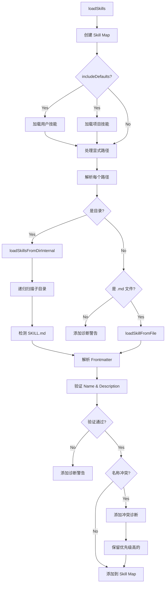

# Skills System 深度分析

> 理解 pi-mono 如何实现 Agent Skills 标准，提供任务特定指令

---

## 1. Skills System 概览

### 1.1 设计目标

Skills System 实现 **Agent Skills 标准**（agentskills.io），允许：
- 为特定任务提供专门指令
- LLM 可以按需读取技能文件
- 支持用户级、项目级和自定义技能位置
- 名称冲突检测和解析

### 1.2 与其他系统的关系

```
┌─────────────────────────────────────────────────────────────────┐
│                        Agent Skills                              │
│                  (任务特定指令，按需加载)                          │
├─────────────────────────────────────────────────────────────────┤
│                         Tools                                    │
│                  (工具定义，可被 Skills 引用)                      │
├─────────────────────────────────────────────────────────────────┤
│                      Extensions                                  │
│                  (可注册 Tools 和 Skills)                         │
└─────────────────────────────────────────────────────────────────┘
```

**关键区别**：
- **Tools**：LLM 可调用的函数
- **Skills**：LLM 可读取的任务指令文件
- **Extensions**：可同时注册 Tools 和 Skills

---

## 2. Skill 定义格式

### 2.1 SKILL.md 文件格式

**位置**：`<skill-directory>/SKILL.md` 或 `<skill-name>.md`

**Frontmatter Schema**：
```yaml
---
name: skill-name                    # 可选，默认为父目录名
description: 简短描述技能用途        # 必需
disable-model-invocation: false    # 可选，禁止模型自动调用
---
```

### 2.2 验证规则

**文件**：`/packages/coding-agent/src/core/skills.ts:92-131`

**Name 验证**：
```typescript
function validateName(name: string, parentDirName: string): string[] {
    const errors: string[] = [];

    // 1. Name 必须与父目录名匹配
    if (name !== parentDirName) {
        errors.push(`name "${name}" does not match parent directory "${parentDirName}"`);
    }

    // 2. 最大长度 64 字符
    if (name.length > MAX_NAME_LENGTH) {
        errors.push(`name exceeds ${MAX_NAME_LENGTH} characters (${name.length})`);
    }

    // 3. 只能包含小写字母、数字、连字符
    if (!/^[a-z0-9-]+$/.test(name)) {
        errors.push(`name contains invalid characters (must be lowercase a-z, 0-9, hyphens only)`);
    }

    // 4. 不能以连字符开头或结尾
    if (name.startsWith("-") || name.endsWith("-")) {
        errors.push(`name must not start or end with a hyphen`);
    }

    // 5. 不能包含连续连字符
    if (name.includes("--")) {
        errors.push(`name must not contain consecutive hyphens`);
    }

    return errors;
}
```

**Description 验证**：
```typescript
function validateDescription(description: string | undefined): string[] {
    const errors: string[] = [];

    // 1. 必需且非空
    if (!description || description.trim() === "") {
        errors.push("description is required");
    }

    // 2. 最大长度 1024 字符
    else if (description.length > MAX_DESCRIPTION_LENGTH) {
        errors.push(`description exceeds ${MAX_DESCRIPTION_LENGTH} characters (${description.length})`);
    }

    return errors;
}
```

### 2.3 示例 Skill

**文件**：`~/.pi/skills/typescript/` + `SKILL.md`

```markdown
---
name: typescript
description: TypeScript code generation, type checking, and refactoring
disable-model-invocation: false
---

# TypeScript Skill

When working with TypeScript code:

1. **Type Safety**: Always prefer explicit types over `any`
2. **Interfaces**: Use interfaces for object shapes
3. **Generics**: Leverage generics for reusable components
4. **Strict Mode**: Assume `strict: true` is enabled

## Common Patterns

### Type Guards
```typescript
function isString(value: unknown): value is string {
    return typeof value === "string";
}
```

### Utility Types
- `Partial<T>` - Make all properties optional
- `Required<T>` - Make all properties required
- `Pick<T, K>` - Subset of properties
- `Omit<T, K>` - Remove properties
```

---

## 3. Skill 发现机制

### 3.1 搜索位置

**文件**：`/packages/coding-agent/src/core/skills.ts:404-508`

**优先级**（从高到低）：
1. **用户技能**：`~/.pi/skills/`
2. **项目技能**：`<cwd>/.pi/skills/`
3. **显式路径**：配置文件中指定的路径

**配置示例**：
```json
{
  "skills": [
    "~/custom-skills/",
    "./company-skills/",
    "specific-skill.md"
  ]
}
```

### 3.2 目录扫描规则

**入口**：`/packages/coding-agent/src/core/skills.ts:172-279`

**规则**：
```typescript
/**
 * Discovery rules:
 * - if a directory contains SKILL.md, treat it as a skill root and do not recurse further
 * - otherwise, load direct .md children in the root
 * - recurse into subdirectories to find SKILL.md
 */
```

**示例目录结构**：
```
~/.pi/skills/
├── typescript/
│   └── SKILL.md              # ✅ 单个技能
├── testing/
│   ├── unit-testing.md       # ✅ 直接子 .md 文件
│   ├── integration-testing.md
│   └── e2e/
│       └── SKILL.md          # ✅ 子目录中的 SKILL.md
└── docs/
    └── README.md             # ❌ 被忽略（根目录 .md 需要递归标志）
```

### 3.3 .gitignore 支持

**文件**：`/packages/coding-agent/src/core/skills.ts:47-65`

**支持的忽略文件**：
- `.gitignore`
- `.ignore`
- `.fdignore`

**规则应用**：
```typescript
function addIgnoreRules(ig: IgnoreMatcher, dir: string, rootDir: string): void {
    const relativeDir = relative(rootDir, dir);
    const prefix = relativeDir ? `${toPosixPath(relativeDir)}/` : "";

    for (const filename of IGNORE_FILE_NAMES) {
        const ignorePath = join(dir, filename);
        if (!existsSync(ignorePath)) continue;

        const content = readFileSync(ignorePath, "utf-8");
        const patterns = content
            .split(/\r?\n/)
            .map((line) => prefixIgnorePattern(line, prefix))
            .filter((line): line is string => Boolean(line));

        if (patterns.length > 0) {
            ig.add(patterns);
        }
    }
}
```

**示例 .gitignore**：
```
# 忽略 WIP 技能
wip-*/

# 但包含特定 WIP 技能
!wip-ready/production-*
```

---

## 4. Skill 加载流程

### 4.1 完整流程



### 4.2 加载单个 Skill

**入口**：`/packages/coding-agent/src/core/skills.ts:281-329`

```typescript
function loadSkillFromFile(
    filePath: string,
    source: string,
): { skill: Skill | null; diagnostics: ResourceDiagnostic[] } {
    const diagnostics: ResourceDiagnostic[] = [];

    try {
        // 1. 读取文件内容
        const rawContent = readFileSync(filePath, "utf-8");

        // 2. 解析 Frontmatter
        const { frontmatter } = parseFrontmatter<SkillFrontmatter>(rawContent);
        const skillDir = dirname(filePath);
        const parentDirName = basename(skillDir);

        // 3. 验证 description
        const descErrors = validateDescription(frontmatter.description);
        for (const error of descErrors) {
            diagnostics.push({ type: "warning", message: error, path: filePath });
        }

        // 4. 提取 name（优先 frontmatter，否则父目录名）
        const name = frontmatter.name || parentDirName;

        // 5. 验证 name
        const nameErrors = validateName(name, parentDirName);
        for (const error of nameErrors) {
            diagnostics.push({ type: "warning", message: error, path: filePath });
        }

        // 6. description 缺失则不加载
        if (!frontmatter.description || frontmatter.description.trim() === "") {
            return { skill: null, diagnostics };
        }

        // 7. 创建 Skill 对象
        return {
            skill: {
                name,
                description: frontmatter.description,
                filePath,
                baseDir: skillDir,
                sourceInfo: createSkillSourceInfo(filePath, skillDir, source),
                disableModelInvocation: frontmatter["disable-model-invocation"] === true,
            },
            diagnostics,
        };
    } catch (error) {
        const message = error instanceof Error ? error.message : "failed to parse skill file";
        diagnostics.push({ type: "warning", message, path: filePath });
        return { skill: null, diagnostics };
    }
}
```

---

## 5. 名称冲突处理

### 5.1 冲突检测

**文件**：`/packages/coding-agent/src/core/skills.ts:415-449`

```typescript
function addSkills(result: LoadSkillsResult) {
    allDiagnostics.push(...result.diagnostics);

    for (const skill of result.skills) {
        // 解析符号链接以检测重复文件
        let realPath: string;
        try {
            realPath = realpathSync(skill.filePath);
        } catch {
            realPath = skill.filePath;
        }

        // 跳过已加载的文件（通过符号链接）
        if (realPathSet.has(realPath)) {
            continue;
        }

        const existing = skillMap.get(skill.name);
        if (existing) {
            // 记录冲突
            collisionDiagnostics.push({
                type: "collision",
                message: `name "${skill.name}" collision`,
                path: skill.filePath,
                collision: {
                    resourceType: "skill",
                    name: skill.name,
                    winnerPath: existing.filePath,
                    loserPath: skill.filePath,
                },
            });
        } else {
            skillMap.set(skill.name, skill);
            realPathSet.add(realPath);
        }
    }
}
```

### 5.2 解析策略

**优先级**：
1. **用户技能** > 项目技能 > 显式路径
2. **先加载** > 后加载

**示例**：
```
~/.pi/skills/typescript/SKILL.md      # ✅ 胜出
.pi/skills/typescript/SKILL.md        # ❌ 被覆盖
```

---

## 6. Prompt 集成

### 6.1 格式化为 XML

**文件**：`/packages/coding-agent/src/core/skills.ts:339-365`

```typescript
export function formatSkillsForPrompt(skills: Skill[]): string {
    // 过滤掉 disableModelInvocation=true 的技能
    const visibleSkills = skills.filter((s) => !s.disableModelInvocation);

    if (visibleSkills.length === 0) {
        return "";
    }

    const lines = [
        "\n\nThe following skills provide specialized instructions for specific tasks.",
        "Use the read tool to load a skill's file when the task matches its description.",
        "When a skill file references a relative path, resolve it against the skill directory (parent of SKILL.md / dirname of the path) and use that absolute path in tool commands.",
        "",
        "<available_skills>",
    ];

    for (const skill of visibleSkills) {
        lines.push("  <skill>");
        lines.push(`    <name>${escapeXml(skill.name)}</name>`);
        lines.push(`    <description>${escapeXml(skill.description)}</description>`);
        lines.push(`    <location>${escapeXml(skill.filePath)}</location>`);
        lines.push("  </skill>");
    }

    lines.push("</available_skills>");

    return lines.join("\n");
}
```

### 6.2 系统提示中的位置

**位置**：系统提示的"Skills" 部分

**示例输出**：
```xml
The following skills provide specialized instructions for specific tasks.
Use the read tool to load a skill's file when the task matches its description.
When a skill file references a relative path, resolve it against the skill directory (parent of SKILL.md / dirname of the path) and use that absolute path in tool commands.

<available_skills>
  <skill>
    <name>typescript</name>
    <description>TypeScript code generation, type checking, and refactoring</description>
    <location>/home/user/.pi/skills/typescript/SKILL.md</location>
  </skill>
  <skill>
    <name>testing</name>
    <description>Unit testing, integration testing, and test-driven development</description>
    <location>/home/user/.pi/skills/testing/SKILL.md</location>
  </skill>
</available_skills>
```

---

## 7. Skill 调用方式

### 7.1 模型自动调用

**流程**：
1. 用户请求："帮我写一个 TypeScript 类型守卫"
2. LLM 看到 `<available_skills>` 中的 `typescript` skill
3. LLM 调用 `read` 工具读取技能文件
4. LLM 根据技能内容生成代码

**示例对话**：
```
User: 帮我写一个 TypeScript 类型守卫

Agent: 我先查看 TypeScript 技能文件。

[Tool Call] read({
  path: "/home/user/.pi/skills/typescript/SKILL.md"
})

[Tool Result] # TypeScript Skill
When working with TypeScript code:
1. **Type Safety**: Always prefer explicit types over `any`
...
## Common Patterns
### Type Guards
```typescript
function isString(value: unknown): value is string {
    return typeof value === "string";
}
```

Agent: 根据技能文件，这里是类型守卫的实现：
```typescript
function isNumber(value: unknown): value is number {
    return typeof value === "number";
}
```
```

### 7.2 显式命令调用

**命令**：`/skill:<name>`

**用途**：
- 调用 `disable-model-invocation: true` 的技能
- 强制加载特定技能

**实现**：通过扩展注册斜杠命令

**示例**：
```typescript
api.registerCommand("skill", {
  description: "Invoke a skill explicitly",
  handler: async (ctx) => {
    const skillName = ctx.args[0];
    const skill = skills.find(s => s.name === skillName);
    if (!skill) {
      ctx.error(`Skill not found: ${skillName}`);
      return;
    }

    const content = await fs.readFile(skill.filePath, "utf-8");
    ctx.info(content);
  }
});
```

### 7.3 技能间的相对路径

**规则**：技能文件中的相对路径基于技能目录解析

**示例**：
```
~/.pi/skills/
└── my-project/
    ├── SKILL.md
    └── templates/
        └── component.ts
```

**SKILL.md 内容**：
```markdown
---
name: my-project
description: My project conventions
---

Use the component template: `templates/component.ts`
```

**Agent 调用**：
```
[Tool Call] read({
  path: "/home/user/.pi/skills/my-project/templates/component.ts"
})
```

**路径解析**：
```typescript
// Agent 识别相对路径
const relativePath = "templates/component.ts";
// 基于技能目录解析
const absolutePath = resolve(skill.baseDir, relativePath);
```

---

## 8. disable-model-invocation

### 8.1 用途

禁止模型自动调用技能，只能通过显式命令使用。

### 8.2 使用场景

1. **敏感操作**：生产环境部署脚本
2. **稀有技能**：不常用但保留的技能
3. **调试工具**：仅在需要时手动调用
4. **实验性功能**：未完成或不稳定的技能

### 8.3 示例

```markdown
---
name: production-deploy
description: Production deployment procedures
disable-model-invocation: true
---

# Production Deployment

⚠️ **WARNING**: This skill performs production deployments.

## Steps
1. Run tests: `npm test`
2. Build: `npm run build`
3. Deploy: `npm run deploy:prod`

Use via: `/skill:production-deploy`
```

---

## 9. 诊断系统

### 9.1 诊断类型

**文件**：`/packages/coding-agent/src/core/skills.ts`

**类型**：
1. **warning**：验证错误（name 格式、description 缺失）
2. **collision**：名称冲突
3. **path**：路径不存在或无效

### 9.2 诊断示例

```json
[
  {
    "type": "warning",
    "message": "name \"MySkill\" contains invalid characters (must be lowercase a-z, 0-9, hyphens only)",
    "path": "/home/user/.pi/skills/MySkill/SKILL.md"
  },
  {
    "type": "collision",
    "message": "name \"typescript\" collision",
    "path": ".pi/skills/typescript/SKILL.md",
    "collision": {
      "resourceType": "skill",
      "name": "typescript",
      "winnerPath": "/home/user/.pi/skills/typescript/SKILL.md",
      "loserPath": ".pi/skills/typescript/SKILL.md"
    }
  },
  {
    "type": "warning",
    "message": "description is required",
    "path": "/home/user/.pi/skills/empty/SKILL.md"
  }
]
```

---

## 10. 最佳实践

### 10.1 技能命名

**推荐**：
- ✅ `typescript`
- ✅ `react-components`
- ✅ `api-integration`
- ✅ `test-driven-development`

**避免**：
- ❌ `TypeScript`（大写）
- ❌ `my_skill`（下划线）
- ❌ `skill-name`（以 skill- 开头）
- ❌ `--double-hyphen`（连续连字符）

### 10.2 Description 编写

**好的描述**：
```yaml
description: Unit testing patterns for JavaScript/TypeScript using Vitest
```

**不好的描述**：
```yaml
description: Testing
```

**建议**：
- 包含适用技术栈
- 说明具体用途
- 长度适中（50-200 字符）

### 10.3 技能内容组织

**推荐结构**：
```markdown
---
name: react-components
description: React component patterns and best practices
---

# React Components

## Core Principles
1. ...

## Common Patterns
### Component Structure
### State Management
### Hooks Usage

## Examples
### Functional Component
### Class Component
### Custom Hook

## Anti-Patterns
❌ Don't do this...
✅ Do this instead...
```

### 10.4 技能目录组织

**推荐**：
```
~/.pi/skills/
├── languages/           # 语言特定技能
│   ├── typescript/
│   ├── python/
│   └── go/
├── frameworks/          # 框架技能
│   ├── react/
│   ├── vue/
│   └── nextjs/
├── practices/           # 开发实践
│   ├── testing/
│   ├── debugging/
│   └── refactoring/
└── project-specific/    # 项目特定
    ├── my-company-api/
    └── internal-tools/
```

### 10.5 版本控制

**建议**：
- **项目技能**：提交到 Git（`.pi/skills/`）
- **用户技能**：可选提交（`~/.pi/skills/`）

**.gitignore 示例**：
```
# 忽略所有 .pi/skills
.pi/skills/

# 但保留特定技能
!.pi/skills/company-standards/
```

---

## 11. 扩展集成

### 11.1 从扩展注册 Skills

**注意**：当前 pi-mono 不直接支持从扩展注册 Skills。

**替代方案**：
1. 扩展安装技能文件到 `~/.pi/skills/`
2. 扩展提供工具生成技能内容

### 11.2 示例：扩展安装技能

```typescript
export default function (api: ExtensionAPI) {
  api.registerCommand("install-skills", {
    description: "Install skills from extension",
    handler: async (ctx) => {
      const skillsDir = path.join(homedir(), ".pi", "skills", "my-extension");
      await fs.ensureDir(skillsDir);

      const skillContent = `
---
name: my-extension
description: My extension specific skills
---

# My Extension Skills

...
      `;

      await fs.writeFile(path.join(skillsDir, "SKILL.md"), skillContent);

      ctx.info("Skills installed. Reload to activate.");
    }
  });
}
```

---

## 12. 调试技巧

### 12.1 列出所有技能

```bash
pi skill list
```

### 12.2 查看技能详情

```bash
pi skill show typescript
```

### 12.3 重新加载技能

```bash
pi skill reload
```

### 12.4 验证技能

```bash
pi skill validate
```

---

## 13. 总结

pi-mono 的 Skills System 设计特点：

1. **标准兼容**：实现 Agent Skills 标准
2. **灵活发现**：支持多位置、递归扫描、.gitignore
3. **严格验证**：Name 格式、Description 必需
4. **冲突处理**：优先级解析、诊断报告
5. **按需加载**：LLM 通过 read 工具按需读取
6. **显式调用**：支持 disable-model-invocation
7. **路径解析**：自动解析技能内的相对路径

这种设计使得 pi-mono 能够灵活管理大量技能，同时保持性能和可用性。

---

**相关文档**：
- [架构概览](../02-architecture/01-architecture-overview.md)
- [扩展系统](./02-extension-system.md)
- [工具系统](./01-tool-system.md)

**[MermaidChart:./_LEARN/docs/mmd/skills-system-lifecycle.mmd]**
