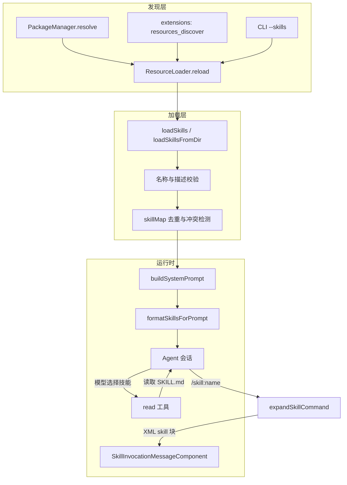
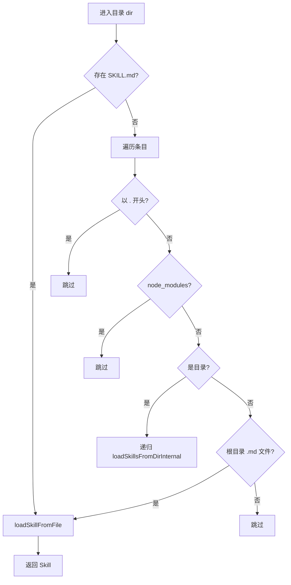
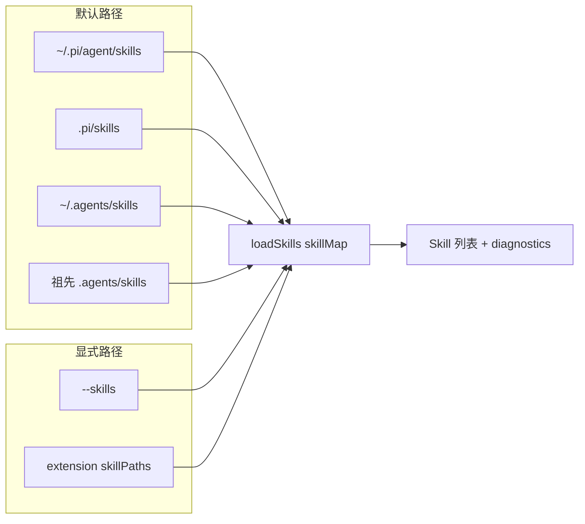
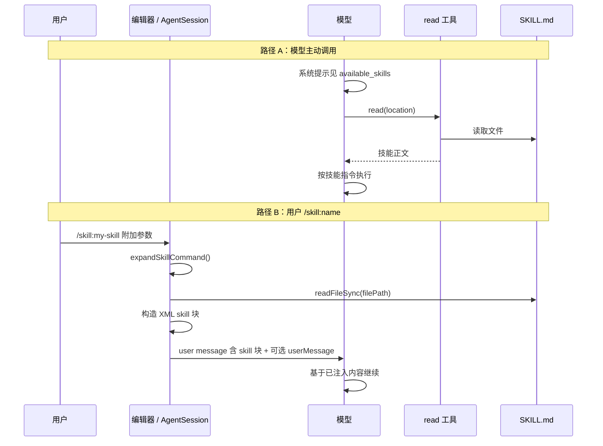
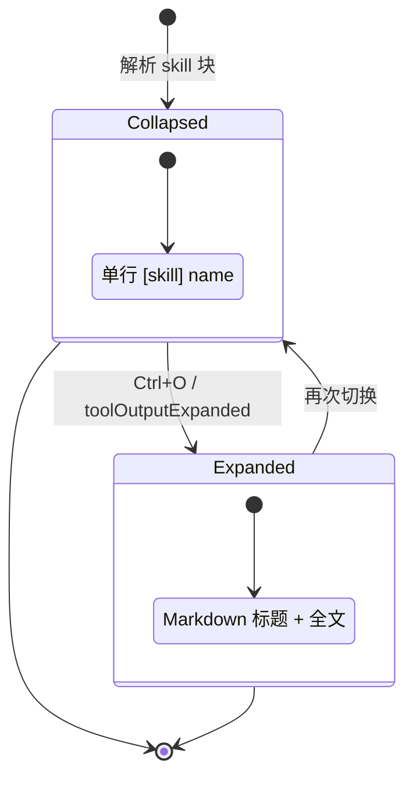

# 技能系统

技能系统实现 [Agent Skills 标准](https://agentskills.io)，为特定任务提供可复用的 Markdown 指令。核心实现位于 `packages/coding-agent/src/core/skills.ts`，由 `ResourceLoader` 聚合多路径来源，经 `formatSkillsForPrompt()` 注入系统提示，并在 TUI 中以专用组件渲染。

---

## 架构概览



---

## SKILL.md 格式

每个技能是一个 Markdown 文件，**必须**包含 YAML frontmatter 与正文指令。

```yaml
---
name: my-skill              # 可选；默认取 SKILL.md 所在目录名
description: 简短说明用途   # 必需；最长 1024 字符
disable-model-invocation: false  # 可选；true 时不出现在系统提示中
---

# 技能正文

在此编写任务专用指令、步骤、示例等。
```

| 字段 | 说明 |
|------|------|
| `name` | 小写 `a-z`、数字、连字符；最长 64 字符；不能以 `-` 开头/结尾；不能含 `--` |
| `description` | 必填；供模型判断何时加载该技能 |
| `disable-model-invocation` | 为 `true` 时仅可通过 `/skill:name` 显式调用，不会写入 `<available_skills>` |

### 目录发现规则

`loadSkillsFromDir()` 按以下规则扫描：

1. 若目录内存在 `SKILL.md`，视为技能根目录，**不再**向下递归
2. 否则扫描根目录下直接 `.md` 文件
3. 递归进入子目录查找 `SKILL.md`
4. 尊重 `.gitignore` / `.ignore` / `.fdignore`，跳过 `node_modules`



---

## 发现路径

技能由 `PackageManager` 与 `ResourceLoader` 统一解析，最终传入 `loadSkills()` 的 `skillPaths`。

| 来源 | 路径 | 作用域 |
|------|------|--------|
| 用户默认 | `~/.pi/agent/skills/` | 全局用户技能 |
| 项目默认 | `.pi/skills/`（相对 cwd） | 项目级技能 |
| Agent Skills 用户 | `~/.agents/skills/` | 跨工具共享的用户技能 |
| Agent Skills 项目 | 自 cwd 向上至 git 根（或文件系统根）的 `.agents/skills/` | 项目祖先链上的技能 |
| CLI | `--skills <path>` | 显式追加路径（文件或目录） |
| 扩展 | `resources_discover` 事件返回的 `skillPaths` | 扩展动态注册 |

### 优先级与冲突

- 同名技能：**先加载者胜出**（写入 `skillMap` 的条目保留）
- 后加载同名技能产生 `collision` 诊断，不会覆盖
- 符号链接指向同一物理文件会被 `canonicalizePath` 去重



`ResourceLoader` 调用 `loadSkills({ includeDefaults: false })`，因为默认目录已由 `PackageManager.resolve()` 展开为具体 `skillPaths`。

---

## 系统提示中的技能列表

`formatSkillsForPrompt()` 将可见技能格式化为 XML，追加到系统提示末尾（需启用 `read` 工具）：

```xml
<available_skills>
  <skill>
    <name>example</name>
    <description>...</description>
    <location>/abs/path/to/SKILL.md</location>
  </skill>
</available_skills>
```

要点：

- `disableModelInvocation === true` 的技能**不会**出现在此列表
- 提示中说明：任务匹配描述时使用 `read` 工具加载 `<location>` 文件
- 技能内相对路径应相对于 `SKILL.md` 所在目录（`baseDir`）解析

调用链：`buildSystemPrompt()` → `formatSkillsForPrompt(skills)` → 模型可见的 `<available_skills>`。

---

## 技能调用流程

存在两条主要路径：**模型主动调用**与**用户显式命令**。



### XML 包装格式

显式调用或扩展展开后，用户消息形如：

```xml
<skill name="my-skill" location="/path/to/SKILL.md">
References are relative to /path/to/skill/dir.

（SKILL.md 正文，不含 frontmatter）
</skill>

（可选：用户附加说明）
```

`parseSkillBlock()` 用正则解析该结构，供 TUI 拆分渲染。

### `/skill:name` 命令

`AgentSession.expandSkillCommand()`：

1. 识别 `/skill:` 前缀
2. 在已加载技能中按 `name` 查找
3. 读取 `SKILL.md`，剥离 frontmatter
4. 包装为上述 XML 块；未知技能则原样透传

`disable-model-invocation: true` 的技能仍可通过 `/skill:name` 使用。

---

## TUI 渲染：SkillInvocationMessageComponent

位置：`packages/coding-agent/src/modes/interactive/components/skill-invocation-message.ts`

当用户消息含 skill XML 块时，`interactive-mode.ts` 调用 `parseSkillBlock()`，用 `SkillInvocationMessageComponent` 渲染（与普通 `UserMessageComponent` 分离）。

| 状态 | 显示 |
|------|------|
| 折叠（默认） | `[skill] 技能名 (Ctrl+O to expand)` |
| 展开 | `[skill]` 标签 + Markdown 渲染的技能名与正文 |

样式：

- 背景：`theme.bg("customMessageBg")`
- 标签：`customMessageLabel`
- 正文：`customMessageText`
- 与自定义消息（custom message）视觉一致

若 XML 块后还有 `userMessage`，单独渲染为普通用户消息气泡。



---

## 扩展集成

### resources_discover

扩展可监听 `resources_discover`，返回额外 `skillPaths`：

```typescript
pi.on("resources_discover", () => ({
  skillPaths: ["/path/to/extra/skills"],
}));
```

`AgentSession` 在 reload 时合并这些路径并重新 `loadSkills`。

### 斜杠命令自动注册

已加载技能自动暴露为 `/skill:<name>`，出现在命令补全中（`source: "skill"`）。

---

## 关键类型

```typescript
interface Skill {
  name: string;
  description: string;
  filePath: string;      // SKILL.md 绝对路径
  baseDir: string;       // 技能目录（相对路径解析基准）
  sourceInfo: SourceInfo;
  disableModelInvocation: boolean;
}

interface SkillFrontmatter {
  name?: string;
  description?: string;
  "disable-model-invocation"?: boolean;
}
```

---

## 相关源文件

| 文件 | 职责 |
|------|------|
| `packages/coding-agent/src/core/skills.ts` | 加载、校验、格式化 |
| `packages/coding-agent/src/core/resource-loader.ts` | 路径聚合与 reload |
| `packages/coding-agent/src/core/package-manager.ts` | `.pi/` 与 `.agents/` 自动发现 |
| `packages/coding-agent/src/core/system-prompt.ts` | 注入技能列表 |
| `packages/coding-agent/src/core/agent-session.ts` | `/skill:` 展开、parseSkillBlock |
| `packages/coding-agent/src/modes/interactive/components/skill-invocation-message.ts` | TUI 组件 |
