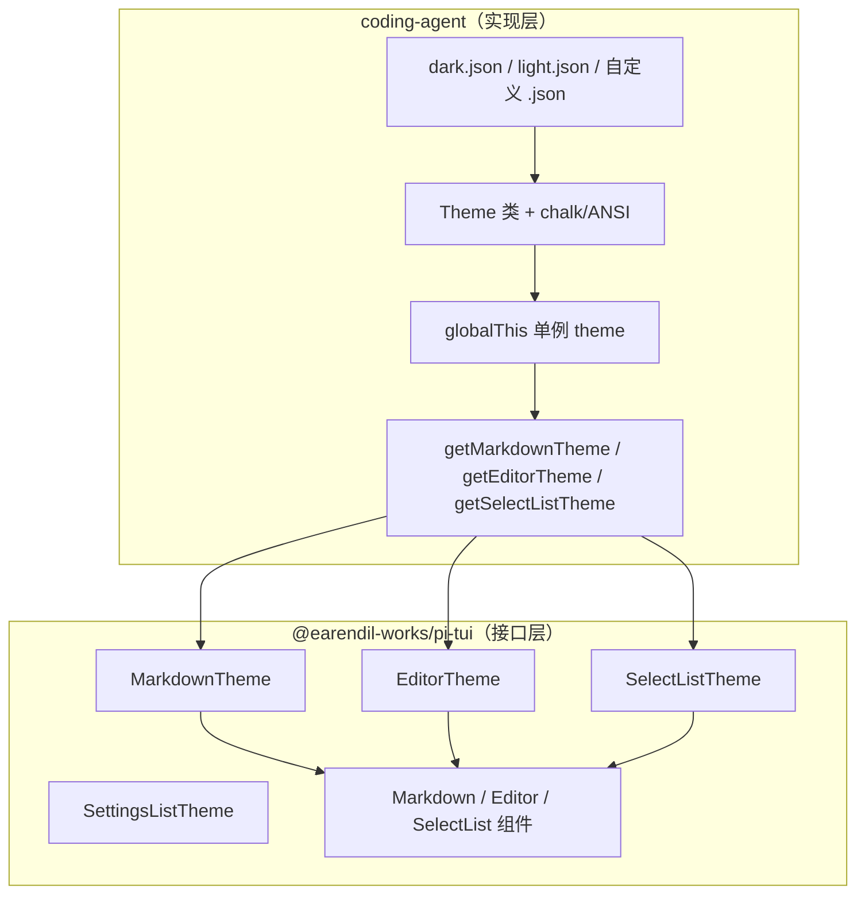
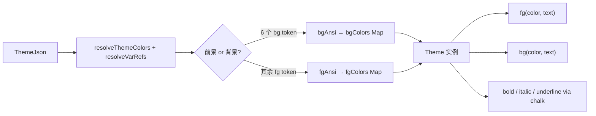
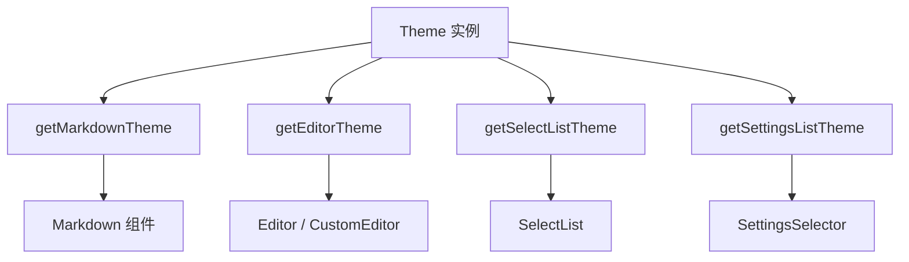
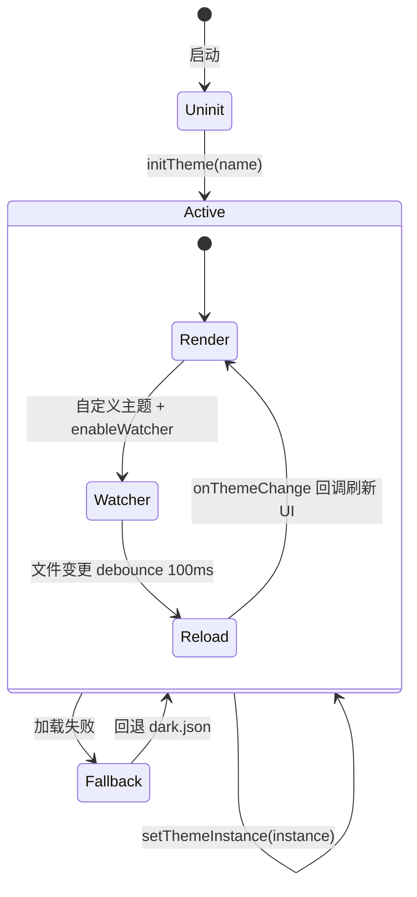
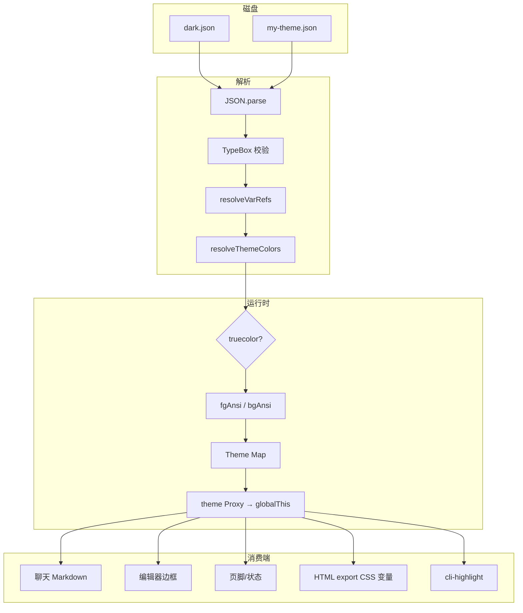

# 主题系统

Pi 的主题架构采用**接口与实现分离**：`pi-tui` 只定义渲染所需的 Theme **接口**，不内置配色；`coding-agent` 在 `packages/coding-agent/src/modes/interactive/theme/` 提供 JSON 主题文件、`Theme` 类及运行时切换逻辑。

---

## 架构分层



**设计原则**：TUI 组件只依赖 `(text: string) => string` 着色函数，不关心颜色从何而来；coding-agent 负责 JSON → ANSI 的完整管线。

---

## pi-tui 主题接口

`pi-tui` **不附带任何配色主题**，仅导出接口供下游实现：

### MarkdownTheme

用于 `Markdown` 组件渲染聊天内容、文档等：

- `heading`, `link`, `linkUrl`, `code`, `codeBlock`, `codeBlockBorder`
- `quote`, `quoteBorder`, `hr`, `listBullet`
- `bold`, `italic`, `underline`, `strikethrough`
- `highlightCode(code, lang?)` → 按行高亮的字符串数组

### EditorTheme

用于输入编辑器边框与内嵌选择列表：

```typescript
interface EditorTheme {
  borderColor: (text: string) => string;
  selectList: SelectListTheme;
}
```

### SelectListTheme

用于模型选择、命令补全等列表 UI：

- `selectedPrefix`, `selectedText`, `description`, `scrollInfo`, `noMatch`

coding-agent  additionally 提供 `getSettingsListTheme()` 用于设置面板（非 pi-tui 核心导出）。

---

## JSON 主题文件

内置主题：`dark.json`、`light.json`，各含 **50+ 颜色 token**。

### 文件结构

```json
{
  "$schema": ".../theme-schema.json",
  "name": "dark",
  "vars": {
    "accent": "#8abeb7",
    "text": "#d4d4d4"
  },
  "colors": {
    "accent": "accent",
    "text": "text",
    "mdHeading": "cyan",
    ...
  },
  "export": {
    "pageBg": "#1e1e1e",
    "cardBg": "#2d2d2d"
  }
}
```

### Token 分类（50+）

| 类别 | 示例 token | 用途 |
|------|-----------|------|
| 核心 UI（10） | `accent`, `border`, `text`, `success`, `error`, `warning` | 通用前景/边框 |
| 背景与消息（11） | `selectedBg`, `userMessageBg`, `toolPendingBg`, `toolTitle` | 消息气泡、工具块 |
| Markdown（10） | `mdHeading`, `mdLink`, `mdCodeBlock` | 富文本渲染 |
| Diff（3） | `toolDiffAdded`, `toolDiffRemoved`, `toolDiffContext` | 工具 diff 输出 |
| 语法高亮（9） | `syntaxKeyword`, `syntaxString`, `syntaxFunction` | cli-highlight |
| Thinking 边框（6） | `thinkingOff` … `thinkingXhigh` | 推理级别指示 |
| Bash 模式（1） | `bashMode` | Bash 输入模式边框 |

### vars 变量引用

`colors` 中的值可以是：

- 十六进制 `"#ff0000"`
- 256 色索引 `123`
- 空字符串 `""`（终端默认色）
- **变量名**（引用 `vars` 中的定义，支持链式解析）

---

## Theme 类：ANSI 着色引擎

`Theme` 类在构造时将解析后的颜色预计算为 ANSI 转义序列：



### 颜色模式

根据终端能力自动选择：

- `truecolor`：24 位 RGB（`\x1b[38;2;r;g;bm`）
- `256color`：将 hex 映射到最近 256 色索引

`detectTerminalBackground()` 通过 `COLORFGBG` 或 OSC 11 响应推断默认 `dark` / `light`。

### 主要方法

| 方法 | 说明 |
|------|------|
| `fg(color, text)` | 前景色，局部重置 `\x1b[39m` |
| `bg(color, text)` | 背景色，局部重置 `\x1b[49m` |
| `getThinkingBorderColor(level)` | 按 thinking 级别返回着色函数 |
| `getBashModeBorderColor()` | Bash 模式边框色 |
| `getFgAnsi` / `getBgAnsi` | 原始 ANSI 前缀（供组件直接使用） |

---

## 接口适配器

coding-agent 将全局 `theme` 实例映射为 pi-tui 接口：



`getMarkdownTheme()` 内嵌 `highlightCode()`，使用 `syntax*` token 构建 cli-highlight 主题。

---

## 自定义主题路径

| 位置 | 路径 | 说明 |
|------|------|------|
| 用户 | `~/.pi/agent/themes/*.json` | `getCustomThemesDir()` |
| 项目 | `.pi/themes/*.json` | PackageManager 自动发现 |
| 内置 | 包内 `dark.json` / `light.json` | `getThemesDir()` |
| 扩展 | `resources_discover` 返回的 `themePaths` | 动态注册 |

同名主题：**后加载覆盖先加载**（`getAvailableThemesWithPaths` 用 `seen` 去重，内置优先，自定义次之，注册主题最后）。

### theme-schema.json

`theme-schema.json` + TypeBox `ThemeJsonSchema` 在加载时校验：

- 必填 `name` 与完整 `colors` 对象
- 每个 color token 必须为 hex、256 索引或 var 引用
- 校验失败抛出详细错误，列出缺失 token

---

## 运行时主题切换



| API | 行为 |
|-----|------|
| `initTheme(name?, enableWatcher?)` | 启动时初始化；失败则静默回退 `dark` |
| `setTheme(name)` | 运行时切换；触 `onThemeChangeCallback` |
| `setThemeInstance(theme)` | 直接注入内存实例（无法 watch） |
| `onThemeChange(cb)` | UI 注册重绘回调 |
| `setRegisteredThemes([])` | 扩展/PackageManager 注册额外主题 |

全局单例通过 `Symbol.for("@earendil-works/pi-coding-agent:theme")` 存于 `globalThis`，确保 tsx/jiti 多模块加载器共享同一实例。

### 热重载

仅对**自定义主题**（非 `dark`/`light`）监听 `~/.pi/agent/themes/<name>.json` 变更，debounce 后重新 `loadThemeFromPath` 并刷新 UI。

---

## Token 流转全图



---

## 相关源文件

| 文件 | 职责 |
|------|------|
| `packages/coding-agent/src/modes/interactive/theme/theme.ts` | Theme 类、加载、切换、TUI 适配 |
| `packages/coding-agent/src/modes/interactive/theme/dark.json` | 内置暗色主题 |
| `packages/coding-agent/src/modes/interactive/theme/light.json` | 内置亮色主题 |
| `packages/coding-agent/src/modes/interactive/theme/theme-schema.json` | JSON Schema |
| `packages/tui/src/components/markdown.ts` | MarkdownTheme 接口 |
| `packages/tui/src/components/editor.ts` | EditorTheme 接口 |
| `packages/tui/src/components/select-list.ts` | SelectListTheme 接口 |
| `packages/coding-agent/src/config.ts` | `getThemesDir`, `getCustomThemesDir` |
