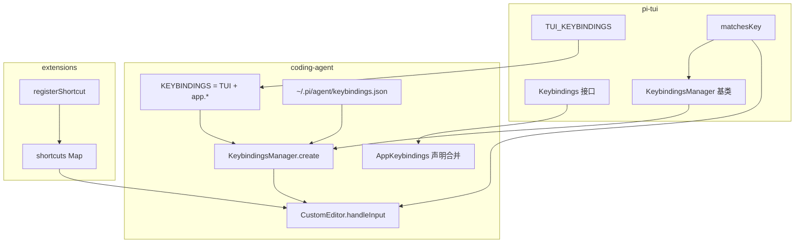
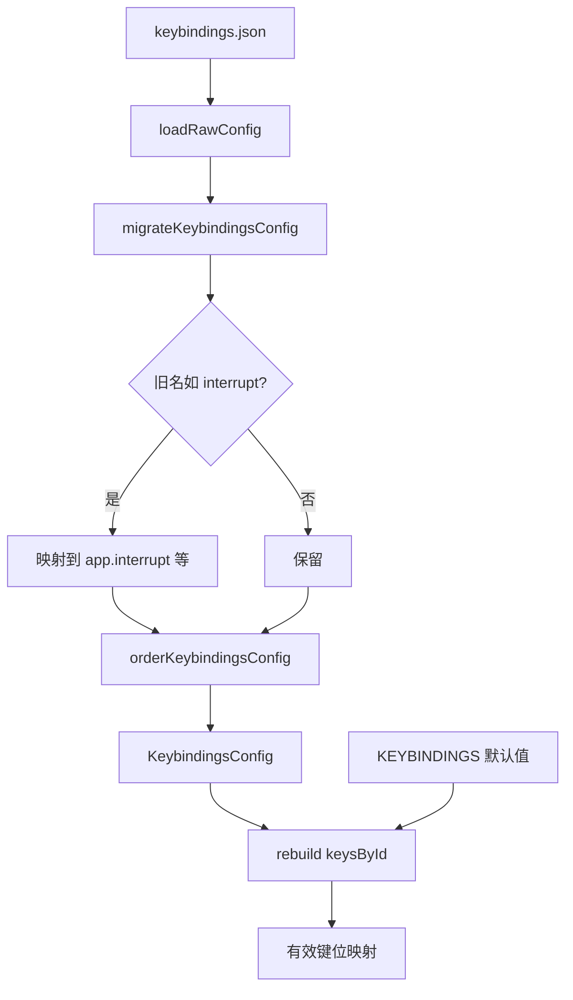
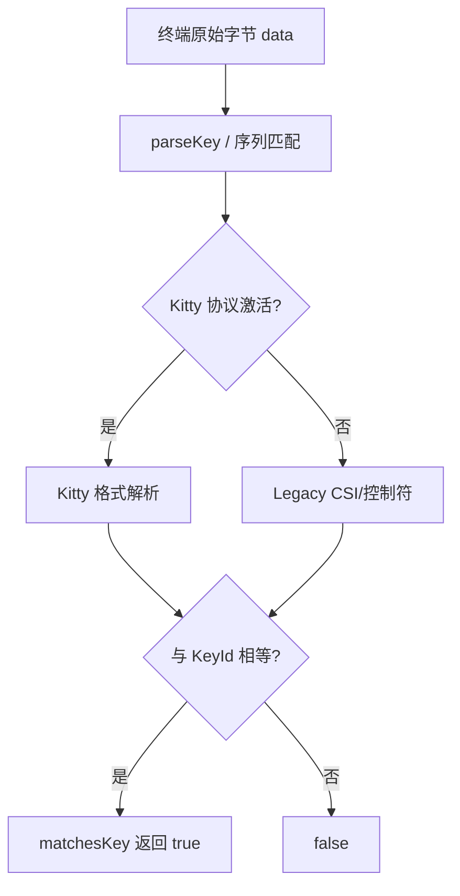
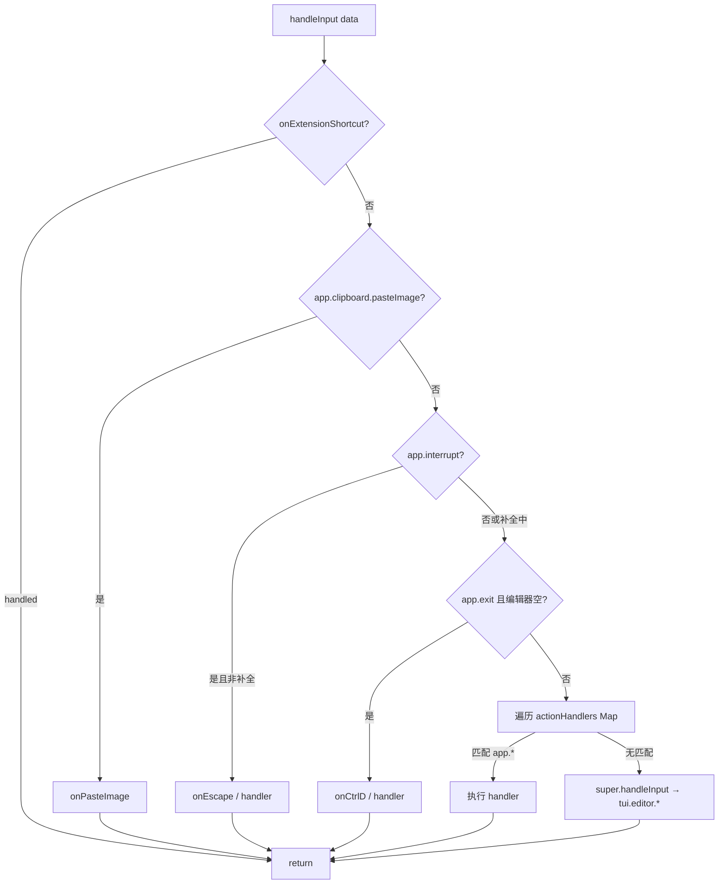
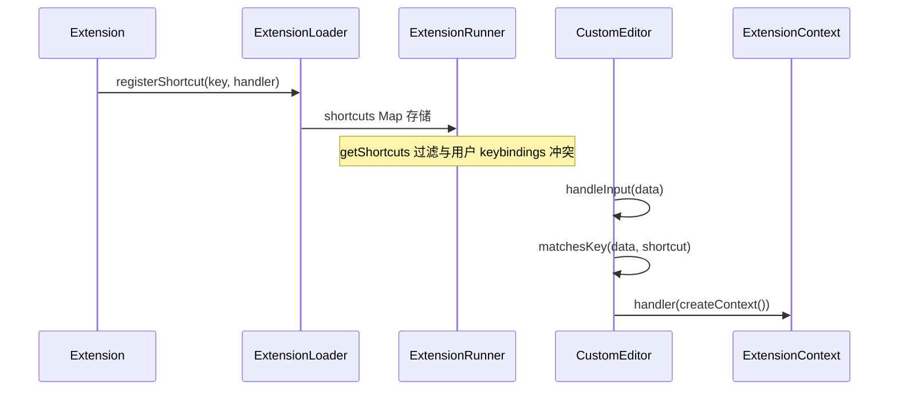
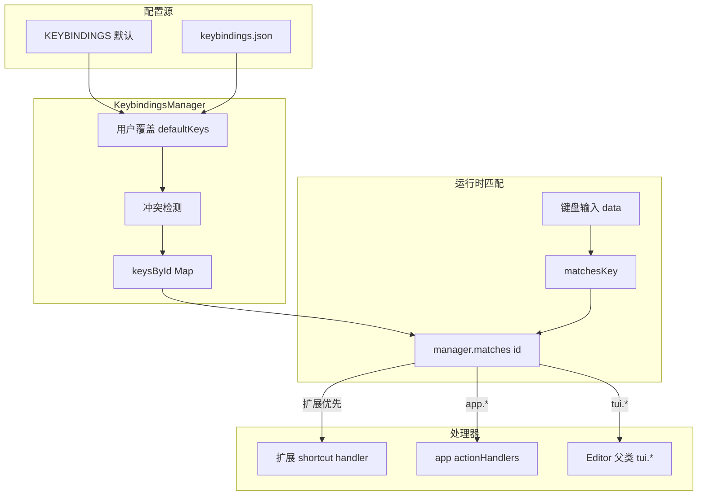

# 快捷键系统

Pi 的快捷键采用**分层注册 + 声明合并 + 用户覆盖**模型：`pi-tui` 提供编辑器/输入/选择的基础绑定；`coding-agent` 通过 TypeScript 声明合并扩展应用级快捷键；`CustomEditor` 在输入链前端拦截应用与扩展快捷键。

---

## 整体架构



---

## TUI 基础快捷键（TUI_KEYBINDINGS）

定义于 `packages/tui/src/keybindings.ts`，命名空间 `tui.*`：

### tui.editor.* — 编辑器导航与编辑

| ID | 默认键 | 说明 |
|----|--------|------|
| `tui.editor.cursorUp/Down/Left/Right` | 方向键 / `ctrl+b,f` | 光标移动 |
| `tui.editor.cursorWordLeft/Right` | `alt+方向` / `alt+b,f` | 按词移动 |
| `tui.editor.cursorLineStart/End` | `home` / `ctrl+a,e` | 行首/行尾 |
| `tui.editor.pageUp/Down` | `pageUp/Down` | 翻页 |
| `tui.editor.deleteCharBackward/Forward` | `backspace` / `delete,ctrl+d` | 删字符 |
| `tui.editor.deleteWordBackward/Forward` | `ctrl+w` / `alt+d` | 删词 |
| `tui.editor.deleteToLineStart/End` | `ctrl+u` / `ctrl+k` | 删到行首/行尾 |
| `tui.editor.yank / yankPop` | `ctrl+y` / `alt+y` | Kill ring |
| `tui.editor.undo` | `ctrl+-` | 撤销 |
| `tui.editor.jumpForward/Backward` | `ctrl+]` / `ctrl+alt+]` | 字符跳转 |

### tui.input.* — 通用输入

| ID | 默认键 |
|----|--------|
| `tui.input.newLine` | `shift+enter` |
| `tui.input.submit` | `enter` |
| `tui.input.tab` | `tab` |
| `tui.input.copy` | `ctrl+c` |

### tui.select.* — 列表选择

| ID | 默认键 |
|----|--------|
| `tui.select.up/down` | 方向键 |
| `tui.select.pageUp/Down` | `pageUp/Down` |
| `tui.select.confirm` | `enter` |
| `tui.select.cancel` | `escape`, `ctrl+c` |

---

## 应用级快捷键（app.*）

`packages/coding-agent/src/core/keybindings.ts` 扩展 `KEYBINDINGS`：

| 类别 | 示例 ID | 默认键 |
|------|---------|--------|
| 会话控制 | `app.interrupt` | `escape` |
| | `app.clear` | `ctrl+c` |
| | `app.exit` | `ctrl+d`（编辑器空时） |
| | `app.suspend` | `ctrl+z`（非 Windows） |
| 模型/思考 | `app.thinking.cycle` | `shift+tab` |
| | `app.model.cycleForward/Backward` | `ctrl+p` / `shift+ctrl+p` |
| | `app.model.select` | `ctrl+l` |
| | `app.thinking.toggle` | `ctrl+t` |
| 工具/UI | `app.tools.expand` | `ctrl+o` |
| | `app.editor.external` | `ctrl+g` |
| 消息队列 | `app.message.followUp` | `alt+enter` |
| | `app.message.dequeue` | `alt+up` |
| 剪贴板 | `app.clipboard.pasteImage` | `ctrl+v`（Win: `alt+v`） |
| 会话树 | `app.session.tree`, `app.tree.foldOrUp` 等 | 多数默认 `[]`，可配置 |
| 模型列表 | `app.models.save`, `app.models.enableAll` 等 | 上下文相关 |

部分 ID 在不同 UI 上下文（会话列表、模型选择器、树视图）复用相同物理键，由当前焦点组件决定实际处理器。

---

## 声明合并（Declaration Merging）

coding-agent 通过模块增强扩展 pi-tui 的类型系统：

```typescript
// packages/coding-agent/src/core/keybindings.ts
declare module "@earendil-works/pi-tui" {
  interface Keybindings extends AppKeybindings {}
}

export const KEYBINDINGS = {
  ...TUI_KEYBINDINGS,
  "app.interrupt": { defaultKeys: "escape", ... },
  // ...
} as const satisfies KeybindingDefinitions;
```

效果：

- `Keybinding` 联合类型自动包含 `tui.*` 与 `app.*`
- `KeybindingsManager.matches(data, "app.interrupt")` 类型安全
- 下游扩展 CustomEditor 时 IDE 可补全全部 ID

```mermaid
flowchart LR
    TUI[pi-tui Keybindings] --> MERGE[interface extends AppKeybindings]
    APP[AppKeybindings] --> MERGE
    MERGE --> UNION[Keybinding = tui.* | app.*]
    UNION --> MGR[KeybindingsManager.matches]
```

---

## KeybindingsManager.create()

```typescript
static create(agentDir = getAgentDir()): KeybindingsManager {
  const configPath = join(agentDir, "keybindings.json");
  const userBindings = KeybindingsManager.loadFromFile(configPath);
  return new KeybindingsManager(userBindings, configPath);
}
```

### 解析流程



特性：

- 用户绑定**覆盖**同 ID 的 `defaultKeys`；`[]` 表示禁用
- 检测同一物理键被多个 ID 声明的冲突（`conflicts` 数组）
- `reload()` 重新读取配置文件
- `getEffectiveConfig()` 返回合并后的完整映射

### 旧名迁移表

`KEYBINDING_NAME_MIGRATIONS` 将历史短名迁移到新命名空间，例如：

- `interrupt` → `app.interrupt`
- `cursorUp` → `tui.editor.cursorUp`
- `submit` → `tui.input.submit`

---

## matchesKey()：Legacy + Kitty 协议

`packages/tui/src/keys.ts` 提供统一键匹配：

- **Legacy 终端序列**：ESC、`^X` 控制符、CSI 序列等
- **[Kitty 键盘协议](https://sw.kovidgoyal.net/kitty/keyboard-protocol/)**：增强修饰键与 Unicode 键报告

全局状态 `setKittyProtocolActive(active)` 由 `ProcessTerminal` 在检测到协议支持后设置。



`KeybindingsManager.matches(data, id)` 遍历该 ID 绑定的所有 `KeyId`，任一匹配即返回 `true`。

---

## CustomEditor 输入拦截链

`CustomEditor` 继承 pi-tui `Editor`，重写 `handleInput()`：



优先级（从高到低）：

1. **扩展快捷键** — `registerShortcut` 注册
2. **粘贴图片** — `app.clipboard.pasteImage`
3. **中断** — `app.interrupt`（自动补全激活时交给父类取消补全）
4. **退出** — `app.exit` 仅当 `getText().length === 0`
5. **其他 app.\*** — `actionHandlers` 中注册的处理器
6. **TUI 默认** — 光标、删除、提交等 `tui.*` 行为

`interactive-mode.ts` 在启动时为各 `app.*` 动作调用 `editor.onAction(...)` 注册 handler。

### 扩展 Editor 时的快捷键转发

自定义 `EditorFactory` 若继承 `CustomEditor`，需手动转发：

```typescript
if (!customEditor.onExtensionShortcut) {
  customEditor.onExtensionShortcut = (data) =>
    this.defaultEditor.onExtensionShortcut?.(data);
}
```

---

## 扩展快捷键：registerShortcut()

扩展 API（`packages/coding-agent/src/core/extensions/loader.ts`）：

```typescript
pi.registerShortcut("ctrl+shift+m", {
  description: "My action",
  handler: async (ctx) => { /* ... */ },
});
```



`setupExtensionShortcuts()` 将 handler 包装为异步执行，错误显示在 TUI 状态栏。Shortcut handler 可通过 `ctx.compact()` 等访问会话能力。

---

## 快捷键解析链（完整）



---

## 相关源文件

| 文件 | 职责 |
|------|------|
| `packages/tui/src/keybindings.ts` | TUI_KEYBINDINGS、基类 Manager |
| `packages/tui/src/keys.ts` | matchesKey、Kitty 协议 |
| `packages/coding-agent/src/core/keybindings.ts` | app.* 定义、用户配置、迁移 |
| `packages/coding-agent/src/modes/interactive/components/custom-editor.ts` | 输入拦截链 |
| `packages/coding-agent/src/modes/interactive/interactive-mode.ts` | action 注册、扩展 shortcut  wiring |
| `packages/coding-agent/src/core/extensions/loader.ts` | registerShortcut |
| `packages/coding-agent/docs/keybindings.md` | 用户文档 |
