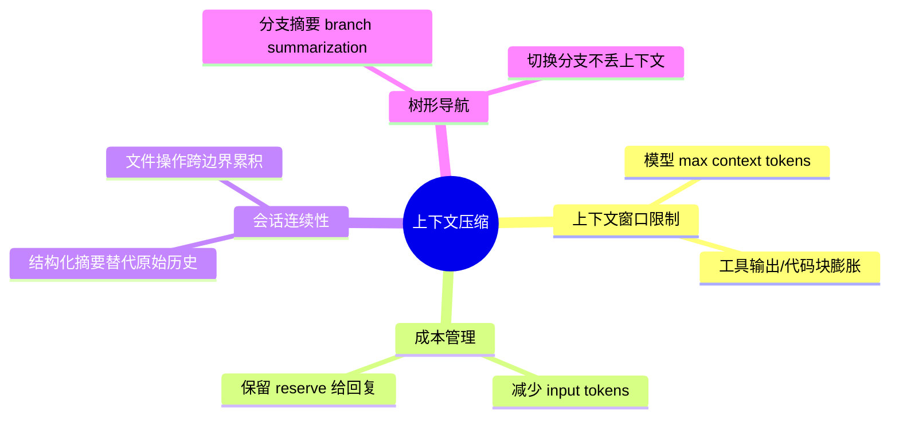
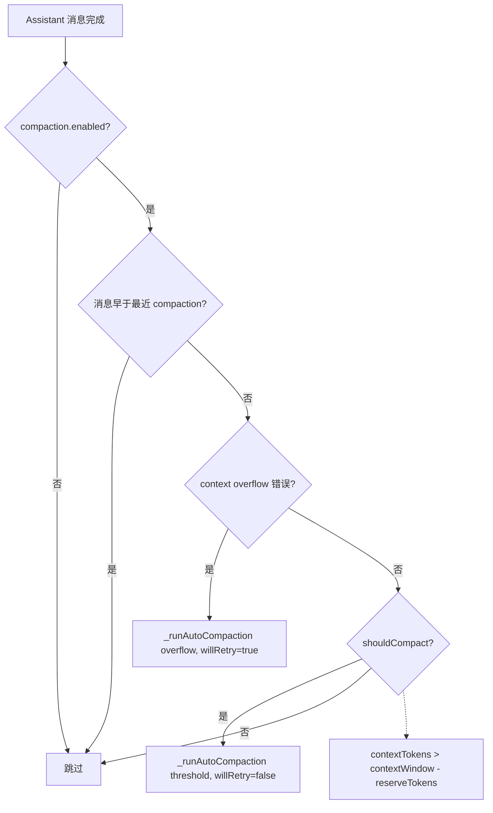
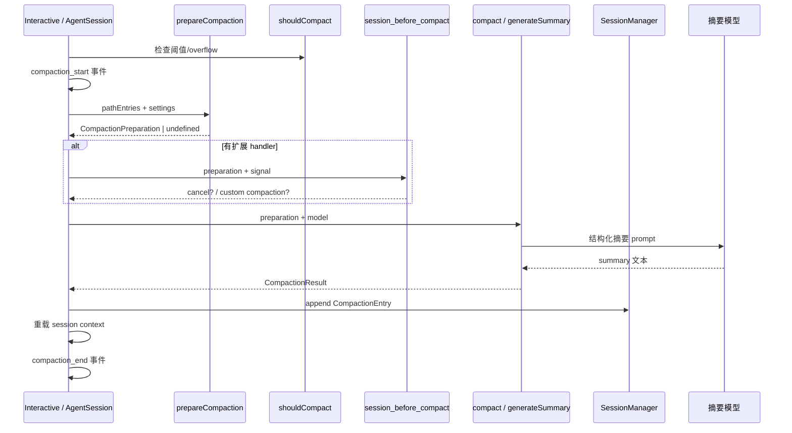
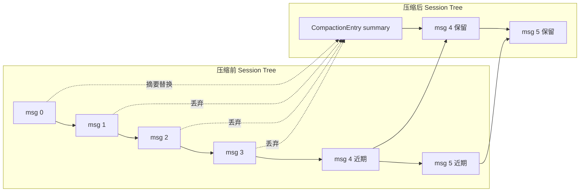
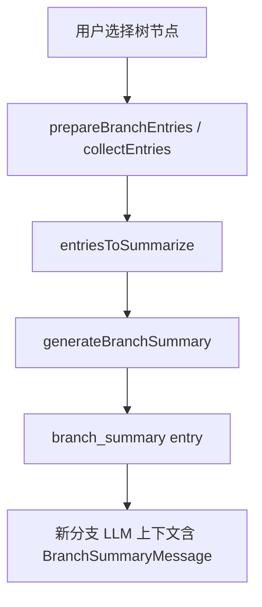
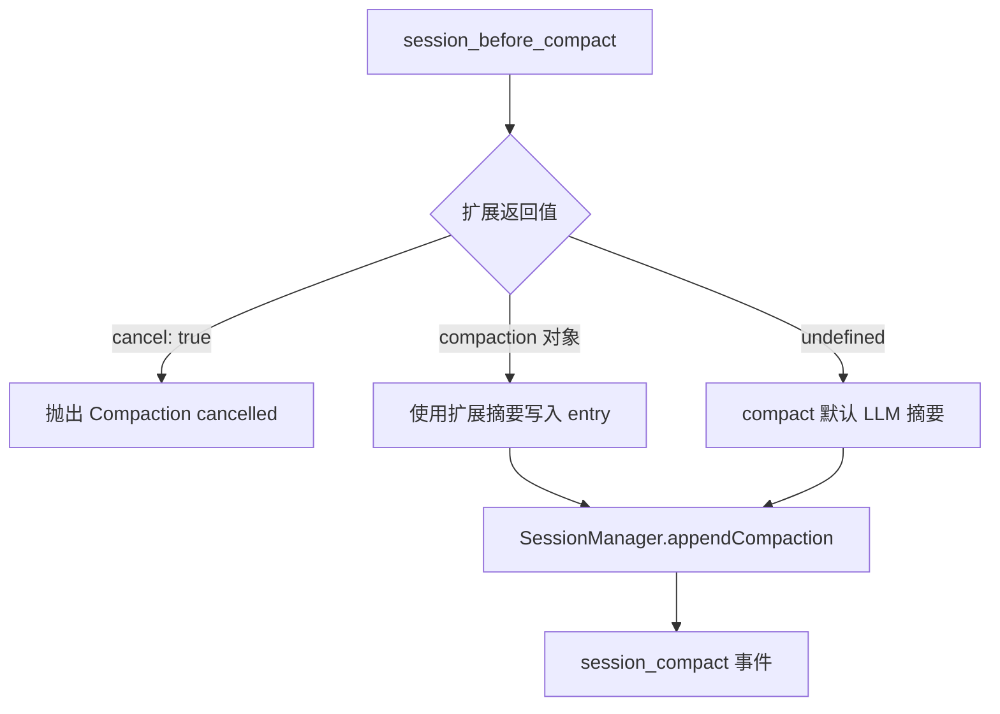

# 上下文压缩系统

当会话历史接近 LLM 上下文窗口上限时，Pi 通过**压缩（Compaction）**将较早消息替换为结构化摘要，并保留最近工作 intact。核心逻辑分布在 `packages/agent/src/harness/compaction/`（Harness 层）与 `packages/coding-agent/src/core/compaction/`（CLI/SDK 层），两者算法一致。

---

## 为什么需要压缩



| 问题 | 压缩如何解决 |
|------|-------------|
| Token 超限 / API overflow | 摘要旧消息，仅保留 `keepRecentTokens` 近期内容 |
| 重复发送大量历史 | `CompactionEntry` 一次写入，后续 LLM 只见 summary + 保留段 |
| 文件上下文丢失 | `details.readFiles` / `modifiedFiles` 累积追踪 |
| 树分支切换 | `branch_summary` 条目保存离开分支的摘要 |

---

## 默认配置

```typescript
const DEFAULT_COMPACTION_SETTINGS = {
  enabled: true,
  reserveTokens: 16384,    // 预留给摘要 prompt + LLM 输出
  keepRecentTokens: 20000, // 压缩后保留的近期 token 估算
};
```

配置位置：`~/.pi/agent/settings.json` 或 `<project>/.pi/settings.json` 的 `compaction` 段。

---

## 触发方式

### 自动压缩

在每次 assistant 响应后（及发送新 prompt 前）调用 `_checkCompaction()`：



两种自动场景：

| reason | 条件 | 压缩后行为 |
|--------|------|-----------|
| `overflow` | 同模型返回上下文溢出错误 | 移除错误 assistant 消息，压缩后**自动重试** prompt |
| `threshold` | 用量超过阈值 | 压缩，**不**自动重试，用户继续对话 |

`shouldCompact(contextTokens, contextWindow, settings)`：

```typescript
return contextTokens > contextWindow - settings.reserveTokens;
```

Token 计算优先使用 assistant `usage.totalTokens`；无 usage 时用 `estimateContextTokens()`（字符/4 启发式 + 末次 usage 外推）。

### 手动压缩

- **斜杠命令**：`/compact` 或 `/compact <自定义说明>`（聚焦摘要内容）
- 手动触发前会 `abort()` 当前 agent 操作，reason 为 `manual`

> 说明：编辑器内 `Ctrl+K` 绑定为 `tui.editor.deleteToLineEnd`（删除到行尾），**不是**压缩快捷键。手动压缩请使用 `/compact`。

---

## 压缩生命周期



### 三阶段核心函数

| 阶段 | 函数 | 输出 |
|------|------|------|
| 准备 | `prepareCompaction()` | `CompactionPreparation` 或 `undefined` |
| 判定 | `shouldCompact()` | boolean |
| 执行 | `compact()` | `CompactionResult` |

---

## prepareCompaction 详解

```mermaid
flowchart TD
    START[pathEntries] --> EMPTY{为空或末条已是 compaction?}
    EMPTY -->|是| UNDEF[返回 undefined]
    EMPTY -->|否| PREV[找上次 compaction 边界]
    PREV --> BOUND[boundaryStart .. boundaryEnd]
    BOUND --> CUT[findCutPoint keepRecentTokens]
    CUT --> SPLIT{isSplitTurn?}
    SPLIT -->|是| HIST[messagesToSummarize] + PREFIX[turnPrefixMessages]
    SPLIT -->|否| HIST_ONLY[messagesToSummarize]
    HIST --> PREP[CompactionPreparation]
    PREFIX --> PREP
    HIST_ONLY --> PREP
```

`CompactionPreparation` 字段：

- `firstKeptEntryId` — 保留历史的起始 entry UUID
- `messagesToSummarize` — 将被摘要并丢弃的消息
- `turnPrefixMessages` — 切 turn 时的前缀段（单独摘要）
- `isSplitTurn` — 是否在 turn 中间切分
- `tokensBefore` — 压缩前上下文 token 估算
- `previousSummary` — 上次 compaction 摘要（用于增量更新）
- `fileOps` — 从工具调用提取的文件读写集合

### findCutPoint 算法

从最新消息**向前**累加 `estimateTokens`，达到 `keepRecentTokens` 后，在**合法切点**处切割。

合法切点：user、assistant、custom、bashExecution、branchSummary、compactionSummary 等；**不可**在 `toolResult` 上切（须跟随其 tool call）。

---

## compact：LLM 摘要

`generateSummary()` 将对话序列化为文本，包裹在 `<conversation>` 标签中，使用固定结构化 prompt（Goal / Progress / Key Decisions / Next Steps 等）。

- 若存在 `previousSummary`，使用 **UPDATE** prompt 增量合并
- 可选 `customInstructions` 追加聚焦说明
- `isSplitTurn` 时并行生成 history 摘要 + turn prefix 摘要，合并为单一 summary

摘要末尾追加文件操作清单（`formatFileOperations`）。

---

## 压缩前后上下文结构



### CompactionEntry

持久化在 session JSONL 中：

```typescript
{
  type: "compaction",
  id: string,
  summary: string,           // 结构化摘要全文
  firstKeptEntryId: string,  // 保留段起点
  tokensBefore: number,      // 压缩前 token 估算
  details?: {                // 默认：文件追踪
    readFiles: string[];
    modifiedFiles: string[];
  },
  fromHook?: boolean          // 扩展提供的压缩
}
```

重建 LLM 上下文时：

1. 注入 `compactionSummary` 消息（含 summary 文本）
2. 从 `firstKeptEntryId` 起加载后续 entry
3. 旧消息不再进入 prompt

重复压缩时，摘要区间从上一次 `firstKeptEntryId` 边界开始，而非 compaction 节点本身，确保中间保留的消息也被纳入新一轮摘要。

---

## 分支摘要（Branch Summarization）

位置：`packages/coding-agent/src/core/compaction/branch-summarization.ts`

在会话树中导航（`/tree`）离开当前分支时触发，防止切换分支丢失工作上下文。



与 compaction 共享：

- `SUMMARIZATION_SYSTEM_PROMPT`
- 结构化摘要格式
- 文件操作累积逻辑（`details.readFiles/modifiedFiles`）

扩展可通过 `session_before_tree` 取消或自定义摘要（类似 compaction hook）。

---

## 扩展钩子：session_before_compact

```typescript
pi.on("session_before_compact", async (event, ctx) => {
  // event.preparation — prepareCompaction 结果
  // event.branchEntries — 当前分支 entries
  // event.customInstructions — /compact 传入的说明
  // event.signal — AbortSignal

  return {
    cancel: true,              // 取消压缩
    // 或
    compaction: {              // 自定义摘要，跳过默认 LLM
      summary: "...",
      firstKeptEntryId: "...",
      tokensBefore: 12345,
      details: { /* 任意 JSON */ },
    },
  };
});
```



`SessionBeforeCompactResult`：

```typescript
interface SessionBeforeCompactResult {
  cancel?: boolean;
  compaction?: CompactionResult;
}
```

压缩完成后触发 `session_compact`，携带 `compactionEntry` 与 `fromExtension` 标志。

---

## 压缩期间 UI 行为

- 发出 `compaction_start` / `compaction_end` 事件
- 压缩进行中用户输入**排队**（steering / followUp），压缩结束后恢复
- TUI 用 `CompactionSummaryMessageComponent` 渲染 `[compaction]` 消息（可折叠展开）
- Footer 在压缩后 `contextUsage.tokens` 可能为 `null`，直到下一次 assistant 响应提供新 usage

---

## Harness 与 coding-agent 双实现

| 包 | 路径 | 差异 |
|----|------|------|
| agent | `packages/agent/src/harness/compaction/` | 返回 `Result<T, CompactionError>` |
| coding-agent | `packages/coding-agent/src/core/compaction/` | 集成 SessionManager、`streamFn`、扩展事件 |

共享 utils：`serializeConversation`、`extractFileOpsFromMessage`、`formatFileOperations` 等。

---

## 相关源文件

| 文件 | 职责 |
|------|------|
| `packages/coding-agent/src/core/compaction/compaction.ts` | prepare/compact/shouldCompact |
| `packages/coding-agent/src/core/compaction/branch-summarization.ts` | 分支摘要 |
| `packages/coding-agent/src/core/compaction/utils.ts` | 序列化、文件追踪 |
| `packages/agent/src/harness/compaction/compaction.ts` | Harness 层同等逻辑 |
| `packages/coding-agent/src/core/agent-session.ts` | 自动/手动触发、扩展事件 |
| `packages/coding-agent/src/core/extensions/types.ts` | SessionBeforeCompactEvent |
| `packages/coding-agent/docs/compaction.md` | 官方文档 |
