# 设计哲学与取舍

Pi 是一个面向编码场景的多包 monorepo。其设计目标不是功能最大化，而是在**可扩展性、类型安全、供应链安全**与**运行时极简**之间取得平衡。本文档说明核心原则、关键取舍，以及这些决策如何体现在代码结构中。

## 核心原则

### 1. Stream-first，Errors-in-band

LLM 响应以**异步事件流**为首要抽象，而非一次性 Promise。错误与完成信号都作为流内事件传递，消费者通过 `for await` 或 `.result()` 统一处理。

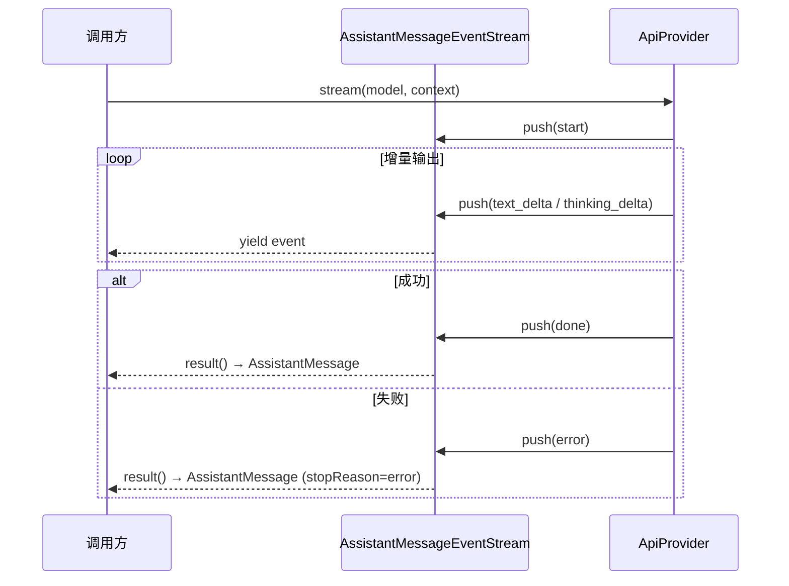

**含义：**

- UI 可以逐 token 渲染，无需等待完整响应
- 取消（AbortSignal）在流层面统一生效
- 错误不是异常抛出的唯一路径；`error` 事件携带结构化诊断信息
- 源码：`packages/ai/src/utils/event-stream.ts`、`packages/ai/src/providers/*.ts`

### 2. 依赖方向向下

四层架构严格单向依赖：

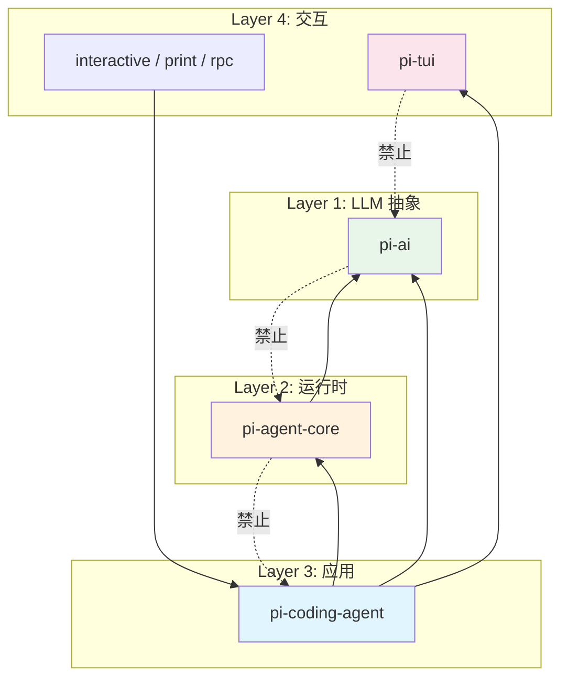

**含义：**

- `pi-tui` 是纯 UI 库，不感知 Agent 或 LLM
- `pi-ai` 不依赖 Agent 运行时
- 上层通过接口消费下层能力，而非反向耦合

### 3. 接口隔离

每层只暴露最小必要接口：

| 层 | 对外接口 | 上层用法 |
|----|---------|---------|
| pi-ai | `stream()`、`getModel()`、`registerApiProvider()` | 获取流、查模型 |
| pi-agent-core | `Agent`、`AgentHarness`、`AgentEvent` | 实例化 + 订阅 |
| pi-tui | `Component`、`TUI`、`Editor` | 实现组件、挂载 |
| pi-coding-agent | `createAgentSession()`、`ExtensionAPI` | SDK 编程 |

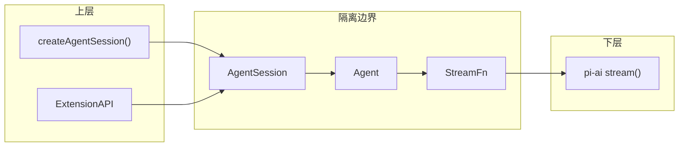

### 4. 传输抽象（StreamFn 注入）

Agent 循环不直接调用 LLM API，而是通过可注入的 `StreamFn`：

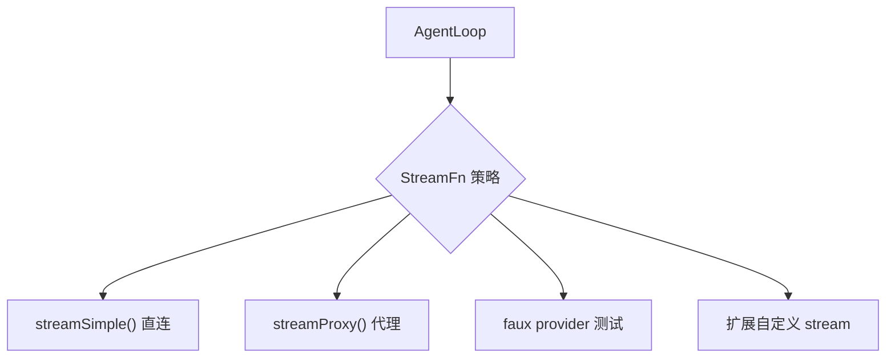

**用途：**

- 生产：直连供应商 API
- 测试：注入 faux provider，无需真实 API Key
- 扩展：包装 payload、添加 header、路由到自定义网关

源码：`packages/agent/src/types.ts`（`StreamFn`）、`packages/agent/src/agent-loop.ts`

### 5. 事件驱动解耦

扩展、会话、UI 之间通过事件总线通信，而非直接调用：

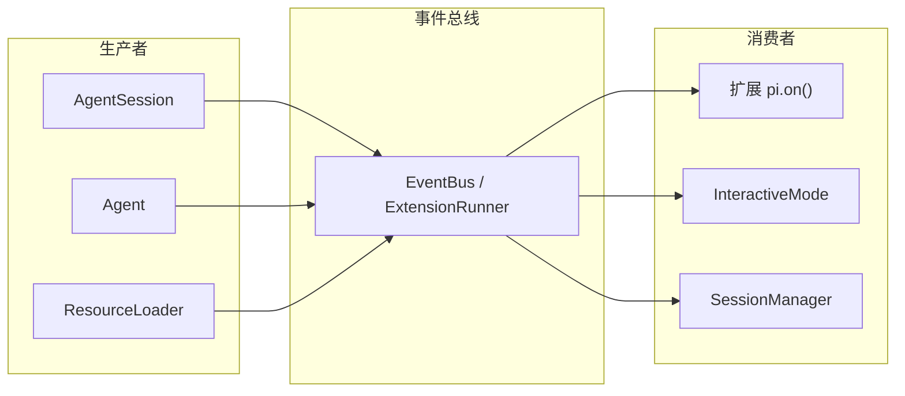

**典型事件：** `session_start`、`tool_call`、`before_agent_start`、`resources_discover`

源码：`packages/coding-agent/src/core/extensions/runner.ts`、`packages/coding-agent/src/core/event-bus.ts`

---

## 关键取舍

### Monorepo 锁步版本 vs 独立版本

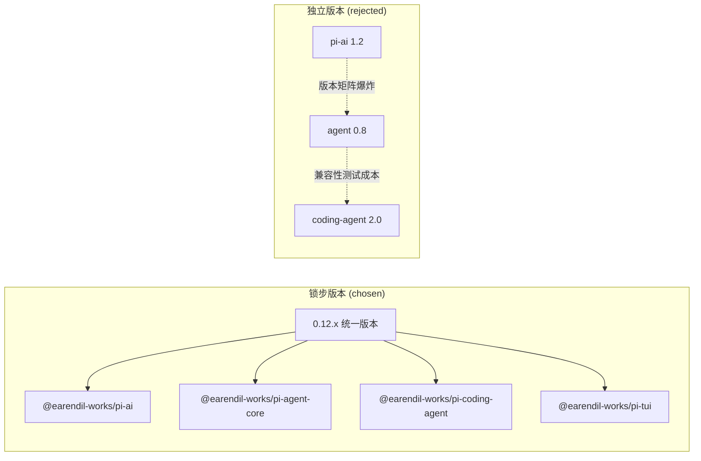

| 维度 | 锁步版本 | 独立版本 |
|------|---------|---------|
| 发布复杂度 | 低：一次 bump 全部包 | 高：需维护兼容矩阵 |
| 内部 API 演进 | 可同步 breaking change | 需 semver 约束 |
| 用户安装 | 版本号一致，不易混装 | 可能装到不兼容组合 |

**决策：** 所有包共享同一版本号，`npm run release:patch/minor` 统一发布。

### Erasable TS 语法 vs 完整 TypeScript

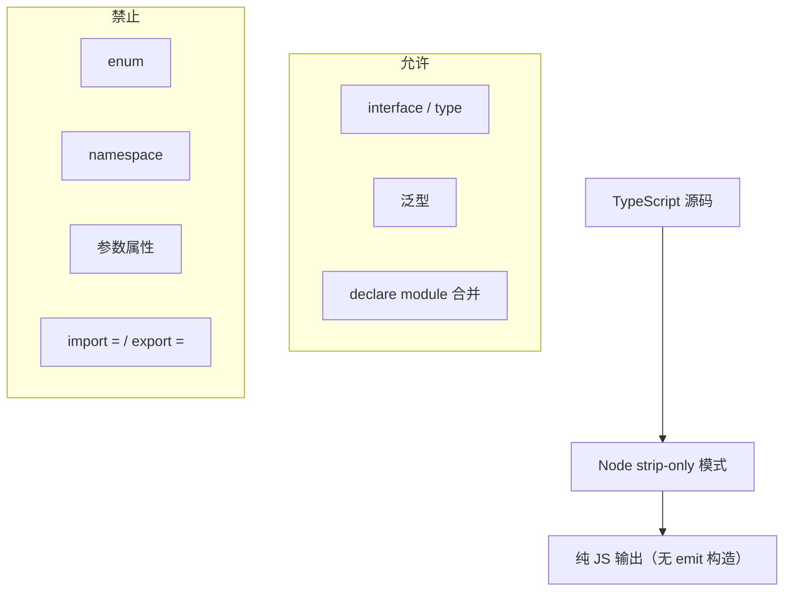

**原因：** Bun 二进制与 `tsx` 运行时直接执行 TS，不需要 tsc emit。禁止需 JS 输出的语法，保证 strip 后行为一致。

**影响：** 用显式字段 + 构造函数赋值替代 parameter properties；用 union + const 替代 enum。

规则来源：`AGENTS.md` → Code Quality

### JSONL 追加写入 vs 数据库

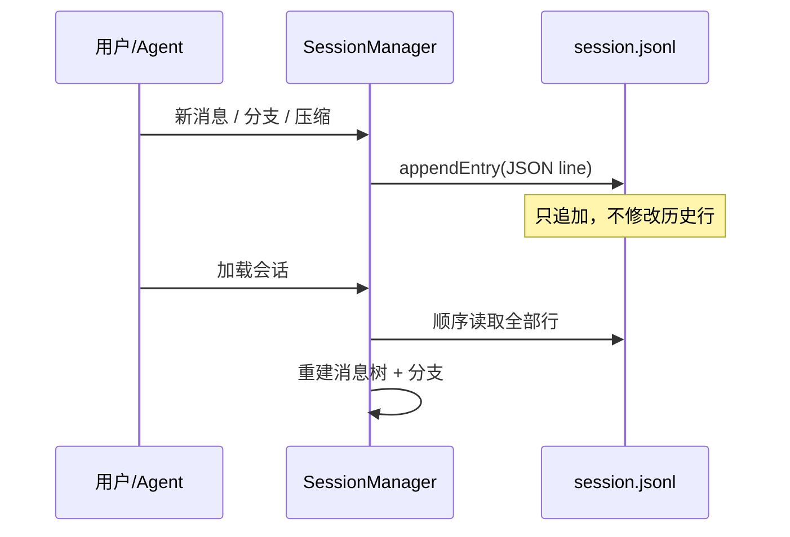

| 维度 | JSONL | 数据库 |
|------|-------|--------|
| 部署 | 零依赖，文件即会话 | 需 DB 服务 |
| 可审计 | git diff 友好 | 需导出工具 |
| 分支/压缩 | 追加 entry 类型即可 | 需 schema 迁移 |
| 并发 | 单写者假设 | 原生支持 |

**决策：** 会话持久化为 `~/.pi/agent/sessions/*.jsonl`，entry 类型包括 `message`、`branch`、`compaction`、`custom`。

源码：`packages/agent/src/harness/session/jsonl-storage.ts`、`packages/coding-agent/src/core/session-manager.ts`

### jiti 动态加载 vs 预编译扩展

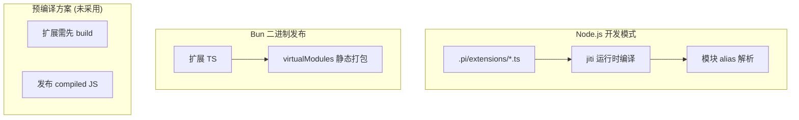

| 维度 | jiti 动态加载 | 预编译 |
|------|-------------|--------|
| 开发体验 | 改扩展即生效 | 需 rebuild |
| 依赖 | 扩展可 import typebox 等 | 需声明 peer deps |
| 二进制 | virtualModules 预打包核心依赖 | 同样可行 |
| 安全 | 需审查扩展代码 | 同样需审查 |

**决策：** 扩展以 TS 源文件形式存在，jiti 在 Node 模式加载；Bun 二进制通过 `virtualModules` 提供 `@earendil-works/pi-*` 等包。

源码：`packages/coding-agent/src/core/extensions/loader.ts`

---

## 极简主义：核心最小，扩展承载

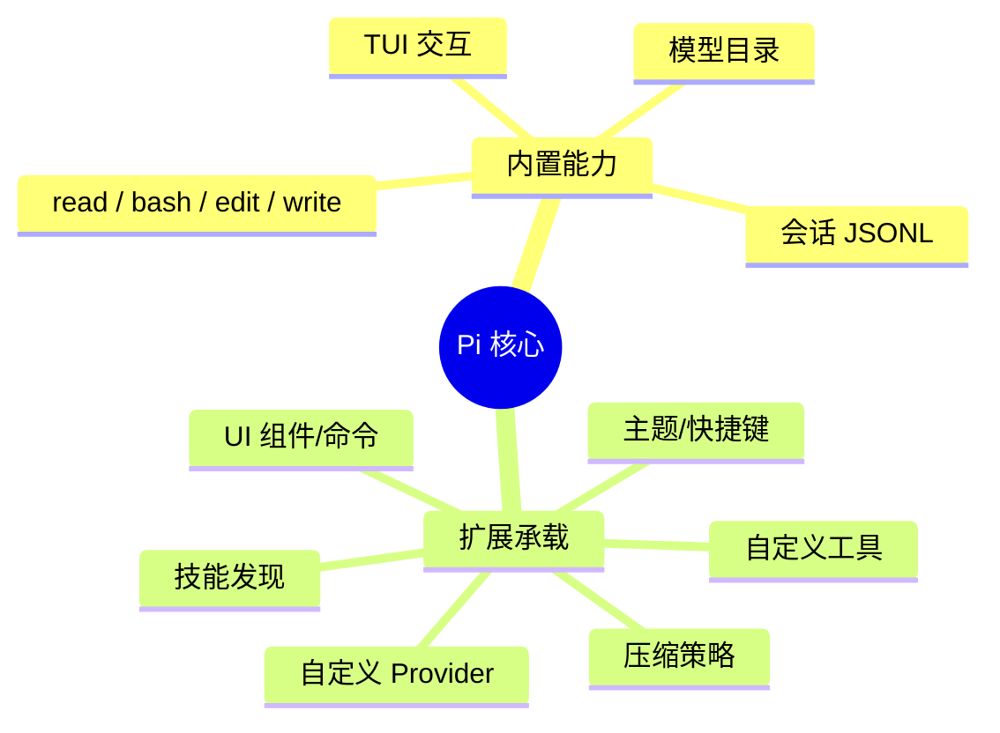

**原则：**

- 核心包只保留编码 Agent 的通用路径
- 团队/个人定制走 `.pi/extensions/` 或 `~/.pi/agent/extensions/`
- 不在核心中添加一次性功能

示例：`packages/coding-agent/examples/extensions/` 含 70+ 扩展示例，核心不内置这些行为。

---

## 供应链安全哲学

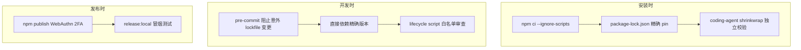

**要点：**

1. **默认不跑 lifecycle scripts**：`npm install --ignore-scripts`，防止 postinstall 恶意代码
2. **锁文件即代码**：直接依赖 pinned 到精确版本；pre-commit 需 `PI_ALLOW_LOCKFILE_CHANGE=1` 才允许改 lockfile
3. **shrinkwrap 独立校验**：`packages/coding-agent/npm-shrinkwrap.json` 单独生成与检查
4. **新依赖 lifecycle 需显式 allowlist**：`scripts/generate-coding-agent-shrinkwrap.mjs`
5. **扩展是信任边界**：扩展以用户身份运行，可访问文件系统和网络；文档强调只安装可信扩展

规则来源：`AGENTS.md` → Dependency and Install Security

---

## 设计决策全景

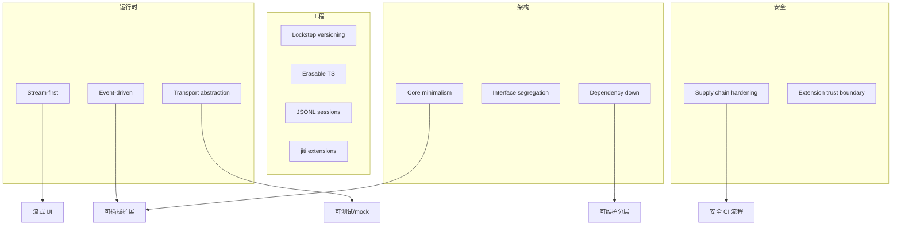

---

## 延伸阅读

- [整体架构](../02-architecture/01-architecture-overview.md)
- [事件系统](../02-architecture/04-event-system.md)
- [扩展系统](../04-subsystems/02-extension-system.md)
- [设计模式索引](./02-patterns-catalog.md)
