# 设计模式索引

本文档 catalog Pi monorepo 中使用的设计模式，每个模式附 Mermaid 图与源码位置。

---

## 1. Registry 模式

**用途：** 运行时注册与查找 Provider、API 实现、模型。

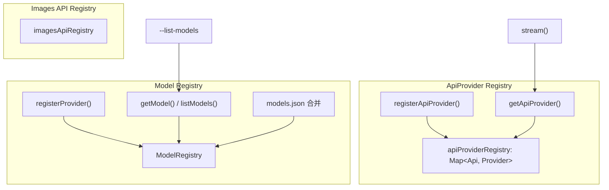

| 注册表 | 注册 API | 查找 API | 源码 |
|--------|---------|---------|------|
| ApiProvider | `registerApiProvider()` | `getApiProvider()` | `packages/ai/src/api-registry.ts` |
| Model | `ModelRegistry.registerProvider()` | `getModel()`、`findModels()` | `packages/coding-agent/src/core/model-registry.ts` |
| Images API | `registerImagesApiProvider()` | `getImagesApiProvider()` | `packages/ai/src/images-api-registry.ts` |
| 内置 Provider | `registerBuiltins()` | 启动时自动 | `packages/ai/src/providers/register-builtins.ts` |

---

## 2. Event Stream 模式

**用途：** LLM 响应的异步增量 delivery。

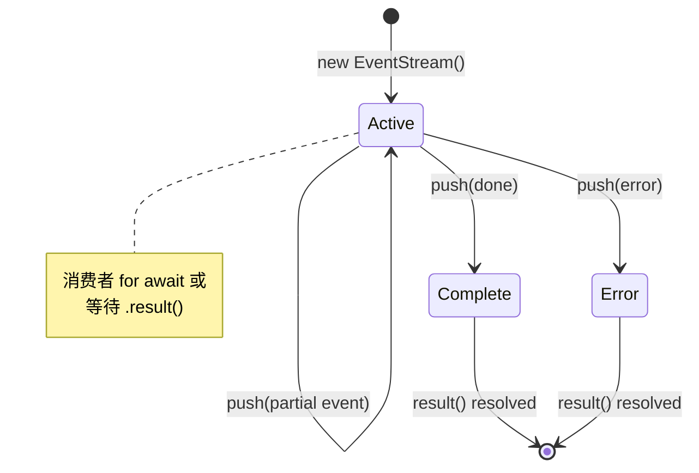

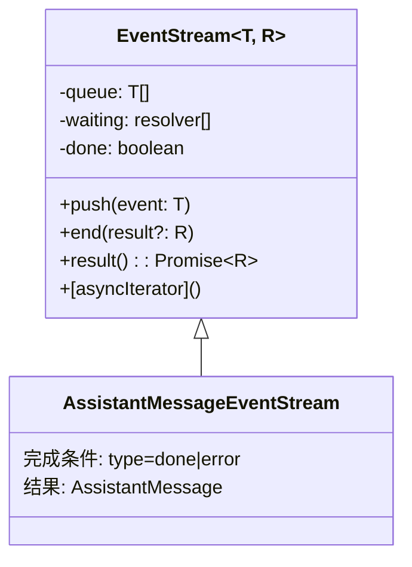

| 组件 | 源码 |
|------|------|
| `EventStream<T, R>` | `packages/ai/src/utils/event-stream.ts` |
| `AssistantMessageEventStream` | 同上 |
| `createAssistantMessageEventStream()` | 同上（扩展工厂） |
| Provider 实现 | `packages/ai/src/providers/*.ts` |

---

## 3. Declaration Merging（声明合并）

**用途：** 在不修改上游包的情况下扩展联合类型。

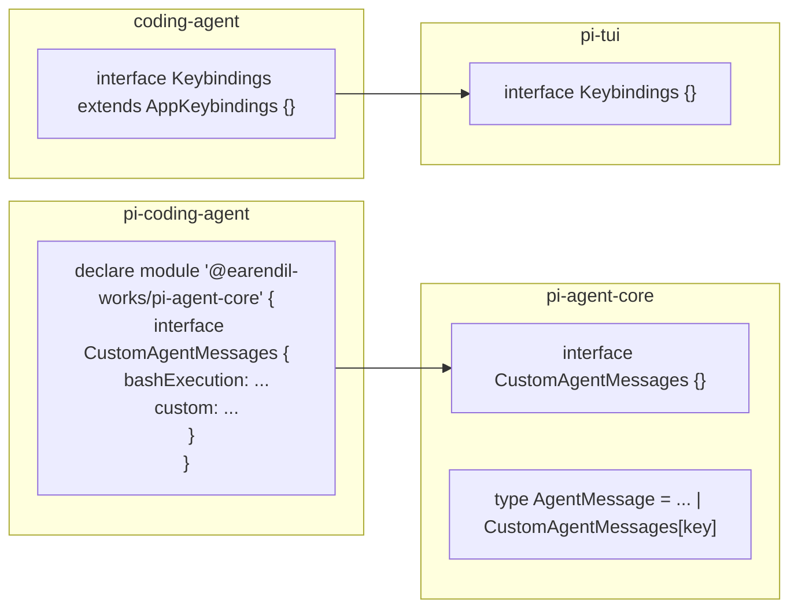

| 扩展点 | 合并位置 | 源码 |
|--------|---------|------|
| `CustomAgentMessages` | coding-agent | `packages/coding-agent/src/core/messages.ts` |
| `Keybindings` | coding-agent → pi-tui | `packages/coding-agent/src/core/keybindings.ts` |
| 示例（web-ui） | 消费者项目 | `packages/web-ui/example/src/custom-messages.ts` |

---

## 4. Factory 模式

**用途：** 创建工具、会话、Agent 实例，隐藏组装细节。

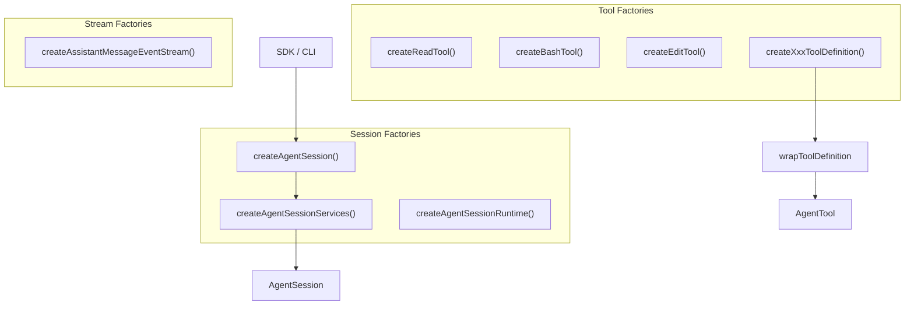

| 工厂 | 产出 | 源码 |
|------|------|------|
| `createReadTool()` 等 | `AgentTool` | `packages/coding-agent/src/core/tools/*.ts` |
| `createXxxToolDefinition()` | `ToolDefinition`（扩展用） | 同上 |
| `createAgentSession()` | `{ session, ... }` | `packages/coding-agent/src/core/sdk.ts` |
| `createAgentSessionServices()` | 服务容器 | `packages/coding-agent/src/core/agent-session-services.ts` |
| `defineTool()` | 类型安全的扩展工具 | `packages/coding-agent/src/core/extensions/types.ts` |

---

## 5. Plugin / Extension 模式

**用途：** 用户 TS 模块在运行时注册工具、命令、Provider、UI。

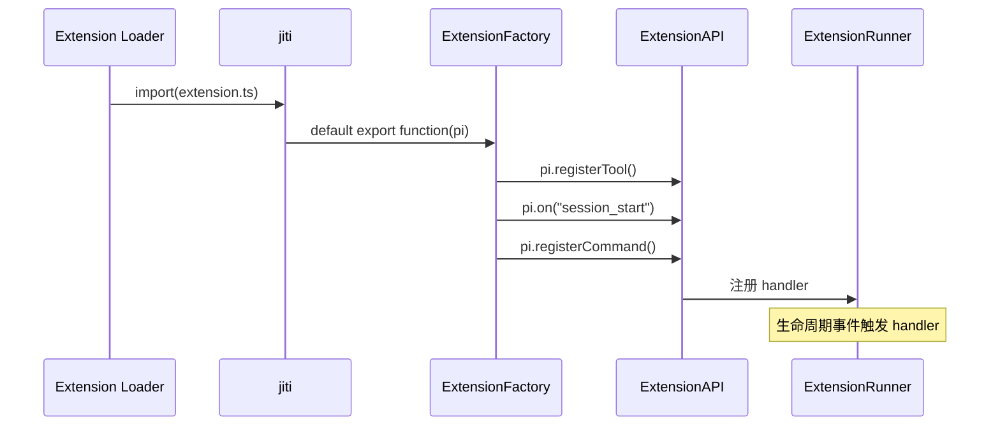

| 概念 | 类型/接口 | 源码 |
|------|----------|------|
| `ExtensionFactory` | `(pi: ExtensionAPI) => void \| Promise<void>` | `packages/coding-agent/src/core/extensions/types.ts` |
| `ExtensionAPI` | 注册/订阅/UI 上下文 | 同上 |
| Loader | jiti + virtualModules | `packages/coding-agent/src/core/extensions/loader.ts` |
| Runner | 事件分发 | `packages/coding-agent/src/core/extensions/runner.ts` |

示例：`packages/coding-agent/examples/extensions/hello.ts`

---

## 6. Result 类型模式

**用途：** 可预期失败以值返回，而非 throw。

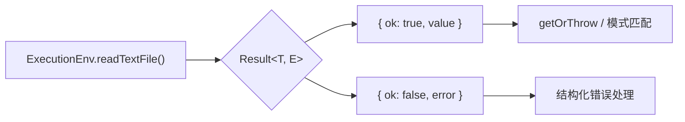

```typescript
// packages/agent/src/harness/types.ts
type Result<T, E> = { ok: true; value: T } | { ok: false; error: E };
function ok<T, E>(value: T): Result<T, E>;
function err<T, E>(error: E): Result<T, E>;
```

| 使用处 | 源码 |
|--------|------|
| `ExecutionEnv` 全部文件/进程操作 | `packages/agent/src/harness/types.ts` |
| Node.js 实现 | `packages/agent/src/harness/env/nodejs.ts` |
| `AuthStorage.withLock` | `packages/coding-agent/src/core/auth-storage.ts`（内部 LockResult） |

---

## 7. Observer 模式

**用途：** Agent 状态变化、会话事件、扩展钩子的订阅/通知。

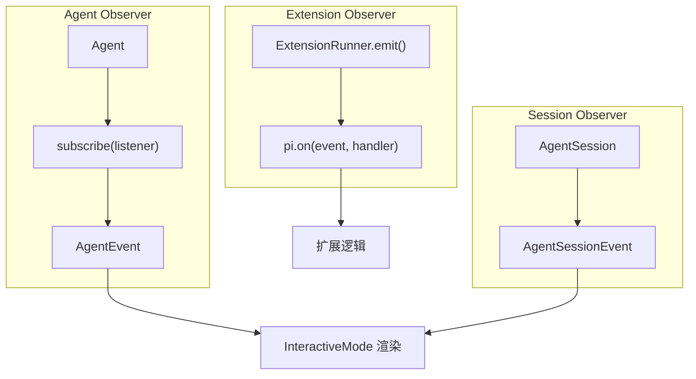

| 订阅 API | 事件类型 | 源码 |
|----------|---------|------|
| `Agent.subscribe()` | `AgentEvent` | `packages/agent/src/agent.ts` |
| `AgentSession` 事件 | `AgentSessionEvent` | `packages/coding-agent/src/core/agent-session.ts` |
| `pi.on()` | 20+ 扩展事件 | `packages/coding-agent/src/core/extensions/types.ts` |
| `EventBus` | 内部 pub/sub | `packages/coding-agent/src/core/event-bus.ts` |

---

## 8. Strategy 模式

**用途：** 运行时切换 LLM 传输策略、工具执行模式。

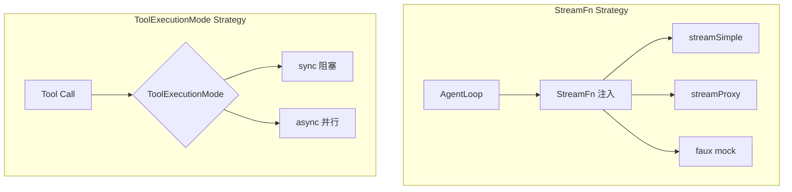

| 策略 | 配置点 | 源码 |
|------|--------|------|
| `StreamFn` | `Agent` 构造 / `createAgentSession({ streamFn })` | `packages/agent/src/types.ts` |
| `ToolExecutionMode` | Agent 配置 / 扩展 | `packages/agent/src/types.ts` |
| `QueueMode`（steering/followUp） | Settings `steeringMode` / `followUpMode` | `packages/coding-agent/src/core/settings-manager.ts` |

---

## 9. Builder 模式

**用途：** 分步构建 system prompt，组合工具说明、技能、上下文文件。

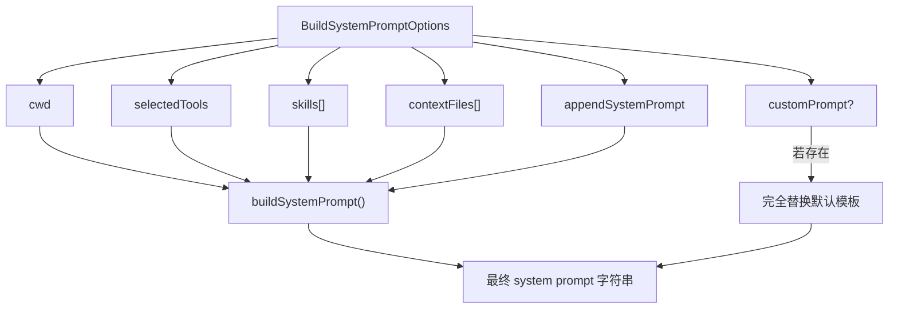

| 组件 | 源码 |
|------|------|
| `BuildSystemPromptOptions` | `packages/coding-agent/src/core/system-prompt.ts` |
| `buildSystemPrompt()` | 同上 |
| `formatSkillsForPrompt()` | `packages/coding-agent/src/core/skills.ts` |
| 扩展 hook | `pi.on("before_agent_start")` 可修改 prompt |

---

## 10. Queue 模式

**用途：** 串行化文件 mutation；排队 steering/follow-up 消息。

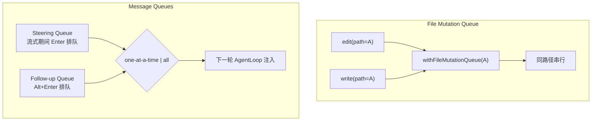

| 队列 | API | 源码 |
|------|-----|------|
| 文件 mutation | `withFileMutationQueue(path, fn)` | `packages/coding-agent/src/core/tools/file-mutation-queue.ts` |
| Steering | `session.steer()` / Enter while streaming | `packages/coding-agent/src/core/agent-session.ts` |
| Follow-up | `session.followUp()` / Alt+Enter | 同上 |
| 队列模式 | `steeringMode`、`followUpMode` settings | `packages/coding-agent/src/core/settings-manager.ts` |

---

## 模式关系总览

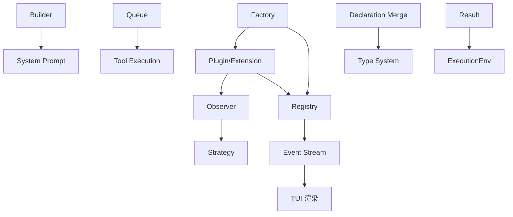

---

## 延伸阅读

- [TypeScript 类型体系](./03-type-system.md)
- [扩展系统](../04-subsystems/02-extension-system.md)
- [工具系统](../04-subsystems/01-tool-system.md)
- [事件系统](../02-architecture/04-event-system.md)
