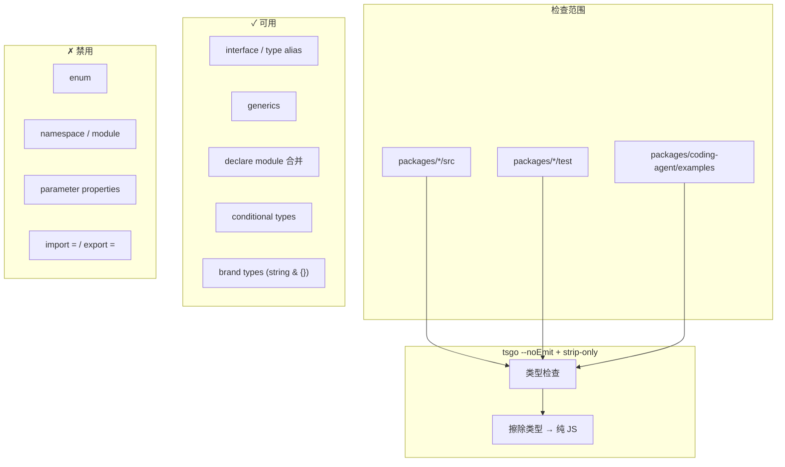
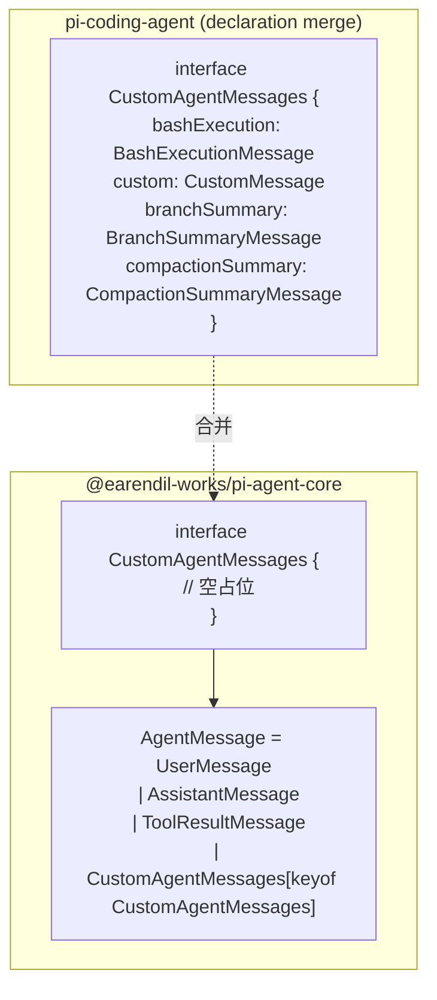
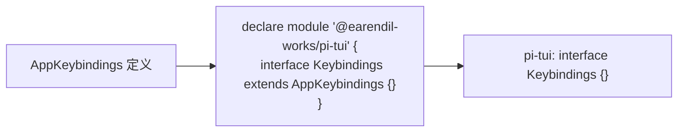
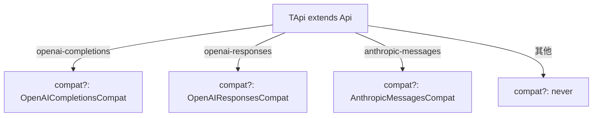
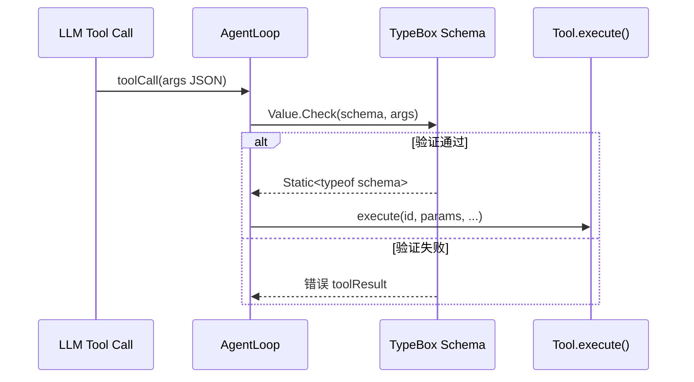
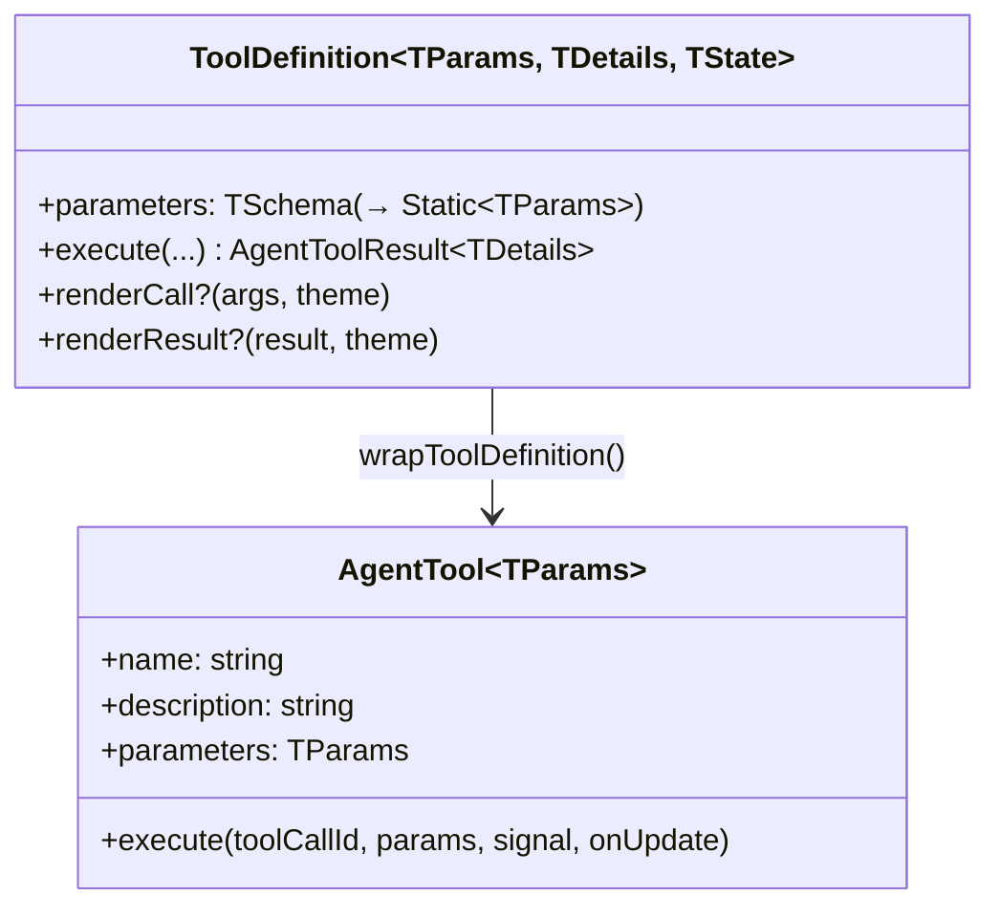
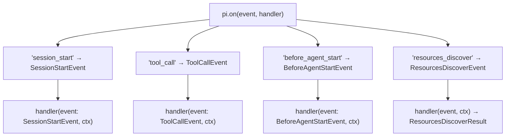
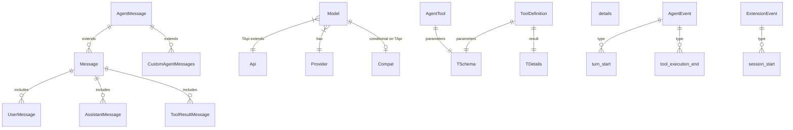
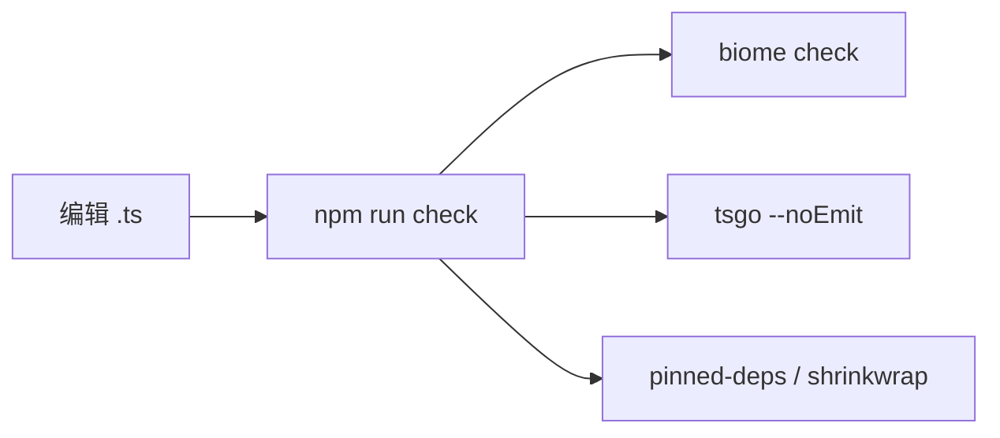

# TypeScript 类型体系

Pi 在 Node strip-only 模式下运行 TypeScript，类型系统既要保证编译期安全，又不能依赖需 emit 的语法。本文档说明约束、扩展机制与关键类型模式。

---

## Erasable 语法约束及影响



**实际影响：**

| 常见 TS 写法 | Pi 替代方案 |
|-------------|------------|
| `enum Status { Active }` | `const Status = { Active: "active" } as const` |
| `constructor(private x: T)` | 显式字段 + 构造函数赋值 |
| `namespace Foo { ... }` | 普通模块 export |
| 动态 `import("pkg").Type` | 顶层 static import |

规则：`AGENTS.md` → "Use only erasable TypeScript syntax"

---

## Declaration Merging 扩展性

### CustomAgentMessages



源码：

- 占位：`packages/agent/src/types.ts`
- 扩展：`packages/coding-agent/src/core/messages.ts`

### Keybindings



效果：`KeyId` 类型自动包含 `app.model.cycleForward` 等应用级快捷键，IDE 自动补全。

源码：`packages/coding-agent/src/core/keybindings.ts`

---

## Brand Types

**用途：** 在运行时仍是 string，但编译期区分语义不同的字符串。

```mermaid
classDiagram
    class Api {
        <<brand>>
        KnownApi | (string & {})
    end

    class Provider {
        <<union>>
        KnownProvider | string
    end

    class ImagesApi {
        <<brand>>
        KnownImagesApi | (string & {})
    end

    class Model~TApi extends Api~ {
        +id: string
        +api: TApi
        +provider: Provider
        +compat?: conditional
    }

    Model --> Api
    Model --> Provider
```

```typescript
// packages/ai/src/types.ts
export type KnownApi = "openai-completions" | "anthropic-messages" | ...;
export type Api = KnownApi | (string & {});

export type KnownProvider = "anthropic" | "openai" | ...;
export type Provider = KnownProvider | string;
```

**`(string & {})` 技巧：**

- 已知 API/Provider 有字面量自动补全
- 同时允许任意自定义字符串（扩展 Provider）
- 不同于 `string`，`(string & {})` 不会吞掉字面量联合的可区分性

---

## Conditional Types：Model.compat

`Model<TApi>` 的 `compat` 字段随 API 类型变化：



```typescript
// packages/ai/src/types.ts
export interface Model<TApi extends Api> {
  // ...
  compat?: TApi extends "openai-completions"
    ? OpenAICompletionsCompat
    : TApi extends "openai-responses"
      ? OpenAIResponsesCompat
      : TApi extends "anthropic-messages"
        ? AnthropicMessagesCompat
        : never;
}
```

**用途：** OpenAI 兼容 API 的字段名差异（如 `max_tokens` vs `max_completion_tokens`）在类型层面约束，避免给 Anthropic 模型设置 OpenAI compat。

---

## TypeBox 运行时验证



| 层次 | 用法 | 源码 |
|------|------|------|
| 工具参数 schema | `Type.Object({ path: Type.String() })` | `packages/coding-agent/src/core/tools/read.ts` |
| 运行时校验 | `Value.Check` / compile | `packages/ai/src/utils/validation.ts` |
| 扩展工具 | `defineTool({ parameters: Type.Object(...) })` | `packages/coding-agent/src/core/extensions/types.ts` |
| 类型推导 | `Static<typeof schema>` | typebox 标准用法 |

**设计：** Schema 同时服务 LLM JSON Schema 导出与运行时验证，单一来源。

---

## Generics 用法

### AgentTool\<TParameters\>



源码：

- `packages/agent/src/types.ts` — `AgentTool<TParameters>`
- `packages/coding-agent/src/core/extensions/types.ts` — `ToolDefinition<TParams, TDetails, TState>`

### defineTool 类型保留

```typescript
export function defineTool<TParams extends TSchema, TDetails = unknown, TState = any>(
  tool: ToolDefinition<TParams, TDetails, TState>,
): ToolDefinition<TParams, TDetails, TState> & AnyToolDefinition;
```

`AnyToolDefinition` 允许 heterogeneous 工具数组；泛型参数在单工具赋值时保留精确类型。

---

## Type-safe Event Handlers

`pi.on()` 使用 overload 签名，handler 的 event 参数类型与事件名绑定：



**可取消事件：** `session_before_switch`、`session_before_compact` 等 handler 返回 `{ cancel: true }` 时类型为 `{ cancel?: boolean }`。

源码：`packages/coding-agent/src/core/extensions/types.ts`（`ExtensionAPI` 接口）

---

## 核心类型关系图



---

## Result 类型（Harness 层）

与 Rust 风格一致的可预期失败：

```typescript
// packages/agent/src/harness/types.ts
export type Result<TValue, TError> =
  | { ok: true; value: TValue }
  | { ok: false; error: TError };
```

`ExecutionEnv` 所有 I/O 方法返回 `Promise<Result<T, FileError>>` 或 `Promise<Result<T, ExecutionError>>`，调用方显式分支处理。

---

## 类型检查工作流



**注意：** 类型错误不能通过降级依赖或加 `any` 绕过；应升级依赖或修正类型。

---

## 延伸阅读

- [设计模式索引](./02-patterns-catalog.md)
- [pi-ai 类型](../03-packages/01-pi-ai.md)
- [pi-agent-core](../03-packages/02-pi-agent-core.md)
- [AGENTS.md 开发规则](../../AGENTS.md)
