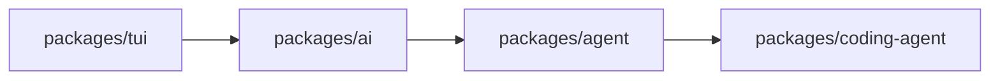
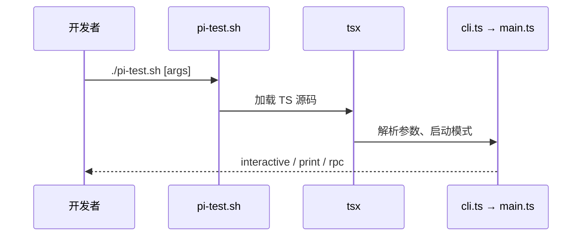
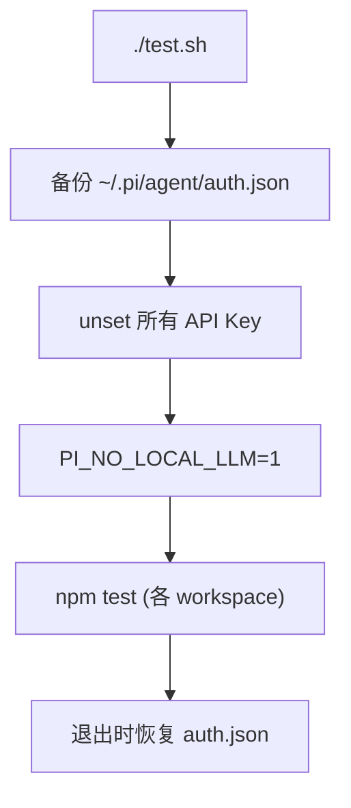
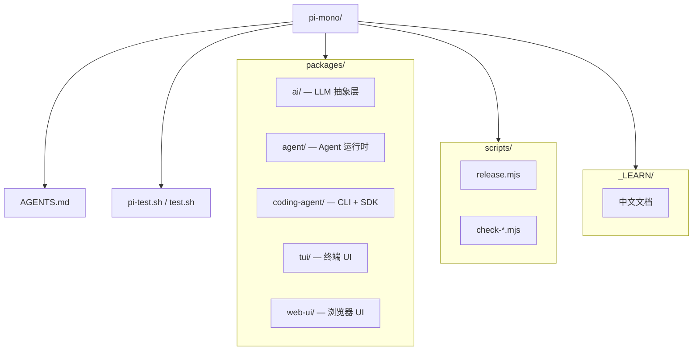
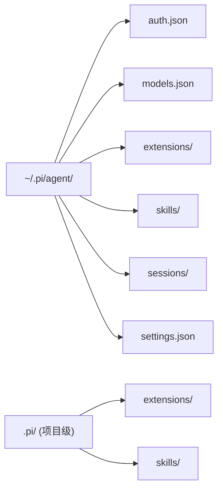
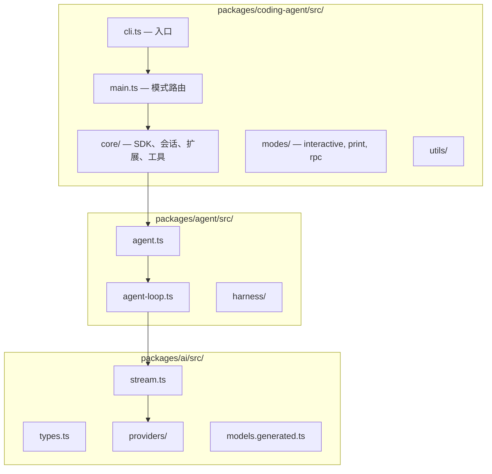

# 快速上手

本文档帮助你在本地搭建 Pi monorepo 开发环境，并运行基本检查与测试。

---

## 前置条件

| 要求 | 说明 |
|------|------|
| **Node.js** | `>= 22.19.0`（见根 `package.json` engines） |
| **npm** | 随 Node 安装即可 |
| **Git** | 克隆仓库 |
| **终端** | 推荐支持 Kitty keyboard protocol 的终端（Ghostty、Kitty、WezTerm） |

可选：API Key（真实 LLM 调用）；开发/测试可不配置，使用 faux provider。

---

## 克隆与安装

```bash
git clone https://github.com/earendil-works/pi-mono.git
cd pi-mono
npm install --ignore-scripts
```

**为何 `--ignore-scripts`：** 默认跳过 npm lifecycle scripts，降低供应链风险。见 `AGENTS.md`。

---

## 构建

```bash
npm run build
```

构建顺序（根 `package.json`）：



各包使用 `tsgo` 编译到 `dist/`。`coding-agent` 额外设置 `cli.js` 可执行权限。

---

## 从源码运行

```bash
./pi-test.sh
```

等价于：

```bash
npx tsx --tsconfig tsconfig.json packages/coding-agent/src/cli.ts
```



**无 API Key 测试：**

```bash
./pi-test.sh --no-env
```

`--no-env` 会 unset 所有已知 API Key 环境变量。

---

## 代码质量检查

```bash
npm run check
```

包含：

| 步骤 | 作用 |
|------|------|
| `biome check --write --error-on-warnings` | 格式 + lint |
| `check:pinned-deps` | 直接依赖精确 pin |
| `check:ts-imports` | TS 相对 import 规则 |
| `check:shrinkwrap` | coding-agent shrinkwrap 校验 |
| `tsgo --noEmit` | 全 monorepo 类型检查 |
| `check:browser-smoke` | web-ui 冒烟 |

**注意：** `npm run check` 不运行测试。

---

## 运行测试

```bash
./test.sh
```



**单包/单文件测试：**

```bash
# 从包根目录
node ../../node_modules/vitest/dist/cli.js --run test/specific.test.ts

# coding-agent 新测试套件
# packages/coding-agent/test/suite/ 使用 harness + faux provider
```

**不要**直接跑完整 vitest 套件（含 e2e，需真实 endpoint/auth）。

---

## 项目结构概览



### 各包职责

| 包 | npm 名 | 职责 |
|----|--------|------|
| `packages/ai` | `@earendil-works/pi-ai` | 多供应商 LLM API、模型目录 |
| `packages/agent` | `@earendil-works/pi-agent-core` | Agent 循环、Harness、会话树 |
| `packages/coding-agent` | `@earendil-works/pi-coding-agent` | CLI、扩展、工具、会话管理 |
| `packages/tui` | `@earendil-works/pi-tui` | 差分渲染终端组件 |
| `packages/web-ui` | `@earendil-works/pi-web-ui` | 浏览器 Agent 界面 |

### 用户配置目录



---

## 目录布局详图



---

## 常用命令速查

| 命令 | 用途 |
|------|------|
| `./pi-test.sh` | 开发模式启动 CLI |
| `./pi-test.sh -p "Say ok"` | 单次 print 模式 |
| `./pi-test.sh --list-models` | 列出可用模型 |
| `npm run check` | lint + 类型检查 |
| `./test.sh` | 无 API Key 测试 |
| `npm run build` | 编译全部包 |

---

## 下一步

- [代码导航指南](./02-codebase-navigation.md) — 按阅读顺序浏览源码
- [编写扩展](./03-writing-extension.md) — 第一个自定义扩展
- [调试指南](./07-debugging.md) — TUI 调试与测试技巧
