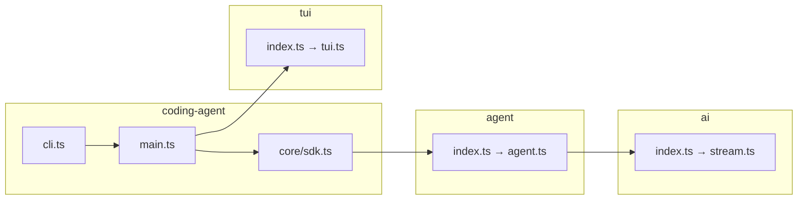
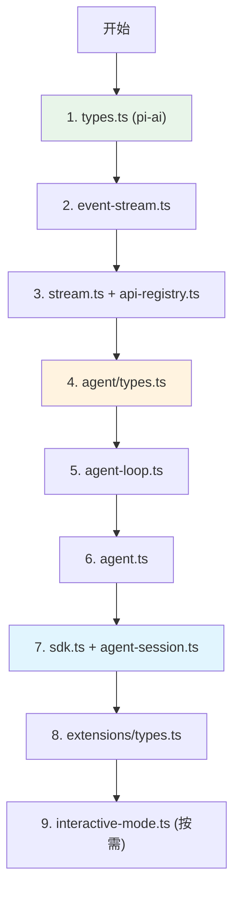
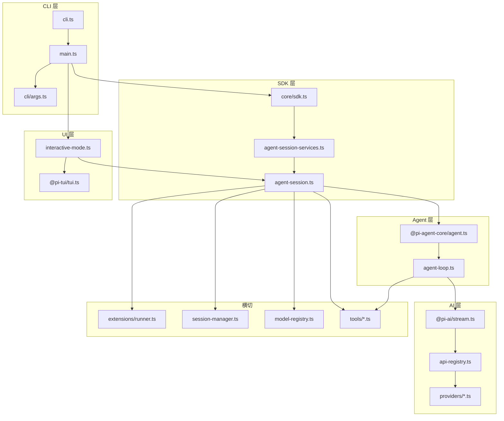

# 代码导航指南

本文档提供 Pi monorepo 的**阅读路线图**：从各包入口到关键文件，以及如何追踪一条从 CLI 到 LLM 的完整调用链。

---

## 各包入口点



| 包 | 入口文件 | 说明 |
|----|---------|------|
| coding-agent | `packages/coding-agent/src/cli.ts` | shebang 入口，调用 `main()` |
| coding-agent | `packages/coding-agent/src/main.ts` | 参数解析、模式分发 |
| coding-agent | `packages/coding-agent/src/core/sdk.ts` | `createAgentSession()` SDK |
| agent | `packages/agent/src/agent.ts` | `Agent` 类、subscribe |
| agent | `packages/agent/src/agent-loop.ts` | turn/tool 循环 |
| ai | `packages/ai/src/stream.ts` | `stream()` / `complete()` |
| tui | `packages/tui/src/tui.ts` | `TUI` 主类 |

---

## 按影响力排序的关键文件

### pi-coding-agent（应用层，优先阅读）

| 文件 | 行量级 | 影响力 | 内容 |
|------|--------|--------|------|
| `core/agent-session.ts` | ~2500 | ★★★★★ | 会话编排、steer/followUp、扩展桥接 |
| `core/extensions/types.ts` | ~1500 | ★★★★★ | ExtensionAPI、事件类型、defineTool |
| `core/extensions/runner.ts` | ~800 | ★★★★☆ | 扩展事件分发 |
| `core/sdk.ts` | ~400 | ★★★★☆ | createAgentSession 组装 |
| `modes/interactive/interactive-mode.ts` | ~5500 | ★★★★☆ | TUI 主循环、快捷键 |
| `core/session-manager.ts` | ~1000 | ★★★★☆ | JSONL 会话持久化 |
| `core/model-registry.ts` | ~900 | ★★★☆☆ | 模型目录 + models.json |
| `core/system-prompt.ts` | ~180 | ★★★☆☆ | system prompt 构建 |
| `core/tools/*.ts` | 各 ~200-400 | ★★★☆☆ | 内置工具实现 |

### pi-agent-core（运行时）

| 文件 | 影响力 | 内容 |
|------|--------|------|
| `agent.ts` | ★★★★★ | Agent 状态机、subscribe |
| `agent-loop.ts` | ★★★★★ | LLM turn + tool 执行循环 |
| `types.ts` | ★★★★☆ | AgentEvent、AgentTool、StreamFn |
| `harness/agent-harness.ts` | ★★★★☆ | 持久化 + 生命周期钩子 |
| `harness/session/jsonl-storage.ts` | ★★★☆☆ | JSONL 读写 |

### pi-ai（LLM 层）

| 文件 | 影响力 | 内容 |
|------|--------|------|
| `types.ts` | ★★★★★ | Message、Model、Api、Provider |
| `stream.ts` | ★★★★★ | 统一 stream 入口 |
| `api-registry.ts` | ★★★★☆ | ApiProvider 注册表 |
| `models.generated.ts` | ★★★☆☆ | 自动生成模型目录 |
| `providers/anthropic.ts` 等 | ★★★☆☆ | 各供应商实现 |
| `utils/event-stream.ts` | ★★★★☆ | EventStream 基础设施 |

### pi-tui（UI 层）

| 文件 | 影响力 | 内容 |
|------|--------|------|
| `tui.ts` | ★★★★★ | 渲染循环、输入分发 |
| `editor-component.ts` | ★★★★☆ | 编辑器、快捷键 |
| `components/*.ts` | ★★★☆☆ | 各类 UI 组件 |

---

## 推荐阅读顺序



**分目标阅读：**

| 目标 | 阅读路径 |
|------|---------|
| 理解 LLM 调用 | `types.ts` → `stream.ts` → `providers/anthropic.ts` |
| 理解 Agent 循环 | `agent-loop.ts` → `agent.ts` |
| 写扩展 | `extensions/types.ts` → `extensions/runner.ts` → `examples/extensions/hello.ts` |
| 写工具 | `tools/read.ts` → `extensions/types.ts` (defineTool) |
| 理解会话 | `session-manager.ts` → `harness/session/jsonl-storage.ts` |
| 理解 TUI | `tui.ts` → `interactive-mode.ts` |

---

## 追踪：CLI → LLM 完整路径

用户输入 `./pi-test.sh` 后发送一条消息的调用链：

```mermaid
sequenceDiagram
    participant CLI as cli.ts / main.ts
    participant IM as InteractiveMode
    participant AS as AgentSession
    participant AG as Agent
    participant LOOP as AgentLoop
    participant SF as StreamFn
    participant AI as pi-ai stream()
    participant PROV as ApiProvider

    CLI->>IM: 启动 interactive 模式
    IM->>AS: createAgentSession()
    Note over IM: 用户输入 + Enter
    IM->>AS: prompt(text)
    AS->>AG: prompt / continue
    AG->>LOOP: runAgentLoop()
    LOOP->>SF: streamFn(model, context)
    SF->>AI: streamSimple(model, context)
    AI->>PROV: getApiProvider(model.api)
    PROV-->>LOOP: AssistantMessageEventStream
    loop for await event
        LOOP-->>AG: AgentEvent
        AG-->>AS: 转发
        AS-->>IM: 更新 UI
    end
    alt 有 tool calls
        LOOP->>LOOP: execute tools
        LOOP->>LOOP: 继续下一轮
    end
```

### 关键跳转点

| 步骤 | 文件:符号 |
|------|----------|
| CLI 入口 | `packages/coding-agent/src/cli.ts` |
| 模式选择 | `packages/coding-agent/src/main.ts` → `InteractiveMode` |
| 会话创建 | `packages/coding-agent/src/core/sdk.ts` → `createAgentSession()` |
| 用户 prompt | `packages/coding-agent/src/core/agent-session.ts` → `prompt()` |
| Agent 循环 | `packages/agent/src/agent-loop.ts` → `runAgentLoop()` |
| Stream 调用 | `packages/agent/src/agent.ts` → `_streamFn` |
| LLM 入口 | `packages/ai/src/stream.ts` → `stream()` |
| Provider 查找 | `packages/ai/src/api-registry.ts` → `getApiProvider()` |
| 事件流 | `packages/ai/src/utils/event-stream.ts` |

---

## 文件关系图



---

## 测试代码导航

| 目录 | 用途 |
|------|------|
| `packages/coding-agent/test/suite/` | 新测试套件 + harness |
| `packages/coding-agent/test/suite/harness.ts` | faux provider 测试 harness |
| `packages/coding-agent/test/suite/regressions/` | issue 回归测试 |
| `packages/ai/test/` | LLM 层单元测试 |
| `packages/agent/test/` | Agent 循环测试 |

---

## 延伸阅读

- [整体架构](../02-architecture/01-architecture-overview.md)
- [数据流](../02-architecture/03-data-flow.md)
- [编写扩展](./03-writing-extension.md)
