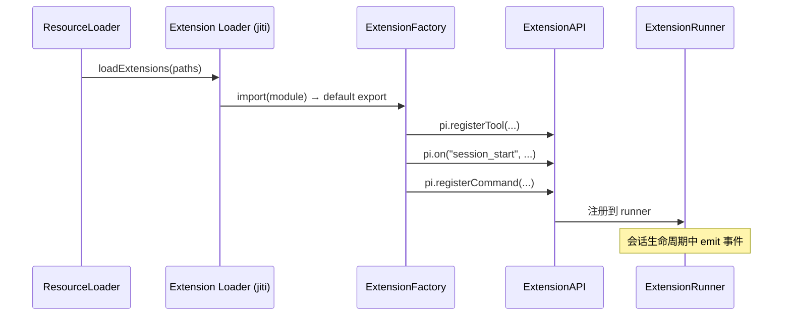
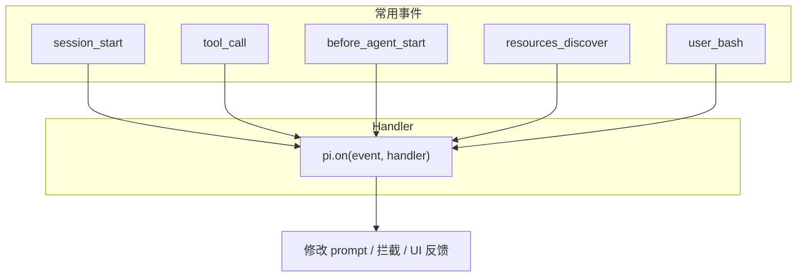
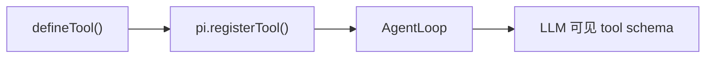
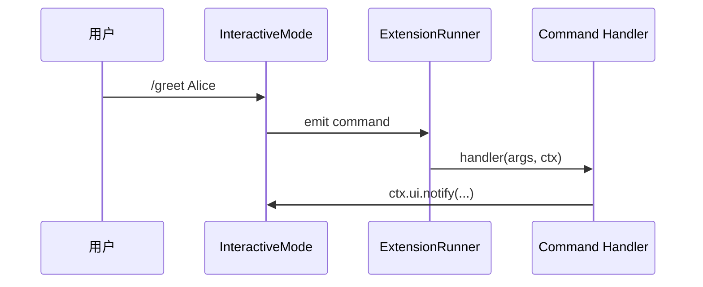
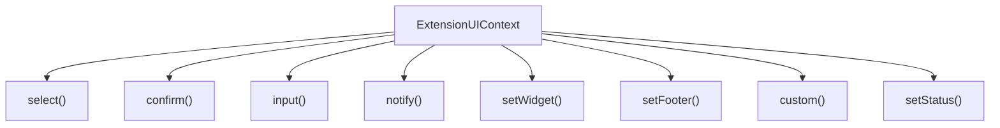
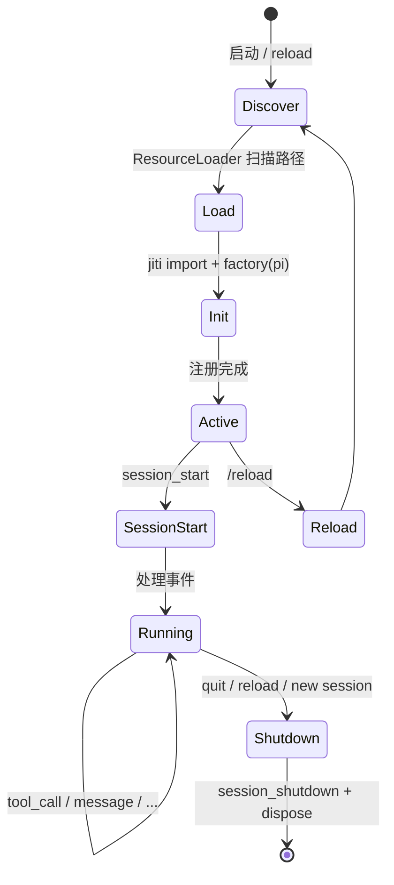

# 编写扩展

本教程演示如何创建 Pi 扩展：订阅事件、注册工具与命令、访问 UI 上下文。

---

## 扩展是什么

扩展是一个 **TypeScript 模块**，默认 export 一个 `ExtensionFactory` 函数：

```typescript
import type { ExtensionAPI } from "@earendil-works/pi-coding-agent";

export default function (pi: ExtensionAPI) {
  // 注册工具、命令、事件 handler
}
```

Pi 在启动时通过 jiti 加载扩展并调用 factory。

---

## 创建扩展文件

```bash
mkdir -p .pi/extensions
```

创建 `.pi/extensions/my-extension.ts`：

```typescript
import { Type } from "@earendil-works/pi-ai";
import { defineTool, type ExtensionAPI } from "@earendil-works/pi-coding-agent";

export default function (pi: ExtensionAPI) {
  // 内容见下文各节
}
```

**加载位置（优先级从低到高）：**

| 路径 | 范围 |
|------|------|
| `~/.pi/agent/extensions/` | 用户全局 |
| `.pi/extensions/` | 项目本地 |
| npm/git 包（settings 配置） | 可共享 |

---

## ExtensionFactory 模式



**类型签名：**

```typescript
// packages/coding-agent/src/core/extensions/types.ts
export type ExtensionFactory = (pi: ExtensionAPI) => void | Promise<void>;
```

Factory 可以是 async；加载器会 await。

---

## 订阅事件

```typescript
pi.on("session_start", async (event, ctx) => {
  ctx.ui.notify(`Session started: ${event.reason}`, "info");
});

pi.on("tool_call", async (event, ctx) => {
  console.log(`Tool: ${event.toolName}`, event.args);
});

pi.on("before_agent_start", async (event, ctx) => {
  return { systemPrompt: event.systemPrompt + "\nExtra instruction." };
});
```



**可取消事件：** `session_before_switch`、`session_before_compact` 等返回 `{ cancel: true }` 可阻止操作。

完整事件列表：`packages/coding-agent/src/core/extensions/types.ts`

---

## 注册工具

使用 `defineTool()` 保留类型：

```typescript
const helloTool = defineTool({
  name: "hello",
  label: "Hello",
  description: "A simple greeting tool",
  parameters: Type.Object({
    name: Type.String({ description: "Name to greet" }),
  }),

  async execute(_toolCallId, params, _signal, _onUpdate, _ctx) {
    return {
      content: [{ type: "text", text: `Hello, ${params.name}!` }],
      details: { greeted: params.name },
    };
  },
});

pi.registerTool(helloTool);
```



参考：`packages/coding-agent/examples/extensions/hello.ts`

---

## 注册命令

Slash 命令（`/mycommand`）：

```typescript
pi.registerCommand("greet", {
  description: "Show a greeting dialog",
  handler: async (args, ctx) => {
    const name = args.trim() || "world";
    ctx.ui.notify(`Hello, ${name}!`, "info");
  },
});
```



参考：`packages/coding-agent/examples/extensions/commands.ts`

---

## 访问 UI 上下文

`ExtensionContext.ui` 提供交互能力（interactive 模式最完整）：

```typescript
pi.registerCommand("pick", {
  description: "Pick an option",
  handler: async (_args, ctx) => {
    const choice = await ctx.ui.select("Pick one", ["A", "B", "C"]);
    if (choice) {
      ctx.ui.notify(`You picked ${choice}`, "info");
    }

    const ok = await ctx.ui.confirm("Continue?", "Are you sure?");
    if (ok) {
      ctx.ui.setStatus("my-ext", "Confirmed");
    }
  },
});
```



**注意：** print/rpc 模式 UI 方法可能是 no-op 或简化实现。

---

## 扩展生命周期



| 阶段 | 触发 | 扩展可做什么 |
|------|------|-------------|
| 加载 | 启动、`/reload` | registerTool/Command/Provider |
| session_start | 新会话/恢复/分支 | 读 sessionManager、恢复状态 |
| 运行中 | 各 Agent/用户事件 | 拦截、修改、UI |
| session_shutdown | 退出/重载 | 清理资源 |

源码：`packages/coding-agent/src/core/extensions/runner.ts`

---

## 完整示例骨架

```typescript
import { Type } from "@earendil-works/pi-ai";
import { defineTool, type ExtensionAPI } from "@earendil-works/pi-coding-agent";

export default function myExtension(pi: ExtensionAPI) {
  // 1. 工具
  pi.registerTool(defineTool({
    name: "my_tool",
    label: "My Tool",
    description: "Does something",
    parameters: Type.Object({ input: Type.String() }),
    async execute(_id, params) {
      return { content: [{ type: "text", text: params.input }] };
    },
  }));

  // 2. 命令
  pi.registerCommand("myext", {
    description: "My extension command",
    handler: async (_args, ctx) => {
      ctx.ui.notify("Extension command ran", "info");
    },
  });

  // 3. 事件
  pi.on("session_start", async (_event, ctx) => {
    ctx.ui.setStatus("my-ext", "ready");
  });

  pi.on("session_shutdown", async () => {
    // cleanup
  });
}
```

---

## 调试扩展

1. 修改 `.pi/extensions/my-extension.ts`
2. 在 TUI 中执行 `/reload` 或重启 `./pi-test.sh`
3. 加载错误会显示在启动 diagnostics 中

---

## 延伸阅读

- [扩展系统](../04-subsystems/02-extension-system.md)
- [添加工具](./05-adding-tool.md)
- [添加 Provider](./04-adding-provider.md)
- 示例目录：`packages/coding-agent/examples/extensions/`
