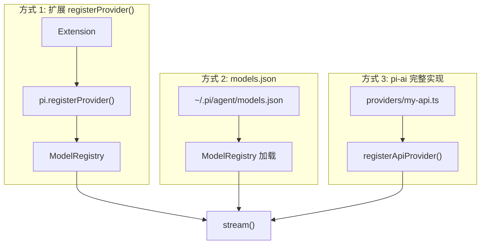
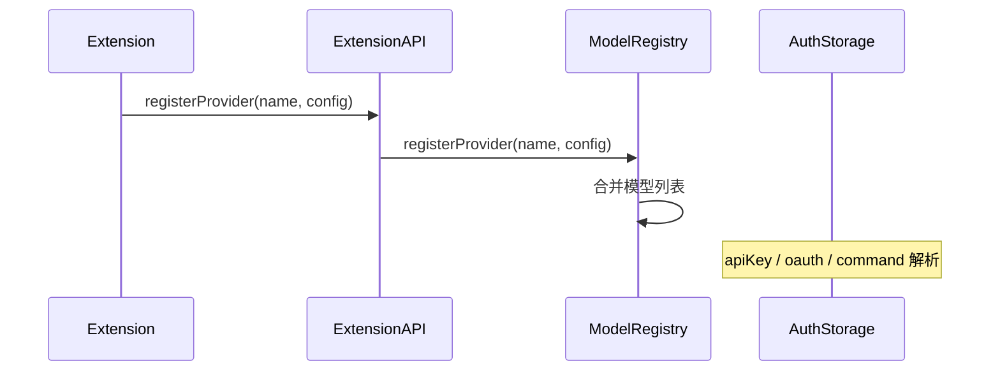
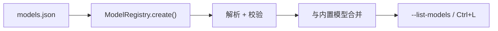
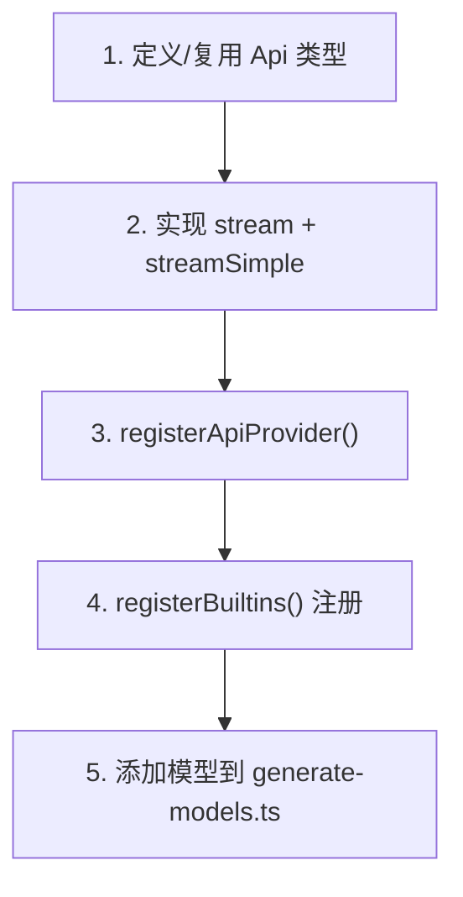
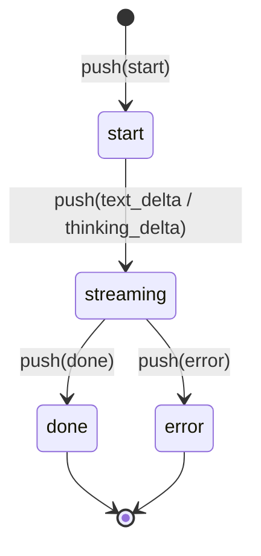
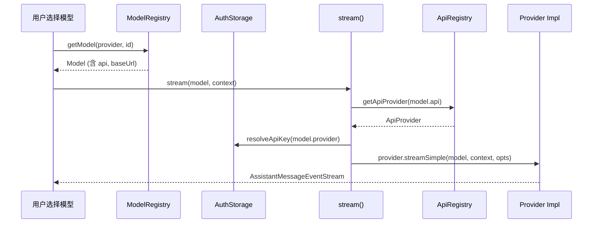

# 添加新 Provider

Pi 支持三种粒度添加 LLM Provider：扩展内轻量注册、models.json 配置、pi-ai 完整 API 实现。

---

## 三种方式对比



| 方式 | 复杂度 | 适用场景 |
|------|--------|---------|
| `registerProvider()` | 低 | 代理已有 API（改 baseUrl/header） |
| `models.json` | 低 | Ollama、vLLM、OpenAI 兼容端点 |
| pi-ai 新 Api 实现 | 高 | 全新协议、需自定义流解析 |

---

## 方式 1：扩展 registerProvider()

在扩展 factory 中注册：

```typescript
import type { ExtensionAPI } from "@earendil-works/pi-coding-agent";

export default function (pi: ExtensionAPI) {
  pi.registerProvider("my-proxy", {
    baseUrl: "https://my-gateway.example/v1",
    api: "openai-completions",
    models: [
      {
        id: "my-model",
        name: "My Model",
        reasoning: false,
        input: ["text"],
        cost: { input: 0, output: 0, cacheRead: 0, cacheWrite: 0 },
        contextWindow: 128000,
        maxTokens: 8192,
      },
    ],
    apiKey: "sk-...", // 或 command: "op read ..."
  });
}
```



**ProviderConfig 关键字段：**

| 字段 | 说明 |
|------|------|
| `baseUrl` | API 端点 |
| `api` | 使用的 Api 类型（如 `openai-completions`） |
| `models` | 模型数组 |
| `apiKey` | 静态 key 或 `{ command: "..." }` |
| `headers` | 自定义 HTTP 头 |
| `streamSimple` | 可选：完全自定义 stream 函数 |

源码：

- API 定义：`packages/coding-agent/src/core/extensions/types.ts` → `ProviderConfig`
- 注册逻辑：`packages/coding-agent/src/core/model-registry.ts`

示例：`packages/coding-agent/examples/extensions/custom-provider-anthropic/`

---

## 方式 2：models.json 配置

编辑 `~/.pi/agent/models.json`（无需写代码）：

```json
{
  "providers": {
    "ollama": {
      "baseUrl": "http://localhost:11434/v1",
      "api": "openai-completions",
      "models": [
        {
          "id": "llama3",
          "name": "Llama 3",
          "reasoning": false,
          "input": ["text"],
          "cost": { "input": 0, "output": 0, "cacheRead": 0, "cacheWrite": 0 },
          "contextWindow": 8192,
          "maxTokens": 4096
        }
      ]
    }
  }
}
```



**认证方式：**

| 方式 | 配置 |
|------|------|
| 环境变量 | 按 provider 名自动映射 |
| auth.json | `pi login` 存储 OAuth |
| models.json apiKey | `"apiKey": "sk-..."` |
| Shell command | `"apiKey": { "command": "op read ..." }` |

文档：`packages/coding-agent/docs/models.md`

路径：`~/.pi/agent/models.json`（`packages/coding-agent/src/config.ts` → `getModelsJsonPath()`）

---

## 方式 3：pi-ai 完整 API 实现

当现有 Api 类型无法满足协议需求时，在 pi-ai 添加新实现。

### 步骤概览



### 1. 实现 Stream 函数

```typescript
// packages/ai/src/providers/my-provider.ts
import { AssistantMessageEventStream } from "../utils/event-stream.ts";
import type { Context, Model, SimpleStreamOptions } from "../types.ts";

export function streamMyProvider(
  model: Model<"openai-completions">,
  context: Context,
  options?: SimpleStreamOptions,
): AssistantMessageEventStream {
  const stream = new AssistantMessageEventStream();

  (async () => {
    try {
      // HTTP 请求 + SSE 解析
      stream.push({ type: "start", message: { ... } });
      stream.push({ type: "text_delta", delta: "..." });
      stream.push({ type: "done", message: { ... } });
    } catch (error) {
      stream.push({ type: "error", error: { ... } });
    }
  })();

  return stream;
}
```

### 2. 注册 ApiProvider

```typescript
// packages/ai/src/providers/register-builtins.ts
registerApiProvider({
  api: "openai-completions",
  stream: streamMyProvider,
  streamSimple: streamMyProvider,
});
```

### 3. EventStream 约定



事件类型定义：`packages/ai/src/types.ts` → `AssistantMessageEvent`

参考实现：

- `packages/ai/src/providers/anthropic.ts`
- `packages/ai/src/providers/openai-completions.ts`
- `packages/ai/src/providers/faux.ts`（测试用）

### 4. 添加模型

**不要**直接改 `models.generated.ts`。更新：

```
packages/ai/scripts/generate-models.ts
```

然后运行生成脚本 regenerate 模型目录。

---

## Provider 解析流程



---

## 测试新 Provider

1. **faux provider** — 单元测试：`packages/ai/src/providers/faux.ts`
2. **扩展 + registerProvider** — 集成测试用 test harness
3. **手动** — `./pi-test.sh --list-models` 确认模型出现

---

## 延伸阅读

- [Provider 系统](../04-subsystems/04-provider-system.md)
- [pi-ai 包分析](../03-packages/01-pi-ai.md)
- [models.json 文档](../../packages/coding-agent/docs/models.md)
