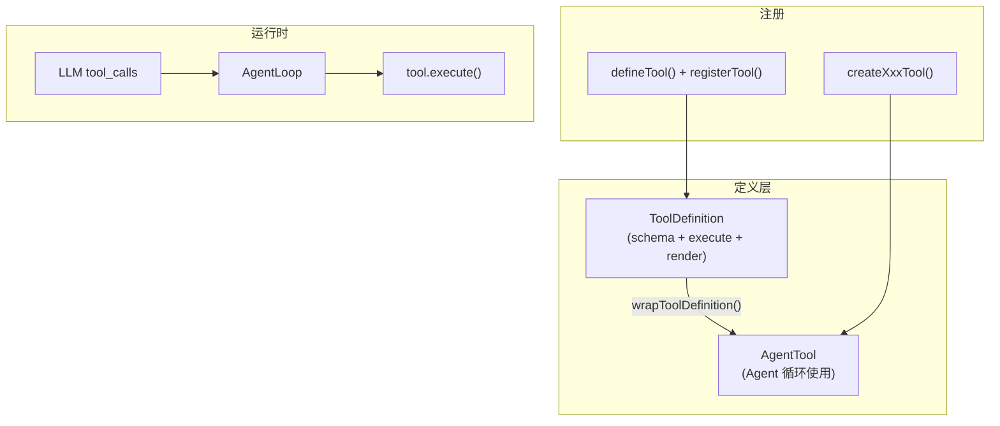
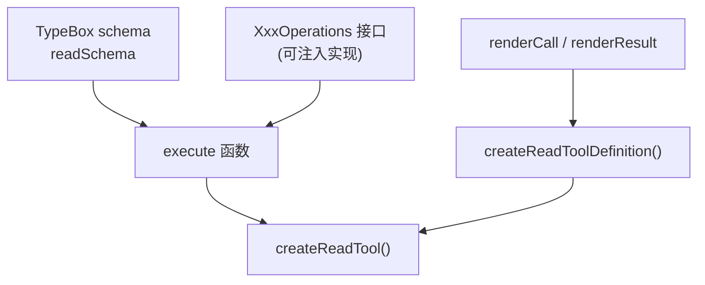
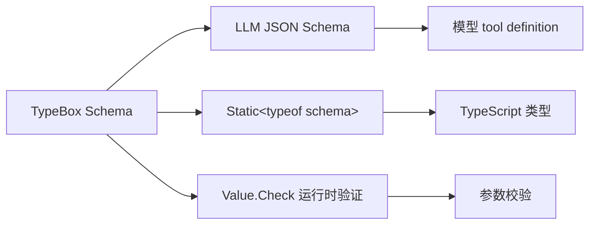
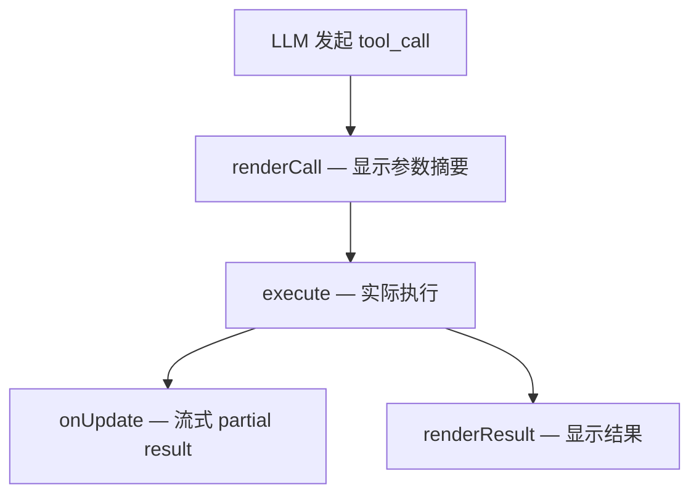

# 添加新工具

Pi 工具是 LLM 可调用的函数，带 TypeBox 参数 schema 和可选的 TUI 渲染。可通过内置工具模式或扩展 `defineTool()` 添加。

---

## 工具架构



---

## 方式 1：内置工具（core/tools）

适用于贡献到 pi-coding-agent 核心的工具。

### 文件结构模式

以 `read` 工具为例（`packages/coding-agent/src/core/tools/read.ts`）：



### 关键步骤

**1. 定义 TypeBox schema：**

```typescript
const readSchema = Type.Object({
  path: Type.String({ description: "Path to the file to read" }),
  offset: Type.Optional(Type.Number({ description: "Start line (1-indexed)" })),
  limit: Type.Optional(Type.Number({ description: "Max lines" })),
});

export type ReadToolInput = Static<typeof readSchema>;
```

**2. 实现 execute：**

```typescript
async function executeRead(params: ReadToolInput, ops: ReadOperations): Promise<AgentToolResult<ReadToolDetails>> {
  const content = await ops.readFile(params.path);
  return {
    content: [{ type: "text", text: content.toString() }],
    details: { /* 结构化详情 */ },
  };
}
```

**3. 自定义渲染（TUI）：**

```typescript
function formatReadCall(args: ReadRenderArgs, theme: Theme): string {
  return `${theme.fg("toolTitle", theme.bold("read"))} ${theme.fg("accent", args.path)}`;
}
```

**4. 导出工厂：**

```typescript
export function createReadTool(options?: ReadToolOptions): AgentTool<ReadToolInput> { ... }
export function createReadToolDefinition(options?: ReadToolOptions): ToolDefinition<typeof readSchema, ReadToolDetails> { ... }
```

**5. 注册到 index：**

`packages/coding-agent/src/core/tools/index.ts`

### 文件 mutation 串行化

edit/write 等修改同一文件的工具应使用：

```typescript
import { withFileMutationQueue } from "./file-mutation-queue.ts";

await withFileMutationQueue(filePath, async () => {
  // 读-改-写
});
```

源码：`packages/coding-agent/src/core/tools/file-mutation-queue.ts`

---

## 方式 2：扩展工具 defineTool()

适用于项目/用户定制，无需改核心。

```typescript
import { Type } from "@earendil-works/pi-ai";
import { defineTool, type ExtensionAPI } from "@earendil-works/pi-coding-agent";

export default function (pi: ExtensionAPI) {
  pi.registerTool(defineTool({
    name: "deploy",
    label: "Deploy",
    description: "Deploy the application",
    parameters: Type.Object({
      env: Type.Union([
        Type.Literal("staging"),
        Type.Literal("production"),
      ]),
    }),

    async execute(_id, params, signal, onUpdate, ctx) {
      onUpdate?.({ content: [{ type: "text", text: "Deploying..." }] });
      // ... 执行部署
      return {
        content: [{ type: "text", text: `Deployed to ${params.env}` }],
        details: { env: params.env },
      };
    },

    renderCall(args, theme) {
      return `${theme.fg("toolTitle", "deploy")} → ${args?.env ?? "?"}`;
    },

    renderResult(result, args, theme) {
      return [theme.fg("success", "✓ Deployed")];
    },
  }));
}
```

```mermaid
sequenceDiagram
    participant LLM as LLM
    participant Loop as AgentLoop
    participant Tool as defineTool.execute()
    participant UI as TUI renderCall/renderResult

    LLM->>Loop: tool_call(deploy, {env: "staging"})
    Loop->>UI: renderCall(args)
    Loop->>Tool: execute(..., onUpdate)
    Tool-->>Loop: AgentToolResult
    Loop->>UI: renderResult(result)
    Loop->>LLM: toolResult message
```

---

## TypeBox 参数 Schema



**常用类型：**

```typescript
Type.Object({ ... })           // 对象
Type.String({ description })   // 字符串
Type.Number({ minimum: 0 })    // 数字
Type.Optional(Type.Boolean())  // 可选
Type.Union([Type.Literal("a"), Type.Literal("b")])  // 枚举
Type.Array(Type.String())      // 数组
```

导入来源：

- 扩展：`import { Type } from "@earendil-works/pi-ai"`
- 核心工具：`import { Type } from "typebox"`

校验：`packages/ai/src/utils/validation.ts`

---

## 自定义渲染 renderCall / renderResult

| 方法 | 调用时机 | 返回值 |
|------|---------|--------|
| `renderCall(args, theme)` | 工具调用开始时 | `string` 或 `string[]`（TUI 行） |
| `renderResult(result, args, theme, opts)` | 工具完成后 | 同上 |



**theme 用法：**

```typescript
theme.fg("toolTitle", theme.bold("mytool"))
theme.fg("accent", path)
theme.fg("muted", "details")
theme.fg("error", "failed")
```

参考：`packages/coding-agent/examples/extensions/built-in-tool-renderer.ts`

---

## ToolDefinition vs AgentTool

| 类型 | 用途 | 定义位置 |
|------|------|---------|
| `ToolDefinition` | 扩展/SDK，含 render | `extensions/types.ts` |
| `AgentTool` | Agent 循环内部 | `@pi-agent-core/types.ts` |
| 转换 | `wrapToolDefinition()` | `tools/tool-definition-wrapper.ts` |

扩展作者只需关心 `ToolDefinition` + `defineTool()`。

---

## 启用/禁用工具

```typescript
// SDK
createAgentSession({
  tools: ["read", "bash"],  // 限定工具集
  customTools: [myTool],
});

// 扩展
pi.setActiveTools(["read", "hello"]);
```

---

## 测试工具

```typescript
// packages/coding-agent/test/suite/harness.ts
const harness = await createHarness({
  tools: [myTool],
  extensionFactories: [myExtensionFactory],
});
await harness.session.prompt("use my tool");
```

---

## 延伸阅读

- [工具系统](../04-subsystems/01-tool-system.md)
- [编写扩展](./03-writing-extension.md)
- 示例：`packages/coding-agent/examples/extensions/tools.ts`
