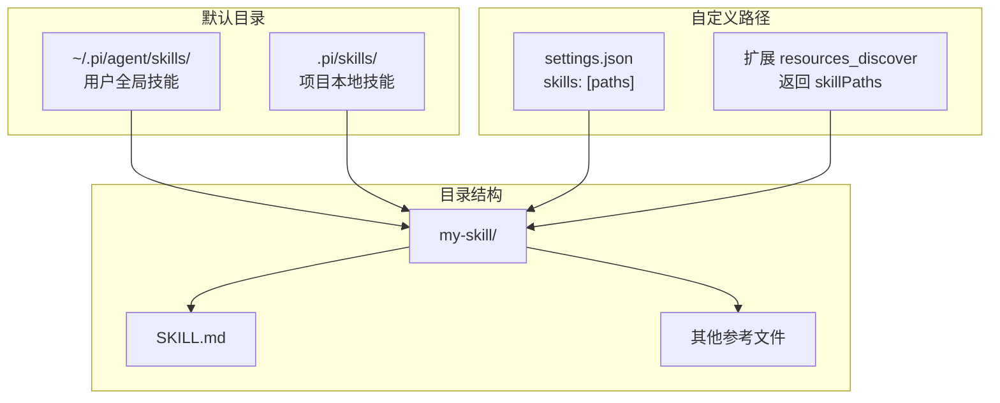
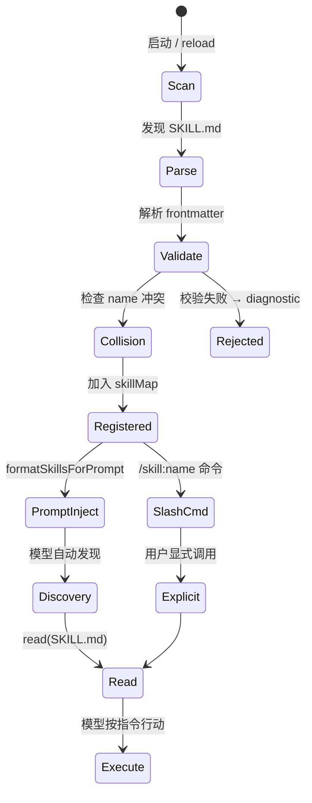
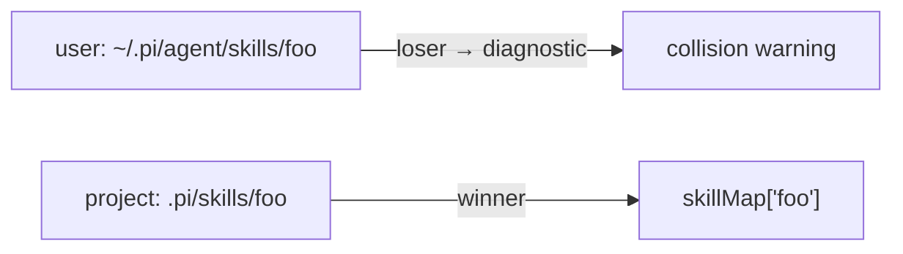

# 创建技能

技能（Skill）是带 frontmatter 的 Markdown 文件，为模型提供特定任务的专项指令。模型通过 system prompt 中的技能目录发现技能，并用 `read` 工具加载完整内容。

---

## SKILL.md 格式

```markdown
---
name: valid-skill
description: A valid skill for testing purposes.
---

# Valid Skill

This is a valid skill that follows the Agent Skills standard.

## When to use

Use this skill when the user asks about X.

## Steps

1. Do A
2. Do B
```

### Frontmatter 字段

| 字段 | 必填 | 说明 |
|------|------|------|
| `name` | 是 | 小写 a-z、0-9、连字符；最长 64 字符 |
| `description` | 是 | 一行描述；最长 1024 字符 |
| `disable-model-invocation` | 否 | `true` 时模型不可自动发现，仅 `/skill:name` |

**name 规则：**

- 仅 `[a-z0-9-]`
- 不能以 `-` 开头或结尾
- 不能含 `--`

校验源码：`packages/coding-agent/src/core/skills.ts` → `validateName()`、`validateDescription()`

---

## 放置位置



| 来源 | 路径 | 优先级 |
|------|------|--------|
| 用户 | `~/.pi/agent/skills/` | 低 |
| 项目 | `.pi/skills/` | 高（同名冲突时 project 胜） |
| settings | `settings.json` → `skills[]` | 按配置 |
| 扩展 | `resources_discover` 事件 | 动态 |

加载逻辑：`packages/coding-agent/src/core/skills.ts` → `loadSkills()`

---

## 模型如何发现与调用技能

```mermaid
sequenceDiagram
    participant RL as ResourceLoader
    participant SP as buildSystemPrompt()
    participant LLM as LLM
    participant READ as read tool

    RL->>RL: loadSkills()
    RL->>SP: skills[]
    SP->>SP: formatSkillsForPrompt()
    Note over SP: 注入 &lt;available_skills&gt; XML
    SP->>LLM: system prompt

    Note over LLM: 任务匹配 description
    LLM->>READ: read(path=skill.filePath)
    READ-->>LLM: SKILL.md 完整内容
    LLM->>LLM: 按技能指令执行
```

### System prompt 中的技能段

`formatSkillsForPrompt()` 生成 XML：

```xml
<available_skills>
  <skill>
    <name>valid-skill</name>
    <description>A valid skill for testing purposes.</description>
    <location>/path/to/SKILL.md</location>
  </skill>
</available_skills>
```

并附带指引：用 `read` 工具加载匹配的技能文件。

源码：`packages/coding-agent/src/core/skills.ts` → `formatSkillsForPrompt()`

### 显式调用：/skill:name

若 `enableSkillCommands` 为 true（默认），技能也注册为 slash 命令：

```
/skill:valid-skill
```

`disable-model-invocation: true` 的技能**不会**出现在 `<available_skills>` 中，只能通过命令调用。

---

## 技能生命周期



---

## 创建步骤

### 1. 创建目录和文件

```bash
mkdir -p .pi/skills/my-deploy-skill
cat > .pi/skills/my-deploy-skill/SKILL.md << 'EOF'
---
name: my-deploy-skill
description: Deploy the application to staging or production with safety checks.
---

# Deploy Skill

## Prerequisites
- Run tests first
- Check git status is clean

## Steps
1. Run `./scripts/deploy.sh staging`
2. Verify health endpoint
EOF
```

### 2. 验证加载

```bash
./pi-test.sh
# 在 TUI 中输入 /reload
# 或检查启动 diagnostics
```

### 3. 测试发现

向 Agent 发送与 description 匹配的任务，观察是否 `read` 该 SKILL.md。

---

## 命名冲突

同名技能来自多个路径时，先加载的获胜，后者产生 collision diagnostic：



---

## 与 read 工具的配合

`read` 工具对 `SKILL.md` 有特殊分类显示（compact read），便于 TUI 识别。

源码：`packages/coding-agent/src/core/tools/read.ts` → `getCompactReadClassification()`

---

## 示例与规范

- 有效示例：`packages/coding-agent/test/fixtures/skills/valid-skill/SKILL.md`
- 扩展动态技能：`packages/coding-agent/examples/extensions/dynamic-resources/`
- Agent Skills 标准：https://agentskills.io/

---

## 延伸阅读

- [技能系统](../04-subsystems/05-skills-system.md)
- [编写扩展](./03-writing-extension.md) — `resources_discover` 动态注册
