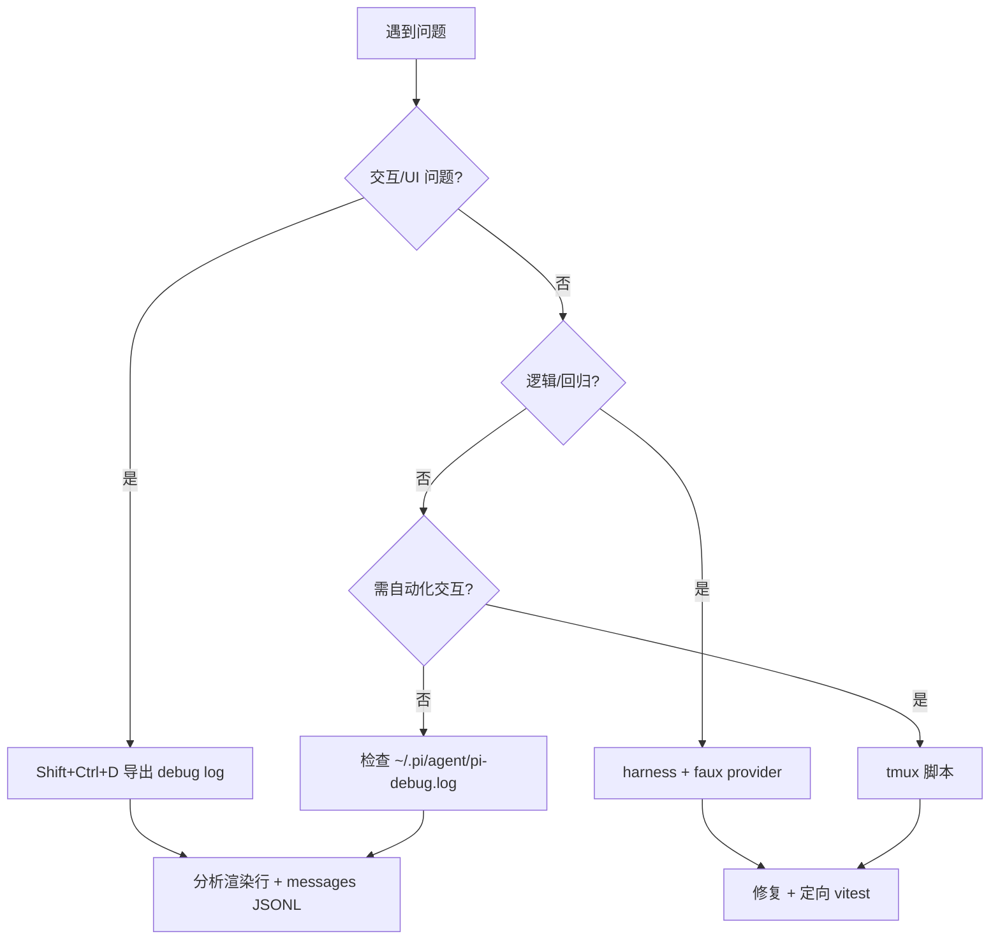
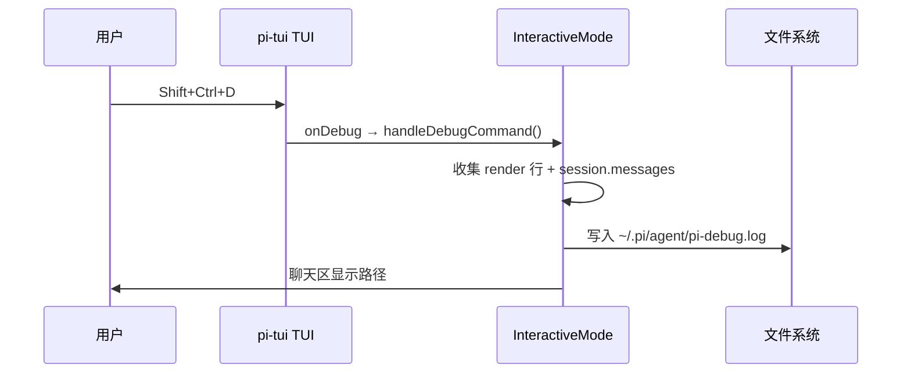
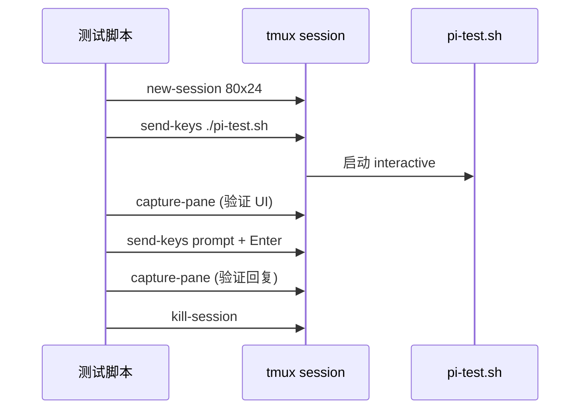
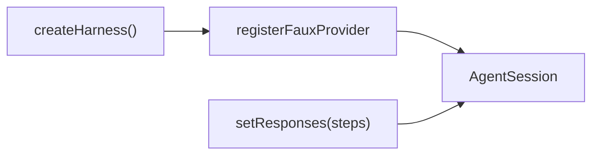
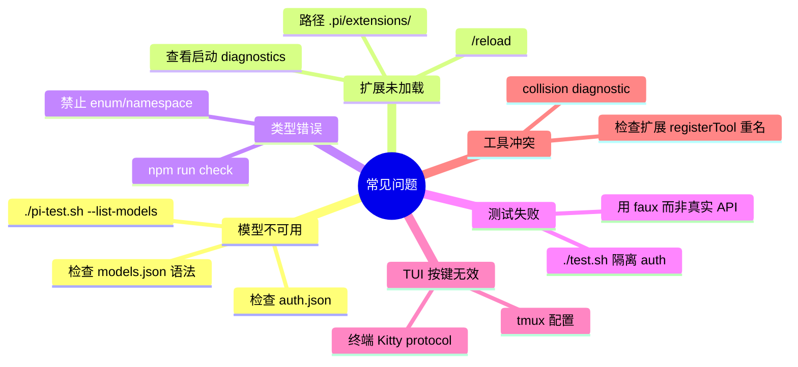

# 调试指南

本文档介绍 Pi 开发中的调试手段：TUI 调试键、tmux 自动化测试、定向测试运行、faux provider 与常见问题。

---

## 调试流程总览



---

## TUI 调试键：Shift+Ctrl+D

全局快捷键（无论焦点在哪），由 `pi-tui` 捕获：



**debug log 内容：**

- 终端尺寸
- 所有渲染行（带 visible width 和 JSON escape）
- 完整 Agent messages（JSONL 格式）

源码：

- 快捷键：`packages/tui/src/tui.ts` → `matchesKey(data, "shift+ctrl+d")`
- 处理：`packages/coding-agent/src/modes/interactive/interactive-mode.ts` → `handleDebugCommand()`
- 路径：`packages/coding-agent/src/config.ts` → `getDebugLogPath()`

**也可用 slash 命令：** `/debug`

---

## tmux 自动化交互测试

AGENTS.md 推荐用 tmux 控制 TUI：

```bash
tmux new-session -d -s pi-test -x 80 -y 24
tmux send-keys -t pi-test "./pi-test.sh" Enter
sleep 3 && tmux capture-pane -t pi-test -p   # 启动后截图

tmux send-keys -t pi-test "your prompt here" Enter
sleep 5 && tmux capture-pane -t pi-test -p   # 等待回复

tmux send-keys -t pi-test Escape              # 中断
tmux send-keys -t pi-test "C-o"               # ctrl+o
tmux kill-session -t pi-test
```



**tmux 键盘注意：** Shift+Enter 等修饰键需配置，见 `packages/coding-agent/docs/tmux.md`

---

## 运行特定测试

### 全 monorepo（无 API Key）

```bash
./test.sh
```

自动 backup auth.json、unset API keys、设 `PI_NO_LOCAL_LLM=1`。

### 单文件

```bash
cd packages/coding-agent
node ../../node_modules/vitest/dist/cli.js --run test/suite/agent-session-queue.test.ts
```

### 新测试套件（推荐）

```typescript
// packages/coding-agent/test/suite/my-feature.test.ts
import { createHarness } from "./harness.ts";

it("does something", async () => {
  const harness = await createHarness();
  harness.setResponses([{ text: "ok" }]);
  await harness.session.prompt("hello");
  expect(harness.getAssistantTexts()).toContain("ok");
});
```



**不要**直接 `npm test` 或跑完整 vitest（含 e2e，需真实 endpoint）。

---

## faux provider 测试

faux provider 模拟 LLM 响应，无需 API Key：

```typescript
import { registerFauxProvider } from "@earendil-works/pi-ai";

const faux = registerFauxProvider({
  models: [{ id: "test", name: "Test", api: "faux", provider: "faux", ... }],
});

faux.setResponses([
  { text: "Hello" },
  { toolCalls: [{ name: "read", arguments: { path: "foo.ts" } }] },
  { text: "Done reading" },
]);
```

```mermaid
sequenceDiagram
    participant Test as 测试
    participant Faux as faux provider
    participant Loop as AgentLoop

    Test->>Faux: setResponses([steps])
    Test->>Loop: prompt("...")
    Loop->>Faux: streamSimple()
    Faux-->>Loop: 预设 text / toolCalls
    Loop-->>Test: messages + events
```

源码：

- Provider：`packages/ai/src/providers/faux.ts`
- Harness：`packages/coding-agent/test/suite/harness.ts`
- 示例：`packages/coding-agent/test/test-harness.ts`

---

## 代码质量检查

修改代码后：

```bash
npm run check
```

包含 biome、类型检查、依赖 pin 校验。**不运行测试。**

---

## 常见问题与解决方案



| 问题 | 原因 | 解决 |
|------|------|------|
| `No models available` | 无 auth / models.json 错误 | `pi login` 或配置 models.json |
| 扩展 silently 不工作 | TS 语法错误 / 路径错 | 启动 diagnostics；`/reload` |
| `npm run check` 失败 | erasable TS 违规 | 改用 interface/显式字段 |
| 测试访问真实 API | 未用 faux / 未 unset keys | `./test.sh` 或 harness |
| Shift+Enter 在 tmux 无效 | 修饰键 stripped | 见 docs/tmux.md |
| 文件 edit 竞态 | 并行 mutation | 确认 `withFileMutationQueue` |
| lockfile commit 被拒 | pre-commit hook | 需 `PI_ALLOW_LOCKFILE_CHANGE=1` |

---

## 调试输出位置

| 输出 | 路径/方式 |
|------|----------|
| Debug log | `~/.pi/agent/pi-debug.log` |
| 会话数据 | `~/.pi/agent/sessions/*.jsonl` |
| RPC stderr | `RpcClient.getStderr()` |
| 启动 diagnostics | TUI 启动时或 `--help` 后 |

---

## 回归测试规范

issue 相关回归测试放在：

```
packages/coding-agent/test/suite/regressions/<issue-number>-<short-slug>.test.ts
```

使用 `harness.ts` + faux provider，禁止真实 API。

---

## 延伸阅读

- [快速上手](./01-quick-start.md)
- [AGENTS.md 测试规则](../../AGENTS.md)
- [tmux 配置](../../packages/coding-agent/docs/tmux.md)
