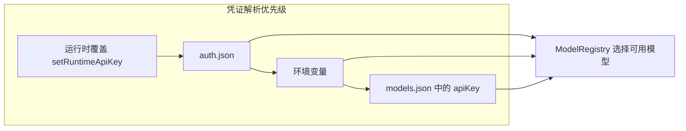
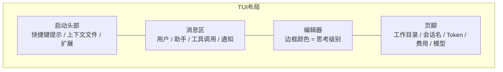
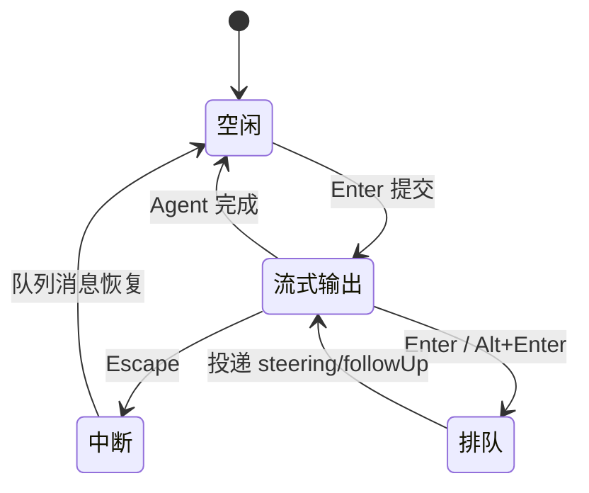
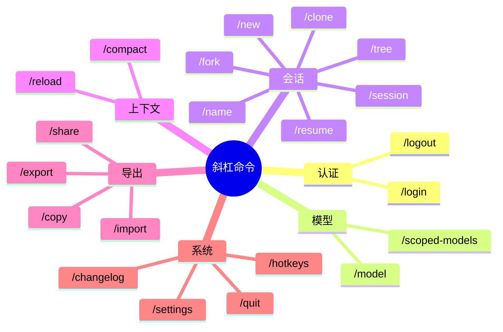
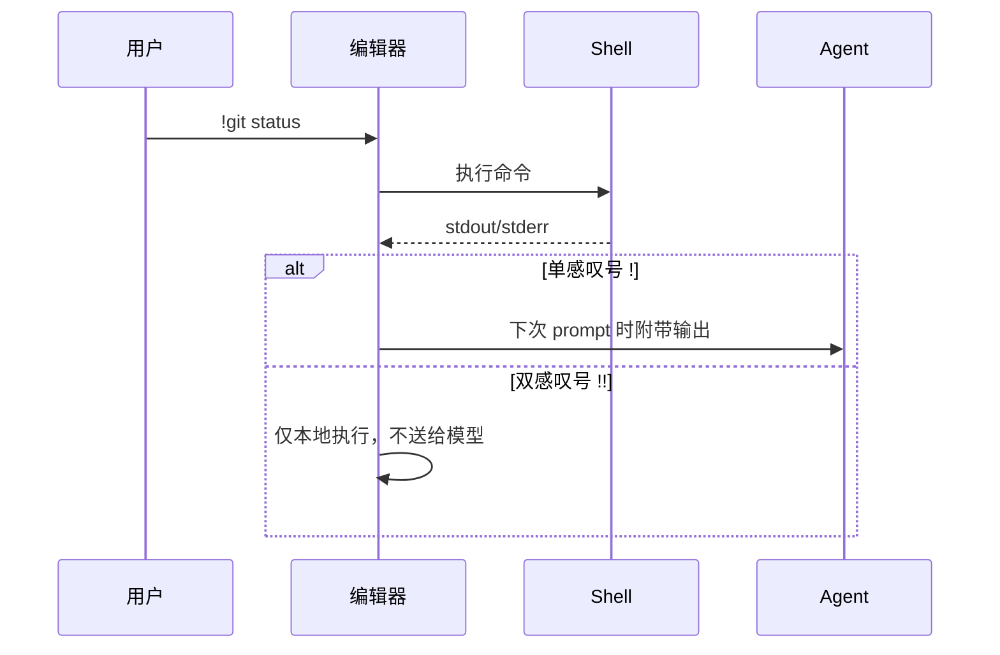
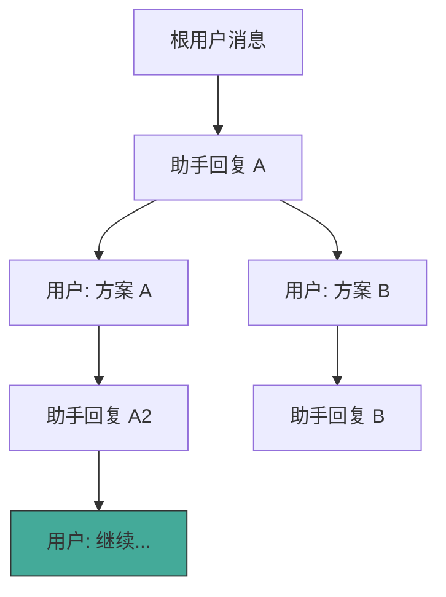
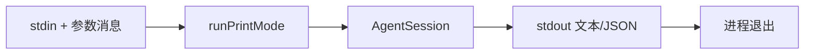

# 终端用户完整指南

Pi（`@earendil-works/pi-coding-agent`）是一款终端 AI 编程助手，提供交互式 TUI、非交互式打印模式，以及完整的会话树管理能力。本文档面向日常使用者，涵盖安装、认证、界面操作、快捷键、斜杠命令与高级用法。

## 整体使用流程

```mermaid
flowchart TD
    A[安装 pi] --> B{首次启动}
    B --> C[/login 或设置 API Key/]
    C --> D[选择模型]
    D --> E{使用模式}
    E -->|默认| F[交互式 TUI]
    E -->|-p| G[打印模式]
    E -->|--mode rpc| H[RPC 模式]
    F --> I[输入提示 / 斜杠命令 / !bash]
    I --> J[Agent 调用工具]
    J --> K[查看结果 / 继续对话]
    K --> L{会话管理}
    L -->|继续| M[pi -c]
    L -->|分支| N[/tree / /fork]
    L -->|压缩| O[/compact]
```

---

## 安装

Pi 通过 npm 全球安装：

```bash
npm install -g --ignore-scripts @earendil-works/pi-coding-agent
```

`--ignore-scripts` 会跳过依赖的生命周期脚本；Pi 的正常 npm 安装不依赖这些脚本。

**系统要求：** Node.js >= 22.19.0

```mermaid
graph LR
    subgraph 安装产物
        BIN[pi 可执行文件]
        PKG[@earendil-works/pi-coding-agent]
    end
    NPM[npm install -g] --> PKG
    PKG --> BIN
    BIN --> CFG[~/.pi/agent/]
```

进入项目目录后启动：

```bash
cd /path/to/project
pi
```

---

## 首次运行与 API Key 配置

Pi 支持两种认证方式：**订阅 OAuth 登录** 与 **API Key**。

### 方式一：订阅登录（/login）

启动 pi 后输入：

```text
/login
```

可选内置订阅提供商包括 Claude Pro/Max、ChatGPT Plus/Pro（Codex）、GitHub Copilot 等。凭证保存在 `~/.pi/agent/auth.json`，过期时自动刷新。

### 方式二：环境变量

```bash
export ANTHROPIC_API_KEY=sk-ant-...
pi
```

常用环境变量示例：

| 提供商 | 环境变量 |
|--------|----------|
| Anthropic | `ANTHROPIC_API_KEY` |
| OpenAI | `OPENAI_API_KEY` |
| Google Gemini | `GEMINI_API_KEY` |
| OpenRouter | `OPENROUTER_API_KEY` |

### 方式三：auth.json 存储

通过 `/login` 选择 API Key 提供商，密钥会写入 `~/.pi/agent/auth.json`（权限 `0600`）。



认证完成后，用 `/model` 或 `Ctrl+L` 选择模型，即可开始对话。

---

## 交互式模式 UI 概览

交互式界面由四个主要区域组成：



| 区域 | 内容 |
|------|------|
| **启动头部** | 快捷键提示、已加载的 AGENTS.md、技能、扩展、更新日志 |
| **消息区** | 对话历史、工具调用与结果、思考块、扩展 UI |
| **编辑器** | 输入提示；边框颜色反映当前 thinking level |
| **页脚** | cwd、会话名称、token/缓存/费用、上下文占用、当前模型 |

打开 `/settings` 或扩展 UI 时，编辑器区域会被临时替换为设置面板或自定义组件。

### 编辑器功能

| 功能 | 操作 |
|------|------|
| 文件引用 | 输入 `@` 模糊搜索项目文件 |
| 路径补全 | `Tab` |
| 多行输入 | `Shift+Enter`（Windows Terminal 可用 `Ctrl+Enter`） |
| 图片 | `Ctrl+V` 粘贴（Windows 为 `Alt+V`），或拖入终端 |
| Shell 命令 | `!command` — 执行并将输出送给模型 |
| 隐藏 Shell | `!!command` — 执行但不送给模型 |
| 外部编辑器 | `Ctrl+G` 打开 `$VISUAL` / `$EDITOR` |

---

## 快捷键速查表

以下为日常最高频操作。带 * 的项在默认配置中绑定不同或未绑定，可通过 `~/.pi/agent/keybindings.json` 自定义；修改后执行 `/reload` 生效。

| 快捷键 | 动作 | 默认绑定 |
|--------|------|----------|
| `Escape` | 中断当前 Agent | 是 |
| `Ctrl+D` | 退出 pi（编辑器为空时） | 是 |
| `Ctrl+R` | 打开模型选择器 * | 默认 `Ctrl+L`；`Ctrl+R` 在会话列表中为「重命名」 |
| `Ctrl+T` | 折叠/展开 thinking 块 | 是 |
| `Ctrl+K` | 手动压缩上下文 * | 默认无；`Ctrl+K` 在编辑器中为「删除到行尾」，压缩请用 `/compact` |
| `Ctrl+N` | 新建会话 * | 默认无；会话列表中 `Ctrl+N` 为「仅显示已命名」 |
| `Ctrl+L` | 打开会话树 * | 默认 `Ctrl+L` 为「模型选择器」；会话树请用 `/tree` |

### 其他常用默认快捷键

| 快捷键 | 动作 |
|--------|------|
| `Ctrl+P` | 循环下一个 scoped 模型 |
| `Ctrl+O` | 折叠/展开工具输出 |
| `Ctrl+G` | 外部编辑器 |
| `Enter` | 提交；Agent 运行时为 steering 队列 |
| `Alt+Enter` | follow-up 队列 |
| `Alt+Up` | 恢复队列消息到编辑器 |
| `Ctrl+C` | 清空编辑器 |

### 推荐 productivity 绑定

若希望上表中带 * 的快捷键按「模型 / 压缩 / 新会话 / 会话树」语义工作，可在 `keybindings.json` 中配置：

```json
{
  "app.model.select": ["ctrl+r"],
  "app.session.new": ["ctrl+n"],
  "app.session.tree": ["ctrl+l"]
}
```

压缩暂无内置 `app.compact` 键位 ID，请继续使用 `/compact` 或绑定扩展命令。

### 会话选择器内快捷键

在 `/resume` 或 `pi -r` 打开的会话列表中：

| 快捷键 | 动作 |
|--------|------|
| `Ctrl+P` | 切换路径显示 |
| `Ctrl+S` | 切换排序 |
| `Ctrl+N` | 仅显示已命名会话 |
| `Ctrl+R` | 重命名会话 |
| `Ctrl+D` | 删除会话 |



完整快捷键列表：输入 `/hotkeys` 或查阅 [keybindings.md](../../packages/coding-agent/docs/keybindings.md)。

---

## 斜杠命令

在编辑器中输入 `/` 触发自动补全。扩展、技能和提示模板也会注册为斜杠命令。



### 内置命令一览

| 命令 | 说明 |
|------|------|
| `/login`, `/logout` | 管理 OAuth 或 API Key 凭证 |
| `/model` | 打开模型选择 UI |
| `/scoped-models` | 配置 Ctrl+P 循环的模型列表 |
| `/settings` | 思考级别、主题、消息投递、传输方式 |
| `/compact [prompt]` | 手动压缩上下文，可附自定义指令 |
| `/new` | 新建会话 |
| `/resume` | 浏览并恢复历史会话 |
| `/session` | 显示会话文件、ID、消息数、token、费用 |
| `/tree` | 在会话树中跳转并继续 |
| `/fork` | 从 earlier 用户消息创建新会话文件 |
| `/clone` | 复制当前活动分支到新会话文件 |
| `/name <name>` | 设置会话显示名称 |
| `/export [file]` | 导出为 HTML 或 JSONL |
| `/import` | 从 JSONL 导入并恢复 |
| `/share` | 上传私有 GitHub Gist 并生成 HTML 链接 |
| `/copy` | 复制最后一条助手消息到剪贴板 |
| `/reload` | 热重载 keybindings、扩展、技能、主题 |
| `/hotkeys` | 显示全部快捷键（等同「帮助」） |
| `/changelog` | 版本更新日志 |
| `/quit` | 退出 pi |

扩展命令形如 `/mycommand`；技能为 `/skill:name`；提示模板为 `/templatename`。

> Pi 没有内置 `/help` 或 `/tools` 命令。查看帮助用 `/hotkeys`；限制工具用 CLI 标志 `--tools read,bash,grep` 或 `--no-tools`。

---

## Bash 执行（! 与 !!）

在编辑器中以 `!` 开头可直接运行 shell 命令：



| 前缀 | 行为 |
|------|------|
| `!command` | 执行命令，输出在**下一次**发送消息时注入 LLM 上下文 |
| `!!command` | 执行命令，**不**送给模型（适合本地检查） |

Agent 内置 `bash` 工具也可由模型自主调用；`!` 前缀则是用户主动执行的快捷方式。

---

## 图片输入

Pi 支持多种图片输入方式：

```mermaid
flowchart LR
    subgraph 输入方式
        P[Ctrl+V 粘贴]
        D[拖入终端]
        A[@file.png CLI]
        RPC[RPC images 字段]
    end
    P --> R[ImageContent]
    D --> R
    A --> R
    RPC --> R
    R --> LLM[发送给支持 vision 的模型]
```

- **交互式：** `Ctrl+V`（Windows：`Alt+V`）或拖入终端
- **CLI：** `pi -p @screenshot.png "描述这张图片"`
- **设置：** `images.autoResize` 默认将图片缩放到 2000×2000；`images.blockImages: true` 可阻止发送

支持的模型在 `/model` 列表中标注 `input: ["text", "image"]`。

---

## 会话管理

会话自动保存到 `~/.pi/agent/sessions/`，按工作目录组织。每个会话是 JSONL 文件，内部为树形结构（`id` / `parentId`）。



`*` 标记处为当前活动叶节点。

### CLI 会话选项

```bash
pi -c                  # 继续最近会话
pi -r                  # 浏览选择历史会话
pi --no-session        # 临时模式，不持久化
pi --session <path|id> # 打开指定会话
pi --fork <path|id>    # Fork 到新会话文件
```

### 会话命令对比

| 功能 | `/tree` | `/fork` | `/clone` |
|------|---------|---------|----------|
| 输出 | 同一会话文件 | 新会话文件 | 新会话文件 |
| 视图 | 完整树 | 用户消息列表 | 当前活动分支 |
| 典型用途 | 原地探索分支 | 从早期 prompt 重新开始 | 复制当前工作再实验 |

`/tree` 切换分支时可选择是否为废弃分支生成摘要，保留上下文而不重放整条路径。

---

## 打印模式（Print Mode）

非交互式单次执行，适合脚本与 CI：

```bash
pi -p "Summarize this codebase"
cat README.md | pi -p "Summarize this text"
pi -p @screenshot.png "What's in this image?"
```



| 标志 | 说明 |
|------|------|
| `-p`, `--print` | 打印响应后退出 |
| `--mode json` | 以 JSON Lines 输出全部事件 |
| `--mode rpc` | stdin/stdout JSONL 协议（见团队集成文档） |

打印模式同样读取管道 stdin 并合并到初始 prompt。限制工具示例：

```bash
pi --tools read,grep,find,ls -p "Review the code"
```

---

## 消息队列

Agent 运行时仍可提交消息：

| 操作 | 行为 |
|------|------|
| `Enter` | steering 消息 — 当前助手轮次工具执行完毕后投递 |
| `Alt+Enter` | follow-up — Agent 完全空闲后投递 |
| `Escape` | 中止并将队列消息退回编辑器 |

在 `settings.json` 中配置 `steeringMode` 与 `followUpMode`（`all` 或 `one-at-a-time`）。

---

## 上下文文件

Pi 启动时自动加载项目约定：

- `~/.pi/agent/AGENTS.md` — 全局
- 从 cwd 向上至 git 根目录的 `AGENTS.md` / `CLAUDE.md`
- 可用 `--no-context-files` 禁用

系统提示词可替换为 `.pi/SYSTEM.md` 或 `~/.pi/agent/SYSTEM.md`；`APPEND_SYSTEM.md` 用于追加而非替换。

---

## 快速参考

```bash
# 列出模型
pi --list-models

# 指定模型与思考级别
pi --model anthropic/claude-sonnet-4-20250514:high -p "Solve X"

# 只读审查
pi --tools read,grep,find,ls -p "Review src/"

# 继续上次工作
pi -c
```

更多细节见 [usage.md](../../packages/coding-agent/docs/usage.md) 与 [quickstart.md](../../packages/coding-agent/docs/quickstart.md)。
