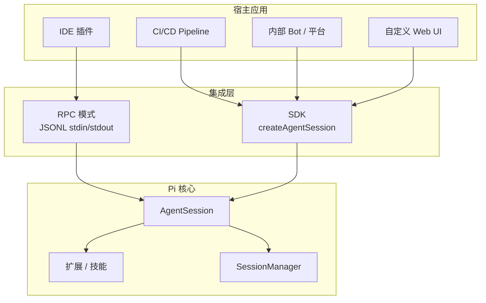
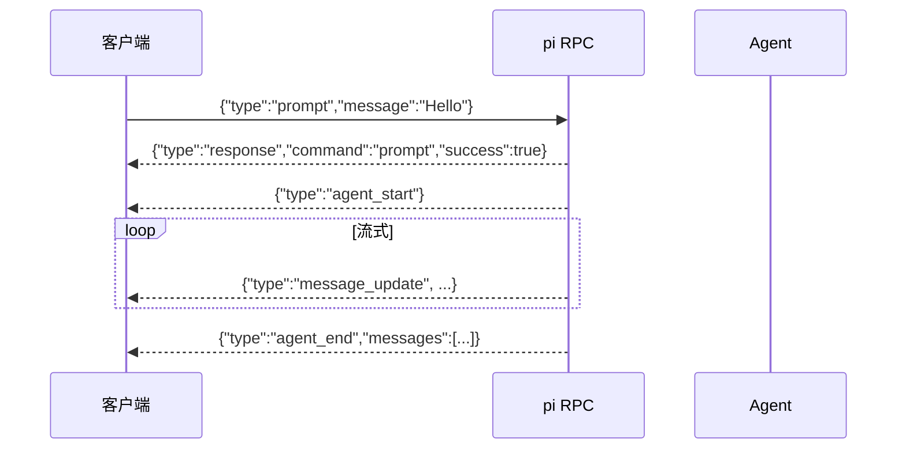
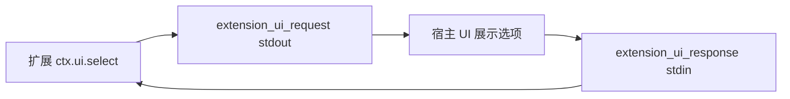
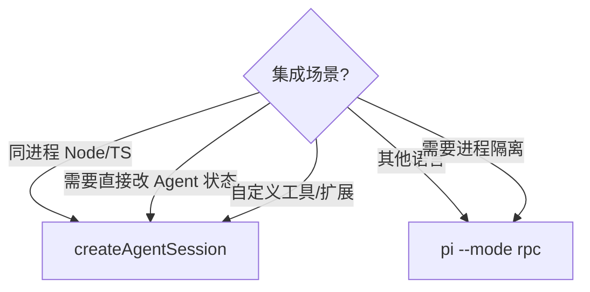
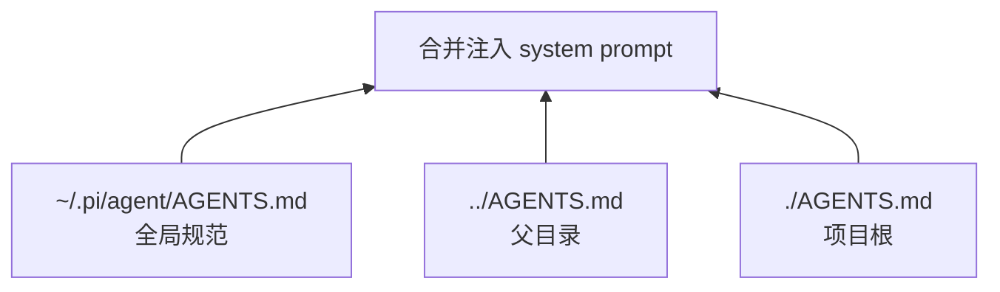
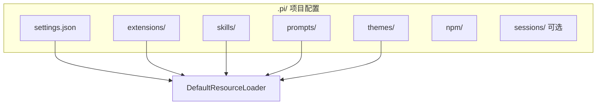
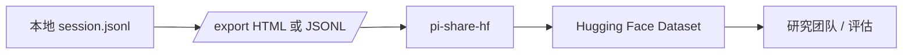
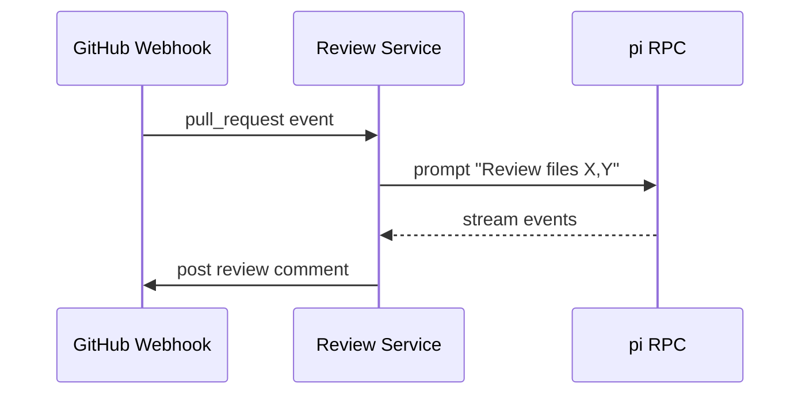

# 团队集成方案

Pi 的设计哲学是「核心精简、扩展丰富」——适合嵌入 IDE、CI 流水线、内部平台和自动化工作流。本文档介绍 RPC 模式、SDK 编程接口、团队上下文约定、项目级配置、会话共享与 CI/CD 集成思路。

## 集成架构总览



---

## RPC 模式：IDE 集成

RPC 模式通过 **stdin/stdout 上的 JSON Lines 协议** 实现无头运行，适合从其他语言或进程调用 pi。

### 启动

```bash
pi --mode rpc [options]
```

常用选项：

| 选项 | 说明 |
|------|------|
| `--provider <name>` | LLM 提供商 |
| `--model <pattern>` | 模型 ID 或模式 |
| `--no-session` | 禁用会话持久化 |
| `--session-dir <path>` | 自定义会话目录 |

### 协议帧格式



**关键规则：**

- **命令：** 每行一个 JSON 对象写入 stdin
- **响应：** `type: "response"` 表示命令成功/失败
- **事件：** Agent 生命周期事件流式写入 stdout
- **分隔符：** 仅 LF (`\n`) 作为记录分隔符；勿用 Node `readline`（会错误分割 JSON 字符串中的 Unicode 行分隔符）

### 核心命令

| 命令 type | 用途 |
|-----------|------|
| `prompt` | 发送用户消息（可带 `images`、`streamingBehavior`） |
| `steer` | Agent 运行中排队 steering 消息 |
| `follow_up` | 排队 follow-up 消息 |
| `abort` | 中止当前操作 |
| `get_state` | 获取模型、streaming 状态、会话信息 |
| `set_model` / `cycle_model` | 模型控制 |
| `compact` | 手动压缩上下文 |
| `bash` | 执行 shell 并写入会话（下次 prompt 时送给 LLM） |
| `fork` / `clone` / `switch_session` | 会话管理 |

流式期间发送 prompt 必须指定 `streamingBehavior`：

```json
{"type": "prompt", "message": "改用方案 B", "streamingBehavior": "steer"}
```

### 扩展 UI 子协议

扩展调用 `ctx.ui.select()` / `confirm()` / `input()` 时，RPC 会发出 `extension_ui_request`，客户端需回写 `extension_ui_response`：



完整协议见 [rpc.md](../../packages/coding-agent/docs/rpc.md)。

### Node.js 客户端示例

```javascript
const { spawn } = require("child_process");

const agent = spawn("pi", ["--mode", "rpc", "--no-session"]);

function send(cmd) {
  agent.stdin.write(JSON.stringify(cmd) + "\n");
}

agent.stdout.on("data", (chunk) => {
  for (const line of chunk.toString().split("\n").filter(Boolean)) {
    const event = JSON.parse(line);
    if (event.type === "message_update") {
      const d = event.assistantMessageEvent;
      if (d?.type === "text_delta") process.stdout.write(d.delta);
    }
  }
});

send({ type: "prompt", message: "List files in cwd" });
```

TypeScript 类型化客户端：[`rpc-client.ts`](../../packages/coding-agent/src/modes/rpc/rpc-client.ts)

---

## SDK 编程用法（createAgentSession）

同一 Node.js 进程内集成时，**优先使用 SDK** 而非 spawn 子进程——类型安全、无序列化开销、可直接访问 Agent 状态。

### 最小示例

```typescript
import {
  AuthStorage,
  createAgentSession,
  ModelRegistry,
  SessionManager,
} from "@earendil-works/pi-coding-agent";

const authStorage = AuthStorage.create();
const modelRegistry = ModelRegistry.create(authStorage);

const { session } = await createAgentSession({
  sessionManager: SessionManager.inMemory(),
  authStorage,
  modelRegistry,
});

session.subscribe((event) => {
  if (event.type === "message_update" && event.assistantMessageEvent.type === "text_delta") {
    process.stdout.write(event.assistantMessageEvent.delta);
  }
});

await session.prompt("当前目录有哪些文件？");
```

### SDK vs RPC 选型



| 维度 | SDK | RPC |
|------|-----|-----|
| 语言 | TypeScript / JavaScript | 任意（通过 JSON） |
| 进程 | 同进程 | 子进程 |
| 类型安全 | 完整 | 需自行定义类型 |
| 状态访问 | `session.agent.state` | `get_state` / `get_messages` |
| 扩展 UI | 原生 TUI 或自定义 | extension_ui 子协议 |

### AgentSessionRuntime

需要 `/new`、`/resume`、`/fork` 等等价「替换当前会话」能力时，使用 Runtime API：

```typescript
import {
  createAgentSessionRuntime,
  createAgentSessionServices,
  createAgentSessionFromServices,
  SessionManager,
  getAgentDir,
} from "@earendil-works/pi-coding-agent";

const runtime = await createAgentSessionRuntime(createRuntimeFactory, {
  cwd: process.cwd(),
  agentDir: getAgentDir(),
  sessionManager: SessionManager.create(process.cwd()),
});

await runtime.newSession();
await runtime.switchSession("/path/to/session.jsonl");
await runtime.fork("entry-id");
```

> 替换会话后需重新 `subscribe` 事件，并重新 `bindExtensions`。

更多示例：[`examples/sdk/`](../../packages/coding-agent/examples/sdk/)

---

## 上下文文件：团队约定（AGENTS.md / CLAUDE.md）

团队规范通过上下文文件注入系统提示，无需改代码。



### 推荐团队模板

**全局 `~/.pi/agent/AGENTS.md`：**

```markdown
# 组织级规范
- 禁止提交 secrets
- 代码变更后运行 npm run check
- 回复使用中文/英文（按项目）
```

**项目根 `AGENTS.md`：**

```markdown
# 项目 Instructions
- 测试：./test.sh
- 分支命名：feature/<ticket>-<slug>
- 不要修改 packages/ai/src/models.generated.ts
```

Pi 同时识别 `CLAUDE.md`（与 Claude Code 生态兼容）。禁用加载：`pi --no-context-files`。

### 系统提示词分层

| 文件 | 作用 |
|------|------|
| `.pi/SYSTEM.md` | 项目级替换默认系统提示 |
| `~/.pi/agent/SYSTEM.md` | 全局替换 |
| `APPEND_SYSTEM.md` | 追加到默认提示之后 |

---

## 项目级 .pi/ 配置

每个仓库可在 `.pi/` 下放置项目专属资源：



| 路径 | 用途 |
|------|------|
| `.pi/settings.json` | 覆盖全局 settings（嵌套对象 deep merge） |
| `.pi/extensions/` | 项目扩展（权限门、git checkpoint 等） |
| `.pi/skills/` | 项目技能 |
| `.pi/prompts/` | 提示模板（斜杠命令） |
| `.pi/themes/` | 项目主题 |
| `.pi/npm/` | 项目级 npm 包安装目录 |

通过 `pi install <source> -l` 安装项目本地包；`pi config` 启用/禁用包资源。

---

## 会话共享：Hugging Face

开源项目若希望公开会话用于模型/提示/工具研究，可使用社区工具 [**pi-share-hf**](https://github.com/badlogic/pi-share-hf) 将会话发布到 Hugging Face Datasets。



内置 `/share` 则上传**私有** GitHub Gist 并生成可分享的 HTML 链接——适合内部分享，而非公开数据集。

| 方式 | 可见性 | 适用场景 |
|------|--------|----------|
| `/share` | 私有 Gist | 团队内快速分享 |
| `/export` | 本地 HTML/JSONL | 归档、审计 |
| pi-share-hf | 公开 Dataset | 开源研究、可复现评估 |

---

## CI/CD 集成思路

Pi 无内置 MCP 或子 Agent，但可通过 SDK / 打印模式嵌入流水线。

### 模式一：打印模式（最简单）

```yaml
# GitHub Actions 示例
- name: AI code review
  env:
    ANTHROPIC_API_KEY: ${{ secrets.ANTHROPIC_API_KEY }}
  run: |
    pi --tools read,grep,find,ls -p \
      "Review the diff in this PR. Output markdown."
```


### 模式二：SDK 脚本

```typescript
// scripts/review.ts
import { createAgentSession, SessionManager } from "@earendil-works/pi-coding-agent";

const { session } = await createAgentSession({
  tools: ["read", "grep"],
  sessionManager: SessionManager.inMemory(),
});

await session.prompt("Run npm run check conceptually on src/");
// 解析 session.messages 输出报告
process.exit(session.agent.state.errorMessage ? 1 : 0);
```

### 模式三：RPC 长期服务

IDE 插件或 review bot 维持 `pi --mode rpc` 子进程，复用会话上下文：



### CI 最佳实践

| 实践 | 说明 |
|------|------|
| 只读工具 | `--tools read,grep,find,ls` 防止 CI 改仓库 |
| Secrets | API Key 走 CI secrets，勿写入 AGENTS.md |
|  ephemeral 会话 | `--no-session` 或 `SessionManager.inMemory()` |
| 超时 | 包装 `timeout` 或 SDK 层 `abort()` |
| 离线 | `PI_OFFLINE=1` 跳过更新检查 |
| 成本控制 | 低 thinking level + 紧凑 prompt + `/compact` |

### 团队扩展场景

- **权限门扩展：** 拦截 `rm -rf`、`sudo` 等危险 bash
- **路径保护：** 禁止写 `.env`、`node_modules/`
- **Git checkpoint：** 每轮 stash，分支切换时恢复
- **CI 触发器：** 扩展监听 `agent_end`  webhook 到 Slack/Jenkins

---

## 包管理与团队分发

```bash
# 安装团队扩展包（全局）
pi install @org/pi-team-extensions

# 项目本地
pi install ./team-pack -l

# 列出与配置
pi list
pi config
```

`settings.json` 的 `packages` 数组可声明团队共享包，新成员 clone 仓库后自动加载项目资源。

---

## 相关文档

- [RPC 协议完整参考](../../packages/coding-agent/docs/rpc.md)
- [SDK 文档](../../packages/coding-agent/docs/sdk.md)
- [扩展开发](../../packages/coding-agent/docs/extensions.md)
- [会话格式](../../packages/coding-agent/docs/session-format.md)
