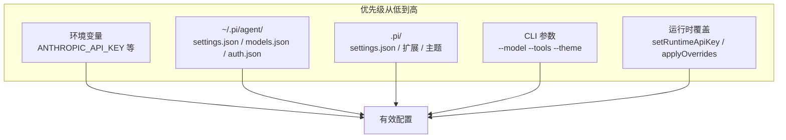
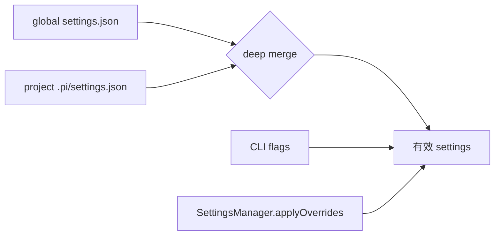
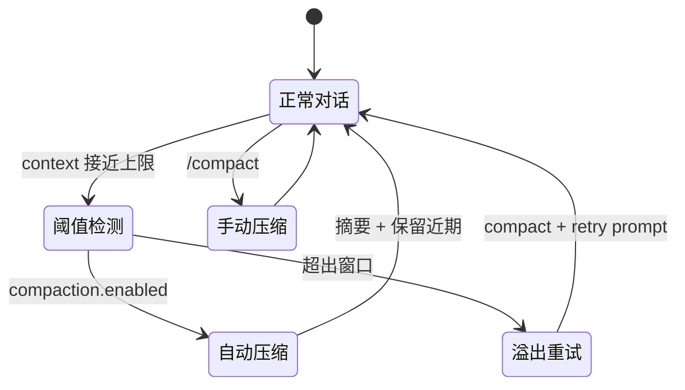
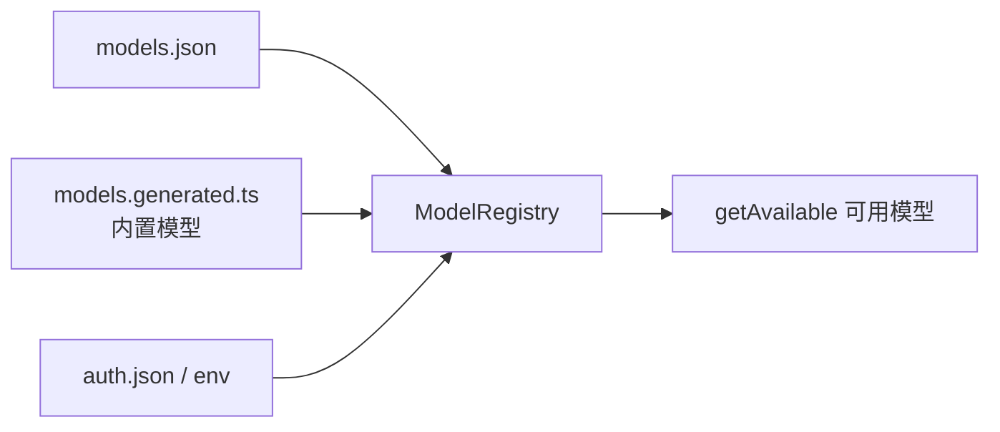
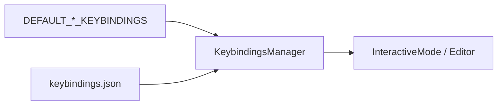
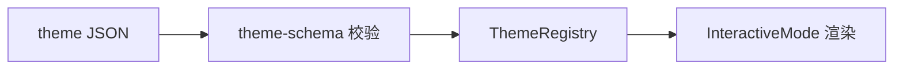

# 高级配置

Pi 的配置系统采用分层合并策略：全局默认值可被项目、CLI 参数和环境变量逐级覆盖。理解优先级与各项 settings 含义，是定制团队工作流的关键。

## 配置层级



### 目录结构

```mermaid
graph TB
    subgraph ~/.pi/agent/ 全局
        GS[settings.json]
        GM[models.json]
        GA[auth.json]
        GK[keybindings.json]
        GE[extensions/]
        GSK[skills/]
        GTH[themes/]
        GSE[sessions/]
        GAG[AGENTS.md]
    end

    subgraph .pi/ 项目
        PS[settings.json]
        PE[extensions/]
        PSK[skills/]
        PTH[themes/]
        PPR[prompts/]
    end
```

| 变量 | 默认路径 | 说明 |
|------|----------|------|
| `PI_CODING_AGENT_DIR` | `~/.pi/agent` | 覆盖全局配置目录 |
| `PI_CODING_AGENT_SESSION_DIR` | `~/.pi/agent/sessions/` | 覆盖会话存储（CLI `--session-dir` 优先） |
| `PI_PACKAGE_DIR` | — | Nix/Guix 等环境下的包路径 |

---

## settings.json

两处加载，**项目覆盖全局**，嵌套对象 **deep merge**：

| 位置 | 作用域 |
|------|--------|
| `~/.pi/agent/settings.json` | 全局 |
| `.pi/settings.json` | 当前项目 |



### 模型与思考

| 键 | 类型 | 说明 |
|----|------|------|
| `defaultProvider` | string | 默认提供商，如 `"anthropic"` |
| `defaultModel` | string | 默认模型 ID |
| `defaultThinkingLevel` | string | `off` / `minimal` / `low` / `medium` / `high` / `xhigh` |
| `hideThinkingBlock` | boolean | 隐藏 thinking 输出 |
| `thinkingBudgets` | object | 各级别 token 预算 |
| `enabledModels` | string[] | Ctrl+P 循环的模型模式 |

```json
{
  "defaultProvider": "anthropic",
  "defaultModel": "claude-sonnet-4-20250514",
  "defaultThinkingLevel": "medium",
  "enabledModels": ["claude-*", "gpt-4o"],
  "thinkingBudgets": {
    "minimal": 1024,
    "low": 4096,
    "medium": 10240,
    "high": 32768
  }
}
```

### UI 与显示

| 键 | 说明 |
|----|------|
| `theme` | 主题名：`dark` / `light` / 自定义 |
| `quietStartup` | 隐藏启动头部 |
| `doubleEscapeAction` | 双击 Escape：`tree` / `fork` / `none` |
| `treeFilterMode` | `/tree` 默认过滤器 |
| `editorPaddingX` | 编辑器水平 padding (0–3) |
| `terminal.showImages` | 终端内联显示图片 |
| `images.autoResize` | 自动缩放大图 |
| `images.blockImages` | 阻止图片发送给 LLM |

### 压缩（Compaction）

| 键 | 默认 | 说明 |
|----|------|------|
| `compaction.enabled` | `true` | 自动压缩 |
| `compaction.reserveTokens` | `16384` | 为 LLM 响应预留 |
| `compaction.keepRecentTokens` | `20000` | 保留近期消息不摘要 |



### 重试

```json
{
  "retry": {
    "enabled": true,
    "maxRetries": 3,
    "baseDelayMs": 2000,
    "provider": {
      "timeoutMs": 3600000,
      "maxRetries": 0,
      "maxRetryDelayMs": 60000
    }
  }
}
```

### 消息投递与传输

| 键 | 默认 | 说明 |
|----|------|------|
| `steeringMode` | `one-at-a-time` | steering 投递策略 |
| `followUpMode` | `one-at-a-time` | follow-up 投递策略 |
| `transport` | `sse` | 多传输提供商偏好：`sse` / `websocket` / `auto` |

### 资源加载

| 键 | 说明 |
|----|------|
| `packages` | npm/git 包列表 |
| `extensions` | 扩展路径（支持 glob、`!` 排除） |
| `skills` | 技能路径 |
| `prompts` | 提示模板路径 |
| `themes` | 主题路径 |
| `enableSkillCommands` | 注册 `/skill:name` 命令 |

```json
{
  "packages": [
    {
      "source": "pi-skills",
      "skills": ["brave-search"],
      "extensions": []
    }
  ],
  "extensions": ["./my-ext.ts", "!**/deprecated/**"]
}
```

编辑后可用 `/settings` UI 修改常见项，或直接编辑 JSON 后 `/reload`。

---

## models.json 自定义模型

路径：`~/.pi/agent/models.json`（打开 `/model` 时自动重载）。



### 最小 Ollama 示例

```json
{
  "providers": {
    "ollama": {
      "baseUrl": "http://localhost:11434/v1",
      "api": "openai-completions",
      "apiKey": "ollama",
      "models": [
        { "id": "llama3.1:8b" },
        { "id": "qwen2.5-coder:7b" }
      ]
    }
  }
}
```

### 完整模型字段

| 字段 | 说明 |
|------|------|
| `id` | API 模型 ID |
| `name` | 显示名 |
| `api` | API 类型（见 supported APIs） |
| `baseUrl` | 端点 |
| `reasoning` | 是否支持思考 |
| `input` | `["text"]` 或 `["text","image"]` |
| `contextWindow` | 上下文窗口 |
| `maxTokens` | 最大输出 token |
| `cost` | 计费信息 |
| `compat` | OpenAI 兼容服务器适配 |

支持的 API 类型包括：`anthropic-messages`、`openai-completions`、`openai-responses`、`google-generative-ai`、`mistral-conversations` 等。

可通过 `models.json` **覆盖内置提供商** 的 `baseUrl` 或追加模型，无需 fork pi。

---

## keybindings.json 自定义

路径：`~/.pi/agent/keybindings.json`



格式：`"keybinding.id": ["key1", "key2"]`

```json
{
  "app.interrupt": ["escape"],
  "app.exit": ["ctrl+d"],
  "app.model.select": ["ctrl+l"],
  "app.thinking.toggle": ["ctrl+t"],
  "app.session.new": ["ctrl+n"],
  "app.session.tree": ["ctrl+shift+l"],
  "tui.editor.cursorUp": ["up", "ctrl+p"],
  "tui.editor.deleteToLineEnd": ["ctrl+k"]
}
```

命名空间：

| 前缀 | 范围 |
|------|------|
| `tui.editor.*` | 编辑器光标、删除 |
| `tui.input.*` | 提交、换行、Tab |
| `app.*` | 应用级：中断、模型、会话、树导航 |

旧版非命名空间 ID（如 `cursorUp`）启动时自动迁移。修改后 `/reload` 即可生效，无需重启。

---

## auth.json 与 OAuth

路径：`~/.pi/agent/auth.json`，权限 `0600`。

```mermaid
flowchart TD
    LOGIN[/login] --> TYPE{凭证类型}
    TYPE -->|OAuth| OAUTH[refresh token + access token]
    TYPE -->|API Key| KEY[api_key 条目]
    OAUTH --> AUTH[auth.json]
    KEY --> AUTH
    AUTH --> AS[AuthStorage]
    ENV[环境变量] --> AS
    RT[setRuntimeApiKey] --> AS
    AS --> RESOLVE[解析有效凭证]
```

### API Key 条目

```json
{
  "anthropic": { "type": "api_key", "key": "sk-ant-..." },
  "openai": { "type": "api_key", "key": "sk-..." }
}
```

### OAuth 条目（结构因提供商而异）

订阅登录（Claude Pro/Max、Codex、GitHub Copilot）通过 OAuth 流程写入 token，自动刷新。

**凭证优先级：**

1. 运行时 `authStorage.setRuntimeApiKey()`（不持久化）
2. `auth.json`（优先于环境变量）
3. 环境变量
4. `models.json` 中的 `apiKey` 字段

`/logout <provider>` 清除对应条目。

---

## 环境变量

### API Keys（部分）

| 提供商 | 变量 |
|--------|------|
| Anthropic | `ANTHROPIC_API_KEY` |
| OpenAI | `OPENAI_API_KEY` |
| Google | `GEMINI_API_KEY` |
| Azure OpenAI | `AZURE_OPENAI_API_KEY` |
| OpenRouter | `OPENROUTER_API_KEY` |
| Hugging Face | `HF_TOKEN` |

完整映射见 [`env-api-keys.ts`](../../packages/ai/src/env-api-keys.ts)。

### Pi 运行时

| 变量 | 说明 |
|------|------|
| `PI_CODING_AGENT_DIR` | 全局配置目录 |
| `PI_CODING_AGENT_SESSION_DIR` | 会话目录 |
| `PI_OFFLINE` | 禁用所有启动网络操作 |
| `PI_SKIP_VERSION_CHECK` | 跳过版本更新检查 |
| `PI_TELEMETRY` | 覆盖安装遥测 |
| `PI_CACHE_RETENTION` | 设为 `long` 延长 prompt cache |
| `VISUAL` / `EDITOR` | 外部编辑器 |

---

## 扩展配置

扩展从多位置发现：

```mermaid
flowchart TB
    GD[~/.pi/agent/extensions/]
    PD[.pi/extensions/]
    ST[settings.json extensions[]]
    CLI[-e / --extension]
    PKG[packages 内扩展]
    GD --> ER[ExtensionRunner]
    PD --> ER
    ST --> ER
    CLI --> ER
    PKG --> ER
```

CLI 精细控制：

```bash
# 禁用自动发现，仅加载指定扩展
pi --no-extensions -e ./my-extension.ts

# 禁用内置工具，保留扩展工具
pi --no-builtin-tools -e ./safe-bash.ts
```

扩展可注册：工具、斜杠命令、事件钩子、自定义 UI、compaction 行为等。详见 [extensions.md](../../packages/coding-agent/docs/extensions.md)。

---

## 自定义主题

主题 JSON 定义 TUI 颜色 token。

**加载位置：**

- 内置：`dark`、`light`
- `~/.pi/agent/themes/*.json`
- `.pi/themes/*.json`
- 包内 `themes/` 或 `pi.themes`
- `--theme <path>`

```json
{
  "$schema": "https://raw.githubusercontent.com/earendil-works/pi/main/packages/coding-agent/src/modes/interactive/theme/theme-schema.json",
  "name": "my-theme",
  "vars": { "primary": "#00aaff", "secondary": 242 },
  "colors": {
    "accent": "primary",
    "border": "primary",
    "success": "#00ff00",
    "error": "#ff0000",
    "userMessageBg": "#2d2d30"
  }
}
```

在 `settings.json` 中设置 `"theme": "my-theme"` 或通过 `/settings` 切换。首次启动 pi 会检测终端背景自动选择 dark/light。



---

## 配置合并示例

```json
// ~/.pi/agent/settings.json
{
  "theme": "dark",
  "compaction": { "enabled": true, "reserveTokens": 16384 },
  "defaultProvider": "anthropic"
}

// .pi/settings.json
{
  "compaction": { "reserveTokens": 8192 },
  "packages": ["@org/team-pack"]
}

// 有效结果
{
  "theme": "dark",
  "compaction": { "enabled": true, "reserveTokens": 8192 },
  "defaultProvider": "anthropic",
  "packages": ["@org/team-pack"]
}
```

CLI 进一步覆盖：

```bash
pi --model openai/gpt-4o --thinking high --theme light --tools read,bash,grep
```

---

## SDK 中的配置管理

```typescript
import { SettingsManager, createAgentSession } from "@earendil-works/pi-coding-agent";

const settingsManager = SettingsManager.create();
settingsManager.applyOverrides({
  compaction: { enabled: false },
  retry: { maxRetries: 5 },
});

const { session } = await createAgentSession({ settingsManager });

// 持久化前 flush
await settingsManager.flush();
const errors = settingsManager.drainErrors();
```

测试场景使用 `SettingsManager.inMemory({ ... })` 避免文件 I/O。

---

## 相关文档

- [settings.md](../../packages/coding-agent/docs/settings.md)
- [models.md](../../packages/coding-agent/docs/models.md)
- [providers.md](../../packages/coding-agent/docs/providers.md)
- [keybindings.md](../../packages/coding-agent/docs/keybindings.md)
- [themes.md](../../packages/coding-agent/docs/themes.md)
