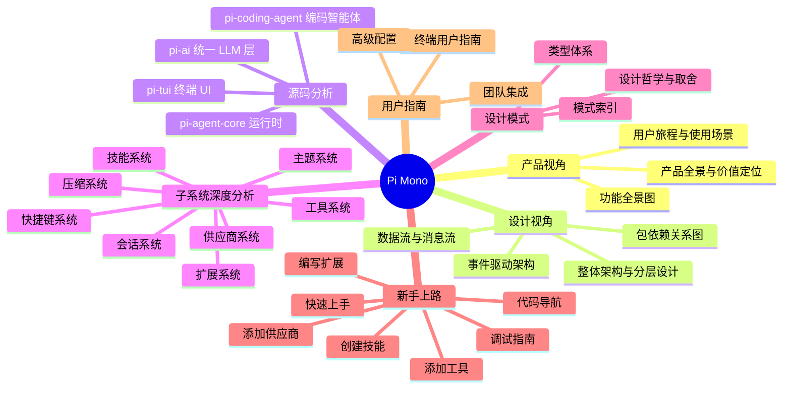
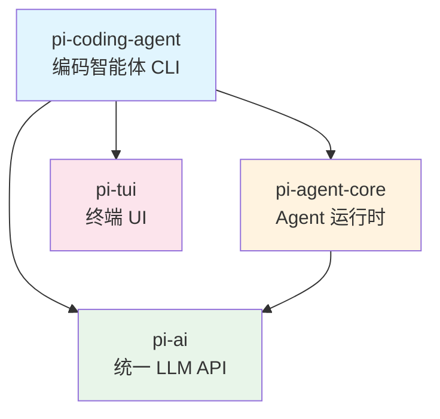

# Pi Mono 项目全面学习指南

> 基于 pi-mono v0.75.5 源码的深度分析报告

## 项目一句话定位

**Pi 是一个开源的交互式编码智能体工具套件**，通过统一的 LLM API 层、通用 Agent 运行时、丰富的工具系统和差分渲染终端 UI，为开发者提供终端内的 AI 辅助编程体验。

## 全景导航



## 四包架构总览

| 包名 | npm 包名 | 职责 | 核心抽象 |
|------|---------|------|---------|
| `packages/ai` | `@earendil-works/pi-ai` | 统一多供应商 LLM API | `stream()`, `Model`, `ApiProvider` |
| `packages/agent` | `@earendil-works/pi-agent-core` | Agent 运行时 + 会话管理 | `Agent`, `AgentHarness`, `Session` |
| `packages/coding-agent` | `@earendil-works/pi-coding-agent` | 编码智能体 CLI | `AgentSession`, `ExtensionRunner`, Tools |
| `packages/tui` | `@earendil-works/pi-tui` | 差分渲染终端 UI 框架 | `TUI`, `Component`, `Editor` |



## 目录索引

### 一、产品视角 (`01-product/`)

面向产品经理和决策者，理解"做什么"和"为什么"。

| 文档 | 内容 | 适合谁 |
|------|------|--------|
| [产品全景与价值定位](01-product/01-product-overview.md) | 市场定位、核心价值、竞品分析 | PM、决策者 |
| [用户旅程与使用场景](01-product/02-user-journey.md) | 端到端使用流程、典型场景 | PM、UX |
| [功能全景图](01-product/03-feature-map.md) | 完整功能清单与分类 | PM、开发者 |

### 二、设计视角 (`02-architecture/`)

面向架构师，理解"怎么设计"和"为什么这样设计"。

| 文档 | 内容 | 适合谁 |
|------|------|--------|
| [整体架构与分层设计](02-architecture/01-architecture-overview.md) | 分层架构、设计原则、技术选型 | 架构师 |
| [包依赖关系图](02-architecture/02-package-dependency.md) | 包间依赖、导出边界、版本策略 | 架构师、开发者 |
| [数据流与消息流](02-architecture/03-data-flow.md) | 从用户输入到 LLM 响应的完整数据流 | 架构师 |
| [事件驱动架构](02-architecture/04-event-system.md) | 事件类型、生命周期、钩子系统 | 架构师、扩展开发者 |

### 三、源码分析 (`03-packages/`)

面向开发者，逐包深度剖析核心代码。

| 文档 | 内容 | 适合谁 |
|------|------|--------|
| [pi-ai 源码分析](03-packages/01-pi-ai.md) | 供应商抽象、流式协议、模型目录 | 后端开发者 |
| [pi-agent-core 源码分析](03-packages/02-pi-agent-core.md) | Agent 循环、工具执行、会话树 | 核心开发者 |
| [pi-coding-agent 源码分析](03-packages/03-pi-coding-agent.md) | CLI 启动流、工具注册、模式分发 | 全栈开发者 |
| [pi-tui 源码分析](03-packages/04-pi-tui.md) | 差分渲染、组件模型、输入处理 | 前端/TUI 开发者 |

### 四、子系统分析 (`04-subsystems/`)

面向需要深入特定领域的开发者。

| 文档 | 内容 | 适合谁 |
|------|------|--------|
| [工具系统](04-subsystems/01-tool-system.md) | read/bash/edit/write 等 7 个内置工具 | 工具开发者 |
| [扩展系统](04-subsystems/02-extension-system.md) | 扩展加载、事件分发、API 表面 | 扩展开发者 |
| [会话系统](04-subsystems/03-session-system.md) | JSONL 持久化、树状结构、分支 | 核心开发者 |
| [供应商系统](04-subsystems/04-provider-system.md) | 模型注册、API Key 解析、OAuth | 集成开发者 |
| [技能系统](04-subsystems/05-skills-system.md) | SKILL.md 格式、发现机制、调用流程 | 技能作者 |
| [主题系统](04-subsystems/06-theme-system.md) | JSON 主题、颜色映射、组件主题接口 | UI 开发者 |
| [快捷键系统](04-subsystems/07-keybinding-system.md) | 命名空间、Kitty 协议、用户覆盖 | UI 开发者 |
| [上下文压缩系统](04-subsystems/08-compaction-system.md) | 自动/手动压缩、分支摘要 | 核心开发者 |

### 五、设计模式与哲学 (`05-patterns/`)

面向追求深层理解的开发者。

| 文档 | 内容 | 适合谁 |
|------|------|--------|
| [设计哲学与取舍](05-patterns/01-design-philosophy.md) | 核心设计原则和关键决策 | 所有人 |
| [设计模式索引](05-patterns/02-patterns-catalog.md) | 项目中使用的设计模式清单 | 开发者 |
| [TypeScript 类型体系](05-patterns/03-type-system.md) | 类型技巧、声明合并、品牌类型 | TypeScript 开发者 |

### 六、新手上路 (`06-onboarding/`)

面向新贡献者的实战指南。

| 文档 | 内容 | 适合谁 |
|------|------|--------|
| [快速上手](06-onboarding/01-quick-start.md) | 环境搭建、首次运行、项目结构 | 新手 |
| [代码导航指南](06-onboarding/02-codebase-navigation.md) | 关键文件索引、阅读路径 | 新手 |
| [编写扩展](06-onboarding/03-writing-extension.md) | 从零创建扩展教程 | 扩展开发者 |
| [添加新 Provider](06-onboarding/04-adding-provider.md) | 接入新 LLM 供应商 | 集成开发者 |
| [添加新工具](06-onboarding/05-adding-tool.md) | 注册自定义工具 | 工具开发者 |
| [创建技能](06-onboarding/06-creating-skill.md) | 编写 SKILL.md | 技能作者 |
| [调试指南](06-onboarding/07-debugging.md) | 调试技巧和常见问题 | 所有开发者 |

### 七、用户指南 (`07-user-guide/`)

面向终端用户。

| 文档 | 内容 | 适合谁 |
|------|------|--------|
| [终端用户完整指南](07-user-guide/01-end-user-guide.md) | 安装、使用、快捷键、命令 | 用户 |
| [团队集成方案](07-user-guide/02-team-integration.md) | CI/CD、RPC 模式、SDK 使用 | DevOps |
| [高级配置](07-user-guide/03-advanced-configuration.md) | 配置文件、环境变量、自定义模型 | 高级用户 |

## 推荐阅读路线

### 路线 A：产品理解（2 小时）

```
产品全景 → 用户旅程 → 功能全景图 → 整体架构
```

### 路线 B：开发上手（4 小时）

```
快速上手 → 代码导航 → 整体架构 → 数据流 → 选一个感兴趣的包深入
```

### 路线 C：扩展开发（3 小时）

```
快速上手 → 扩展系统 → 编写扩展 → 工具系统 → 添加工具
```

### 路线 D：全面掌握（2-3 天）

```
按目录顺序从头到尾阅读
```

## 技术栈速查

| 类别 | 技术 |
|------|------|
| 语言 | TypeScript 5.9 (erasable syntax only) |
| 运行时 | Node.js >= 22.19.0 / Bun |
| 构建 | tsgo (native TypeScript compiler) |
| 格式化/Lint | Biome 2.3 |
| 测试 | Vitest + Node 内置 test runner |
| 包管理 | npm workspaces (lockstep versioning) |
| 供应链安全 | 精确版本锁定 + shrinkwrap + npm audit |
