# pi-mono 项目学习指南

> 全面深入理解 pi-mono AI Agent 开发平台

---

## 项目简介

**pi-mono** 是由 Mario Zechner (@badlogic) 开发的 AI Agent 开发平台 Monorepo。核心产品是 **pi-coding-agent** - 一个功能强大的交互式编程助手 CLI，具有以下特点：

- **统一多 Provider API**：支持 20+ LLM 供应商（OpenAI、Anthropic、Google、Mistral 等）
- **完整的扩展系统**：通过 TypeScript 扩展、Skills、主题进行深度定制
- **原生终端体验**：基于 pi-tui 的差分渲染终端 UI
- **会话管理**：JSONL 持久化、分支、树状导航、上下文压缩
- **工具执行**：内置 read、bash、edit、write、grep、find、ls 等开发工具

---

## 前置知识要求

在阅读本指南前，建议具备以下知识：

- **TypeScript**：熟练使用泛型、类型推断、声明合并
- **Node.js**：了解 npm workspaces、模块系统
- **LLM 基础**：理解流式响应、工具调用、Token 计费
- **终端编程**：了解 ANSI 转义序列、原始模式输入（有益但非必需）

---

## 推荐阅读路径

### 🎯 产品经理 / 决策者路线

了解产品定位、价值主张和竞品对比，快速把握项目本质。

```
01-product/01-product-overview.md
01-product/02-user-journey.md
01-product/03-feature-map.md
```

### 🏗️ 架构师路线

理解系统分层设计、模块关系、数据流向和事件系统。

```
02-architecture/01-architecture-overview.md
02-architecture/02-package-dependencies.md
02-architecture/03-data-flow.md
02-architecture/04-event-system.md
04-subsystems/ (全部)
05-patterns/ (全部)
```

### 💻 开发者路线

从快速上手到源码分析，再到扩展开发。

```
06-onboarding/01-quick-start.md
06-onboarding/02-codebase-navigation.md
03-packages/ (按需阅读)
04-subsystems/ (按需阅读)
06-onboarding/03-writing-extension.md
06-onboarding/04-adding-provider.md
06-onboarding/05-adding-tool.md
```

### 📚 全面深入路线

系统学习整个项目，适合希望深度参与的贡献者。

```
01-product/ → 02-architecture/ → 03-packages/ → 04-subsystems/ → 05-patterns/ → 06-onboarding/ → 07-user-guide/
```

---

## 文件索引表

| 文件 | 标题 | 概要 | 预估阅读时间 | 前置依赖 |
|------|------|------|-------------|----------|
| **01-product/** |
| [01-product-overview](./01-product/01-product-overview.md) | 产品全景 | 产品定位、价值主张、竞品对比 | 15 min | 无 |
| [02-user-journey](./01-product/02-user-journey.md) | 用户旅程 | 从安装到日常使用的完整流程 | 10 min | 无 |
| [03-feature-map](./01-product/03-feature-map.md) | 功能地图 | 系统化梳理所有功能特性 | 20 min | 产品全景 |
| **02-architecture/** |
| [01-architecture-overview](./02-architecture/01-architecture-overview.md) | 宏观架构 | 四层架构模型与设计决策 | 25 min | 无 |
| [02-package-dependencies](./02-architecture/02-package-dependencies.md) | 包依赖关系 | 各包职责边界与契约 | 15 min | 宏观架构 |
| [03-data-flow](./02-architecture/03-data-flow.md) | 核心数据流 | 用户输入到最终渲染的完整流程 | 20 min | 宏观架构 |
| [04-event-system](./02-architecture/04-event-system.md) | 事件驱动架构 | 三层事件系统深度分析 | 25 min | 宏观架构 |
| **03-packages/** |
| [01-pi-ai](./03-packages/01-pi-ai.md) | 统一 LLM API | Provider 注册、流式处理、类型系统 | 30 min | 宏观架构 |
| [02-pi-agent-core](./03-packages/02-pi-agent-core.md) | Agent 运行时 | Agent Loop、状态管理、工具执行 | 35 min | 宏观架构、pi-ai |
| [03-pi-coding-agent](./03-packages/03-pi-coding-agent.md) | 编程 Agent | AgentSession、交互模式、核心服务 | 40 min | Agent 运行时、pi-tui |
| [04-pi-tui](./03-packages/04-pi-tui.md) | 终端 UI 库 | 差分渲染、组件系统 | 30 min | 无 |
| [05-pi-web-ui](./03-packages/05-pi-web-ui.md) | Web UI 组件 | Web 聊天界面组件 | 20 min | pi-ai |
| [06-pi-mom](./03-packages/06-pi-mom.md) | Slack 机器人 | Slack 集成与沙箱执行 | 15 min | pi-coding-agent |
| [07-pi-pods](./03-packages/07-pi-pods.md) | GPU Pod 管理 | vLLM 部署管理 | 15 min | 无 |
| **04-subsystems/** |
| [01-tool-system](./04-subsystems/01-tool-system.md) | 工具系统 | 定义、执行、渲染完整分析 | 25 min | pi-coding-agent |
| [02-extension-system](./04-subsystems/02-extension-system.md) | 扩展系统 | 加载、运行、生命周期管理 | 30 min | pi-coding-agent |
| [03-session-system](./04-subsystems/03-session-system.md) | 会话系统 | 持久化、分支、压缩机制 | 25 min | pi-coding-agent |
| [04-provider-system](./04-subsystems/04-provider-system.md) | Provider 系统 | 注册、懒加载、流式适配 | 20 min | pi-ai |
| [05-skills-system](./04-subsystems/05-skills-system.md) | Skills 系统 | 发现、加载、提示注入 | 15 min | pi-coding-agent |
| [06-theme-system](./04-subsystems/06-theme-system.md) | 主题系统 | 结构、加载、自定义 | 10 min | pi-coding-agent |
| [07-keybinding-system](./04-subsystems/07-keybinding-system.md) | 快捷键系统 | 配置、优先级、扩展覆盖 | 15 min | pi-tui |
| [08-compaction-system](./04-subsystems/08-compaction-system.md) | 上下文压缩 | 压缩策略、分支摘要 | 20 min | pi-coding-agent |
| **05-patterns/** |
| [01-design-philosophy](./05-patterns/01-design-philosophy.md) | 设计哲学 | 核心原则与设计理念 | 20 min | 架构全景 |
| [02-patterns-catalog](./05-patterns/02-patterns-catalog.md) | 设计模式目录 | 代码中使用的 10+ 设计模式 | 25 min | 架构全景 |
| [03-type-system](./05-patterns/03-type-system.md) | 类型系统设计 | TypeBox、泛型、声明合并 | 20 min | pi-ai、pi-agent-core |
| **06-onboarding/** |
| [01-quick-start](./06-onboarding/01-quick-start.md) | 快速上手 | 环境搭建与开发工作流 | 10 min | 无 |
| [02-codebase-navigation](./06-onboarding/02-codebase-navigation.md) | 代码库导航 | 目录结构与功能定位 | 15 min | 无 |
| [03-writing-extension](./06-onboarding/03-writing-extension.md) | 编写扩展 | 扩展开发实战教程 | 30 min | 扩展系统 |
| [04-adding-provider](./06-onboarding/04-adding-provider.md) | 添加 Provider | 新 LLM Provider 实战 | 25 min | Provider 系统 |
| [05-adding-tool](./06-onboarding/05-adding-tool.md) | 添加工具 | 新工具开发实战 | 20 min | 工具系统 |
| [06-creating-skill](./06-onboarding/06-creating-skill.md) | 创建 Skill | Skill 开发实战 | 15 min | Skills 系统 |
| [07-debugging](./06-onboarding/07-debugging.md) | 调试技巧 | 调试方法与工具 | 15 min | 快速上手 |
| **07-user-guide/** |
| [01-end-user-guide](./07-user-guide/01-end-user-guide.md) | 终端用户指南 | 安装配置与使用手册 | 20 min | 无 |
| [02-team-integration](./07-user-guide/02-team-integration.md) | 团队集成 | Mom + Web UI 集成方案 | 15 min | 用户指南 |
| [03-advanced-configuration](./07-user-guide/03-advanced-configuration.md) | 高级配置 | 配置参考与调优 | 25 min | 用户指南 |

---

## Mermaid 图表索引

本指南包含以下 Mermaid 图表（可在支持 Mermaid 的 Markdown 查看器中渲染）：

| 图表名称 | 类型 | 位置 |
|---------|------|------|
| 目录导航图 | graph TD | 本文件 |
| 产品生态图 | graph LR | 01-product/01-product-overview.md |
| 用户旅程时序图 | sequenceDiagram | 01-product/02-user-journey.md |
| 架构分层图 | graph TB | 02-architecture/01-architecture-overview.md |
| 包依赖关系图 | graph TD | 02-architecture/02-package-dependencies.md |
| 核心数据流时序图 | sequenceDiagram | 02-architecture/03-data-flow.md |
| 事件系统关系图 | graph TD | 02-architecture/04-event-system.md |
| Agent 状态机图 | stateDiagram | 03-packages/02-pi-agent-core.md |
| EventStream 类图 | classDiagram | 03-packages/01-pi-ai.md |
| TUI 组件类图 | classDiagram | 03-packages/04-pi-tui.md |
| 工具执行流程图 | flowchart | 04-subsystems/01-tool-system.md |
| 扩展生命周期图 | stateDiagram | 04-subsystems/02-extension-system.md |
| Agent Loop 流程图 | flowchart | 03-packages/02-pi-agent-core.md |

---

## 源码版本说明

本指南基于以下版本分析：

- **Commit**: `05f79b0` (2026-04-27)
- **各包版本**: `0.70.2` (统一版本)
- **分析日期**: 2026-04-27

如需获取最新代码：

```bash
git clone https://github.com/badlogic/pi-mono.git
cd pi-mono
npm install
npm run build
./pi-test.sh
```

---

## 术语表

| 术语 | 解释 |
|------|------|
| **Provider** | LLM 服务供应商（如 OpenAI、Anthropic） |
| **Agent** | AI 智能体，可使用工具完成复杂任务 |
| **Tool** | 工具，Agent 可调用的函数（如 read、bash） |
| **Skill** | 技能，封装特定领域指令的 SKILL.md 文件 |
| **Extension** | 扩展，TypeScript 编写的功能增强模块 |
| **Session** | 会话，持久化的对话历史（JSONL 格式） |
| **Compaction** | 压缩，减少上下文 Token 数量的机制 |
| **Agent Loop** | Agent 核心循环，处理消息和工具调用 |
| **EventBus** | 事件总线，跨组件通信机制 |
| **TUI** | Terminal User Interface，终端用户界面 |
| **TypeBox** | 用于 JSON Schema 和运行时验证的类型库 |

---

## 核心源文件速查

| 文件 | 说明 | 行数 |
|------|------|------|
| `/packages/coding-agent/src/core/extensions/types.ts` | 扩展系统核心类型定义 | 1546 |
| `/packages/agent/src/agent-loop.ts` | Agent Loop 核心实现 | ~500 |
| `/packages/ai/src/providers/register-builtins.ts` | Provider 懒加载注册 | ~300 |
| `/packages/coding-agent/src/core/tools/index.ts` | 工具定义与注册 | ~200 |
| `/packages/tui/src/tui.ts` | TUI 核心与差分渲染 | ~1000 |
| `/packages/coding-agent/src/core/session-manager.ts` | 会话管理 | ~600 |
| `/packages/ai/src/types.ts` | AI 包核心类型 | ~500 |

---

## 导航图

```mermaid
graph TD
    A[README.md<br>总索引] --> B[01-product<br>产品视角]
    A --> C[02-architecture<br>架构全景]
    A --> D[03-packages<br>包源码分析]
    A --> E[04-subsystems<br>子系统专题]
    A --> F[05-patterns<br>设计模式]
    A --> G[06-onboarding<br>开发者上手]
    A --> H[07-user-guide<br>用户指南]

    B --> B1[产品全景]
    B --> B2[用户旅程]
    B --> B3[功能地图]

    C --> C1[架构概览]
    C --> C2[包依赖]
    C --> C3[数据流]
    C --> C4[事件系统]

    D --> D1[pi-ai]
    D --> D2[pi-agent-core]
    D --> D3[pi-coding-agent]
    D --> D4[pi-tui]
    D --> D5[pi-web-ui]
    D --> D6[pi-mom]
    D --> D7[pi-pods]

    E --> E1[工具系统]
    E --> E2[扩展系统]
    E --> E3[会话系统]
    E --> E4[Provider系统]
    E --> E5[Skills系统]
    E --> E6[主题系统]
    E --> E7[快捷键系统]
    E --> E8[压缩系统]

    F --> F1[设计哲学]
    F --> F2[设计模式目录]
    F --> F3[类型系统]

    G --> G1[快速上手]
    G --> G2[代码库导航]
    G --> G3[编写扩展]
    G --> G4[添加Provider]
    G --> G5[添加工具]
    G --> G6[创建Skill]
    G --> G7[调试技巧]

    H --> H1[终端用户指南]
    H --> H2[团队集成]
    H --> H3[高级配置]

    style A fill:#4a90d9,stroke:#2c5aa0,color:#fff
    style B fill:#7ed321,stroke:#5a9a16
    style C fill:#f5a623,stroke:#d48806
    style D fill:#bd10e0,stroke:#8b0aa1
    style E fill:#50e3c2,stroke:#2a9d8f
    style F fill:#b8e986,stroke:#7cb342
    style G fill:#4a90d9,stroke:#2c5aa0
    style H fill:#f8e71c,stroke:#c4a000
```



---

## 贡献指南

本学习指南是 pi-mono 项目的一部分。如需改进或补充：

1. 直接编辑对应的 Markdown 文件
2. 保持格式一致性
3. 添加源码引用时使用相对路径
4. Mermaid 图表放在 `_LEARN/docs/mmd/` 目录

---

## 许可证

MIT License - 与 pi-mono 主项目一致
